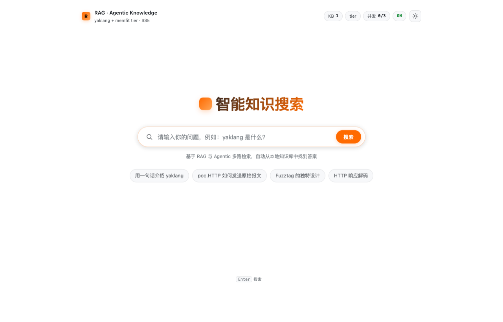
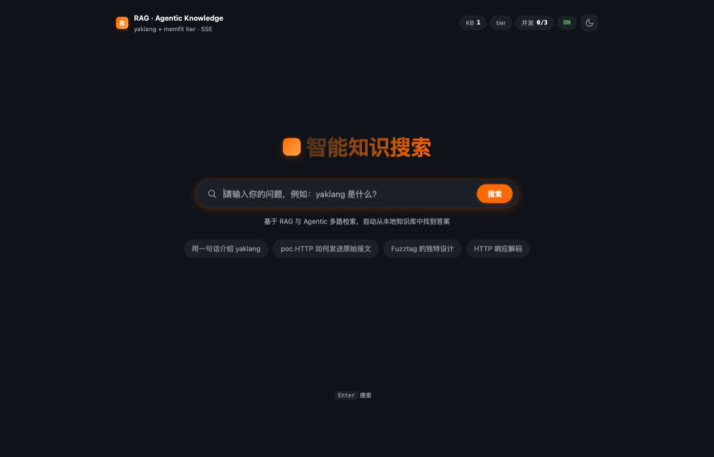
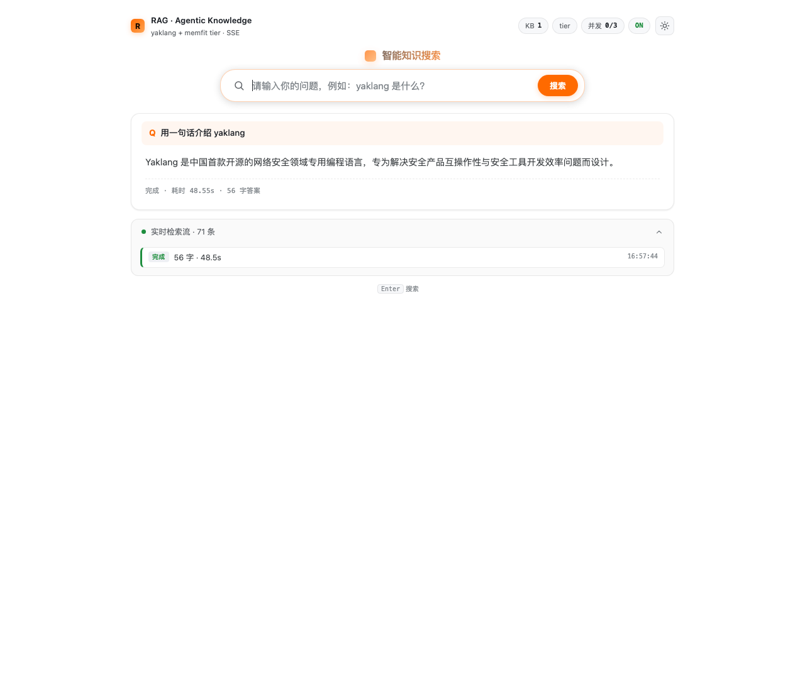
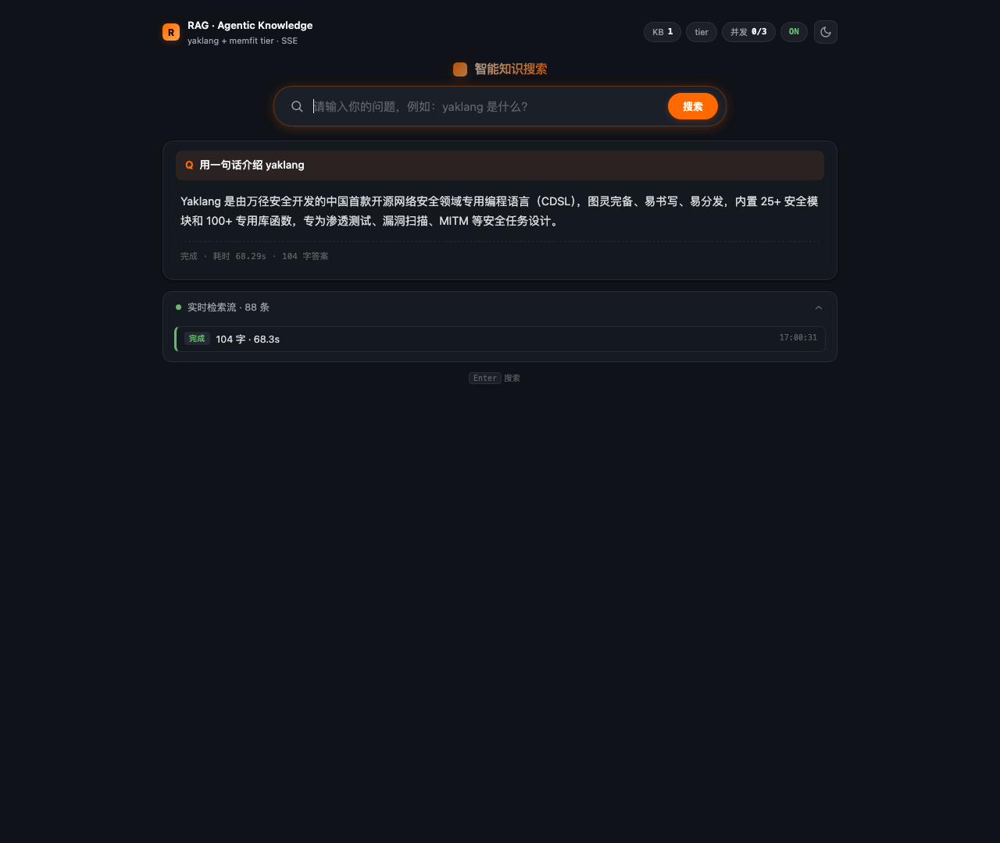
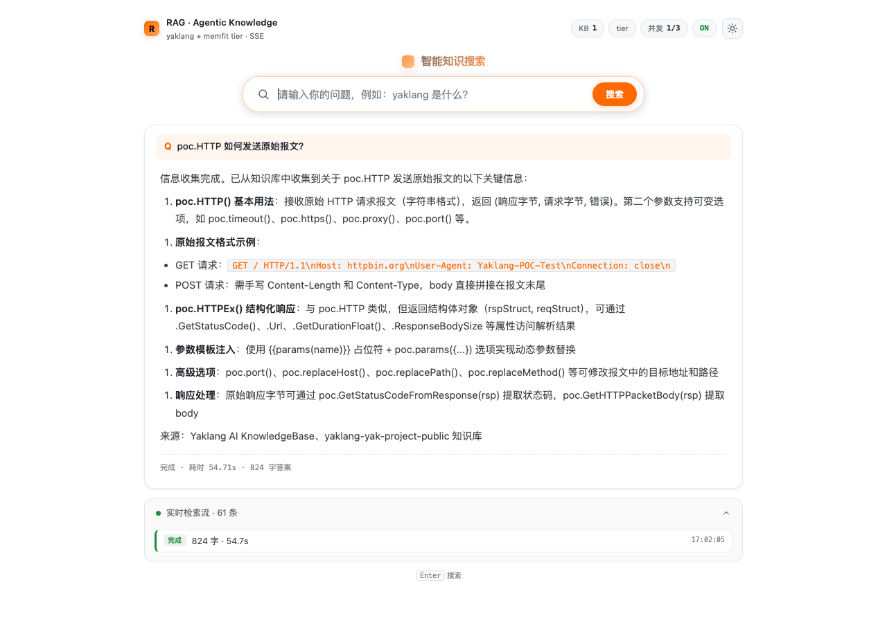

# RAG Server · Agentic Knowledge Search

基于 yaklang `aim` (ReAct) + `rag` 库构建的小型 Agentic RAG 问答服务，前端 Google 风格搜索框 + 暗/亮双主题 + SSE 流式回答 + 实时检索过程展示。

---

## 截图

### 主页（极简 Google 风格搜索框）

| 浅色（默认 / 跟随系统） | 深色 |
| --- | --- |
|  |  |

### 提问后展开（搜索框上移 + 答案卡片 + 检索流面板）

| 浅色 | 深色 |
| --- | --- |
|  |  |

### Markdown 渲染（加粗、有序/无序列表、行内代码、代码块）



---

## 特性总览

- **Agentic RAG**：基于 `aim.focus("knowledge_enhance")`，AI 自主多路检索后总结答案。默认 `max-iteration=1`（追求响应速度，loop 内部最多 3 轮检索）。
- **SSE 流式协议**：浏览器通过 `EventSource` 拿到 `start / log / thought / answer / end / error` 事件，连接在 `end` 后自动关闭。
- **并发保护**：内存信号量限制同时进行的 chat 数；超限直接返回 `HTTP 429` 并 SSE `error`。
- **会话即清即弃**：每次问答自动捕获 `EmitPinDirectory` 路径，请求结束 `defer` 中 `RemoveAll` 落盘的 artifact 文件 + 整个 `aispace/<session>/` 目录。硬盘不再增长。
- **分级模型默认（memfit tier）**：不传任何 AI 参数时，由 `aim` 调用全局分级回调（`memfit-light-free` + `memfit-basic-free`）。
- **单 AI 模型直连**：传 `--ai-model / --ai-apikey / --ai-domain` 即可切换为单模型（`aibalance` 网关）。
- **前端零依赖**：单个 `index.html`，内嵌迷你 Markdown 渲染器（无 CDN、无外网依赖），便于嵌入。
- **暗/亮主题**：跟随系统 + 右上角切换按钮 + URL 强制（`?theme=dark` / `?theme=light`）。
- **嵌入友好**：所有静态资源即一个 HTML，可作 iframe 直接挂到其他系统。

---

## 启动方式

需要使用 yaklang 源码运行（rag 二进制格式 v2，预编译 yak 可能未带最新支持）：

```bash
cd /Users/v1ll4n/Projects/yaklang

go run common/yak/cmd/yak.go \
    /Users/v1ll4n/Projects/yaklang-ai-training-materials/apps/rag-server/start-rag-server.yak \
    --rag-files /tmp/yaklang-aikb.rag \
    --concurrent 3 \
    --port 9093
```

启动成功输出（节选）：

```
[OK] RAG Server started:
   port=9093 concurrent=3 timeout=180s max-iteration=1
   ai-mode=tiered light=memfit-light-free quality=memfit-basic-free
   collections=[rag_c988e8a9_yaklang-aikb]
```

浏览器打开：

- `http://127.0.0.1:9093/` —— 跟随系统主题
- `http://127.0.0.1:9093/?theme=dark` —— 强制深色
- `http://127.0.0.1:9093/?q=用一句话介绍 yaklang` —— 自动发起一次提问（适合截图/演示/自动化）

---

## CLI 参数

| 参数 | 默认值 | 说明 |
| --- | --- | --- |
| `--rag-files` | (必填) | 一个或多个 `.rag` 文件路径，逗号分隔 |
| `--concurrent` | `5` | 同时允许处理的 `/api/chat` 请求数；超出返回 `HTTP 429` |
| `--port` | `9093` | HTTP 监听端口 |
| `--host` | `127.0.0.1` | HTTP 监听地址（生产请改 `0.0.0.0` 并自行控好暴露面） |
| `--timeout` | `180` | 单次问答总超时秒数 |
| `--max-iteration` | `1` | Agentic RAG 最大轮数（loop 内部仍最多 3 次检索，1 已够大多数答案） |
| `--ai-model` | (空) | 覆盖 AI 模型；不填则走 `aim` 全局分级回调（memfit tier） |
| `--ai-apikey` | (空) | 覆盖时使用的 aibalance API key |
| `--ai-domain` | (空) | 覆盖时使用的 aibalance 域名 |

---

## API

### `GET /api/health`

```json
{
  "ai": {
    "lightModel":   "memfit-light-free",
    "mode":         "tiered",
    "qualityModel": "memfit-basic-free",
    "type":         "aibalance"
  },
  "concurrent": 3,
  "inflight":   0,
  "kbCount":    1,
  "kbNames":    ["rag_c988e8a9_yaklang-aikb"],
  "ok":         true,
  "ragFiles":   1
}
```

`ai.mode == "single"` 时改为返回 `{ "mode": "single", "model": "xxx", "domain": "xxx", "type": "..." }`。

### `GET /api/chat?q=<question>`

返回 `text/event-stream`。事件协议：

| event | data 字段 | 说明 |
| --- | --- | --- |
| `start` | `kbCount, kbNames[], maxIteration, aiMode, aiLightModel, aiQualityModel?, aiModel?, sessionId` | 流开始 |
| `log` | `kind, label, message, type, nodeId` | 检索/任务/时间线/文件等过程事件；前端按 `kind` 上色 |
| `thought` | `chunk` | 模型思考流式片段（被前端合并显示于检索流） |
| `answer` | `chunk` | 最终答案流式片段（前端 markdown 实时渲染） |
| `end` | `durationMs, ok` | 流结束（无论成败） |
| `error` | `code, message` | 失败（也会立即发 `end`） |

约定：`kind=status` 已经在后端被过滤，不会发到前端。所有 JSON 单行序列化，符合 SSE 协议。

---

## 准备 RAG 知识库

推荐使用 `yaklang-aikb`（yaklang 官方 AI 知识库）做测试。

### 1. 从 yakit-projects 拷贝（如已有）

```bash
ls ~/yakit-projects/aikb/   # 列出本机现存 .rag 文件
cp ~/yakit-projects/aikb/yaklang-aikb.rag /tmp/yaklang-aikb.rag
```

### 2. 或自行打包目录为 .rag

参考 `library-usage/rag/` 下的脚本，使用 `rag.Import(name, files)` 一次性把目录灌入 `.rag` 二进制文件。

---

## 会话清理机制

每次 `/api/chat` 请求：

1. 启动时生成唯一 `sessionID = "ragsrv-<12位随机>"` 并传给 `aim.sessionID(...)`，aim 内部为它分配 `~/yakit-projects/aispace/<num>_session_<date>_<hash>/` 目录。
2. 在 `aim.onEvent` 回调中监听 `filesystem_pin_directory / filesystem_pin_filename` 事件，把所有 pin 的路径放入 `cleanupPaths` 队列。
3. `defer` 中调用 `file.Remove(path)`（内部即 `os.RemoveAll`），逐个把 markdown 中间文件、loop 调用记录、最终报告以及 session 根目录全部清掉。
4. 日志：`cleanup artifact path: <path>` + 末尾 `cleaned=<count>` 表示删了多少条。

实测一次问答清理 11 项（含 session 根目录），磁盘占用归零。

---

## 嵌入到其他系统

`index.html` 是单文件零依赖，可：

- 直接 `iframe` 嵌入到任何页面（建议 width≥720px 才能容纳搜索框 + 推荐项）
- 通过 URL 参数预填问题：`<iframe src="https://your.host/?q=..."></iframe>`
- 通过 URL 参数锁定主题：`?theme=dark`（写入 localStorage，下次访问保持）
- 接入业务系统时，直接复用 `/api/chat` SSE 协议；上游可以自行拼一个更花哨的 UI

后端配置 `--host 0.0.0.0` 即可对外提供服务，建议同时挂一层反向代理 + 鉴权。

---

## 自动化测试 / 演示

`?q=<question>` 自动触发查询，可用于自动截图：

```bash
chrome --headless --disable-gpu --window-size=1280,1080 \
       --virtual-time-budget=70000 \
       --screenshot=demo.png \
       "http://127.0.0.1:9093/?theme=dark&q=用一句话介绍%20yaklang"
```

纯 `curl` 验证 SSE：

```bash
curl -sN -H "Accept: text/event-stream" \
     "http://127.0.0.1:9093/api/chat?q=$(python3 -c \
          'import urllib.parse;print(urllib.parse.quote("用一句话介绍 yaklang"))')"
```

---

## 文件结构

```
apps/rag-server/
├── start-rag-server.yak    # 服务端实现（yak 脚本）
├── index.html              # 单文件前端（零依赖）
├── screenshots/            # README 用截图
└── README.md
```

---

## 关键词

`Yaklang Agentic RAG`、`aim.focus knowledge_enhance`、`memfit tier model`、`SSE EventSource`、`session_id artifact cleanup`、`mini markdown renderer`、`Google-style search box`、`light/dark theme toggle`、`embeddable single-file frontend`
