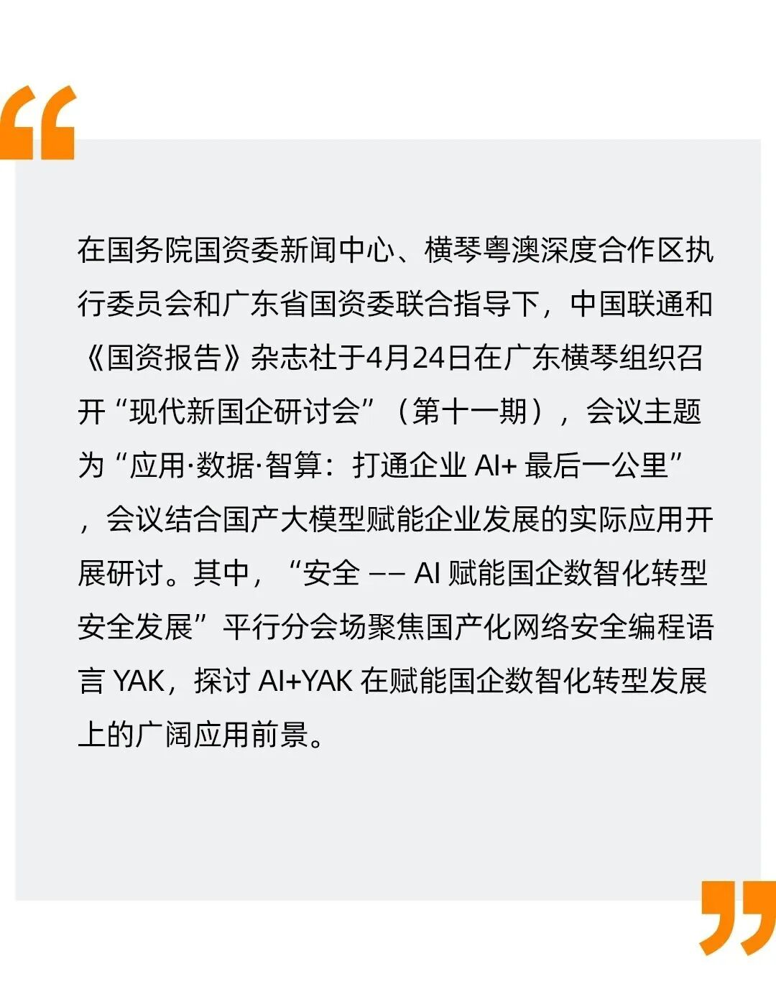
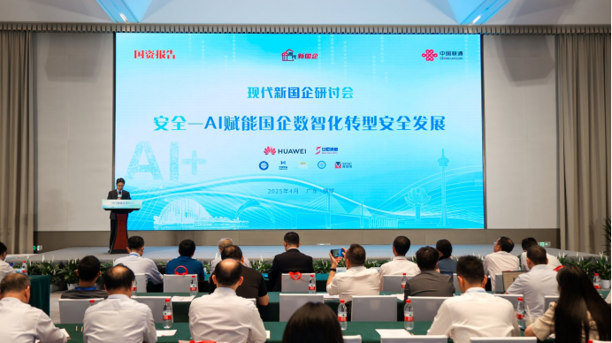
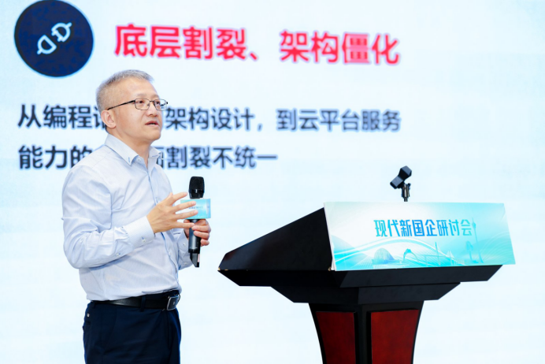
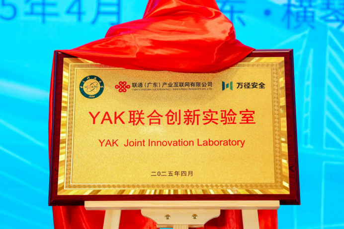
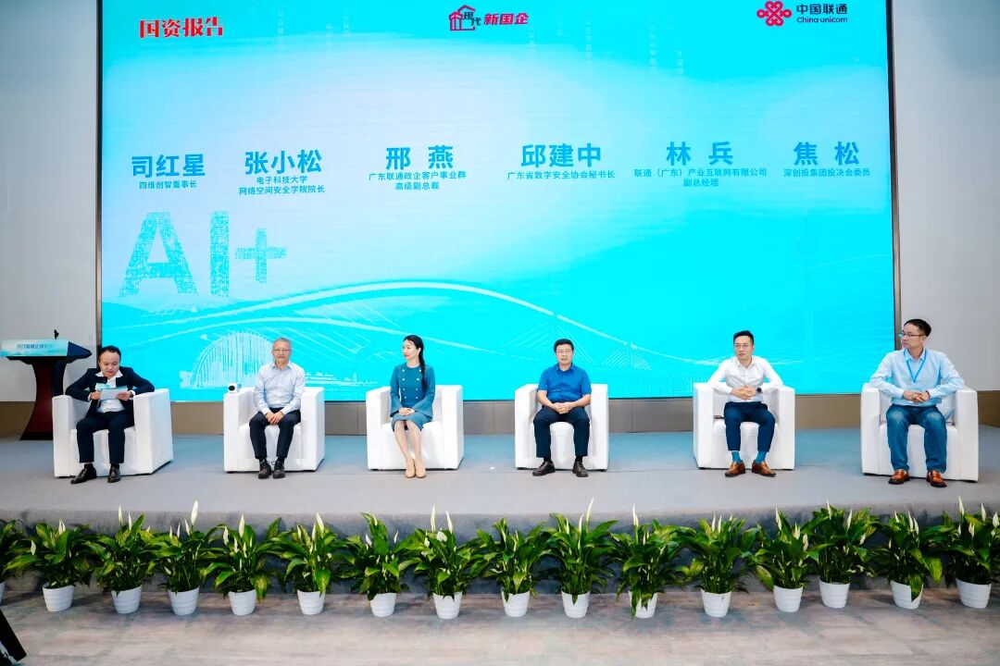

# 重磅新闻 | AI+YAK 赋能国企数智化转型安全发展！

日期: 2025-04-24 | 原文: <https://mp.weixin.qq.com/s/XG8vYs7htqOwozLSZhAVzw>

会议现场（图）

由中国联通、电子科技大学、万径安全联合研发的 YAK 作为网络安全领域开发环境，为我国网络安全产业提供了强大的技术支持和创新动力。它凭借自身优势，打破了国外垄断，填补了国内空白，推动了我国网络安全产业的自主可控发展进程。

在分论坛的主旨分享环节，万径安全首席科学家、电子科技大学网络空间安全学院院长张小松教授发表了题为“构建国产化的网络安全产品研发生态” 的演讲，他谈到：“缺‘芯’少‘魂’是我国信息产业发展的卡脖子痛点，在网络安全产业中，专用高效的开发语言和工具就是网络安全产业的‘魂’和基础能力。YAK 为破解网络安全产业困境贡献出了一款国产、开源、易用的网络安全产品开发平台，正在吸引越来越多的同行参与，共建我国自主可控的网络安全产业生态。”

张小松教授发表现场演讲（图）

为进一步联合深化构建自主可控网络安全生态体系的工作，万径安全与联通（广东）产业互联网有限公司成立 YAK 联合创新实验室并现场举行揭牌仪式。未来双方将围绕  YAK 在网络安全技术创新、产品研发等领域展开深度合作，共同打造行业领先的网络安全技术创新平台。

YAK 联合创新实验室揭牌（图）

圆桌讨论环节以“ AI+YAK 赋能国企数智化转型”为主题，由六位行业专家、院校和企业领导就 AI+YAK 在产品开发、产学研合作、政企网络安全及应用实践、国企应用实践、安全产业创新方面展开深入交流与对话。

万径安全董事长司红星就“ AI+YAK 赋能安全产品开发”角度，从技术突破、生态重构、战略安全维度分享了 YAK 语言与 AI 技术融合带来的产业变革，强调打造真正的自主可控的产品必须构建在开放生态之上，通过 AI+YAK 双引擎筑牢我国网络安全产业发展。

圆桌论坛现场（图）

本次研讨会充分展示了 AI+YAK 在国企数智化转型安全发展中的突出贡献和巨大潜力。万径安全将继续携手中国联通、电子科技大学等合作伙伴，依托YAK联合创新实验室等平台，不断深化 AI+YAK 在重点领域的研发和应用，为国企乃至各行各业的数字化转型提供更安全、更高效的解决方案，助力我国现代化产业体系建设和高质量发展。
