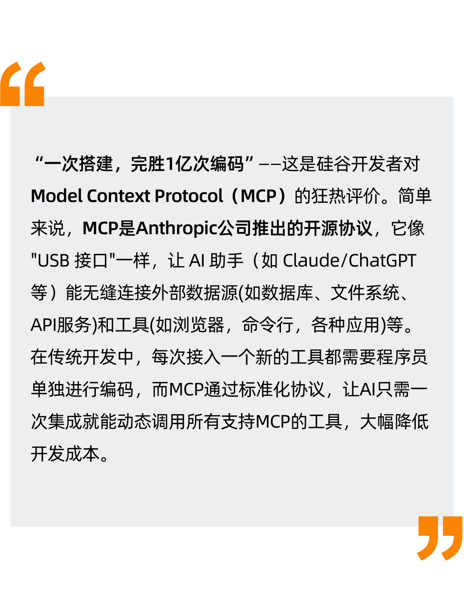
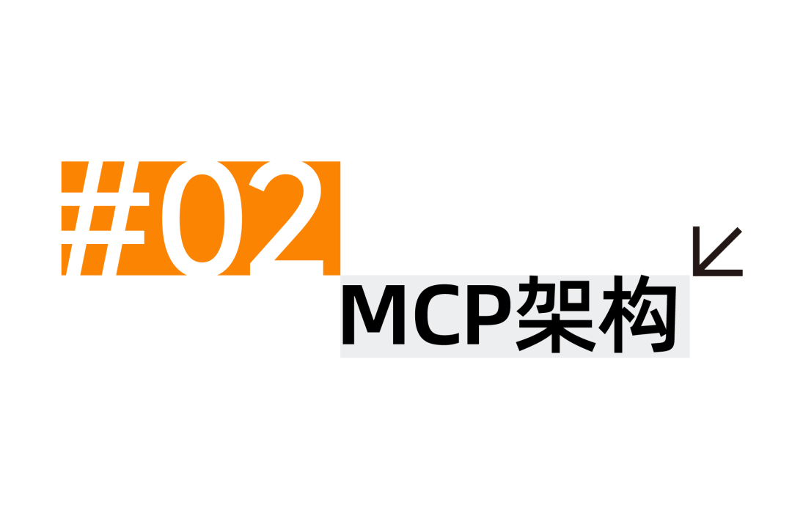
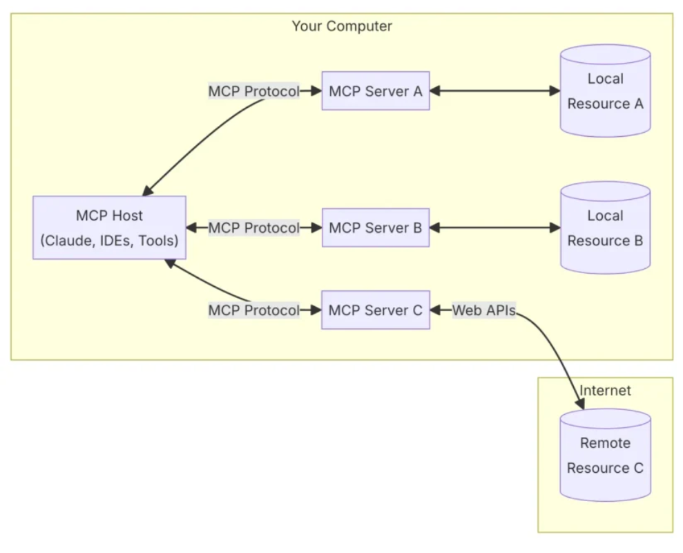
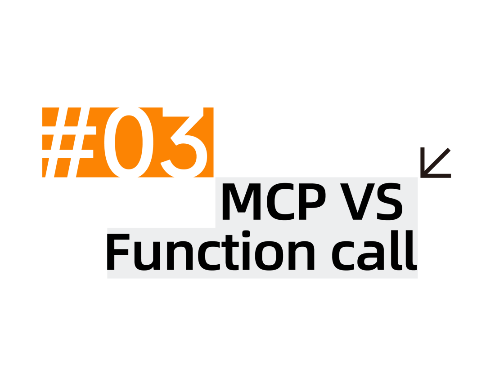
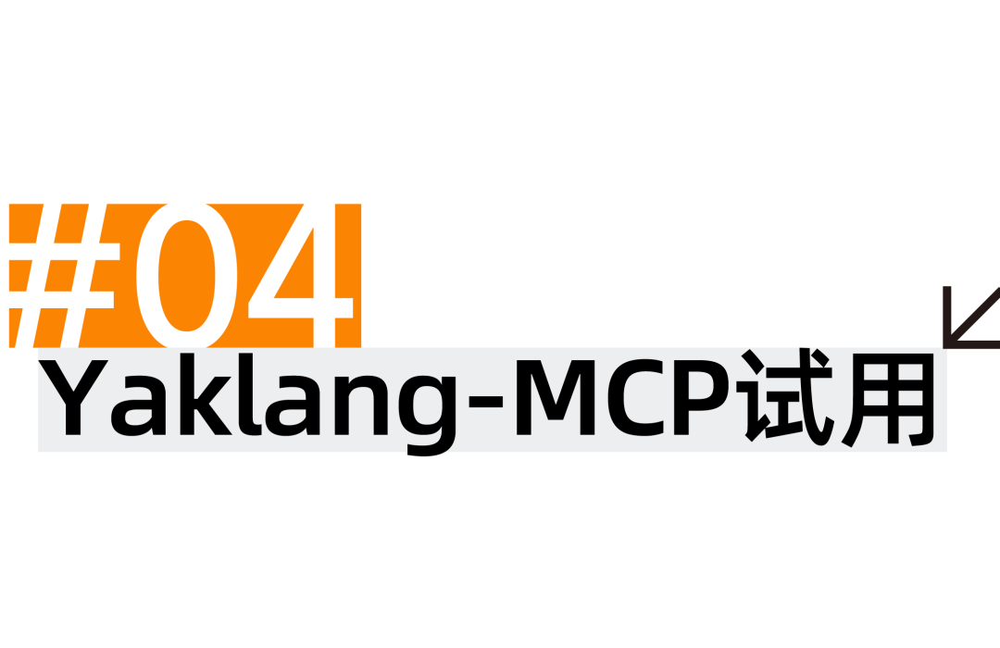
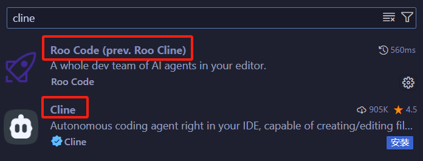
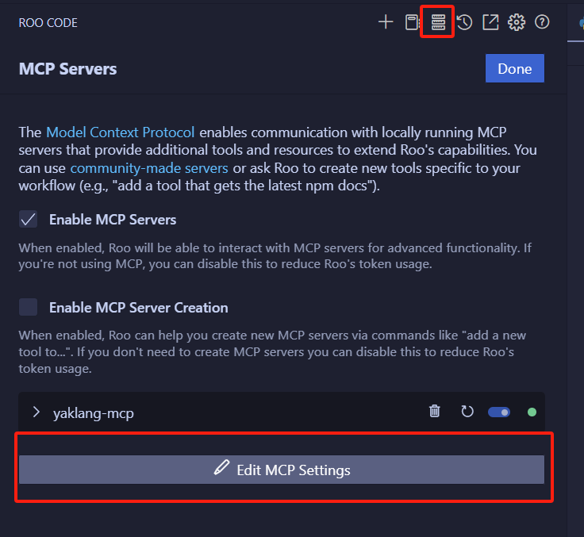

# 那我问你，MCP是什么？回答我！

日期: 2025-03-20 | 原文: <https://mp.weixin.qq.com/s/FGmpvQKAbKstwkXhOAG4xQ>

Looking my eyes！

Yaklang-MCP是不是MVP?

回答我，你回答我！





我们知道，AI虽然非常强大，但常常会被迫“束手束脚”。例如，医生问诊需同时调取病历、化验结果和医学文献，复杂任务需要多个工具一起协同执行。MCP的核心价值在于：

- **统一连接**：通过MCP，AI可访问本地文件、云端数据库甚至实时金融数据。
- **动态协作**：多个工具互相协作，例如爬虫任务中一个工具负责爬取网页内容，另外一个工具负责处理爬取信息，最后一个工具用于生成报告。从此，AI从"QA问答机"升级为"全能执行者"。





MCP的通信协议底层基于**STDIO**(标准输入输出)或**SSE**(Server-Send Events)，顶层则基于**JSON-RPC 2.0**

此外，MCP的架构设计极简却高效，包含三大组件：

- **主机**（如Claude）：调用**客户端**来获取**服务器**的资源/工具列表，解析AI响应以调用**客户端**发送任务请求，将**客户端**的响应提供给AI
- **客户端**：发送任务请求，处理服务器响应返回给**主机**
- **服务器**：解析任务请求以提供数据或工具服务



有了解过Function call的小伙伴们可能发现了，MCP最终实现的功能似乎与Function call类似，都是使得AI能够与外部链接，那么他们的区别是什么呢?

|  | **MCP** | Function Call |
| --- | --- | --- |
| 协议栈 | 应用层协议（OSI Layer 7） | 模型功能扩展 |
| 服务发现机制 | 可以动态通知并修改 | 预编译函数列表，无法修改 |
| 工具接入方式 | 支持多个工具热插拔 | 冷加载 |

实际上，MCP的Host也可以使用Function Call来实现，前提是模型本身要支持Function Call。一种更通用适合所有模型的的方法则是在System Prompt中告诉AI其能够使用的工具与资源。一个Prompt的例子如下(来自vscode插件-cline):

```python
You must respond to the user's request by using at least one tool call. When formulating your response, follow these guidelines:

1. Begin your response with normal text, explaining your thoughts, analysis, or plan of action.
2. If you need to use any tools, place ALL tool calls at the END of your message, after your normal text explanation.
3. You can use multiple tool calls if needed, but they should all be grouped together at the end of your message.
4. After placing the tool calls, do not add any additional normal text. The tool calls should be the final content in your message.

Here's the general structure your responses should follow:

```
[Your normal text response explaining your thoughts and actions]

[Tool Call 1]
[Tool Call 2 if needed]
[Tool Call 3 if needed]
```
Remember:
- Choose the most appropriate tool(s) based on the task and the tool descriptions provided.
- Formulate your tool calls using the XML format specified for each tool.
- Provide clear explanations in your normal text about what actions you're taking and why you're using particular tools.
- Act as if the tool calls will be executed immediately after your message, and your next response will have access to their results.

# Tool Descriptions and JsonSchema
1.
{
  "title": "execute_command",
  "description": "Execute a CLI command on the system. Use this when you need to perform system operations or run specific commands to accomplish any step in the user's task. You must tailor your command to the user's system and provide a clear explanation of what the command does. Prefer to execute complex CLI commands over creating executable scripts, as they are more flexible and easier to run. Commands will be executed in the current working directory.",
  "type": "object",
  "required": [
    "command"
  ],
  "properties": {
    "command": {
      "type": "string",
      "description": "Your command here"
    }
  }
}

2. list_files:
{
  "title": "list_files",
  "description": "List files and directories within the specified directory. If recursive is true, it will list all files and directories recursively. If recursive is false or not provided, it will only list the top-level contents.",
  "type": "object",
  "required": [
    "path"
  ],
  "properties": {
    "path": {
      "type": "string",
      "description": "Directory path here"
    },
    "recursive": {
      "type": "boolean"
    }
  }
}
```

实际预见的是，连接的MCP服务器越多，提供的资源/工具越多，那么每次提问所要消耗的token也就越多。



基于Yakit的MCP Host仍在开发中，但是Yaklang的MCP server实际上已经可以使用了。我们可以使用其他的MCP Host来尝鲜一下。

1. 打开vscode，下载以下插件之一（前者Roo Code是社区驱动的Cline，新功能和更新比较频繁）:



1. 打开Roo Code页面，点击MCP Servers设置，Edit MCP Settings：



1. 输入配置，其中command改为你实际的yak的路径：

```json
{
  "mcpServers": {
    "yaklang-mcp": {
      "command": "yak.exe",
      "args": ["mcp"],
      "env": {},
      "disabled": false,
      "alwaysAllow": [],
      "timeout": 3600
    }
  }
}
```

1. 开始使用，这里以弱口令爆破为例：
