# SyntaxFlow实战CVE漏洞？那很好了

日期: 2025-03-13 | 原文: <https://mp.weixin.qq.com/s/zLoIRNYORVgY0_n3vIIGWA>

之前的文章为大家介绍过

如何使用YAK的SyntaxFlow功能进行代码审计

今天则是使用一个案例来为大家说明

如何使用SyntaxFlow**实战**复现一个CVE漏洞**


这个XSS漏洞发生在一个文档上传功能里。

上传文档后通过**/emissary/Document.action/{uuid}**接口来获取文档的信息，uuid参数对应的不同的文档。当uuid不存在时，返回一个XML格式的内容，提示uuid不存在, 但传入的uuid参数未经任何的安全过滤就原样显示在回显文本中，可导致反射型XSS。关键代码如下图：

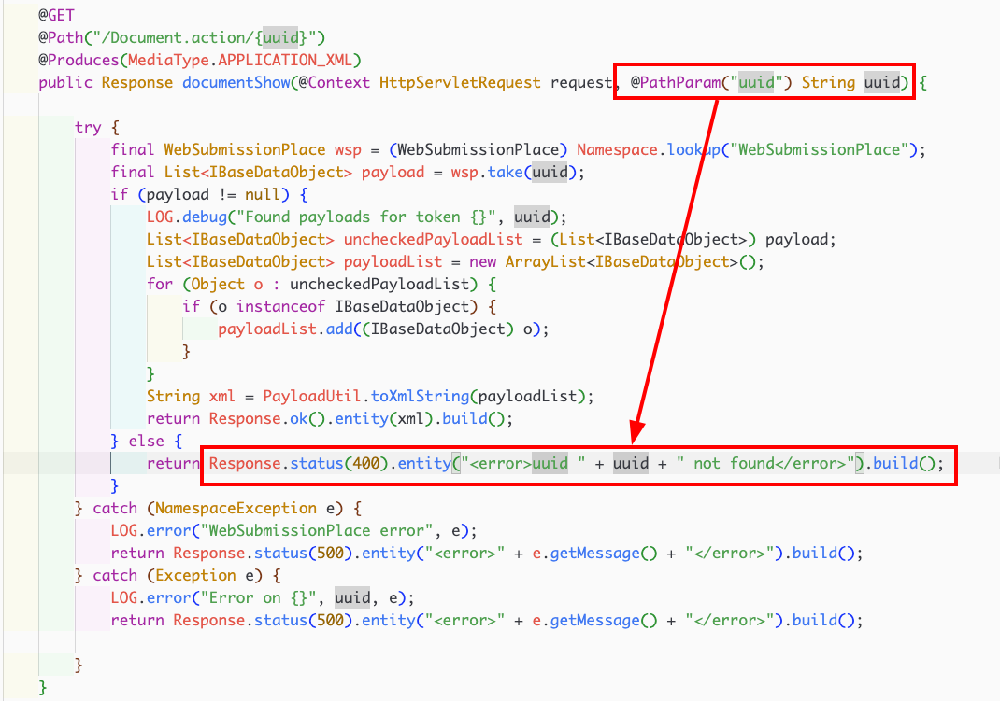


在项目编译页面，直接选中路径开始编译将会自动确认项目名为：文件名(时间) ，但是我们也可以手动设置文件名，这里使用的是emissary 5.9.0版本于是手动设置项目名为：**emissary-5.9.0**

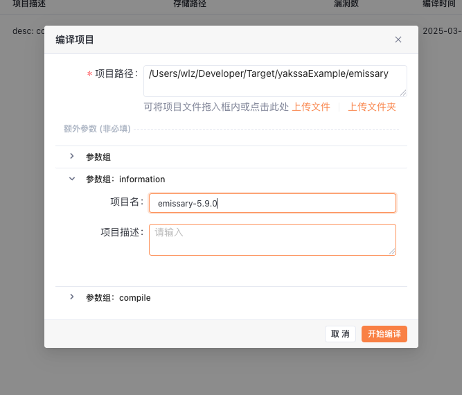


漏洞来源于上传文档后通过**`/emissary/Document.action/{uuid}`**接口来获取文档的信息。

首先，通过代码审计页面的搜索功能，可以快速确定到对应代码位置。

> 代码搜索功能将会在近期发布的SAST产品中一同和大家见面！

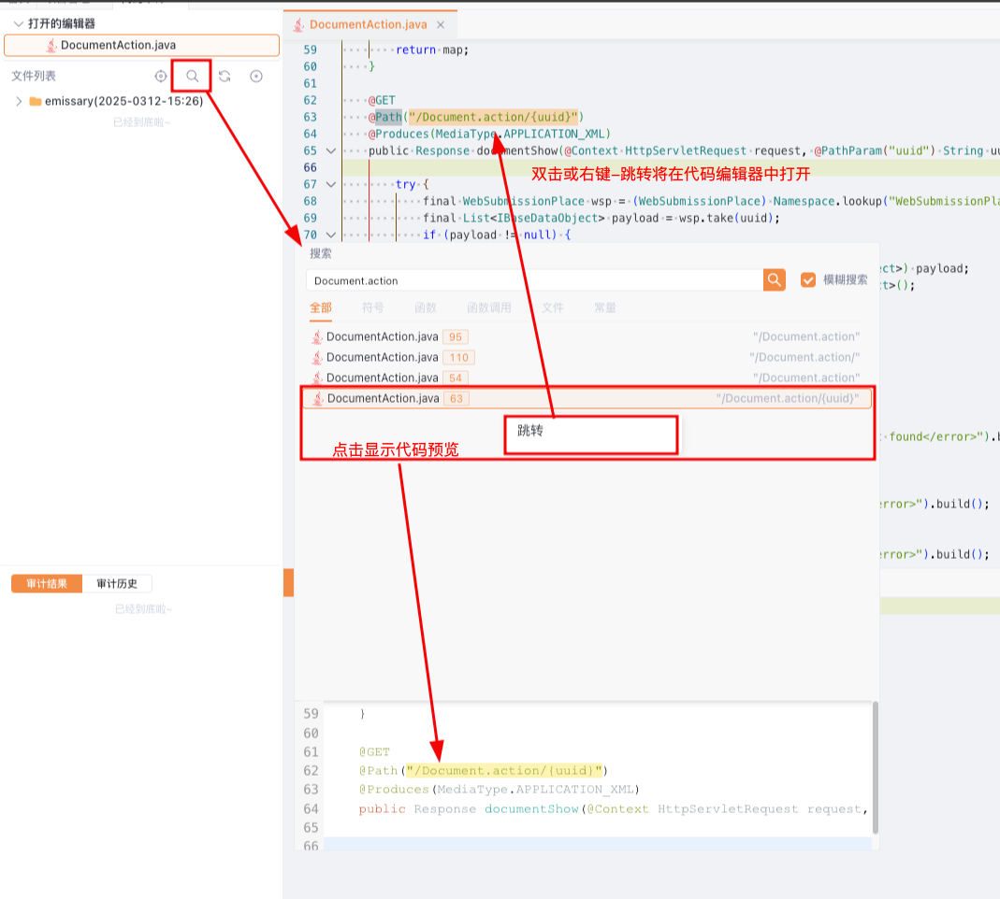

可以找到漏洞相关信息如下：

该函数接受Get请求并且接受路径参数**`uuid`**， 尝试通过获取文件，如果没有文件的话将会进行报错，但是此时的报错直接将未经任何处理的用户输入**`uuid`**拼接返回，并且该函数定义标注了将会输出**`XML`**类型的相应。

将会导致反射XSS漏洞。

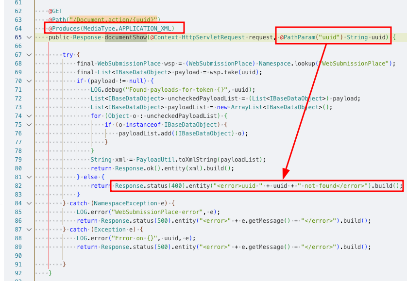

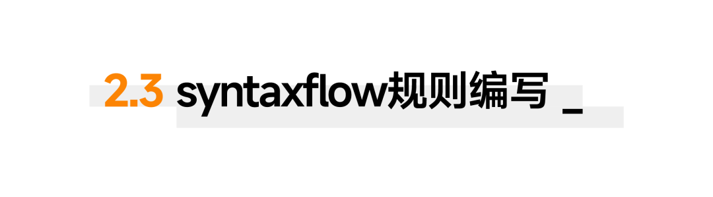

#### **获取所有请求处理函数**

通过**`Path`**注解和**`GET`**或**`POST`**方法可以定位请求处理函数，其中的参数为用户输入的参数。

于是我们想要搜索的目标就是：同时被**`Path`**和**`GET`**注解的函数：

在Syntaxflow中，

- `${annotation}.__ref__ as $instance` 通过`__ref__`可以从注解到实例
- `${instance}.annotation.* as ${annotation}`通过`anotation` 可以通过实例访问到注解。

于是我们可以编写如下的规则：

```
// 通过Path搜索注解，通过`__ref__`从注解定位到被注解的值  过滤只定位函数Path.__ref__?{opcode: function} as $path_handler// 将获取到的所有注解了`Path`的数据 搜索其中的注解 $path_handler?{.annotation.*?{have:"GET"}} as $get_path_handler
```

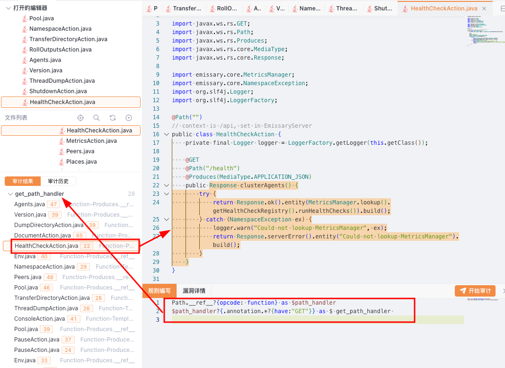

#### **获取返回数据**

在emissary项目中，我们可以看到大量使用的**`Response.serverError().entity(xxx).build();`**或 **`Response.ok().entity(xxx).build();`**这种链式调用的形式。

我们可以寻找如下的代码结构：

```css
Response (中间链式调用省略) .entity(target) (中间链式调用过程省略) .build()
```

在syntaxflow中，链式调用处理语法是：**`...`**， 表示省略中间的函数调用以及成员访问，于是我们可以编写简单的代码访问到期望的代码结构：

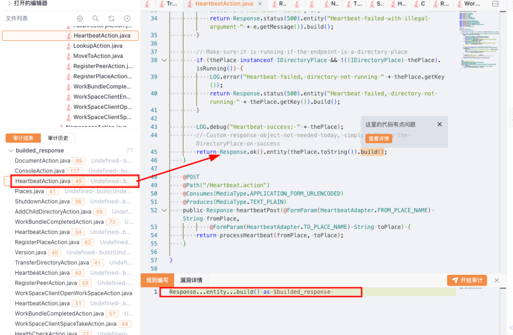

进一步，使用条件过滤语法，我们可以得到所有最后将会被构建的entity的位置，并且得到期望的entity的参数：

```
// 查找到后续被build的entityResponse...entity?{*...build()} as $builded_entity // 获取entity的参数 $builded_entity(, * as $target)
```

示例如图所示：

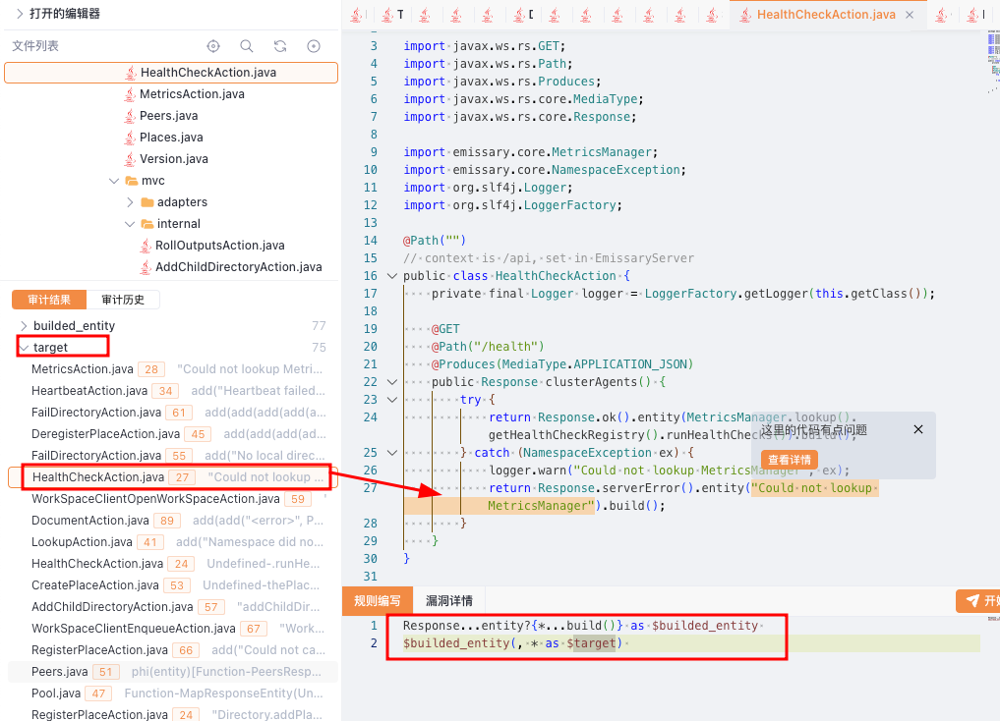

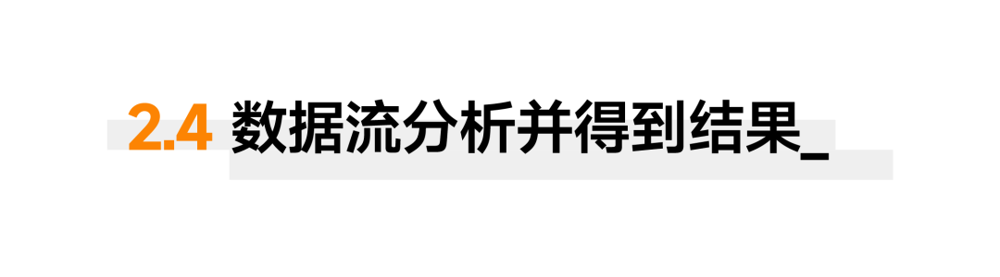

再次确认一下入口，所有的get请求处理函数的参数中被注解为**`QueryParam`/`PathParam`/`FromParam`/`HeaderParam`**是请求输入的参数，或被**`Context`**注解的的请求。在这里我们只获取到参数。

```
// 获取请求处理函数的参数$get_path_handler(, * ?{opcode: param} as $param)// 过滤注解中存在*Param的参数 $param ?{.annotation.* ?{have: "*Param"}} as $source
```

于是我们得到完整的审计代码：

```
// 通过Path搜索注解，通过`__ref__`从注解定位到被注解的值  过滤只定位函数Path.__ref__?{opcode: function} as $path_handler// 将获取到的所有注解了`Path`的数据 搜索其中的注解 $path_handler?{.annotation.*?{have:"GET"}} as $get_path_handler // 获取请求处理函数的参数$get_path_handler(, * ?{opcode: param} as $param)// 过滤注解中存在*Param的参数 $param ?{.annotation.* ?{have: "*Param"}} as $source // 查找到后续被build的entityResponse...entity?{*...build()} as $builded_entity // 获取entity的参数 $builded_entity(, * as $target)   $target #{    include:"* & $source"}-> as $xss
```

搜索得到四个结果：

我们可以成功复现cve目标：**`"/Document.action/{uuid}"`:**

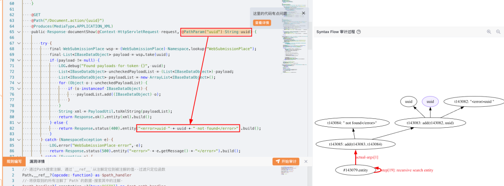

还有一个非常相似的xss**`"/TransferDirectory.action"`:**

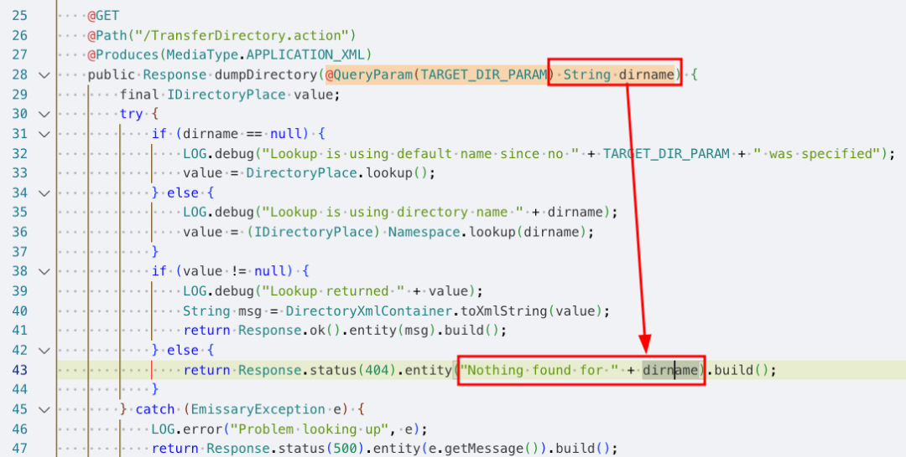


另外可以发现一个类似，但是输出为**`MediaType.TEXT_PLAIN`**的位置，这其实是没有问题的，在规则中我们没有进行过滤：

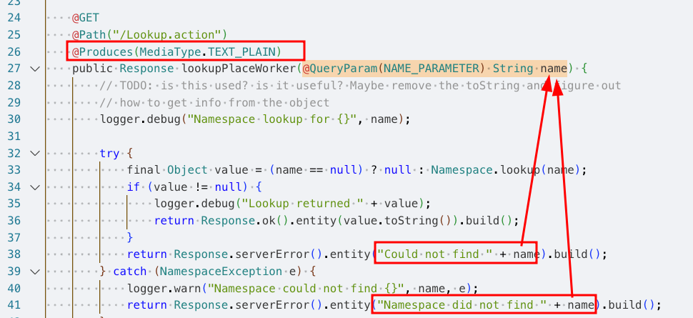

先来对注解进行搜索，在**get_path_handler**的列表中通过**.annotation**获取注解，再通过**.value**获取注解内的数据：

```
// 获取Produces注解， 并且通过`.value`获取其中的数据，筛选所有的`TEXT_PLAIN` $get_path_handler.annotation.Produces.value?{have:"TEXT_PLAIN"}  as $produces
```

运行发现可以获取到所有TEXT_PLAIN注解：

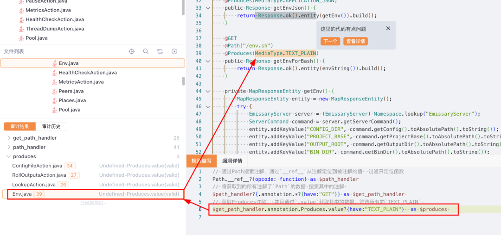

那么我们可以将这个搜索转换为过滤并且更新检查规则：

```
// 通过Path搜索注解，通过`__ref__`从注解定位到被注解的值  过滤只定位函数Path.__ref__?{opcode: function} as $path_handler// 将获取到的所有注解了`Path`的数据 搜索其中的注解 $path_handler?{.annotation.*?{have:"GET"}} as $get_path_handler // 获取Produces注解， 并且通过`.value`获取其中的数据，筛选所有的`TEXT_PLAIN` $get_path_handler?{! .annotation.Produces.value?{have:"TEXT_PLAIN"}}  as $get_path_handler_could_xss// 获取请求处理函数的参数$get_path_handler_could_xss(, * ?{opcode: param} as $param)// 过滤注解中存在*Param的参数 $param ?{.annotation.* ?{have: "*Param"}} as $source // 查找到后续被build的entityResponse...entity?{*...build()} as $builded_entity // 获取entity的参数 $builded_entity(, * as $target)   $target #{    include:"* & $source"}-> as $xss
```

运行发现刚刚的漏报已经解决：

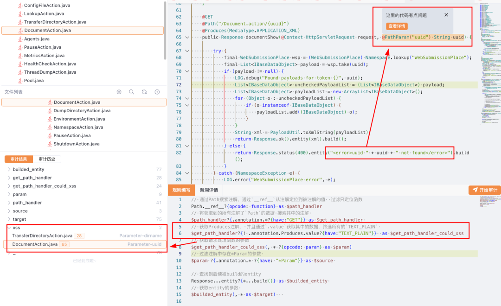


保存到规则列表，编写相关信息，并且使用**alert $xss**报告错误到漏洞与风险

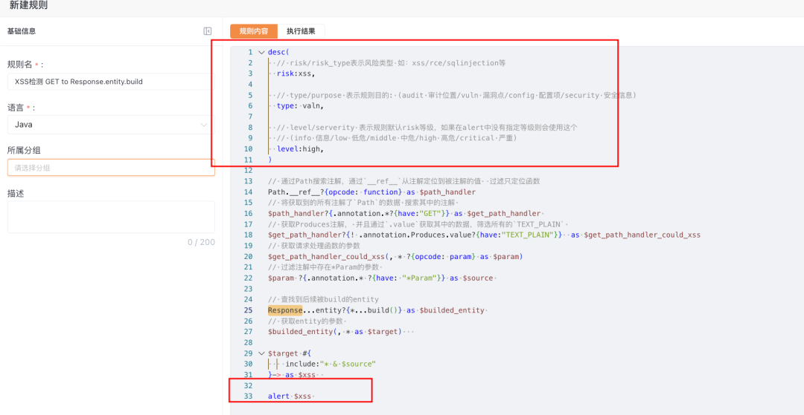

运行规则，可以扫描得到漏洞风险相关信息：
