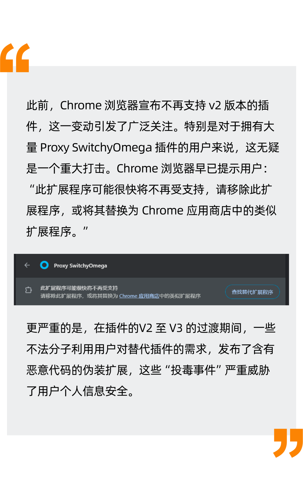
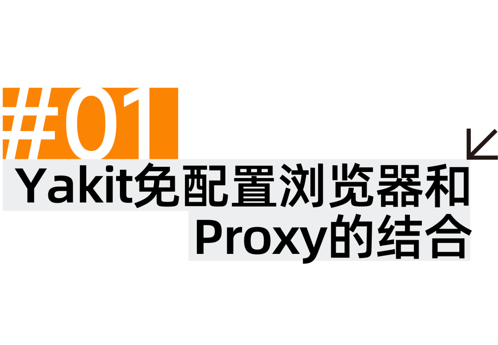
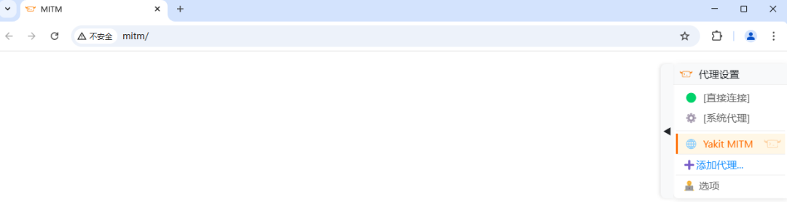
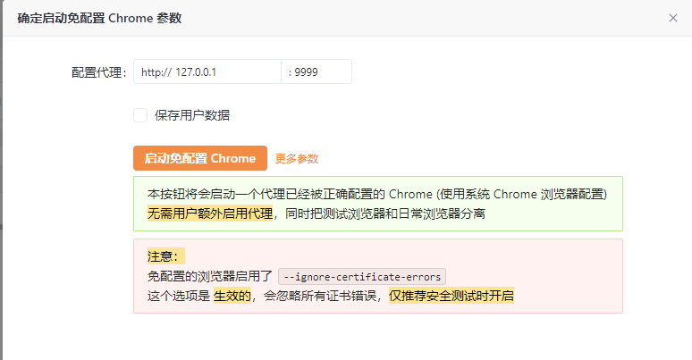
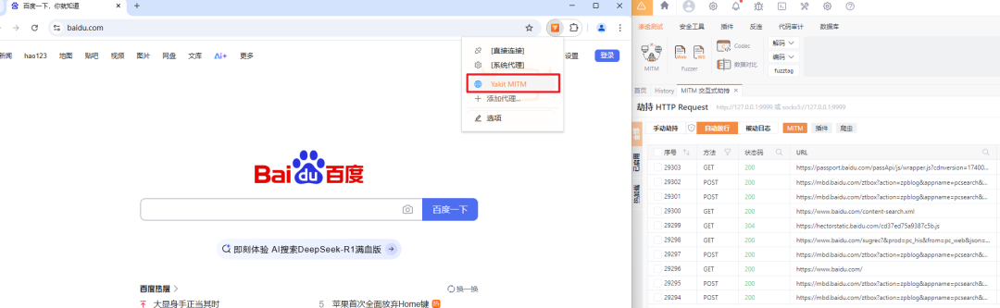
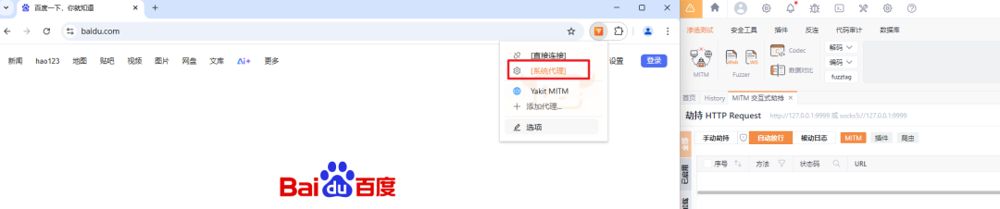
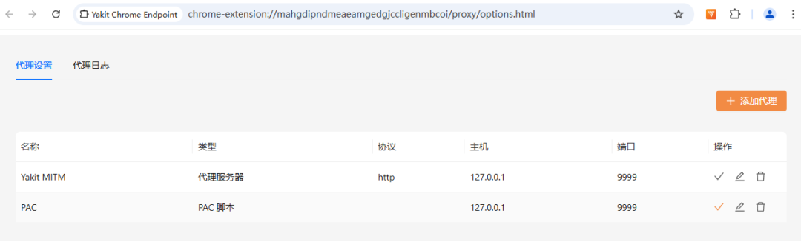
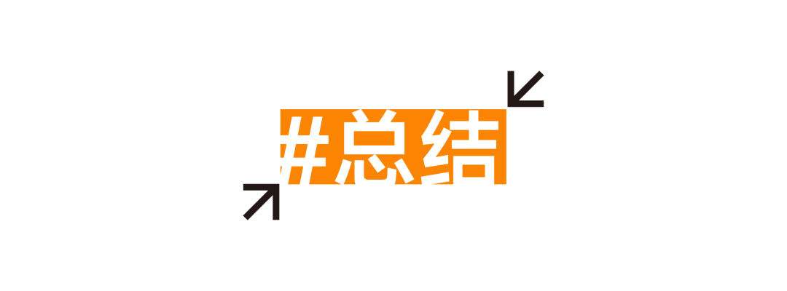

# Oi，不要小看Proxy浏览器插件与Yak之间的羁绊啊！

日期: 2025-02-20 | 原文: <https://mp.weixin.qq.com/s/p1YSHGB8Dk7eXRwLSoz-ug>

超级牛：

不知道啊

# 这插件他喊着友情啊羁绊啊未来啊什么的就冲上来了






## 对于 Yakit 用户来说，免配置浏览器带来了很多的便捷，一键启动即可打开一个配置好了 Yakit MITM 代理的浏览器，并且与日常使用的浏览器互不干扰。

## 为了进一步增强免配置浏览器的使用体验、以及完成对 Proxy SwitchyOmega 插件需求的过渡，我们开发了一个类似 Proxy SwitchyOmega 功能的插件，现在当用户打开免配置浏览器时，本质上是通过**插件控制**浏览器的代理项，而非此前的使用固定的 **chromeFlags**  的方式来启动，现在点击启动免配置浏览器时，会通过 **--load-extension chromeFlags** 来加载我们编写的浏览器插件，如下图：



插件通过对当前的导航地址**http://mitm/**注入一个 content.js 来提示用户插件当前正在工作，用户也可以手动将插件 **Pin** 在chrome 的工具栏中，方便后续的使用。

> 当前悬浮框UI，只会在导航地址显示，当访问别的网站时，可以点击插件图标进行使用

当前浏览器插件的默认代理项是点击 "启动免配置 Chrome" 是配置的代理，也就是如下图中的**http://127.0.0.1:9999**




在加载了浏览器插件后，免配置浏览器完全可以类似正常的浏览器使用，当切换到 **[Yakit MITM]** 代理项时，访问的流量会经过 Yakit MITM：



当用户选择**[系统代理]** 时，会和正常浏览器访问网站一样，流量不会经过 Yakit MITM：



Yakit 浏览器插件也提供了自定义添加，相对比较简单。




代理实现部分用到了 Chrome Extensions 提供的 chrome.proxy api，基本概念如下：


在 proxy.ProxyConfig 对象中定义。根据 Chrome 的代理设置， 这些设置可能包含 proxy.ProxyRules 或 proxy.PacScript。


ProxyConfig 对象的 mode 属性决定了 Chrome 的整体行为 代理用量。它可以采用以下值：

**direct**在 **direct**模式下，所有连接都是直接创建，不涉及任何代理。此模式允许 **ProxyConfig** 对象中没有其他参数。

**auto_detect**在 **auto_detect**模式下，代理配置由可下载的 PAC 脚本决定。

**pac_script**在 **pac_script** 模式下，代理配置由从系统检索到的 PAC 脚本决定 取自 **proxy.PacScript** 对象中指定的网址，或直接从 **data** 元素中获取 **proxy.PacScript** 对象中指定的任何 ID。除此之外，此模式不允许使用任何其他参数，在 **ProxyConfig**对象中。

**fixed_servers**在 **fixed_servers** 模式下，代理配置编码在 **proxy.ProxyRules** 对象中。其 代理规则中介绍了具体结构。除此之外，**fixed_servers** 模式 **ProxyConfig** 对象中的参数

**system**在 **system** 模式下，代理配置从操作系统中获取。此模式不允许在 **ProxyConfig**对象中包含更多参数。请注意，**system** 模式不同于 设置无代理配置。对于后一种情况，只有在以下情况下，Chrome 才会回退到系统设置：任何命令行选项都不会影响代理配置。


```
db/ - IndexedDB 数据库操作public/  - background.js - 扩展后台脚本  - content.js - 内容脚本  - proxy/ - 代理相关功能  manifest.json - 配置清单src/  - components/ - React 组件  - pages/ - 页面组件  - types/ - TypeScript 类型定义  - network/ - 网络通信相关
```

首先需要在 **manifest.json** 中声明 proxy 权限

```
{  "manifest_version": 3,  "name": "Yakit Chrome Endpoint",  "permissions": [    "proxy"  ],  ...}
```

核心部分的代理设置有 **fixed_servers** 和 **pac_script** 两种， 使用方式如下：

**fixed_servers**

```
const proxyConfig = {    mode: "fixed_servers",    rules: {        singleProxy: {            scheme: 'http',            host: "127.0.0.1",            port: 9999        },        bypassList: ["localhost", "127.0.0.1"]    }};await new Promise((resolve) => {    chrome.proxy.settings.set({        value: proxyConfig,        scope: 'regular'    }, resolve);});
```

**pac_script**

```
var config = {  mode: "pac_script",  pacScript: {    data: "function FindProxyForURL(url, host) {\n" +          "  if (host == 'www.yaklang.com')\n" +          "    return 'PROXY 127.0.0.1:2080';\n" + // 设置的另外一个 fixed_servers 代理          "  return 'DIRECT';\n" +          "}"  }};await new Promise((resolve) => {    chrome.proxy.settings.set({        value: config ,        scope: 'regular'    }, resolve);});
```

剩下的一些 UI 部分则是交给 AI 完成 。



目前浏览器插件的 UI 以及用户交互部分还很僵硬，亟须改进。也理解了 Proxy SwitchyOmega 为何用户众多 —— 它的代理切换功能确实很好用，值得参考借鉴。
