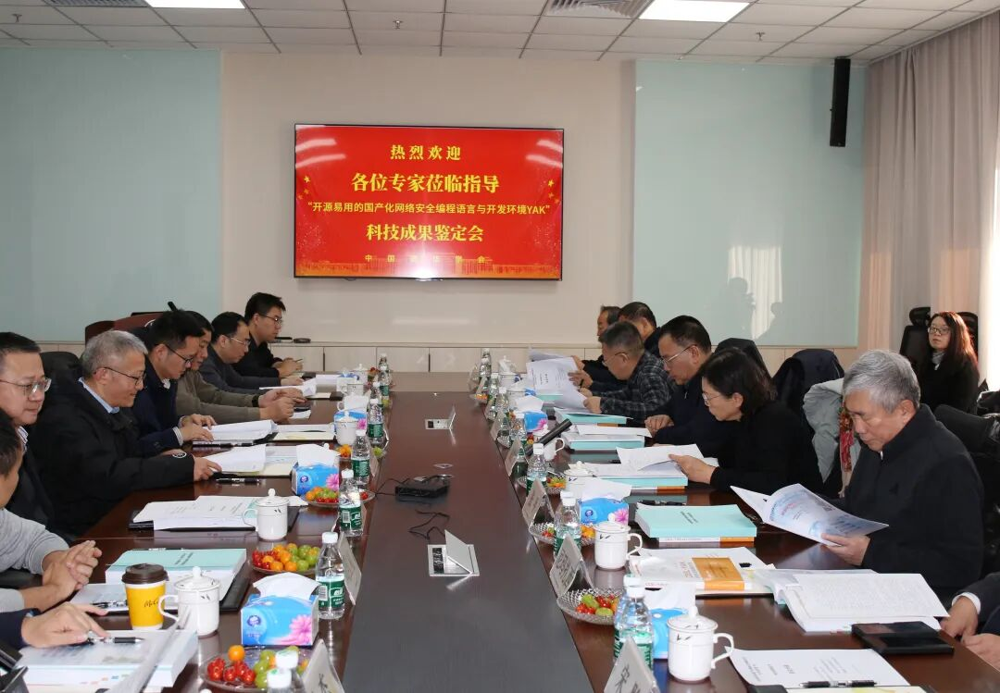
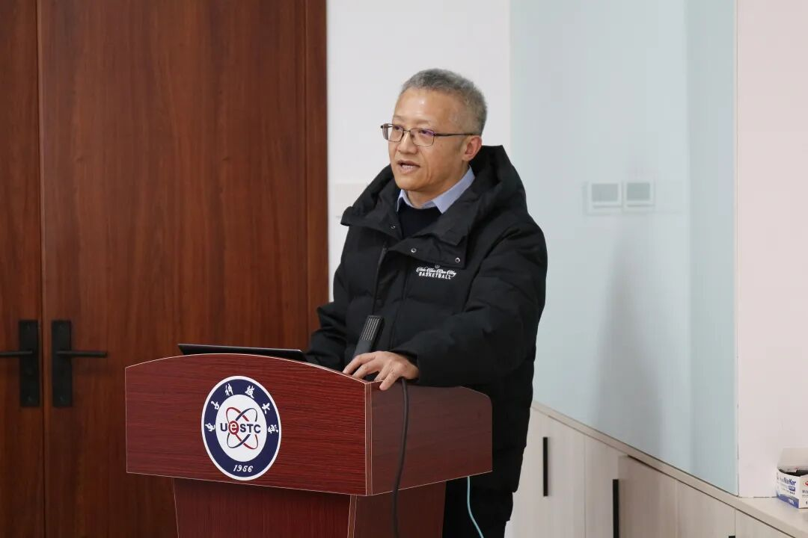
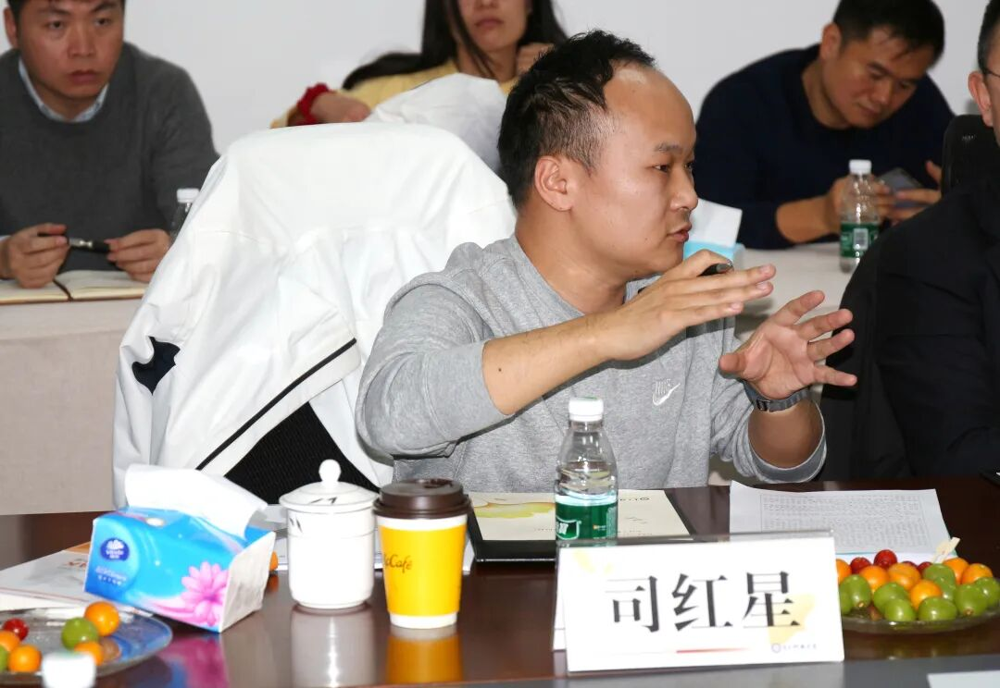

# 国内外首创！“面向网络安全的专用编程语言与开发环境YAK” 科技成果鉴定会在京成功举办

日期: 2025-01-08 | 原文: <https://mp.weixin.qq.com/s/CL7I6Dk46hRTYHlQRhxE7g>

> 2025年1月7日，中国通信学会在京组织召开了由电子科技大学、中国联合网络通信集团有限公司、国家工业信息安全发展研究中心、四维创智（北京）科技发展有限公司共同完成的“面向网络安全的专用编程语言与开发环境YAK”科技成果鉴定会。

科技成果鉴定会现场（图）

鉴定委员会由**七位中国工程院院士**和**两位科研院所专家教授**共同组成。电子科技大学网络空间安全学院院长、万径安全首席科学家张小松教授代表项目组向鉴定委员会专家汇报了YAK的研制报告、技术报告、推广应用情况以及经济和社会效益。万径安全董事长司红星向鉴定委员会专家意见进行答疑。

张小松教授汇报现场（图）

万径安全董事长司红星答疑现场（图）

鉴定委员会专家审查了项目组提供的相关材料，并通过质询、讨论与评议等形式对成果进行评估，最终形成鉴定意见，认为该项科技成果技术**研制难度大，创新性突出，具有自主知识产权**，成果总体达到国内领先、国际先进水平，其中**网络安全领域开发环境YAK属国内外首创。**

该成果针对网络安全领域软件产品开发编程环境复杂、异构等问题，项目设计研发了国产自主可控、开源易用的网络安全领域专用编程语言Yaklang及开发平台环境Yakit（统称YAK），实现**网络安全领域产品开发的高效率、低成本、易运维、风险可控。**

项目成果获授权国内发明专利22项，软著40项，发表论文32篇，出版专著1部，教材1部，研究成果支撑发布了国际国内标准7项，在通信、电力、钢铁等多个关键行业应用，提升了安全产品开发效率、节约了开发成本，社会和经济效益显著。
