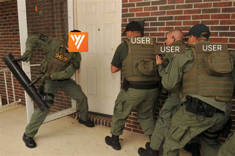
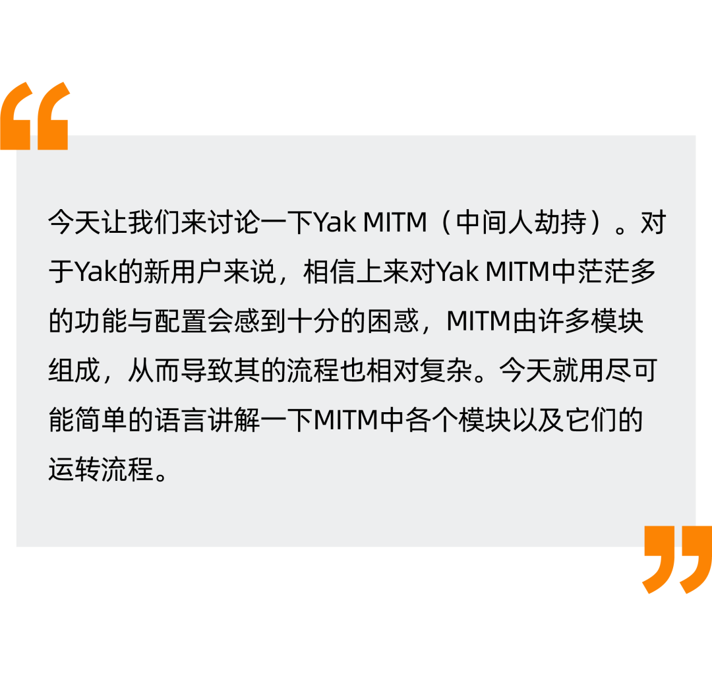
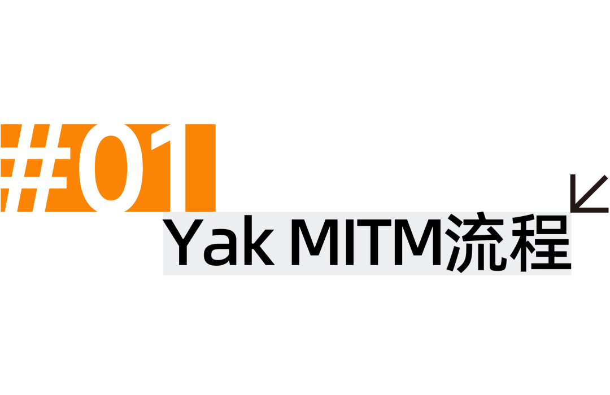
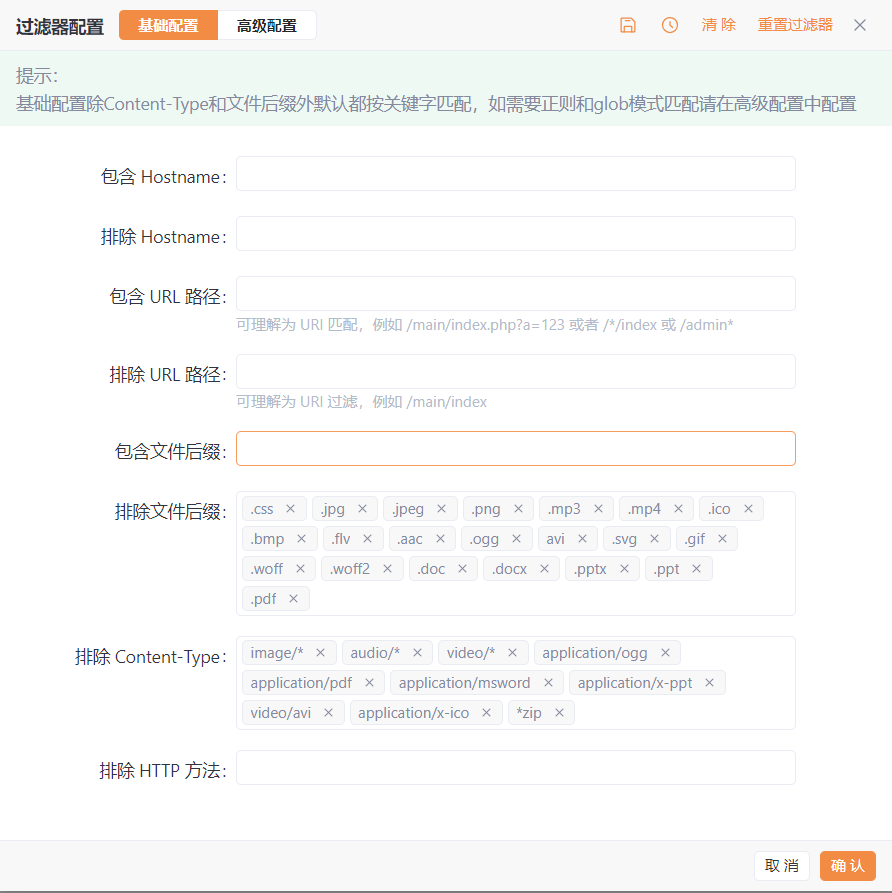
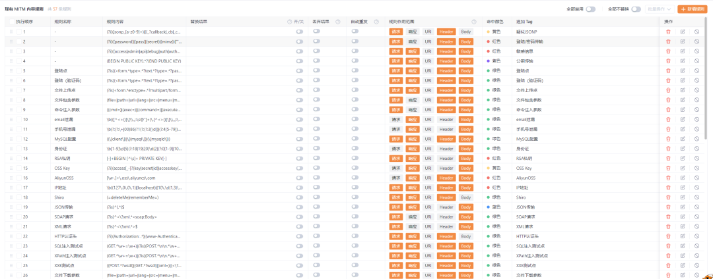
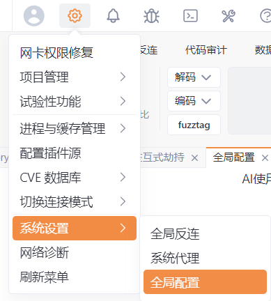
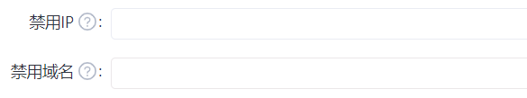

# 不许动，你被劫持了！

日期: 2024-11-21 | 原文: <https://mp.weixin.qq.com/s/CBCeVYdD6vHOF3EusjZ-Kg>

**“Stop！Yak MITM Open The Door！”**








**新的HTTP请求**

对于每个进入MITM的HTTP请求，MITM服务器会启动一个**新的线程**来对其进行处理。

**过滤器**

之后，流量会先进入过滤器，如下图所示：




**过滤器决定请求是应该被过滤（即自动放行）还是应该继续进入后续的流程。**

对于请求来说，过滤器支持对Hostname（主机名）、URL路径、请求方法进行过滤。

被过滤器过滤的请求会自动放行（直接流向目的服务器/代理服务器），并返回响应，中途不会再经过绝大多数模块（Yakit劫持，内容规则）的处理。

**检测请求方法**

对于没有过滤的请求，会再单独检查请求方法，对于Connnect请求方法，MITM服务器会特殊处理，而其他方法则进入到下一个模块中。

**内容规则**

然后，请求会进入内容规则模块的处理，如下图所示：




请求会经过每一个处理请求的规则（会优先经过需要替换的规则），并会对该流量进行提前的染色或者添加标签。需要特殊注意的是，**如果某个规则对请求进行了丢弃，就不会再进入后续的流程。方法：hijackRequest**

接下来，请求会进入插件/热加载中的hijackRequest方法进行处理，**经过处理的请求可能会被丢弃（不会再进入后续的流程）**，或者被修改。

```go
// hijackHTTPRequest 每一个新的 HTTPRequest 将会被这个 HOOK 劫持，
// 劫持后通过 forward(modified) 来把修改后的请求覆盖
// 如果需要屏蔽该数据包，通过 drop() 来屏蔽
hijackHTTPRequest = func(isHttps, url, req, forward /*func(modifiedRequest []byte)*/, drop /*func()*/) {
}
```

**Yakit前端**

接着，请求会进入到Yakit前端，Yakit前端有三个模式，如下图所示：


除了手动劫持以外，**剩下的两个模式都会将请求自动放行（直接流向目的服务器/代理服务器）并记录在History中**。对于手动劫持的请求，用户可以手动为其添加颜色或标签，修改请求，提交数据或丢弃数据，**丢弃数据后不会再进入后续的流程。方法：beforeRequest**

后续，请求会进入插件/热加载中的beforeRequest方法进行处理，经过处理的请求可能被修改。

```swift
// beforeRequest 允许发送数据包前再做一次处理，定义为 func(origin []byte) []byte
beforeRequest = func(req) {
}
```

**全局配置-禁用IP/禁用域名**

之后，即将发出的请求还会经过系统配置 - 全局配置中的禁用IP/禁用域名，对于禁用的IP或域名，请求会被自动丢弃并且不会再进入后续的流程：





**发起请求，接收响应**

请求会被发往目的服务器/代理服务器，然后接收到对应的响应。

**再次进入过滤器**

对于响应，会再次进入过滤器，对于响应来说，过滤器支持对Content-Type，文件后缀进行过滤。


**过滤器决定响应是应该被过滤还是应该继续进入后续的流程。**

对于被过滤器过滤的响应，流量不会记录到History中，中途不会再经过绝大多数模块的处理，**只会镜像到插件或热加载中mirrorHTTPFlow方法中。方法：hijackResponse/hijackResponseEX**

请求与响应会依次进入插件/热加载中的hijackResponseEx，hijackResponse方法。经过处理的响应可能被修改或被丢弃，**被丢弃的流量不会再进入后续的流程。**

```swift
// hijackHTTPResponse 每一个新的 HTTPResponse 将会被这个 HOOK 劫持，劫持后通过 forward(modified) 来把修改后的请求覆盖，如果需要屏蔽该数据包，通过 drop() 来屏蔽
hijackHTTPResponse = func(isHttps, url, rsp, forward, drop) {
}

hijackHTTPResponseEx = func(isHttps, url, req, rsp, forward, drop) {
}
```

**第二次：内容规则**

响应会经过每一个处理响应的规则（会优先经过需要替换的规则）并会对该流量进行染色或者添加标签。需要特殊注意的是，**如果某个规则对响应进行了丢弃，就不会再进入后续的流程。可选：再次进入Yakit前端**

如果首次进入Yakit前端时设置了劫持响应，那么响应会再次进入Yakit前端。Yakit前端有三个模式，除了手动劫持以外，**剩下的两个模式都会将响应自动放行（跳过此流程，继续后续流程）。**对于手动劫持的响应，用户可以手动为其添加颜色或标签，修改响应，提交数据或丢弃数据，**丢弃数据后不会再进入后续的流程。方法：afterRequest**

后续，响应会进入插件/热加载中的beforeRequest方法进行处理，经过处理的请求可能被修改。

```swift
// 在回复给浏览器之前的hook
afterRequest = func(ishttps, oreq/*原始请求*/ ,req/*hiajck修改之后的请求*/ ,orsp/*原始响应*/ ,rsp/*hijack修改后的响应*/){
}
```

**创建流量**

根据最终的请求，响应以及前面标注的颜色，标签创建流量，并准备存储进入数据库。

**第三次：内容规则**

响应会经过每一个规则，对匹配到对应规则的流量进行染色或者添加标签。

**方法：hijackSaveHTTPFlow**

后续，流量会进入插件/热加载中的hijackSaveHTTPFlow方法再最后进入数据库之前进行处理，用户可以在此对流量进行修改（修改请求/修改响应/添加标签等）或者丢弃。**丢弃的流量不会存储进数据库中。**

```swift
hijackSaveHTTPFlow = func(flow /* *yakit.HTTPFlow */, modify /* func(modified *yakit.HTTPFlow) */, drop/* func() */) {
}
```

**流量进入数据库**

流量在进入数据库之前会等待前序的内容规则/hijackSaveHTTPFlow最多300毫秒，之后若流程完成或超时，都会将非丢弃的流量存储进数据库中。
