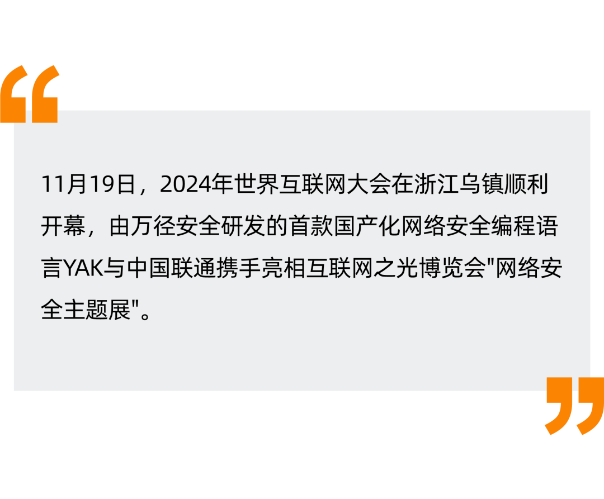
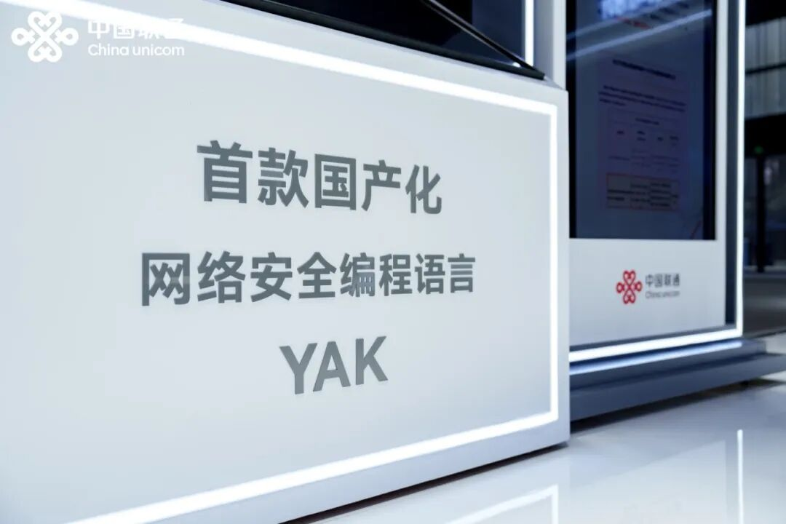

# YAK 亮相2024年世界互联网大会！携手中国联通共塑网络安全新生态

日期: 2024-11-20 | 原文: <https://mp.weixin.qq.com/s/r2BwfqVfBw9pNOmxQMqjWQ>

11月20日，国家主席习近平向2024年世界互联网大会乌镇峰会开幕视频致贺，并指出，当前我们应当把握数字化、网络化、智能化发展大势，把创新作为第一动力、把安全作为底线要求、把普惠作为价值追求，加快推动网络空间创新发展、安全发展、普惠发展，携手迈进更加美好的“数字未来”。

**聚焦网络安全未来发展**

2024年世界互联网大会“互联网之光”博览会“网络安全主题展”上，中国联通以“融智链安，护航向新”为主题，聚焦网络安全未来发展。其中，由中国联通、电子科大、万径安全等国内顶尖科研团队打造的首款全国产化的网络安全领域专用编程语言 YAK 成功展出。

**YAK是第一款专为网络安全而生的专业编程语言**

Yak 是由万径安全开发的一门图灵完备，且易书写、易分发、自主可控的首款网络安全领域编程语言(Cyber-security Domain-Specific Language)。

作为一门动态强类型语言，Yak语法简单，交互快速，可以作为"嵌入式语言"被其他语言调用或编译，帮助安全专业人员更加高效地编写脚本和工具。
