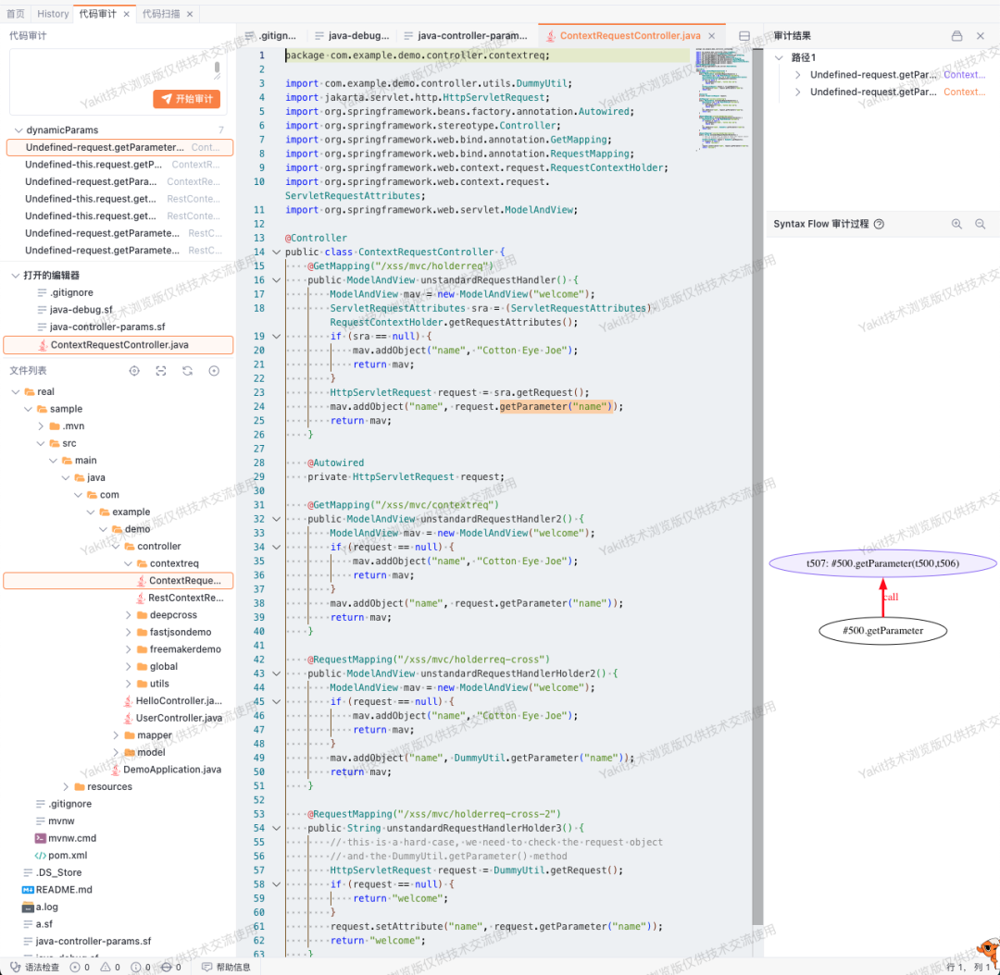
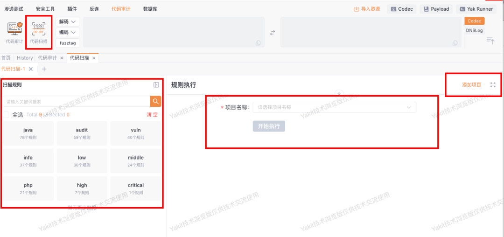
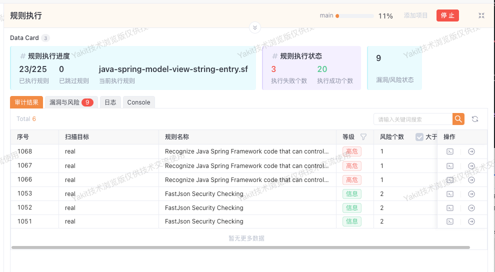
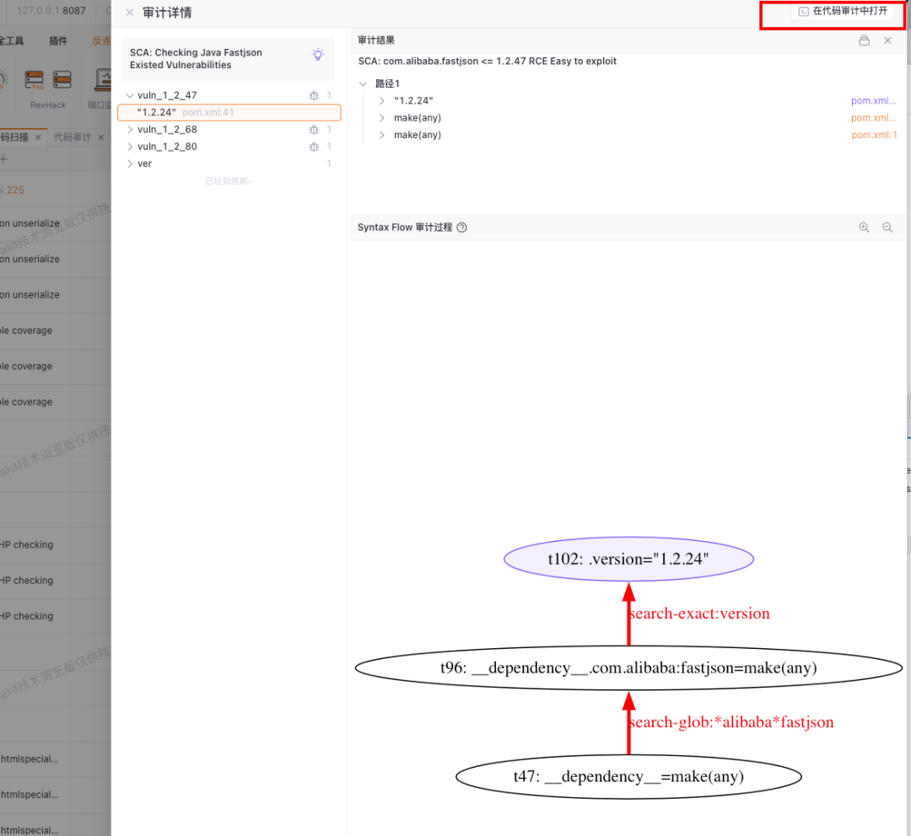
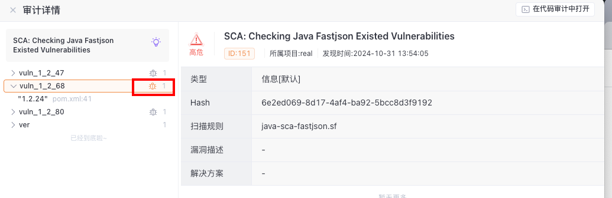
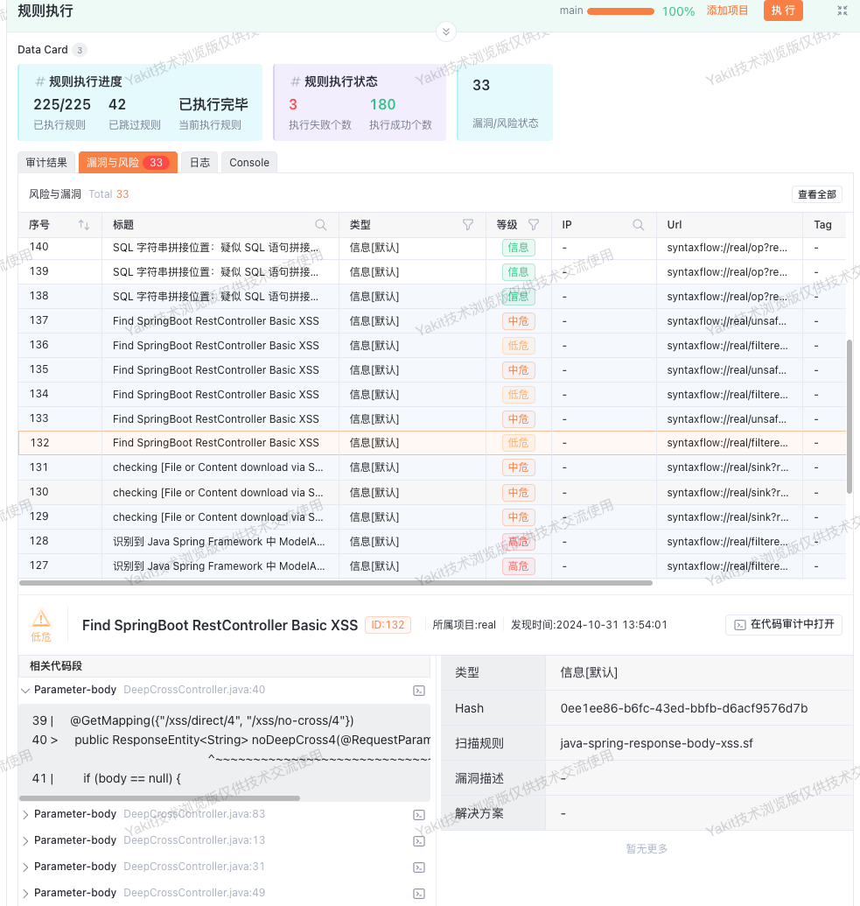
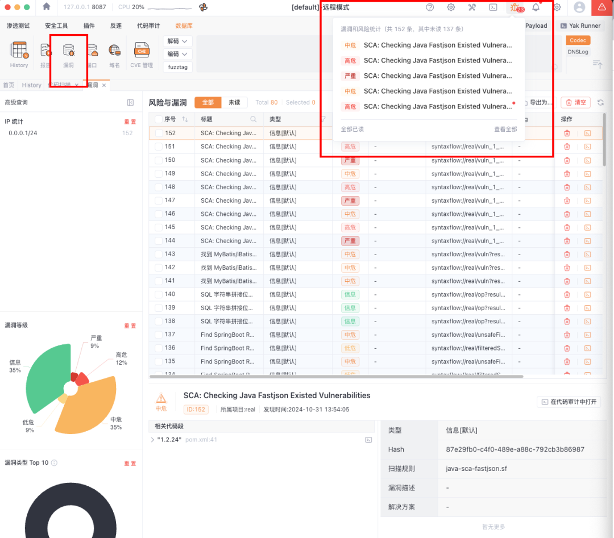
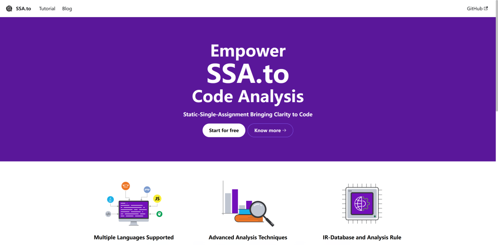
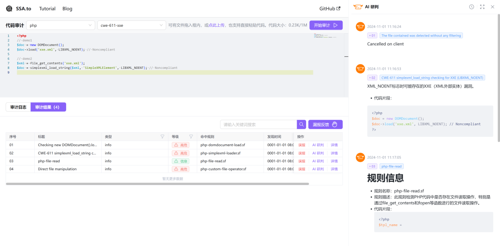
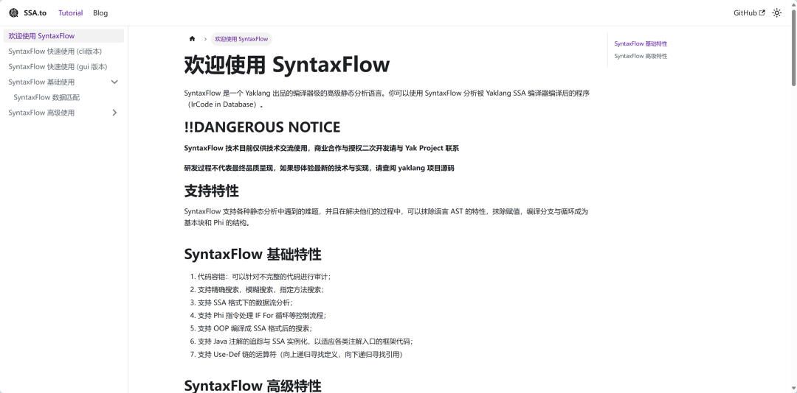

# 你这SyntaxFlow，保熟吗？

日期: 2024-11-01 | 原文: <https://mp.weixin.qq.com/s/7h7DuhPWONH0iOQ_xdkgaw>

朋友，你还在苦苦寻觅代码审计更便捷的方式么？

本周不仅有**Yakit SyntaxFlow界面上新**

更有全新**网页端代码扫描小工具**

一键启动代码审计！

谁说这代码审计老啊？这代码审计可太棒了！

**代码审计功能：项目管理**

点击代码审计功能会进入到项目管理页面， 在此页面将会展示已编译的所有项目，可以在操作中选择跳转到代码扫描页面或代码审计页面。

在此页面也可以在右上角开始编译新的项目，将会在编译完成以后自动跳转到代码审计页面：

代码审计页面如下：

可以看到类似之前的yakRunner内的代码扫描功能，调整了下文件系统和代码审计框的布局。

点击代码扫描功能，可以使用内置规则对已编译项目进行代码扫描：

- 在页面左侧为规则选择页面，目前支持内置规则和内置规则分组。

> 内置规则正在持续更新。接下来也会开放用户自定义规则、自定义规则分组的功能。

- 在页面中间可以通过下拉框选择已编译的项目，也可以通过右上角添加项目进行编译。

在选中规则以及项目以后可以开始扫描：

将会显示以下信息：

- **执行进度：**
- **执行状态：**

在表格中，将会展示审计结果和漏洞风险。

审计结果默认仅展示风险个数大于0的审计结果。在扫描执行结束以后可以手动取消选中查看全部的规则，也可以对表内的等级等信息进行筛选。

表中的每一项都是一次审计的结果。其中出现风险个数的是有意义的审计结果。其中的每一项都可以查看信息：

- 操作中的终端图标将可以直接跳转到代码审计页面打开整个项目查看相关信息。
- 操作中的➡️图标将会用侧边栏打开并展示相关信息，此时也可以跳转到代码审计页面查看项目。

相关的操作与代码审计页面一致，查看审计的结果，审计的路径以及过程图。

值得注意的是如果当前展示的审计结果有相关漏洞与风险信息的话将会标注漏洞风险的bug图标，点击可以查看对应的漏洞风险信息。

漏洞与风险的数据展示如下：

和之前的漏洞与风险同样的操作逻辑，点击将会显示漏洞与风险信息。

但同时，右侧将会显示该漏洞与风险的对应代码。点击相关代码段可以展开显示代码内容，点击右侧终端图标将会跳转到代码审计页面自动打开对应的代码查看详情。

代码扫描产生的漏洞与风险同样被保存在全局，如下图所示，将会在yakit顶栏出现通知，并且可以在全局数据库内看到：

**无需安装yakit**，在线启动代码审计？

超级牛全新**网页版代码扫描**平台上线，轻量级代码段一把梭哈！

**网址：**Hello from SSA.to | SSA.to

全新风格平台，代码扫描启动！

AI协助研判，代码片段快速分析，误报漏报一键反馈

教程详细，多个版本一站速通

Let's Start For Free！
