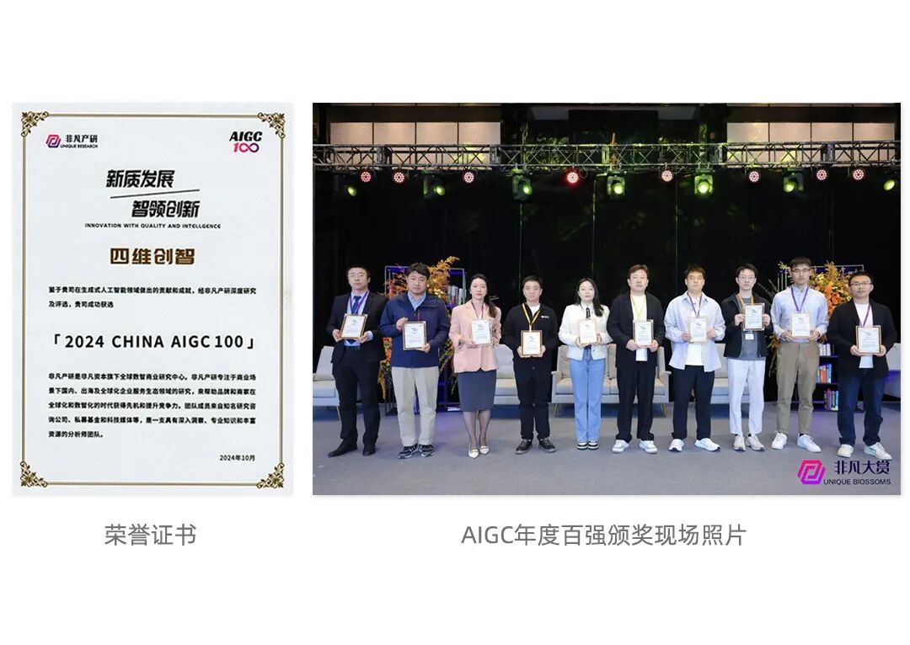
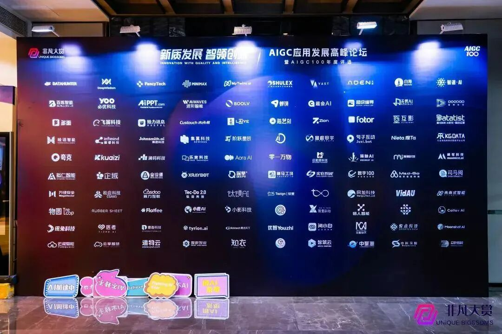

# AIGC年度百强名单出炉，万径安全上榜！

日期: 2024-10-18 | 原文: <https://mp.weixin.qq.com/s/o3Pi6Ow3z7TQRqAXux9zUA>

2024年10月17日，「2024年度AIGC应用发展高峰论坛暨AIGC100年度评选」隆重开幕，万径安全凭借AI与网络安全领域的融合创新成功入选。

“AIGC100评选”旨在挖掘并表彰在泛AI应用领域具有卓越贡献的100家先进企业，这些企业覆盖了教育、医疗、金融、零售、物流、制造、娱乐等多个行业，充分展示了AI技术在不同领域的广泛应用与深远影响。

万径安全入选中国AIGC百强名单不仅彰显了在行业中的重要地位，也为整个AIGC行业的发展注入了新的活力。随着人工智能技术的不断进步，公司将继续加大在AIGC领域的研发投入，推动技术创新，拓展业务边界，在网络安全领域持续深耕。

**万径安全核心战略以“AI+”为底色**

万径安全以 “AI+YAK” 为企业核心战略，专注于网络安全基础设施和智能化技术研究，致力于为企业提供专业的网络安全基础设施，为企业带来专业、可控、放心的安全产品及服务。2019年公司率先发布了基于“AI+知识图谱”的智能渗透测试机器人，将人工智能首次融入网络安全；2023年上线基于领域知识增强的网络安全领域大模型千机（ChatCS），用AI助力安全从业人员全面提升。经过多年有益尝试，公司不断践行AI与网络安全领域融合发展，积极推动行业的创新性变革。

**千机(ChatCS)是AI驱动安全的佼佼者**

千机（ChatCS）自2019年就确定了基于领域知识图谱增强、构建贴近网络安全场景真实需求的技术发展战略。公司先后构建并应用了漏洞情报问答、告警分诊、数据分类分级治理、自动化漏洞挖掘、智能渗透测试等智能体，综合渠道访问量每日上万次调用、最终用户涵盖社区和政企单位，运用于能源、教育、运营商、金融等各个行业，因其具备高质量大规模领域知识支撑，为客户带来精确、专业的网络安全事件响应决策指导和漏洞挖掘、渗透测试方面工作的效率提升。

**关于万径安全**

万径安全是网络安全行业知名的专精特新企业，致力于为用户提供全面、高效、安全的网络安全解决方案。公司以 “AI+YAK” 为企业核心战略，专注于网络安全基础设施和智能化技术研究，打造了首款国产安全语言Yaklang和网络安全专用AI大模型千机（ChatCS）两大核心，并基于YAK构建自主可控的网络安全生态体系，推动安全产业融合发展，产品已广泛应用于能源、金融、运营商等多个行业。
