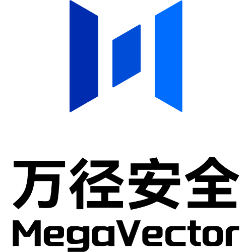
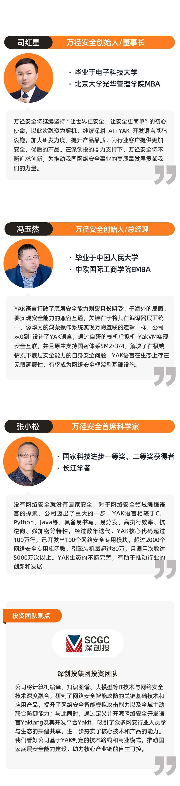
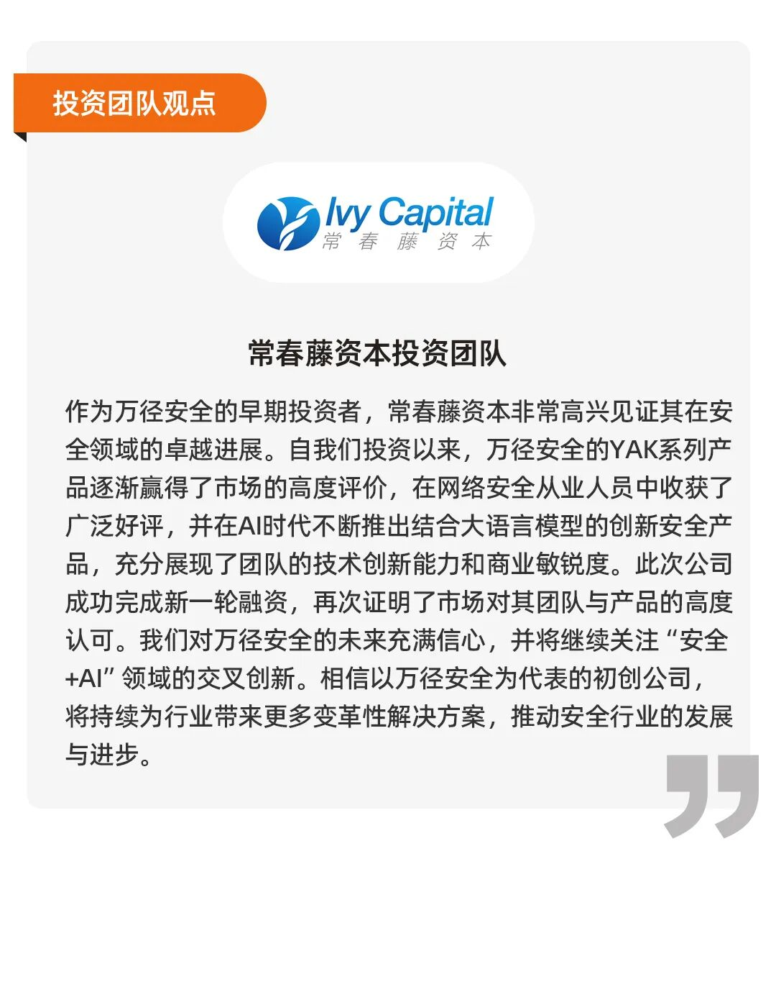

# 聚焦AI+YAK生态！万径安全获数千万元深创投独家投资

日期: 2024-09-24 | 原文: <https://mp.weixin.qq.com/s/RYdDRUvVhiiuZuC4oA7SzQ>

2024年9月，万径安全（四维创智（北京）科技发展有限公司）完成数千万元新一轮增资。深圳市创新投资集团有限公司（简称“深创投”）作为本轮独家投资方，将助力万径安全进一步加强在网络安全领域的研发实力，扩大市场份额，推动公司业务持续高速发展。

万径安全成立于2013年，是网络安全行业知名的**专精特新**企业，致力于为用户提供全面、高效、安全的网络安全解决方案。

公司以 **“AI+YAK”**为企业核心战略，专注于网络安全基础设施和智能化技术研究，打造了首款国产安全语言Yaklang和网络安全专用AI模型千机（ChatCS）两大核心，并基于YAK构建自主可控的网络安全生态体系，推动安全产业融合发展，产品已广泛应用于能源、金融、运营商等多个行业。

**万径安全将携手合作伙伴共建网络安全生态，以YAK编程语言夯实底层能力，致力为我国网络安全产业提供强大的技术支持。在国产自主可控的大背景下，加速打造网络安全新质生产力，共同将YAK打造成中国网络安全产业链的核心基础设施之一。关于深创投**

深圳市创新投资集团有限公司（简称“深创投集团”）1999年由深圳市政府出资并引导社会资本出资设立，集团以发现并成就伟大企业为使命，致力于做创新价值的发掘者和培育者，已发展成为以创业投资为核心的综合性投资集团，现注册资本100亿元，管理各类资金总规模约4800亿元。

**关于常春藤资本**

上海常春藤投资有限公司（简称“常春藤资本”）自2007年成立以来，专注于科技领域的早期投资，投资覆盖了企业数字化、AI、芯片、智能制造等多个高增长领域。常春藤资本始终坚守“因为专注，所以专业”的投资纪律，致力于成为科创企业背后的耐心资本。2021年，常春藤资本在万径安全的Pre-A轮融资中担任领投方，是其最早的机构投资者之一。
