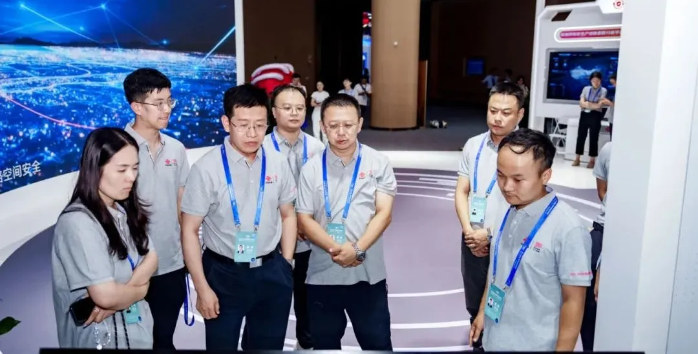

# 携手中国联通共建网络安全生态，YAK编程语言亮相网安周

日期: 2024-09-09 | 原文: <https://mp.weixin.qq.com/s/7c5o0jJYcevpMhPI5gy2fw>

2024年9月8日，国家网络安全宣传周在广州南沙正式开幕。中国联通以“**数智融安，筑盾向新”**为主题，涵盖多项安全业务，展示了中国联通打造网络安全产业高地、筑牢国家网络安全屏障的最新成果。

**首款全国产化网络安全领域专用编程语言——YAK亮相展区。**

**自主创新，铸就安全防线**

网络安全已成为国家战略的重要组成部分。中国联通携手电子科技大学、四维创智等国内顶尖科研团队，成功打造了**首款**全国产化的网络安全领域专用编程语言——YAK**。

YAK语言，是我国网络安全领域自主创新能力的体现。从底层编译器到栈机虚拟机，核心组件均实现自主研发，确保技术的自主性和可控性。从源头到应用的全流程国产化，让YAK编程语言在保障网络安全方面具备突出优势。

**国际先进、国内领先**

YAK编程语言在技术上达到了国际先进、国内领先水平，研制难度大，创新性突出。它的出现，打破了国外编程语言在网络安全领域的垄断地位，为我国网络安全产业注入了强大的动力。入选2023年信息通信领域十大科技进展，是对YAK编程语言创新性和先进性的高度认可。

**赋能产业，打造新质生产力**

四维创智将携手中国联通共建网络安全生态，以YAK编程语言夯实底层能力，致力为我国网络安全产业提供强大的技术支持。在国产自主可控的大背景下，加速打造网络安全新质生产力，共同将YAK打造成中国网络安全产业链的核心基础设施之一。
