# 玩越权测试插件？我来助你

日期: 2024-08-30 | 原文: <https://mp.weixin.qq.com/s/zs8xi3L3r_PWk0lG-XBIbQ>

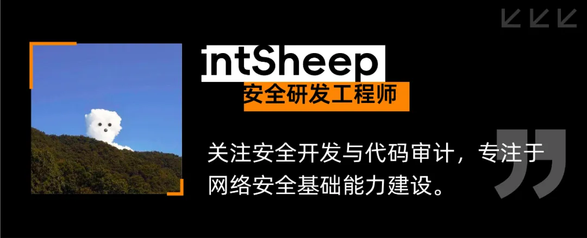

[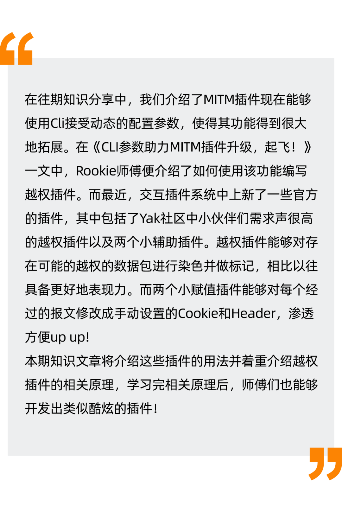](http://mp.weixin.qq.com/s?__biz=Mzk0MTM4NzIxMQ==&mid=2247520865&idx=1&sn=b56361be1d147e02733410b9be1a75b9&chksm=c2d1eec5f5a667d3f65a78c0837685809c036e8d55f7a5add58c177f2d6a57de949dd416fb86&scene=21#wechat_redirect)

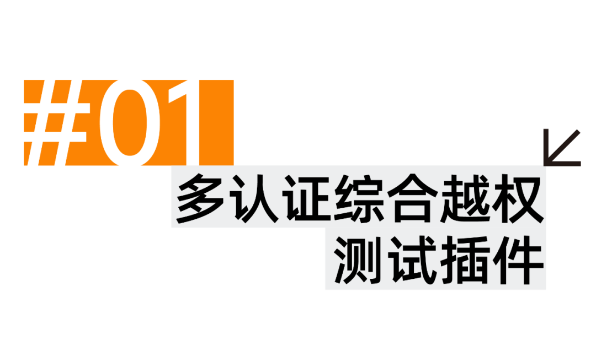

在MITM交互劫持页面的交互插件，便能够找到我们的多认证综合越权测试插件。

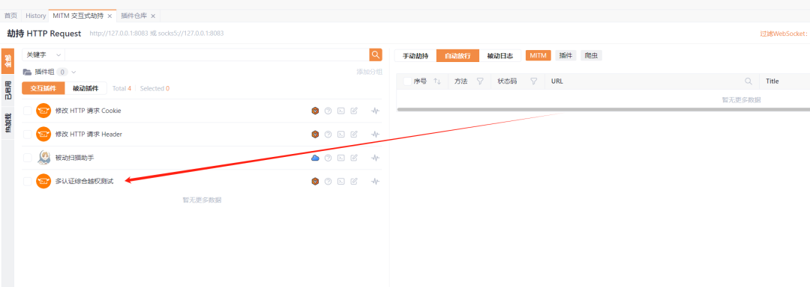

目前多认证综合越权测试能够支持基于Cookie与Header Auth认证两种模式。

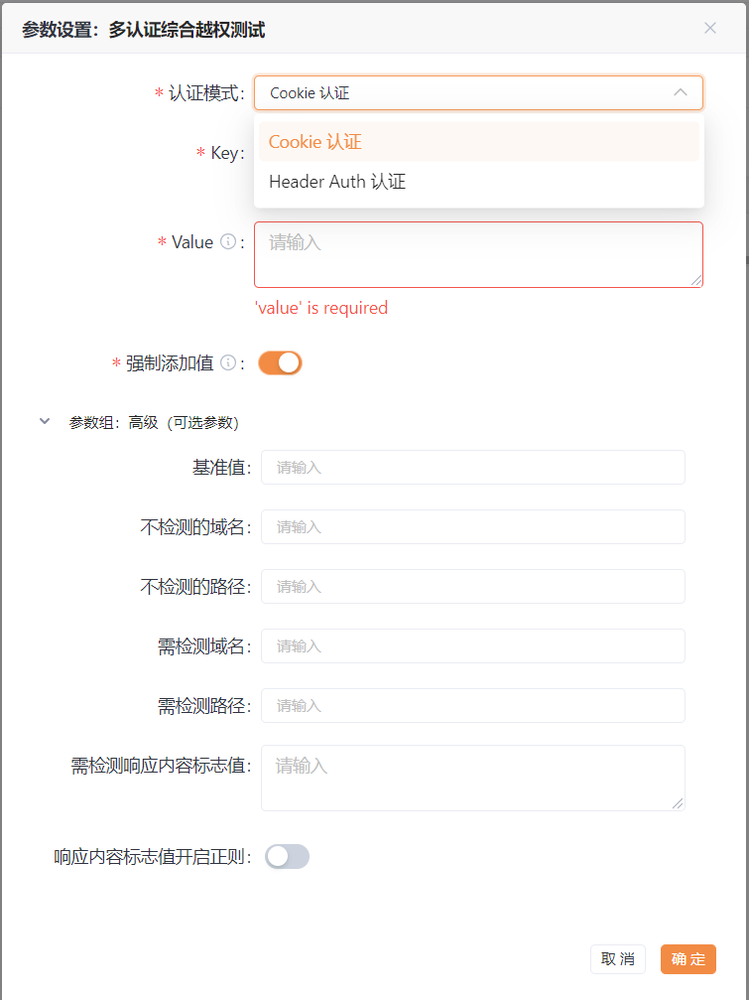

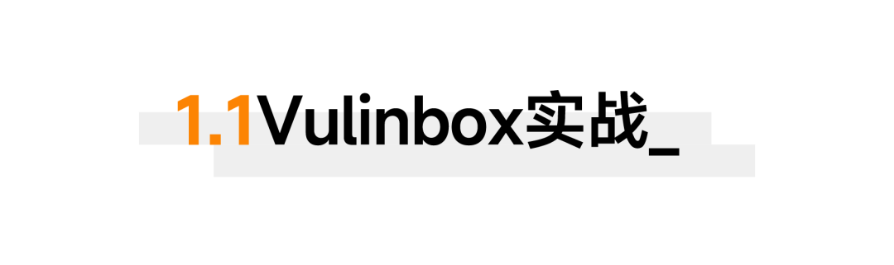

这里使用Vulinbox靶场中的逻辑场景进行插件测试。

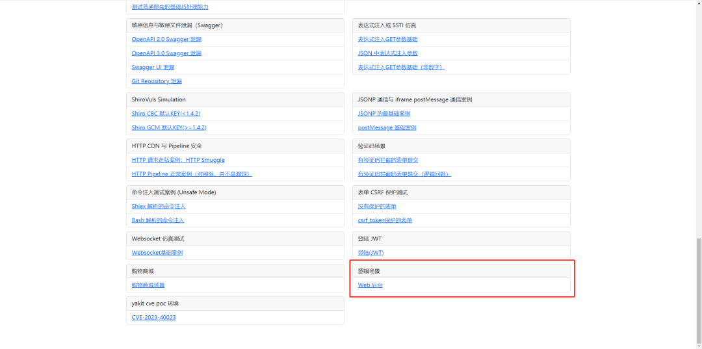

首先注册两个用户，用户名分别为**test1**和**test2**，接着登录**test1**的账号，获取其**cookie**为

```css
_cookie:11e0bdd7-c1e2-4fcd-82a6-7a341d5dc54ebr
```

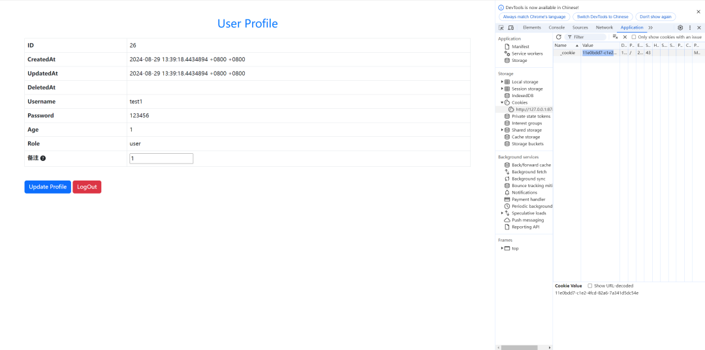

接着将cookie配置进多认证综合越权测试插件，并启动插件:

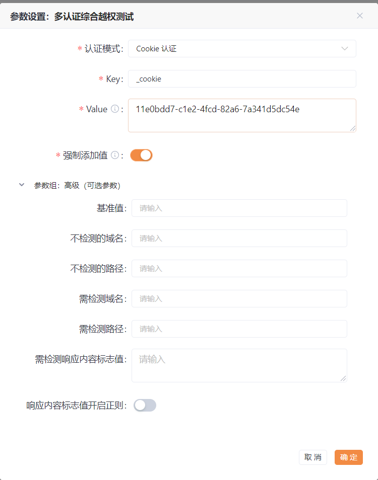

接着在**不退出test1**的情况下，使用**test2**账号进行登录，从MITM流量中的**插件**是可以看到经过修改的数据包的。如下图，一共有两条数据，第一条为**_cookie**被移除了，做了一个未授权访问的检测，发现不存在未授权访问。而第二条的**_cookie**使用的是**test1**的，并且其返回包的内容与使用**test2**的**_cookie**一模一样，因此我们认为其存在水平越权漏洞，并且将该条报文设置成**红色**，以便其更加显眼。

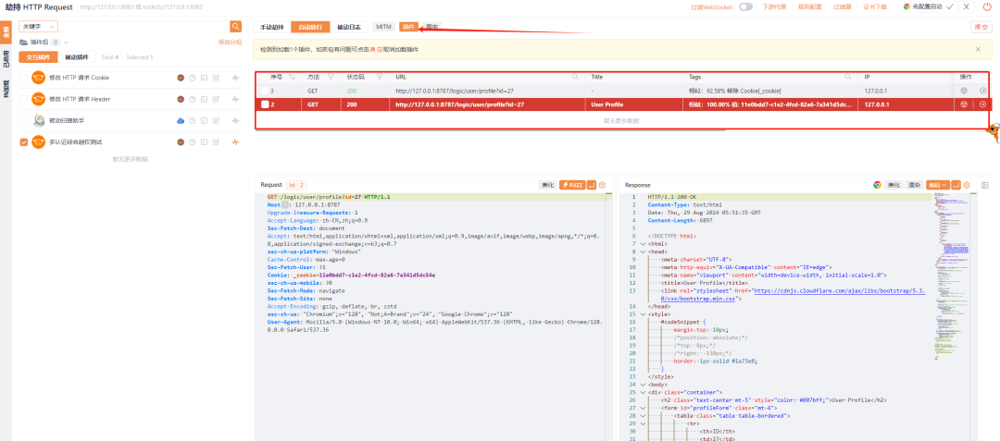

这里只有两条被修改过cookie的报文，那么我们要看原报文如何查看呢？很简单，只要点击MITM便可以了。

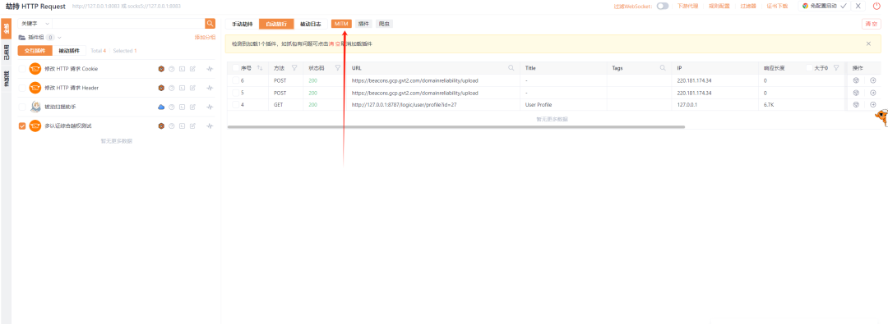


怎么样？该插件相比之前的交互式插件是不是更"酷"了呢？以上，我们实现了数据包的**染色**以及**tag**的添加，以便能够一眼看到哪些报文存在越权漏洞。事实上，对数据包添加tag与染色并不是什么魔法，它只是"简单地"加了一串yaklang的代码，便能够有如此之奇效。所以，在你编写自己的插件的时候，完完全全可以应用这些功能，让你的插件更加的酷炫，更加具有表现力。

为了进一步了解其相关原理，我们可以将鼠标悬浮于"多认证越权测试插件"上，查看其代码的实现。其染色与加tag主要逻辑在下方的handleReq中：

```bash
 handleReq = (reqBytes, newValue) => {        poc.HTTP(            reqBytes,            poc.https(https),            poc.saveHandler(response => {                tag= ""                if len(enableResponseKeywordList) > 0 {                    if respMatch(response.RawPacket,enableResponseKeywordList...){                        tag = "响应内容标志值匹配"                        response.Red()                    }else {                        tag = "响应内容标志值消失"                        response.Green()                    }                }else{                    sim := str.CalcSimilarity(baseResponse, response.RawPacket)                    if sim > 0.95 {                        response.Red()                    } elif sim <= 0.4 {                        response.Green()                    } else {                        response.Grey()                    }                    showSim = "%.2f" % (sim * 100.0)                    tag = f"相似：${showSim}% "                }                if newValue == "" {                    tag = f"${tag} 移除 ${isCookieMode? f`Cookie[${key}]`:f`Header[${key}]`}"                }else{                    tag = f"${tag} 值: ${newValue}"                }                response.AddTag(tag)            }),         )    }
```

可以看到，当http数据包要被保存的时候，会调用**saveHandler**进行相关处理（函数的相关作用可以在yakRunner代码提示中进行查看）。具体逻辑为，如果返回包匹配到了我们手动设置的相关字段，那么就使用**response.Red()**让该数据染成红色，否则就是绿色。而如果没有手动设置关键字的话，那么就使用**str.CalcSimilarity**文本相似性算法，计算新的返回包与原来返回包直接的相似性，如果精度达到0.95以上的话就设置为红色。最后使用**response.AddTag(tag)**进行tag的添加。

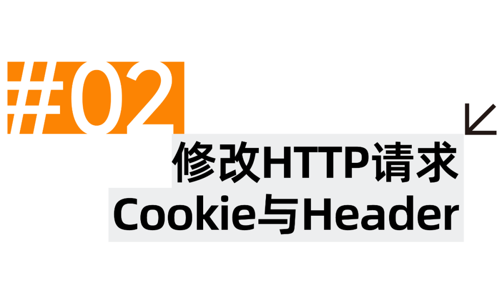

# 与多认证综合越权测试插件一起上架的还有**修改 HTTP 请求 Cookie**与**修改 HTTP 请求 Header**两款交互性插件，因为两款插件大差不差。这里以**修改 HTTP 请求 Cookie**做介绍。

以下是该交互性插件所需要添加的参数，分别为cookie的key和value。同时还有一个前提URL条件，如果填了前提URL条件，那么就只会改相关URL的cookie。修改cookie的行为本质是调用**poc.ReplaceHTTPPacketCookie**函数的，因此如果请求包中存在该cookie就会进行修改，不存在的话就会添加这个cookie。

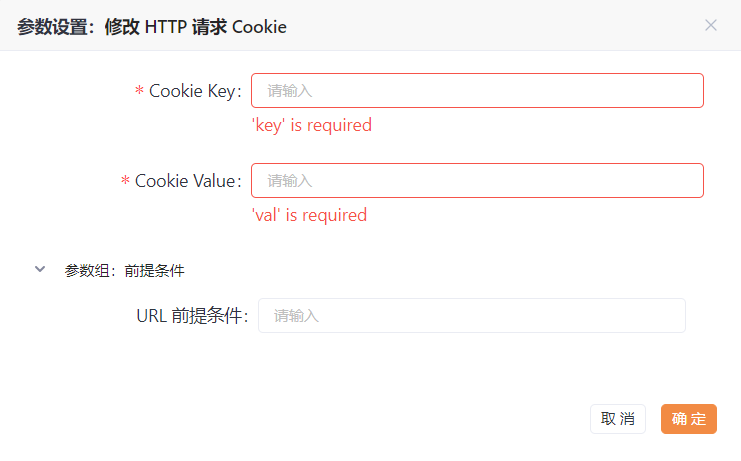

在这里，我们以访问百度为例，配置内容如下:

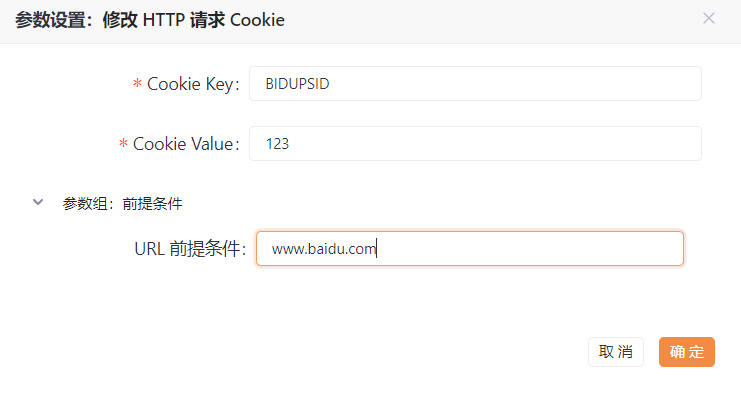

启动后，可以发现与百度相关cookie都会被修改了：

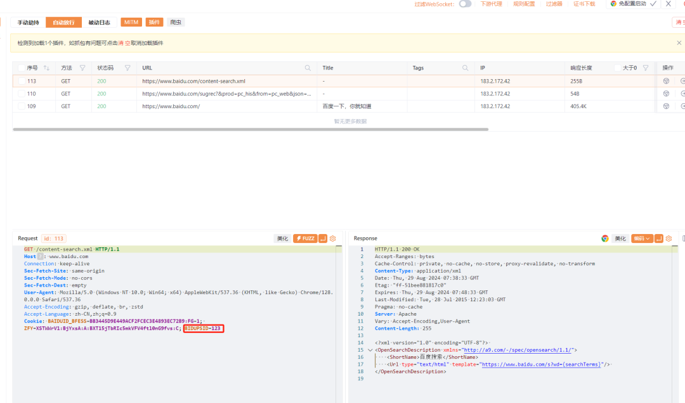

> 这里值得注意的是，如果取消选中交互插件，那么页面会默认显示MITM的流量，需要点击插件最右边的按钮才能查看相关插件的流量。

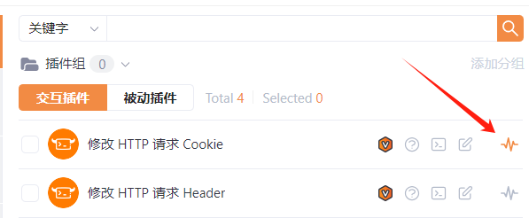

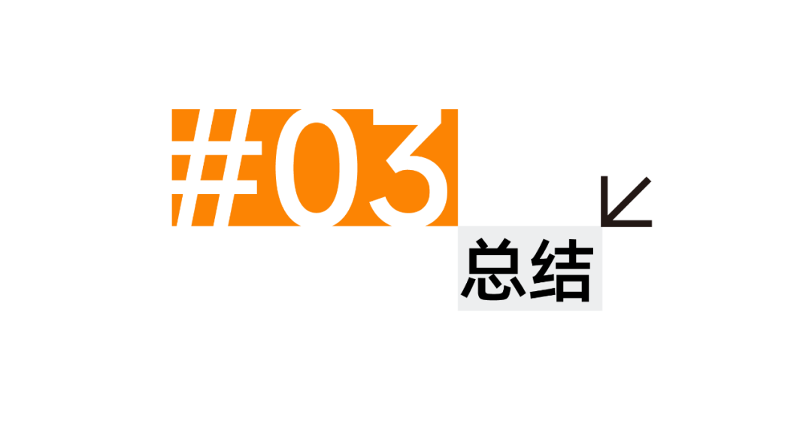

# 官网新上线的这几个交互插件，可以更为方便进行渗透测试。其中多认证越权测试能够对存在的越权漏洞的数据包打上颜色与标签，可以说表现力比以往更上一层次。在了解其相关原理以后，也推荐师傅们可以开发出类似酷炫的插件！
