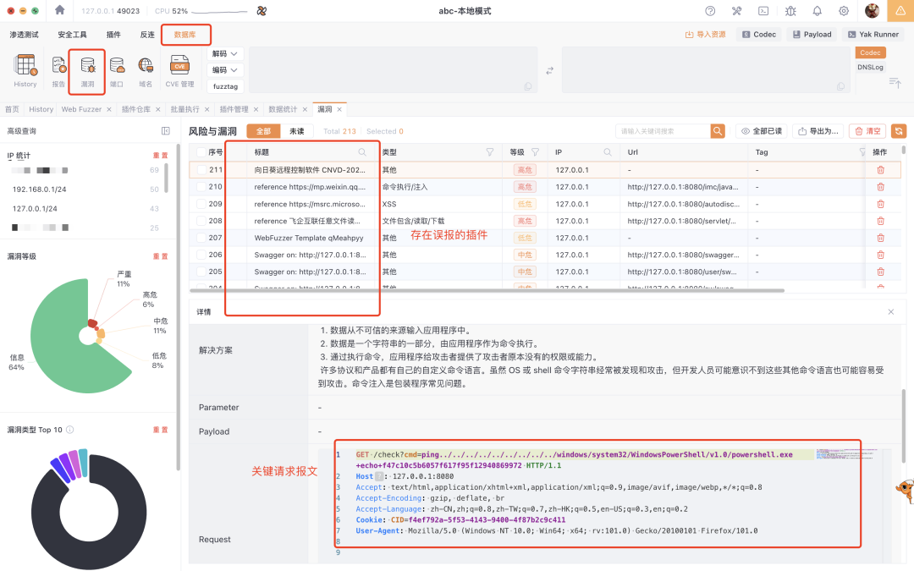
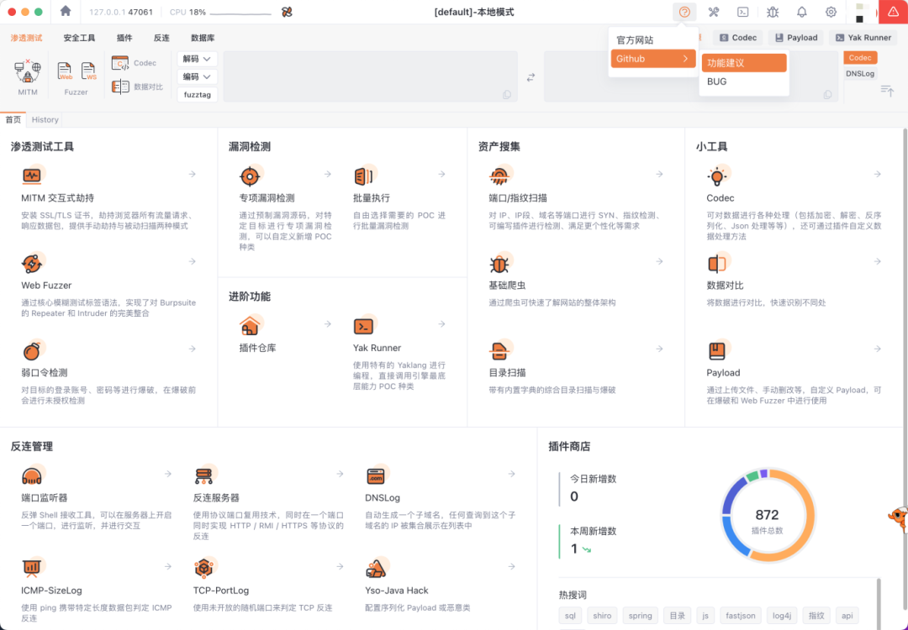
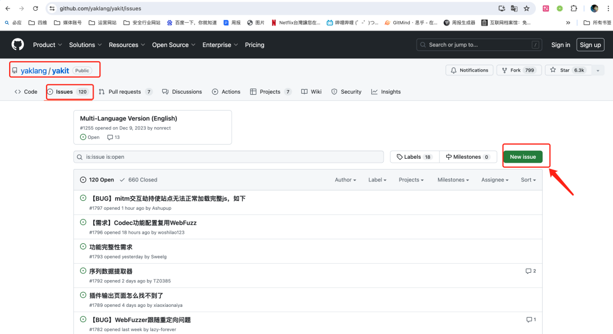

# 【体验+1】Yakit插件商店治理计划，启动！

日期: 2024-07-10 | 原文: <https://mp.weixin.qq.com/s/ttvbPIpxGnglYIeL1go72w>

整个插件社区的治理，需要大量一线用户提供支持，希望您能在使用过程中，或者看到该文章后，打开您手中的Yakit，找到数据库-漏洞栏，看下您的历史漏洞里是否存在误报。

如果存在误报，我们提供了以下反馈方式：

请您提供填写以下问卷，帮助我们更好的修复插件。问卷地址：

*https://feishu-4dogs.feishu.cn/share/base/form/shrcnzaWRrCZagvo4OBqSYjSkCd*

**步骤2:完成问卷后点击提交即可**

通过 Yakit 内的 Github issue 反馈添加误报/插件优化建议

**步骤1：Yakit内反馈-Github-功能建议**

**步骤2:跳转登陆-进入issue页面提交**

（当然，为了研发同学更好的修复插件的 BUG，请您尽可能在反馈中包含：原始请求，原始响应等必要的可以帮助复现误报的内容，不包含关键信息不被视为有效反馈喔）
