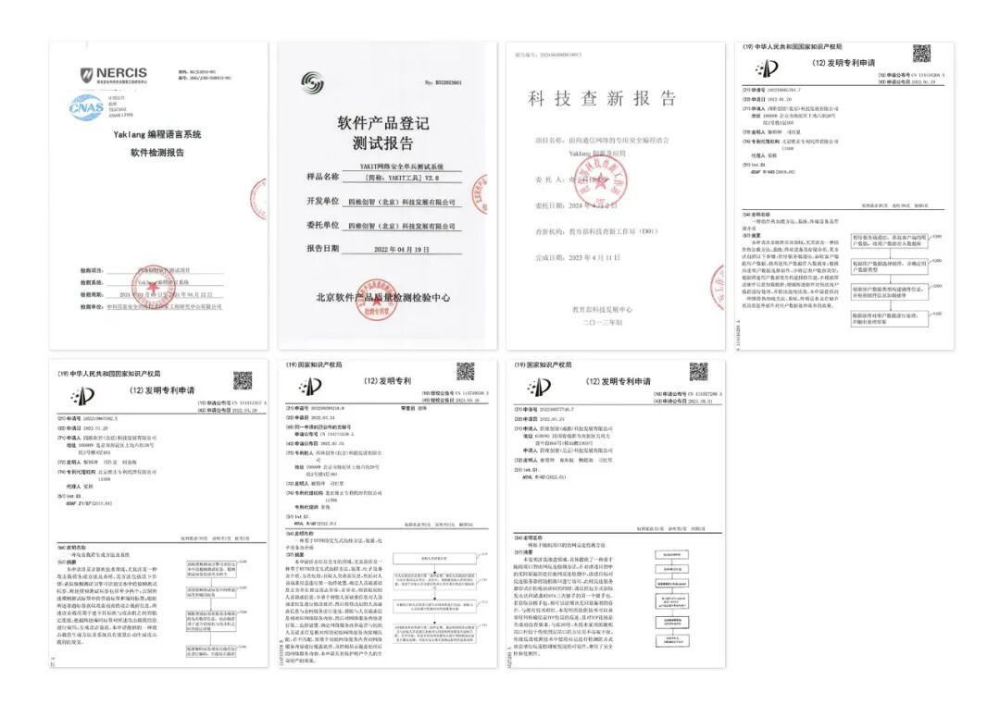

# Yakit：推动企业安全建设的“粘合剂”

日期: 2024-05-16 | 原文: <https://mp.weixin.qq.com/s/yEipyWd-inoRnWrRRHJsSA>

**熟悉我们的朋友去年，公司品牌名全面更换为**万径安全**

官网直通车：*https://megavector.cn/*

官方公众号：

与市场相关的**视觉、品牌、官网、产品文档**也全部做了更新。
品牌升级官宣文档：[一家十年的网络安全公司选择重新创业](http://mp.weixin.qq.com/s?__biz=MzIwMzI1MDg2Mg==&mid=2649943664&idx=1&sn=c8c8826711ef24ffdcd158ca5d60e1c9&chksm=8ed403b1b9a38aa71ba9812d14975e735223081fba98bfa26803ed530f93d8bfc35a30d6ed2a&scene=21#wechat_redirect)

在官网的产品页面，用户可以直接下载对应产品白皮书，白皮书会根据产品、技术更新的进度，不定期进行更新。

## Yakit交互式应用安全测试平台

**最近，Yakit的企业版白皮书又有了一些个大动作。**

首先是资质认证方面：

这几年，Yakit一直深耕安全技术领域，努力打造“一站式”的安全能力基座，致力于网络安全生态发展。这期间，Yakit也取得了不小的成就，先后通过了：

**信息安全共性技术国家工程研究中心的“Yaklang编程语言系统软件检测”；“面向通信网络的专用安全编程语言”的教育部科技查新；“一种插件热加载方法、系统、终端设备及存储介质”的发明专利；“一种基于MITM的交互式劫持方法、装置、电子设备及介质”发明专利；“一种基于随机端口的出网反连检测方法”的发明专利；“一种攻击载荷生成方法及系统”的发明专利；**

其次是内容方面：

在Yakit白皮书1.0的基础上，2.0版本更加完善，**增加了近段时间Yakit迭代的版本功能和技术内容**。主要有以下几点：

**基于 Yak 语言的扩展能力**

除了提供基础的安全工具外，Yakit 允许用户基于 Yak 的特性，对这些工具进行定制和扩展。这意味着在满足日常基础安全功能的同时，用户还可以根据自己的具体需要，添加新的功能或改进现有功能。这种扩展能力大大增强了工具的适用性和灵活性，使其能够更好地适应不同企业的独特需求和不断变化的安全威胁环境。Yakit 的基础安全能力本质上是通过一段脚本或一个 Yakit 插件实现的“动态加载”过程。这个过程非常简便和灵活，用户可以轻松地加载或更新所需的安全功能，无需进行复杂的配置。这种动态加载机制不仅提高了安全工具的灵活性和响应速度，还降低了内部安全开发的的复杂性和成本。

**全方位的权限管控**

在企业的实际应用中，全方位的权限管控是维护系统安全的关键环节。Yakit通过其高级权限管理功能确保只有授权用户才能访问敏感数据和重要功能，从而保护系统免遭未授权访问和潜在内部威胁。这一功能对于维护组织的数据安全性和符合相关法规标准至关重要。Yakit的权限管理系统提供细致的权限和角色控制，确保每个用户能根据其职责和需要获得适当的访问权限。

**项目管理和数据管控**

项目管理功能是为了增强团队的组织和协作效率而设计的。在这个框架下，每个项目中产生的所有业务流量都被详细记录，并存储到单独的数据库中。这一设计不仅使数据的追踪和管理变得更为高效，也为后续的质量分析和数据审计提供了坚实的数据支撑。

Yakit作为高度集成化的Yak语言安全能力输出平台，得益于底层天生的融合特性，并通过丰富的 API 以及插件体系，巧妙地将多元化的安全工具和服务等整合在一个统一的平台上。这种集成性不仅打破了传统工具间的壁垒，还能将各个分散的单位紧密结合。因此，在企业建设中，**可以将Yakit视为企业安全建设的“粘合剂”。**

以Yak语言为核心，依托衍生产品，通过构建底层安全能力基座，协助企业进行网络安全体系建设，推动企业安全运营与安全管理的改革，提高企业高位安全能力。Yakit已慢慢成长为企业安全建设领域的革新者，用技术和产品质量实现“让安全更简单”的承诺。

其他更多的内容，可以点击原文到官网直接下载阅读，关注我们。
