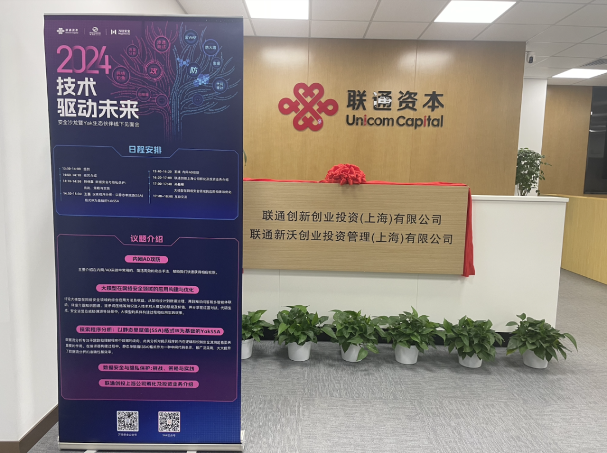
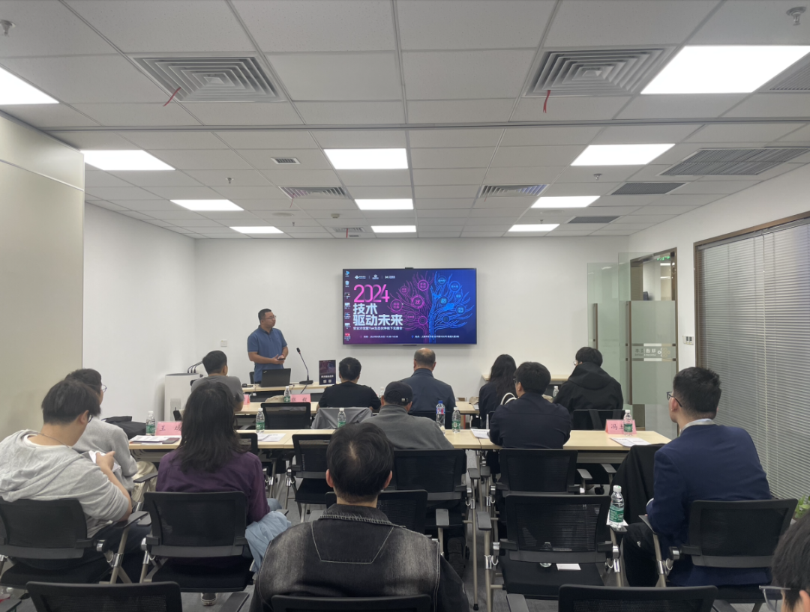
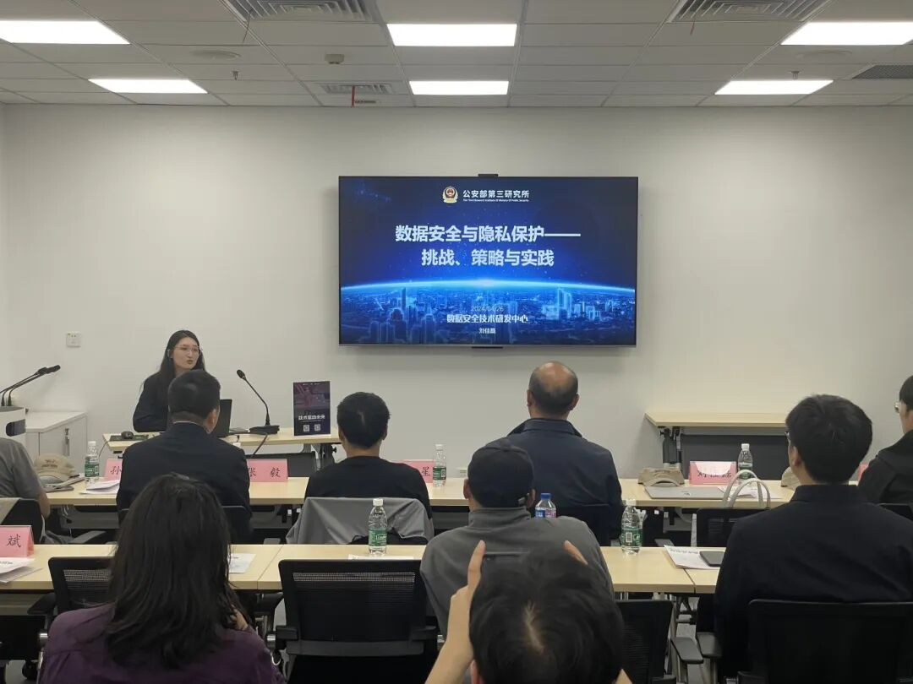
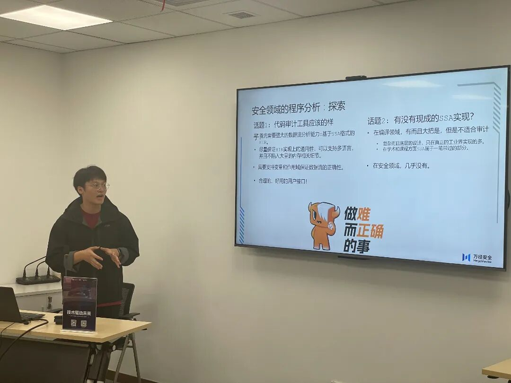
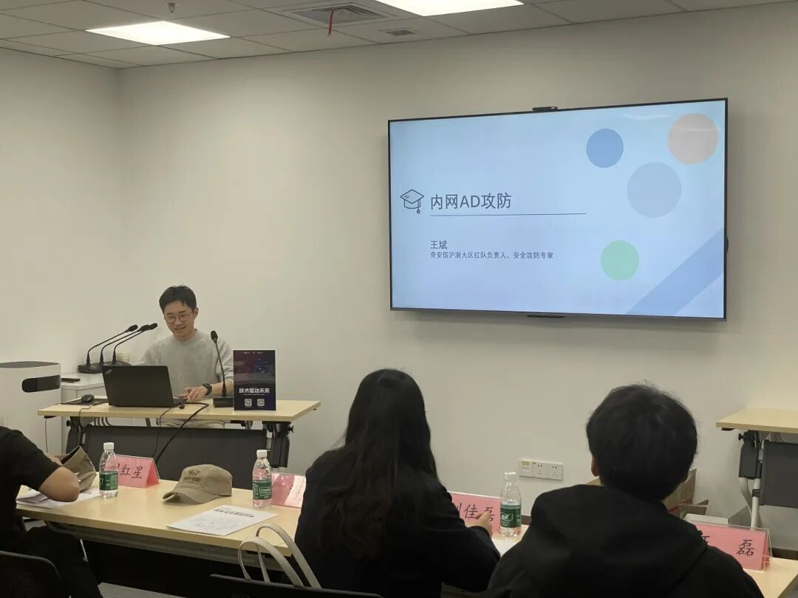
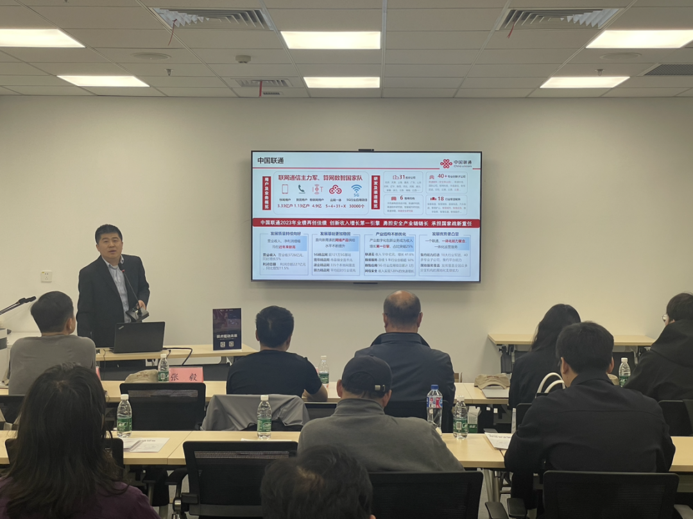
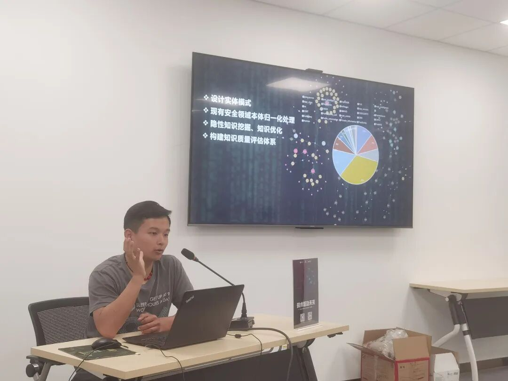

# 圆满结束！聚焦安全前沿，技术探索不止

日期: 2024-04-26 | 原文: <https://mp.weixin.qq.com/s/ERArjr26gK-oEgIOSOk_lg>

**在2024年4月26日的上海联通大厦，一场网络安全领域的线下活动圆满落幕。**

本次沙龙活动是**联通创新创业投资（上海）有限公司、电子科技大学网络空间安全研究院、四维创智(北京)科技发展有限公司**共同举办的，围绕网络安全专用编程语言 Yaklang 创新及应用技术的线下交流见面会。

活动汇聚了业内顶尖专家，围绕内网AD攻防、大模型应用构建与优化以及程序分析等议题展开了深入探讨，聚焦安全领域的前沿技术，以技术创新驱动未来安全新篇章。更有公安三所的嘉宾解读了**数据安全与隐私保护：挑战、策略与实践**；联通创投上海公司则就**孵化及投资业务**展开了详细介绍。

**数据安全与隐私保护**

公安部三所数安中心刘佳磊女士，关注的主题为数据安全与隐私保护，涉及国内外数据泄露事件、政策背景、技术发展及实战案例。重点介绍了隐私计算与区块链结合技术，包括分布式共享、安全多方计算和联邦学习。通过案例展示了如何利用这些技术解决数据隐私保护和共享问题。

**程序分析探秘：YakSSA引领编程语言安全风潮**

令则/王磊先生，万径安全高级安全研发工程师，为大家带来了关于程序分析的深度探讨。他分享了基于静态单赋值(SSA)格式中间代码表示的YakSSA在程序分析实践中的应用，以及如何解决抽象语法树(AST)分析中的复杂多语言前端问题和数据流分析问题。他的分享让大家深入了解了程序分析的重要性以及YakSSA在其中的关键作用。

**攻防之术：内网AD攻防精彩分享**

王斌先生，奇安信沪浙大区红队负责人、安全攻防专家，以其多年攻防一线经验，为大家带来了一场精彩的内网AD攻防主题分享。他深入浅出地介绍了内网/AD实战中常用的攻击手法，让与会者在短时间内领略到了攻防的精髓，为网络安全提供了新的思路和方法。

**要素融通 生态孵化 产投协同**

联通创投上海公司副总经理 张毅为我们详细介绍了联通创投的产业背景及投资理念，还有上海创投业务介绍。

中国联通旗下投资平台通过直投、基金和孵化方式，聚焦网络安全领域，构建产业生态，推动数字经济发展。平台已参股近百家企业，设立市场化基金管理平台，发起并管理多只基金，形成投资链条和协同机制。重点投资网络安全技术，打造产业链安全云市场，推动安全要素资源共享，扩大安全投入，促进产业合作生态繁荣。同时，推动产业生态孵化，建设实体和虚拟孵化空间，提供全周期服务，培育新赛道，开拓新领域。

**网络安全新纪元：大模型引领安全防护革命**

孙基栩先生，万径安全安全研发工程师，带来了关于大模型在网络安全领域的应用构建与优化的精彩分享。他详细介绍了大模型在网络安全领域的综合应用方法及收益，从架构设计到数据治理，再到知识问答和多智能体联动，为大家揭示了大模型在安全防护方面的巨大潜力。

本次活动不仅是一次技术交流，也是安全领域的一次“小团建”。在与会者的共同努力下，本次活动取得了圆满成功，期待未来更多的交流与分享，共同推动网络安全事业的发展！
