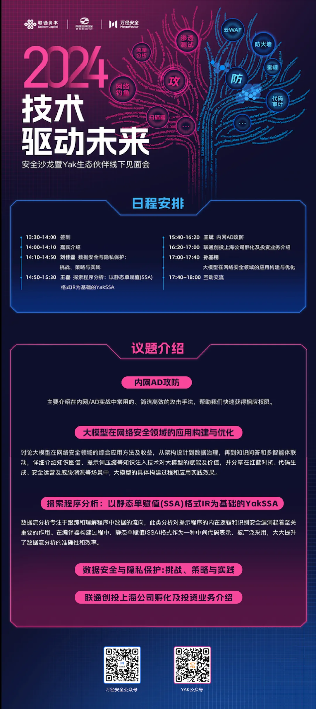

# 重磅来袭！上海见！技术驱动未来安全沙龙暨 Yak生态伙伴线下见面会

日期: 2024-04-19 | 原文: <https://mp.weixin.qq.com/s/hooPwk-ft1FiMMElj7Fsmw>

各位小伙伴们，大家好呀！

万径安全将于2024年4月26日下午，在上海市长宁区长宁路1033号联通大厦举办一场别开生面的活动——**“技术驱动未来安全沙龙暨 Yak生态伙伴线下见面会”**！本次沙龙活动是**联通创投（上海）产业生态孵化器、电子科技大学网络空间安全研究院、四维创智(北京)科技发展有限公司**共同举办的，围绕网络安全专用编程语言 Yaklang 创新及应用技术的线下交流见面会。

在这个充满变革与创新的时代，技术无疑是我们前行的强大动力。而安全，更是技术发展的基石。此次，我们将聚焦安全领域的前沿技术，探讨如何通过技术创新驱动未来安全的新篇章！

同时，这也是一个难得的机会，让我们与Yak生态伙伴们面对面交流，分享经验，碰撞思想，携手共进，共创美好未来！

📅时间：2024年4月26日下午

📍地点：上海市长宁区 长宁路1033号 联通大厦3楼

💪让我们共同期待这场科技与安全的盛宴，一起探讨、学习、成长！

👉小伙伴们，赶紧报名吧！名额有限，先到先得哦！
