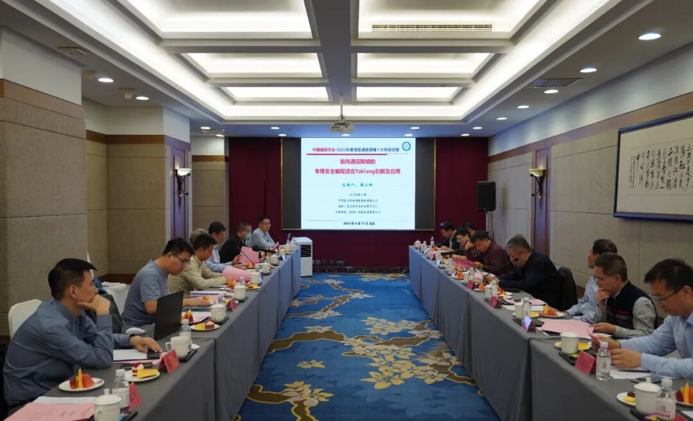

# 国产自主！安全编程语言Yaklang成果鉴定会在京举行！

日期: 2024-04-16 | 原文: <https://mp.weixin.qq.com/s/c2eYH21Zmjbs7VmEx0HVCw>

2024年4月15日，由中国通信学会主办的，对电子科技大学、中国联合网络通信集团有限公司、国家工业信息安全发展研究中心、四维创智（北京）科技发展有限公司共同完成的“面向通信网络安全的专用编程语言Yaklang创新及应用”项目进行的科技成果鉴定会在北京举行。

鉴定委员会由两位中国工程院院士担任主任委员、副主任委员，以及来自工业与信息化部、北京航空航天大学、北京理工大学、北京邮电大学、中国互联网协会、中国电子技术标准化研究院的其他7位教授专家担任委员。

成果鉴定会现场

鉴定委员会专家听取了项目组的研制报告、技术报告、文件资料审查报告、测试报告、查新报告、应用报告等，经质询和讨论，形成如下鉴定意见：

鉴定委员会认为，该成果**技术研制难度大，创新性突出，具有完全自主知识产权**，成果总体达到国际先进、国内领先水平，其中“内生式”模糊标签安全测试技术、基于字节码单向生成机制的抗逆向分析跨语言执行环境构建技术处于**国际领先水平**。

项目针对通信网络安全领域长期缺乏自主可控的高效专用编程语言短板，在语法规范、编程工具、执行环境、安全能力集成等方面开展了系统性原创和设计，研发了首款开源的国产通信网络安全领域专用编程语言Yaklang，及其集成开发环境Yakit、运行环境YakVM 系列产品，并在通信、能源、制造等重点行业推广应用。

**主要创新点：**

1. 设计了高度融合网络安全能力的可扩展语法规范体系，在网络安全产品设计中，编码效率提升20%，性能指标优于Python、Golang等主流通用编程语言。
2. 提出了“内生式”支持软件缺陷分析的图灵完备模糊标签技术Fuzztag，模糊测试平均执行时间、平均内存占用、CPU利用率、I/O利用率等关键性能指标优于国外同类专用编程语言NASL“外挂式”调用方法。
3. 研发了跨语言执行环境YakVM，支持通信网络多种数据交换协议，提出并使用字节码单向生成机制，实现了原生的虚拟机抗逆向分析能力，防止执行逻辑泄漏导致的安全隐患。

项目已开发出25个网络安全专用模块，超过100个网络安全专用库函数，在全球最大开源网站GitHub上建立了Yaklang开源社区，月调用次数达3000万次以上。项目成果获授权国内发明专利9项，受理4项，软著10项，发表论文5篇，出版专著1部，待出版教材1本，研究成果支撑了国际国内标准4项，项目取得了重要的社会和经济效益。
