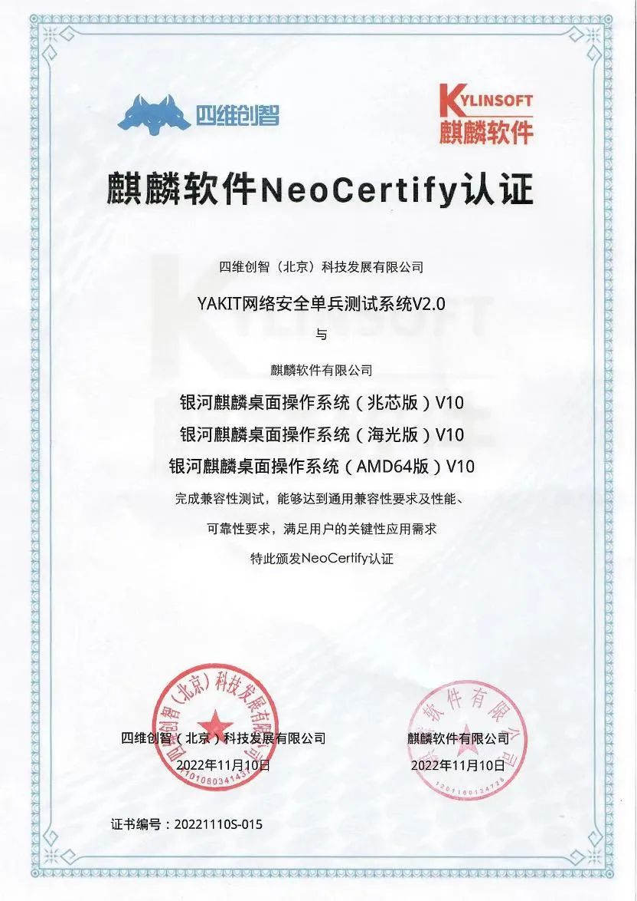
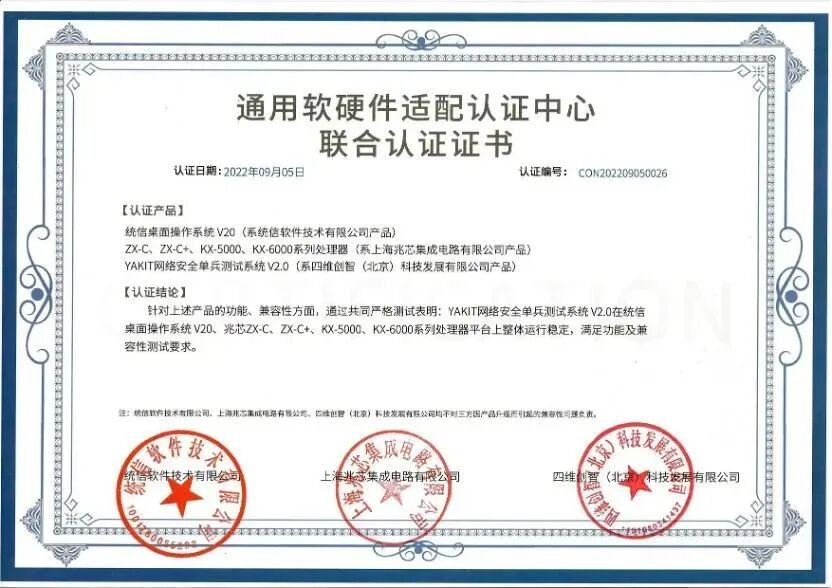
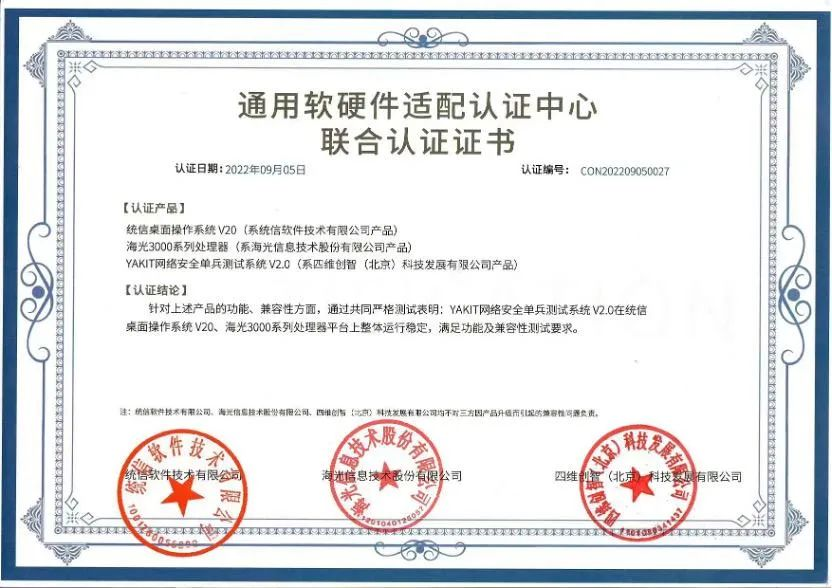
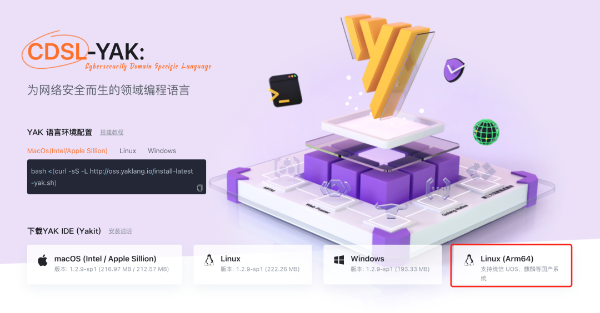

# Yakit Linux（arm64）版本，来了！

日期: 2024-02-01 | 原文: <https://mp.weixin.qq.com/s/iXc-JZ2uTeqONV3oigFRIQ>

近年来，ARM64在桌面平台的使用率正在快速提升，国外的微软等制造商推出不少ARM产品，而国产终端(包括PC)逐步采取该架构，并配套相应的国产操作系统。万径安全作为国产化赛道的支持者，团队重视用户需求，提前布局并投入研发支持，终于在近期正式上线。

**2024年1月26日，万径安全正式发布了新一版本的Yakit for Linux，并官方正式支持ARM 64位架构，基于ARM64的原生版本为用户们提供更好的性能**。Yakit平台，安全好帮手**

Yakit大家已经很熟悉了，在过去已经成了很多小伙伴们的好帮手。

借本次更新，我们也再来介绍一下Yakit的**核心功能**。

1.类 Burpsuite 的 MITM 劫持操作台

2.查看所有劫持到的请求的历史记录以及分析请求的参数

3.全球第一个可视化的 Web 模糊测试工具：Web Fuzzer

4.Yak Cloud IDE：内置智能提示的 Yak 语言云 IDE

5.ShellReceiver：开启 TCP 服务器接收反弹交互式 Shell 的反连

6.第三方 Yak 模块商店：社区主导的第三方 Yak 模块插件，你想要的应有尽有

7.通过分享密令实时共享测试细节和插件，实现高效的协同

8.灵活的项目管理和数据管控，记录业务流量，支持多项目管理及项目数据导入导出

9.根据漏洞数据包一键生成PoC，享受丝滑体验

10.序列器、匹配器、数据提取器，丰富的辅助工具让测试更高效

**资质认证，使用更安心**

而早先，在2022年，Yakit网络安全单兵测试系统就已完成麒麟软件与统信软件兼容互认证。

**原生支持，使用更高效**

ARM64 版在功能方面与常规版本完全相同，包括MITM劫持、反连、ChatCS、Payload等都可以直接使用，不影响操作习惯。且在原生支持 ARM64 后，意味着Yakit现在可以发挥最佳性能，不会因为兼容或环境模拟等问题导致性能下降，从而让效率更上一层楼。

欢迎新老朋友们下载体验。

**下载方式1：**

*https://www.yaklang.com/*

**下载方式2：**
