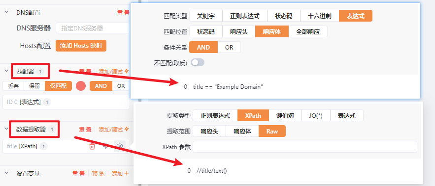
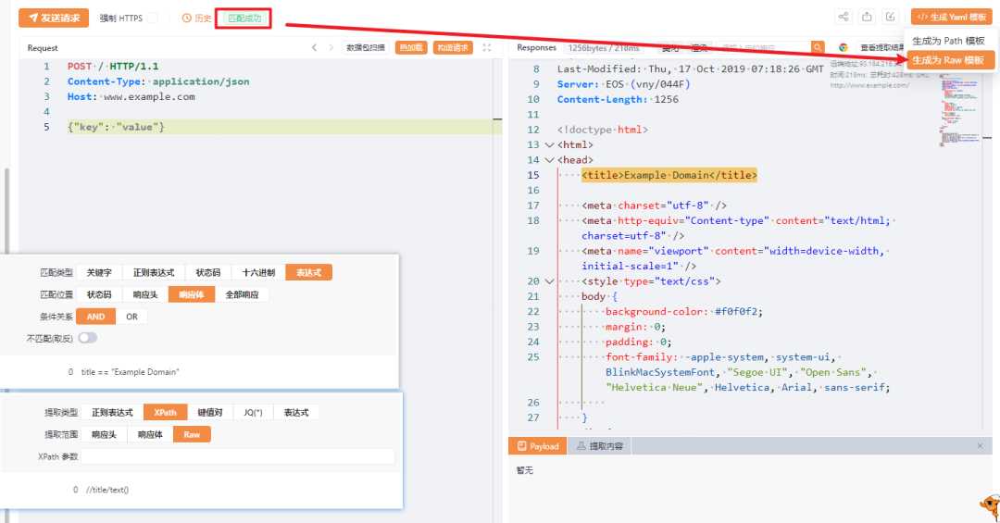

# 选的好，下次别选了

日期: 2024-01-18 | 原文: <https://mp.weixin.qq.com/s/jHn4FiUww18M9Mfz8yt8kg>

**互动实验**


如果你在街上闲逛，在你眼前的摊位上摆着一个汉堡、一把刀和一串手链——如果让你从中挑选一件，那么你会选择哪件物品带走？


玩笑归玩笑，答案很简单：你做了一次经过判断的【选择】

这项互动，是为了让大家感受**选择**这个动作，每个人的答案或许都不同，这正是在分析自身需求后做出的一个决定。

**偶遇一次对线**


实验结束（记住选择），我们把目光移到最近牛牛遇到的一次网络对线：

某某：**uu们，你们写yaml文件真的不费劲吗？**


这段对线也引发了牛同学的些许思考和担心，毕竟Yakit里yaml的出镜率不低，而yaklang编写插件的师傅也不算少。确实，在使用一个工具时，初期会有很多人处于懵逼状态，不知做何选择来完成具体需求。在之后的分享里，牛同学会针对大家疑惑点比较多的地方做专项解答。这周，牛同学想和大家唠唠在Yakit的使用过程中，**选择yaklang编写插件或使用yaml，哪个更方便呢？Yaklang，首个国产化网络安领域编程语言。**提供了非常强大的基础安全能力，是绝大部分“数据描述语言/容器语言”的超集。图灵完备，特点高效、函数级调用、自动补全、高阶工具......

**YAML，一种数据序列化语言。**它的设计目标是使数据在不同编程语言之间交换和共享变得简单。采用一种简洁、直观的语法，以易于阅读和编写的方式表示数据结构。

一个是大融合的网络安全垂直领域语言

一个是简洁、易读易写的数据序列化语言。

在什么样的维度下比较？选谁？

选不出来，那是必然，我们把任务点再设定得具体一点。

**场景一：**


### 现在你需要一个PoC检测功能，打开Yakit你会怎么做？


**选择一**

使用yaklang进行插件编写 PoC 检测，代码如下：

```makefile
rsp, req = poc.HTTP(`GET / HTTP/1.1
Host: www.example.com

`)~

node ,err = xpath.LoadHTMLDocument(rsp)
die(err)

res := xpath.FindOne(node , "//title/text()")

title = res.Data

if title == "Example Domain" {
    risk.NewRisk(
        "www.example.com",
        risk.title("测试Title"),
        risk.description("测试"),
        risk.severity("low"),
        risk.request(req),
        risk.response(rsp)
        )
}
```


**选择二**

使用 Web Fuzzer 生成 Yaml

设置数据提取器，和 匹配器






```http
id: WebFuzzer-Template-LuxKIHKO

info:
  name: 测试 Test
  author: god
  severity: low
  description: 测试
  reference:
  - https://github.com/
  - https://cve.mitre.org/
  metadata:
    max-request: 1
    shodan-query: ""
    verified: true
  yakit-info:
    sign: 024cd1cef5c52bf5267e2933ae6c298a

http:
- raw:
  - |-
    @timeout: 30s
    POST / HTTP/1.1
    Content-Type: application/json
    Host: {{Hostname}}
    Content-Length: 16

    {"key": "value"}

  max-redirects: 3
  matchers-condition: and
  matchers:
  - type: dsl
    part: body
    dsl:
    - title == "Example Domain"
    condition: and

  extractors:
  - name: title
    scope: raw
    type: xpath
    xpath:
    - //title/text()

# Generated From WebFuzzer on 2024-01-11 17:16:19
```

在场景一这个具体的设定下，使用yaml会更方便一些。而使用yaklang编写插件，需要你了解一定yaklang语法，如果选择使用yaml则只需要设置一些匹配规则，随后"点点点"就可以生成如上的yaml插件了，根本不需要编写代码。

**场景二：**


需要进行简单探测IIOP协议，打开Yakit你会怎么做？


**选择一**

使用yaklang进行插件编写简单的PoC，代码如下：

```php
conn, err = tcp.Connect(target, port, tcp.clientTimeout(4))
die(err)

GIOPRequest,_ = codec.DecodeHex("47494f50010200030000001700000002000000000000000b4e616d6553657276696365")

yakit.Info("开始发送 GIOPRequest 请求")
conn.Write(GIOPRequest)
reply = conn.RecvTimeout(2)[0]
if str.StartsWith(reply,"GIOP"){ // GIOP Header前四个字节是GIOP
        yakit.Info("目标: %v 发现IIOP协议，可能存在CVE-2020-2551 漏洞", target)
        risk.NewRisk(
        str.HostPort(target, port), risk.severity("high"), risk.type("poc"),
        risk.title("WebLogic Weblogic IIOP protocol may have CVE-2020-2551 vulnerability"),            ## English Title for Risk
        risk.titleVerbose("WebLogic Weblogic iiop协议 可能存在CVE-2020-2551漏洞"),           ##  中文标题
        risk.details({
            "target": target,
            "request": parseString(GIOPRequest),
            "response": parseString(reply),
        }),
    )
}
```


**选择二**

使用yaml的路不太行

通过场景二可以发现，在应对一些复杂的或者畸形请求的 PoC 检测时，可能无法通过 yaml 插件的方式进行检测。能够利用Yaml 的主要场景是针对一些需要发送 Http 数据包的情况。

**具体问题具体分析**


**选谁，是具体分析后决定的。**

总的来说，插件能够覆盖绝大部分场景，实用性更广，是个万能箱；而yaml满足一些简单功能需求，所以有些场景使用yaklang编写插件会有些大材小用。比如一些简单的发包探测和匹配回显，yaml足够了，而相对复杂的检测或其他功能，就需要使用yaklang编写。

PS：插件编写对于代码编写有一定要求，所以尽可能学习一些yaklang基本语法，说不定会派上大用场。对比图如下：

|  | yaml | yaklang编写插件 |
| --- | --- | --- |
| 语法 | 语法简单，逻辑性单一 | 融合多种语法特性，逻辑性强 |
| 功能 | 功能比较固化，单一 | 图灵完备，按需编写 |
| 实现难度 | 较低 | 高 |
| 编写难易 | 较低，可借助UI配合生成 | 中，需要学习 yaklang 语法 |
| 优点 | 特定的固化场景使用 | 适应各种复杂场景 |

**条条大路通罗马**


多个工具，多种语言，如何**选择**成为了使用者的头号任务。条条大路通罗马是没毛病，但不是每一条路都是一样便捷。如此看来，**选择**是一个重要任务点。


**选择谁这个问题取决于需求本身的功能复杂度和扩展度。**在自身有需求时，选择合适且好用的工具。在没有交互性的大型工具之前，很多安全从业者使用二进制文件，而随着越来越多的复杂扫描器出现，选择面更多，但现在仍然有不少群体还在使用二进制，毕竟功能点单一时使用二进制会更方便。任何东西的进化总是朝着越来越便捷(lan)的方向去走的！所以，在达到“罗马”前考虑清楚哪条路更适合，当然，为了拥有更多选择空间，多学点总是没错的，技多不压身嘛。

最后，感谢在茫茫海洋中，**师傅们选择了Yakit**。

未来，我们会继续更新迭代，实现**安全融合**大目标。
