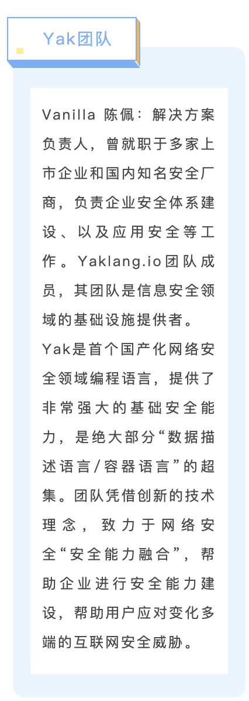
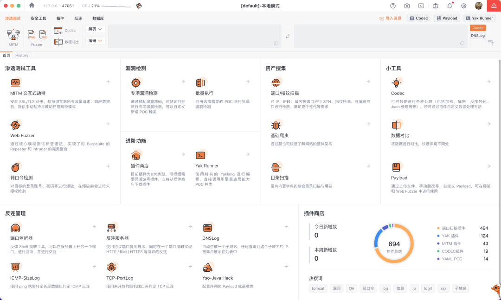
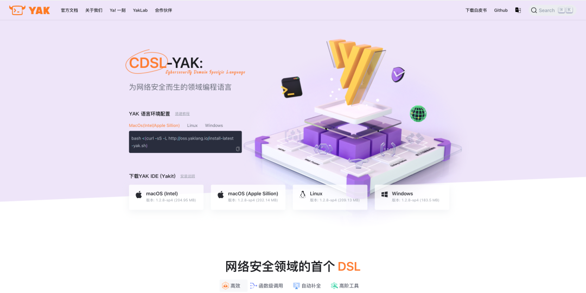

# Yakit教程正式上线i春秋，安全渗透从此简单易学！

日期: 2024-01-05 | 原文: <https://mp.weixin.qq.com/s/C2YVYjENUgnZUr6eoZSQvA>

万径安全牵手i春秋，联手上线网络安全课程

“不管您是行业用户，还是高校学生，Yak 永远是您的好伙伴“

号外！号外！

Yakit课程正式上线i春秋

历时三个月打造总计11课时286分时长的精品课程

**软件开源，课程免费，保质保量**

包你从入门到进阶，从新手到老鸟

通过学习，您将掌握：

技术

**核心漏洞扫描反连检测劫持手动测试特殊协议支持等**

工欲善其事，必先利其器

你的**高效渗透测试 & 漏洞挖掘之旅**

从此刻开始☑️

看课地址：

https://www.ichunqiu.com/course/76611

**快速看课入口**

**为什么要学Yakit**

Yakit作为Yak引擎的客户端，提供了一个图形化用户界面（GUI）来操控Yak引擎的能力。同时，Yakit也是一款集成化的渗透测试工具，提供了一系列安全工具和功能，包括MITM劫持操作台、Web Fuzzer、Yak Cloud IDE、ShellReceiver等。

Yakit作为一款可视化的交互式应用安全测试平台，覆盖渗透测试全流程。除了我们提供的功能，用户更能在实际操作中，灵活定义插件，将自己的安全工具能力融合到Yakit当中，进而提升效率，提高生产力。

**无论是自动化还是手工**渗透测试**，测试人员即使在没有熟练技巧的情况下，使用Yakit也能轻松高效地完成渗透测试工作。**

**Yakit平台功能介绍**

能做扫描器吗？

能！

主要包含综合目录扫描、端口探测、指纹识别。Yakit内置一些常见字典，这些字典文件包含了一些常见的目录和文件路径，用于帮助目录扫描工具生成HTTP请求。支持的文件或文件类型有.sql、.bak、.zip、.rar、admin.sql、backup.zip、web.rar。端口探测主要以TCP SYN扫描、TCP Connect扫描、UDP扫描三种技术为主，来确定端口的开放情况以及其服务类型和版本信息。指纹识别主要以应用程序指纹识别、协议指纹识别、操作系统指纹识别来确定目标系统上的操作系统、应用程序和服务信息。

能当基础爬虫吗？

能！

Yakit基础爬虫功能可以直接爬取目标系统中的相关信息，将其源代码存储到扫描器的数据库中，并从中提取关键信息加载到相关的Yakit插件进行漏洞扫描，根据扫描结果直接输出相应的漏洞报告。

能进行爆破与未授权检测吗？

能！

采用多线程和异步请求等技术，可以同时进行多个协议和服务(如ftp、memcached、mongodb.mssql、mysql、postgres、rdp、redis、smb.ssh、tomcat、vnc等)的口令爆破，大大缩短测试时间。

能进行子域名收集吗？

能！

子域名收集主要采用域名解析+爆破技术。在子域名收集过程中，可以通过查询主域名的DNS记录来获取其下的子域名列表，通过递归查询，可以获取主域名下所有的子域名，也可以使用字典文件对主域名进行爆破，尝试各种可能存在的子域名。

MITM劫持能不止于劫持吗？

能！

MITM操作台可百分百替代 BurpSuite，下载并安装证书、劫持请求、响应、编辑劫持到的数据包等。并且提供一整套顺畅的工作流，劫持 => History => Repeater / Intruder，劫持到的数据，在History可以查看历史数据，选择需要“挖掘”的数据包，发送到 WebFuzzer 进行 Repeater / Intruder 操作。除了这些典型的操作场景外，MITM 还提供了插件被动扫描、热加载、数据包替换、标记等更灵活的功能。

能做资产收集吗？

能

Yakit后端集成了知道创宇旗下404实验室驱动打造的网络空间搜索引擎ZoomEye（“钟馗之眼”）以及奇安信推出的互联网资产收集平台鹰图（HUNTER）。

通过网络空间测绘技术与Yak语言的融合，实现互联网资产的可查、可定位、可管理。提升企业用户发现问题、解决问题的能力和效率，实现安全的闭环管理。

**Yakit在哪下载**

这么好用的工具，相信大家已经摩拳擦掌准备上手一试了

那么，在哪可以下载到呢？

告诉大家两个方式！

现在就去体验吧！

### **方式一：Yakit官网**

https://www.yaklang.com/

### **方式二：github**
