# 极客大挑战JAVA题目WP

日期: 2023-12-28 | 原文: <https://mp.weixin.qq.com/s/5F2nIFk2ncqZAP4vyjytbg>

**Java该题目**源码位于*https://github.com/yaklang/yaklang/tree/geek2023)*

**分析**

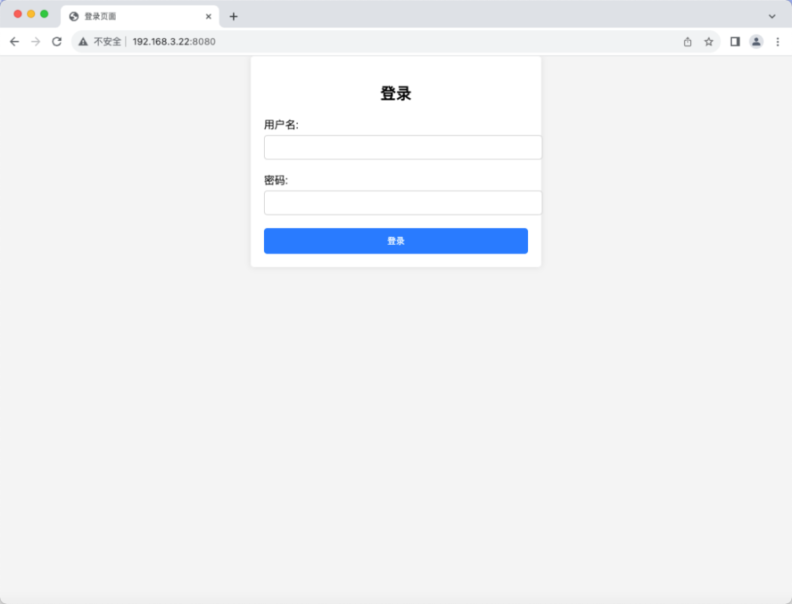

打开后是一个登录框。

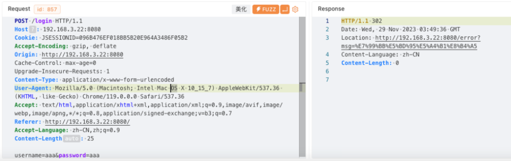

**登录**

登录是明文传输的，可以直接从源码看密码，也可以爆破一下

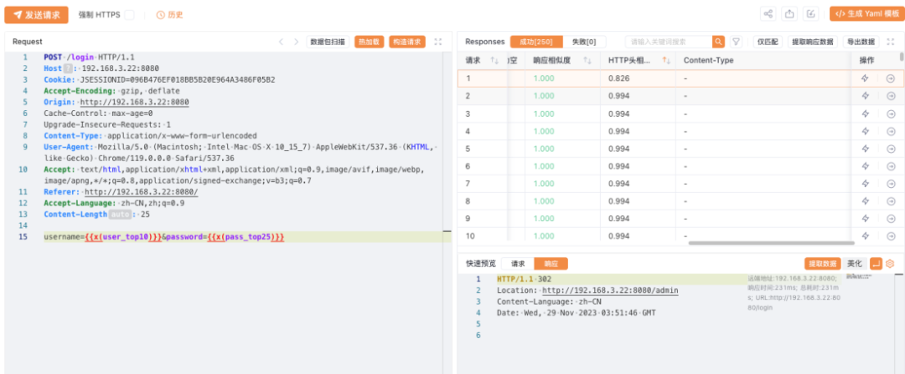

通过Header相似度可以找出登录成功的认证信息：admin、123456

登录后是一个表单，修改下信息保存，抓包查看。可以看见保存时先调用了/marshalinfo接口对信息序列化，又调用invoke将序列化信息传给后端更新信息。

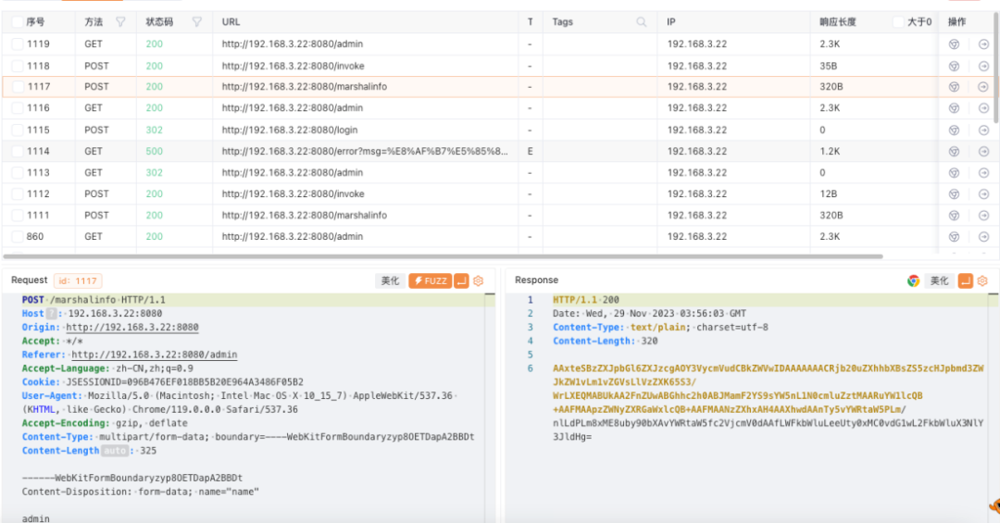

对序列化信息解析下，可以看到关键字my serilizersr，猜测是魔改了writeObject方法

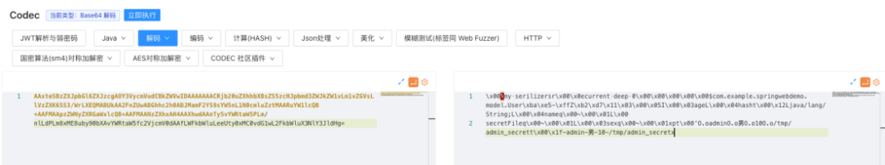

除此还可以看到一些信息，包括姓名、性别、年龄、和secret，secret是一个文件路径，猜测可以修改文件路径，读取任意文件

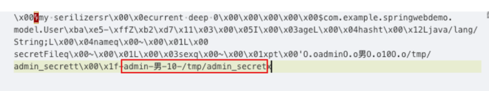

可以先尝试直接修改/tmp/admin_secret

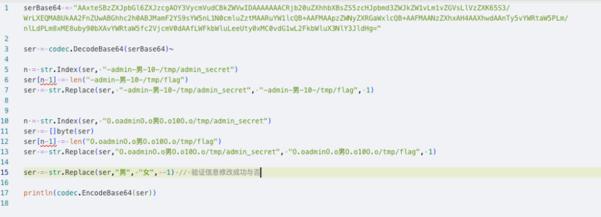

改了后调用更新接口

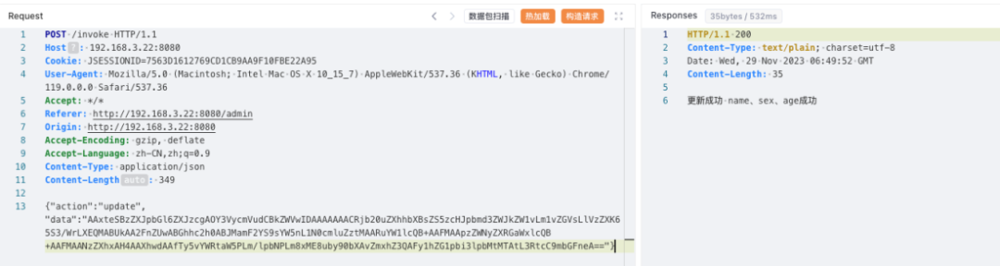

刷新网页，发现性别修改成功，但是secret没修改成功，看来只会修改name、sex、age

题目给了jar包，直接看源码吧，使用jd打开可以看见源码结构

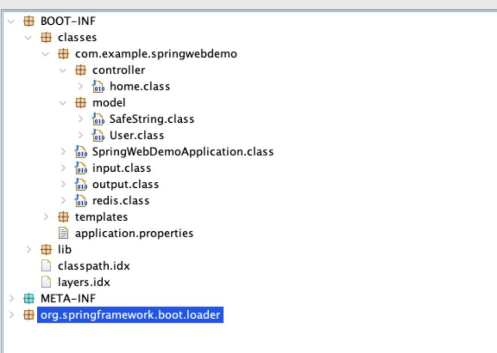

先看更新接口，对输入内容反序列化，然后对旧信息更新（只更新了name、sex、age、hash），然后对更新后的信息进行了序列化，储存到redis

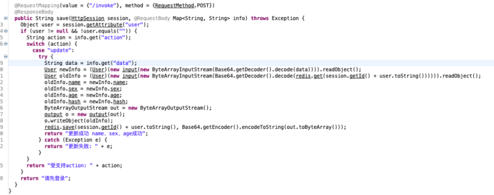

再看input和ouput，对序列化过程进行了一些魔改

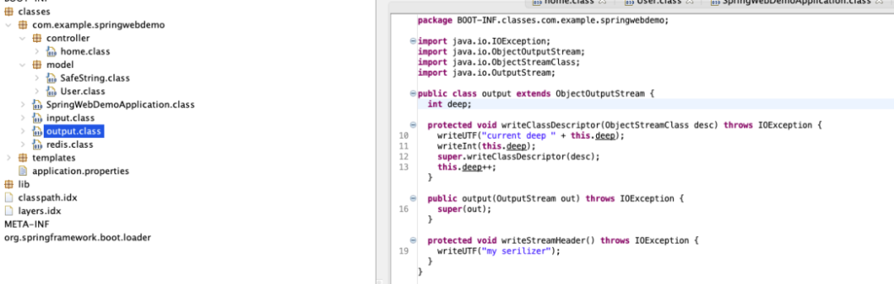

可以看见User重写了writeObject和readObject

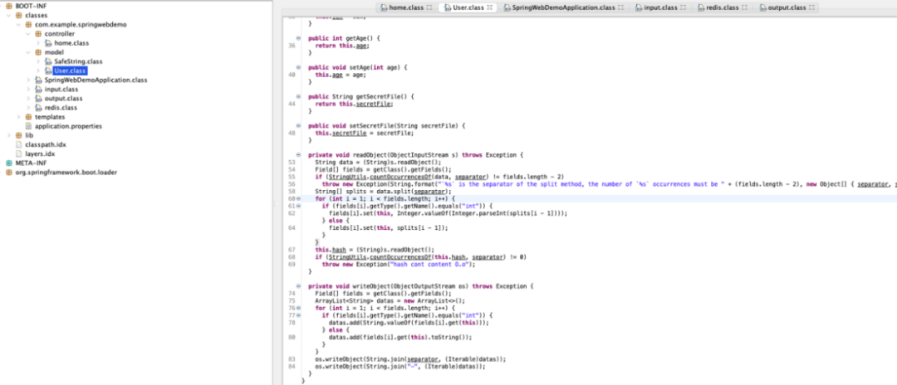

序列化时把所有字段使用分隔符拼接存到一个字符串中，还有一个hash的字符串，和我们在codec中看到的O.oadminO.o男O.o10O.o/tmp/admin_secret和-admin-男-10-/tmp/admin_secret就对得上了

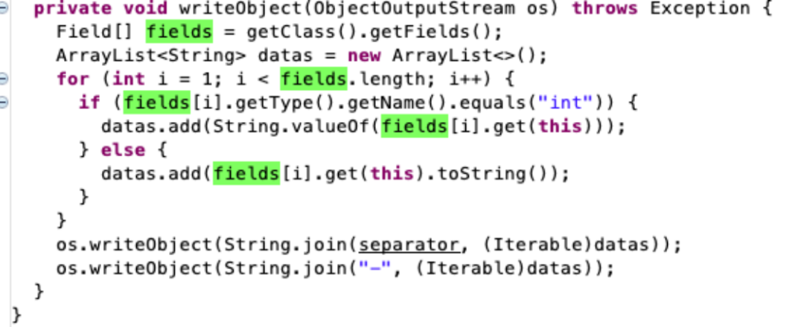

但是注意到，在拼接是跳过了一个字段，也就是hash，所以拼接结果是[hash(隐藏)]-admin-男-10-/tmp/admin_secret

再看反序列化时，是直接split，然后遍历字段赋值。

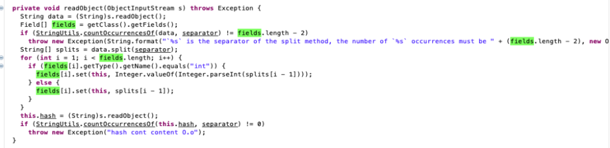

**反序列化漏洞**

如果直接修改secretFile字段，在调用update接口时不会更新secretFile，但是会更新hash，而hash又处于拼接时的第一个字段，所以可以造成字符串逃逸的效果。

所以在前面脚本基础上，修改rep1(hash字段)

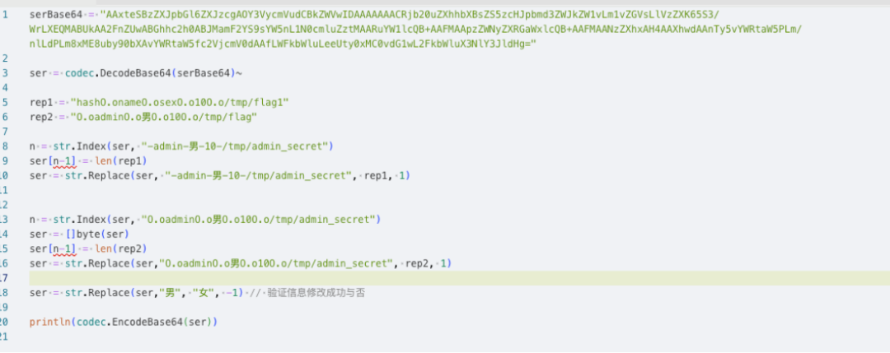

但发生报错

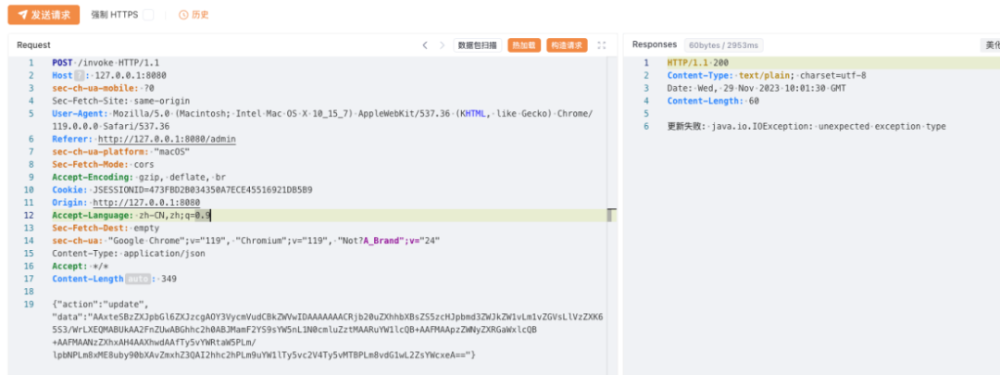

在源码中可以看到，hash做了过滤，不可以存在O.o

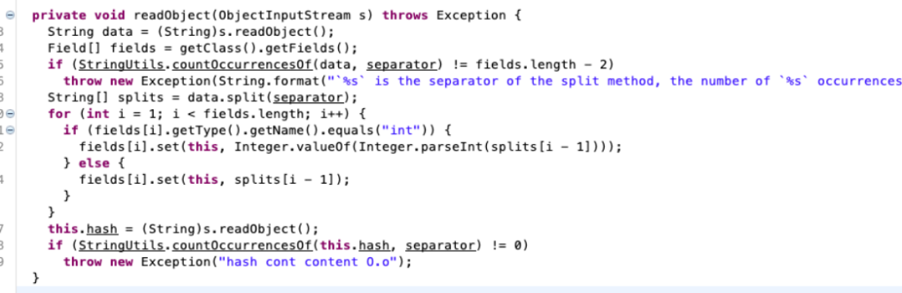

**Java split特性**

java的String.split参数其实是一个正则，所以可以这样绕过所以O.o可以替换为O<任意字符>o绕过

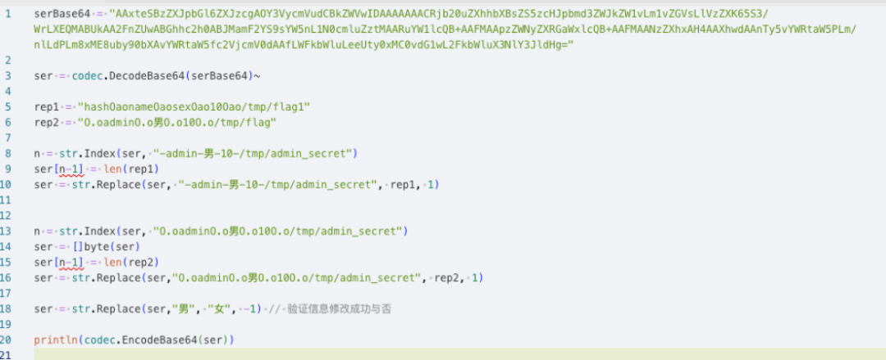

发送payload，更新后可以看到成功读取flag
