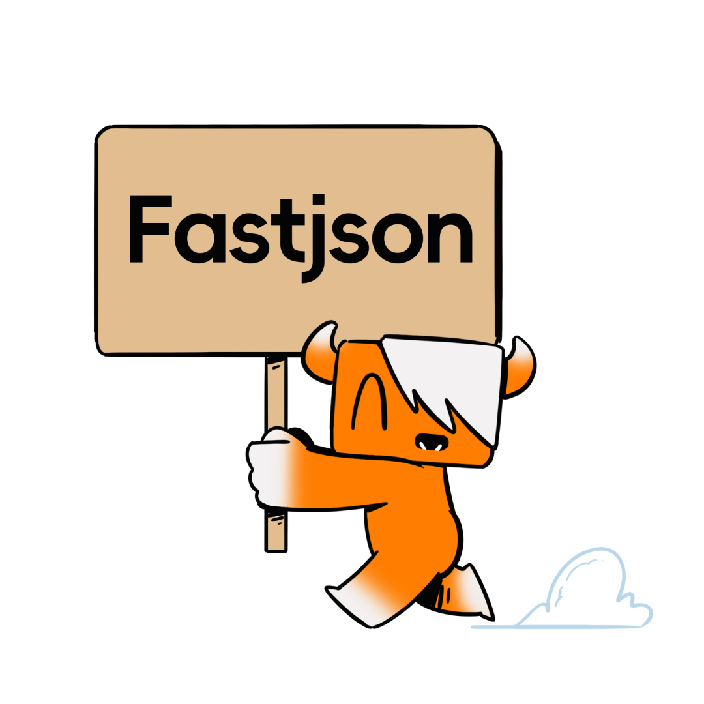

# Yakit靶场通关教程|Fastjson反序列化漏洞

日期: 2023-12-22 | 原文: <https://mp.weixin.qq.com/s/eJtQJ-8jpp-KhGC9oDZWng>

**前言**

在JAVA开发中，JSON已经成为了常见的数据格式之一。牛牛相信JAVA开发师傅肯定对Fastjosn不陌生，其高性能、高稳定性等特性让开发者爱不释手。

不过FastJson在解析json的过程中，支持使用autoType来实例化某一个具体的类，并调用该类的set/get方法来访问属性。通过查找代码中相关的方法，可构造出一些恶意利用链。**攻击者通过恶意类执行代码远程执行漏洞**，不仅可能获取到服务器的**敏感信息**，甚至可以利用漏洞进一步对**服务器数据进行增删改**等操作。

牛牛针对Fastjson反序列化漏洞在靶场中设置了一些常规案例，帮助师傅们在开发时规避部分风险，快前往Yakit Vulinbox练练手吧！



**案例分享及教学GET 传参案例**


fastjson的一个安全问题是不受信任的用户可以构造恶意JSON数据，导致远程代码执行漏洞。本漏洞案例演示了一个fastjson GET请求传参的示例，其中存在潜在的fastjson远程代码执行漏洞。

**示例代码：**

```go
{
    Title:        "GET 传参案例案例",
    Path:         "/json-in-query",
    DefaultQuery: `auth={"user":"admin","password":"password"}`,
    Handler: func(writer http.ResponseWriter, request *http.Request) {
        if request.Method == http.MethodGet {
            action := request.URL.Query().Get("action")
            if action == "" {
                // 返回登录页面或脚本
                // 省略部分代码
                return
            }
            auth := request.URL.Query().Get("auth")
            if auth == "" {
                writer.Write([]byte("auth 参数不能为空"))
                return
            }
            response := mockController(generateFastjsonParser("1.2.43"), request, auth)
            writer.Write([]byte(response))
        } else {
            writer.WriteHeader(http.StatusMethodNotAllowed)
        }
    },
}
```

**攻击示例：**

```perl
http://127.0.0.1:8787/fastjson/json-in-query?auth={"@type":"java.net.Inet4Address","val":"dnslog"}&action=login
```

在以上URL中，攻击者传递了一个auth参数，其中包含了恶意构造的JSON数据。这个恶意JSON数据可能触发fastjson解析器漏洞。

**防御措施：**

- 更新fastjson库：确保使用的fastjson库是最新版本，因为早期版本可能存在已知的漏洞。
- 白名单：对JSON数据中的字段和内容进行白名单验证，只接受预期的字段和数据。
- 谨慎使用fastjson：在不受信任的环境中，避免使用fastjson解析不受信任的JSON数据。

**靶场演示： 视频POST Form传参案例**


Fastjson在处理JSON数据时存在一些潜在的安全风险，尤其是在接收用户输入并将其反序列化为Java对象时。这个漏洞案例演示了如何通过在POST表单参数中注入恶意JSON数据来触发Fastjson反序列化漏洞。

**示例代码：**

```go
{
    Title: "POST Form传参漏洞案例",
    Path:  "/json-in-form",
    Handler: func(writer http.ResponseWriter, request *http.Request) {
        if request.Method == http.MethodPost {
            body := request.FormValue("auth")
            response := mockController(generateFastjsonParser("1.2.43"), request, body)
            writer.Write([]byte(response))
        } else {
            writer.Write([]byte(utils2.Format(string(fastjson_loginPage), map[string]string{
                "script":
                // 省略部分代码,
            })))
            return
        }
    },
}
```

**攻击示例：**

攻击者发送POST请求到`/json-in-form`，在表单参数`auth`中注入恶意JSON数据

```json
{"@type":"java.net.Inet4Address","val":"dnslog"}
```

服务器使用Fastjson反序列化恶意JSON数据。

恶意JSON数据中的内容被反序列化成Java对象，并且攻击者可能获得对服务器的控制或者执行恶意操作。

**防御措施：**

- 更新Fastjson库：确保你的应用程序使用的Fastjson库版本不受已知漏洞的影响，始终保持最新的安全更新。
- 输入验证：在接受用户输入并将其用于反序列化之前，进行严格的输入验证和过滤，仅接受符合预期结构的数据。
- 阻止不必要的反序列化：只在必要的情况下执行反序列化操作，避免将未经验证的数据传递给Fastjson。
- 安全配置：Fastjson提供了一些配置选项，可以帮助减少安全风险，例如关闭自动类型识别。

**靶场演示： 视频POST Body传参案例**


### 该案例演示了一种潜在的安全漏洞，当后端处理 POST 请求的请求体（Request Body）时，没有对其中的数据进行足够的验证和处理，可能导致安全问题。特别是在使用 Fastjson 或其他 JSON 解析器的情况下，攻击者可以构造恶意 JSON 请求体来触发 Java 反序列化漏洞。

**示例代码：**

```php
{
    Title: "POST Body传参案例案例",
    Path:  "/json-in-body",
    Handler: func(writer http.ResponseWriter, request *http.Request) {
        if request.Method == http.MethodPost {
            body, err := io.ReadAll(request.Body)
            if err != nil {
                writer.WriteHeader(http.StatusBadRequest)
                writer.Write([]byte("Invalid request"))
                return
            }
            defer request.Body.Close()
            response := mockController(generateFastjsonParser("1.2.43"), request, string(body))
            writer.Write([]byte(response))
        } else {
            writer.Write([]byte(utils2.Format(string(fastjson_loginPage), map[string]string{
                "script": `function load(){
                    name=$("#username").val();
                    password=$("#password").val();
                    auth = {"user":name,"password":password};
                    $.ajax({
                        type:"post",
                        url:"/fastjson/json-in-body",
                        data:JSON.stringify(auth),
                        dataType: "json",
                        success: function (data ,textStatus, jqXHR)
{
                            $("#response").text(JSON.stringify(data));
                            console.log(data);
                        },
                        error:function (XMLHttpRequest, textStatus, errorThrown) {
                            alert("请求出错");
                        },
                    })
                }`,
            })))
            return
        }
    },
}
```

**攻击示例：**

攻击者可以构造 POST 请求，将恶意 JSON 数据作为请求体发送给目标服务器。例如，post payload `{"@type":"``java.net``.Inet4Address","val":"dnslog"}` 将触发 Fastjson 反序列化漏洞。

**防御措施：**

- 验证请求体：后端应该对接收到的请求体进行验证和解析，确保其格式正确，数据类型合法。
- 使用安全的 JSON 解析库：考虑使用安全的 JSON 解析库，这些库通常会提供防御反序列化攻击的功能。
- 限制反序列化能力：在可能的情况下，禁用或限制应用程序的反序列化能力，只反序列化信任的数据。

请注意，漏洞的防御措施可能因编程语言和框架而异，因此确保您的应用程序采取了适当的防御措施，以确保安全性。

**靶场演示： 视频Cookie 传参案例**


该案例演示了一种潜在的安全漏洞，当后端没有对其中的数据进行足够的验证和处理，可能导致安全问题。攻击者可以在 Cookie 中插入恶意 JSON 数据，以触发 Fastjson 反序列化漏洞。

**示例代码：**

```php
{
    Title: "Cookie传参案例",
    Path:  "/json-in-cookie",
    Handler: func(writer http.ResponseWriter, request *http.Request) {
        if request.Method == http.MethodGet {
            action := request.URL.Query().Get("action")
            if action == "" {
                writer.Header().Set("Set-Cookie", `auth=`+codec.EncodeBase64Url(`{"id":"-1"}`)) // Fuzz Coookie暂时没有做只能解码，不能编码
                writer.Write([]byte(utils2.Format(string(fastjson_loginPage), map[string]string{
                    "script": `function load(){
                        name=$("#username").val();
                        password=$("#password").val();
                        auth = {"user":name,"password":password};
                        $.ajax({
                            type:"get",
                            url:"/fastjson/json-in-cookie",
                            data:{"auth":JSON.stringify(auth),"action":"login"},
                            success: function (data ,textStatus, jqXHR)
{
                                $("#response").text(JSON.stringify(data));
                                console.log(data);
                            },
                            error:function (XMLHttpRequest, textStatus, errorThrown) {
                                alert("请求出错");
                            },
                        })
                    }`,
                })))
                return
            }
            cookie, err := request.Cookie("auth")
            if err != nil {
                writer.Write([]byte("auth 参数不能为空"))
                return
            }
            response := mockController(generateFastjsonParser("1.2.43"), request, cookie.Value)
            writer.Write([]byte(response))
        } else {
            writer.WriteHeader(http.StatusMethodNotAllowed)
        }
    },
}
```

**攻击示例：**

攻击者可以更改 Cookie 的内容为 `{"@type":"``java.net``.Inet4Address","val":"dnslog"}` 或其他恶意 JSON 数据。当服务端尝试解析这个 Cookie 数据时，Fastjson 可能会反序列化它，触发反序列化漏洞，导致潜在的远程代码执行。

**防御措施：**

- 升级 fastjson 版本：使用最新版本的 fastjson，因为较新的版本通常修复了已知的反序列化漏洞。
- 限制白名单：在 fastjson 中配置白名单，只允许反序列化预期的类，这可以限制攻击者能够执行的操作。
- 禁用 AutoType 特性：Fastjson 的 `AutoType` 特性允许自动识别类类型，但这也是许多漏洞的根本原因之一。可以通过配置禁用该特性来提高安全性。
- 输入验证和过滤：在接受用户输入的地方进行有效的输入验证和过滤，以防止恶意数据进入系统。

**靶场演示： 视频Authorization 传参案例**


### 该案例演示了一种潜在的安全漏洞，当后端处理包含 Fastjson 序列化的 Authorization 头部数据时，没有对其中的数据进行足够的验证和处理，可能导致安全问题。攻击者可以在 Authorization 头部插入恶意 JSON 数据，以触发 Fastjson 反序列化漏洞，进而导致潜在的远程代码执行。

**示例代码：**

```php
{
    Title: "Authorization传参案例",
    Path:  "/json-in-authorization",
    Handler: func(writer http.ResponseWriter, request *http.Request) {
        if request.Method == http.MethodGet {
            action := request.URL.Query().Get("action")
            if action == "" {
                writer.Write([]byte(utils2.Format(string(fastjson_loginPage), map[string]string{
                    "script": `function load(){
                        name=$("#username").val();
                        password=$("#password").val();
                        auth = {"user":name,"password":password};
                        authHeaderValue = btoa(JSON.stringify(auth));
                        $.ajax({
                            type:"get",
                            url:"/fastjson/json-in-authorization?action=login",
                            headers: {"Authorization": "Basic "+authHeaderValue},
                            dataType: "json",
                            success: function (data ,textStatus, jqXHR)
{
                                $("#response").text(JSON.stringify(data));
                                console.log(data);
                            },
                            error:function (XMLHttpRequest, textStatus, errorThrown) {
                                alert("请求出错");
                            },
                        })
                    }`,
                })))
                return
            }
            auth := request.Header.Get("Authorization")
            if len(auth) < 6 {
                writer.Write([]byte("auth 参数不能为空"))
                return
            }
            response := mockController(generateFastjsonParser("1.2.43"), request, auth[6:])
            writer.Write([]byte(response))
        } else {
            writer.WriteHeader(http.StatusMethodNotAllowed)
        }
    },
}
```

**攻击示例：**

攻击者可以更改 Authorization 头部的内容为 `Basic {"@type":"``java.net``.Inet4Address","val":"dnslog"}` 或其他恶意 JSON 数据。当服务端尝试解析这个 Authorization 数据时，Fastjson 可能会反序列化它，触发反序列化漏洞，导致潜在的远程代码执行。

**防御措施：**

- 升级 fastjson 版本：使用最新版本的 fastjson，因为较新的版本通常修复了已知的反序列化漏洞。
- 限制白名单：在 fastjson 中配置白名单，只允许反序列化预期的类，这可以限制攻击者能够执行的操作。
- 禁用 AutoType 特性：Fastjson 的 `AutoType` 特性允许自动识别类类型，但这也是许多漏洞的根本原因之一。可以通过配置禁用该特性来提高安全性。

**靶场演示： 视频GET 传参Jackson后端案例**


该案例演示了一种潜在的安全漏洞，当使用`json`将数据作为 GET 请求的查询参数传递到后端，并且后端使用 Jackson 库处理该数据时，可能会导致安全问题。攻击者可以构造恶意 JSON 数据并将其作为查询参数发送，以触发 Jackson 反序列化漏洞，进而导致潜在的远程代码执行。

**示例代码：**

```php
{
    Title:        "GET传参Jackson后端案例",
    Path:         "/jackson-in-query",
    DefaultQuery: `auth={"user":"admin","password":"password"}`,
    Handler: func(writer http.ResponseWriter, request *http.Request) {
        if request.Method == http.MethodGet {
            action := request.URL.Query().Get("action")
            if action == "" {
                writer.Write([]byte(utils2.Format(string(fastjson_loginPage), map[string]string{
                    "script": `function load(){
                        name=$("#username").val();
                        password=$("#password").val();
                        auth = {"user":name,"password":password};
                        $.ajax({
                            type:"get",
                            url:"/fastjson/json-in-query",
                            data:{"auth":JSON.stringify(auth),"action":"login"},
                            success: function (data ,textStatus, jqXHR)
{
                                $("#response").text(JSON.stringify(data));
                                console.log(data);
                            },
                            error:function (XMLHttpRequest, textStatus, errorThrown) {
                                alert("请求出错");
                            },
                        })
                    }`,
                })))
                return
            }
            auth := request.URL.Query().Get("auth")
            if auth == "" {
                writer.Write([]byte("auth 参数不能为空"))
                return
            }
            response := mockJacksonController(request, auth)
            writer.Write([]byte(response))
        } else {
            writer.WriteHeader(http.StatusMethodNotAllowed)
        }
    },
}
```

**攻击示例：**

攻击者可以构造 GET 请求，将参数 `auth` 设置为 `{"@type":"``java.net``.Inet4Address","val":"dnslog"}` 或其他恶意 JSON 数据。当后端使用 Jackson 库处理此数据时，可能会触发反序列化漏洞，导致潜在的远程代码执行。

**防御措施：**

- 升级 Jackson 版本：使用最新版本的 Jackson 库，因为较新的版本通常修复了已知的反序列化漏洞。
- 配置白名单：在 Jackson 中配置白名单，只允许反序列化预期的类，这可以限制攻击者能够执行的操作。
- 输入验证和过滤：在接受用户输入的地方进行有效的输入验证和过滤，以防止恶意数据进入系统。
- 禁用 Jackson 特性：Jackson 具有许多功能和模块，可以通过配置来禁用不必要的特性，以降低安全风险。

**靶场演示： 视频结尾**


Fastjson 反序列化漏洞是一种安全漏洞，它允许攻击者通过构造特定的 JSON 数据来执行恶意代码，该漏洞主要涉及 Fastjson 库的版本，早期版本中存在漏洞。总的来说，要想防范需要做到**常升级、常加固、多替换**三大点，每个案例后牛牛都提供了具体防御措施，希望能给师傅们在开发时提供一定帮助。
