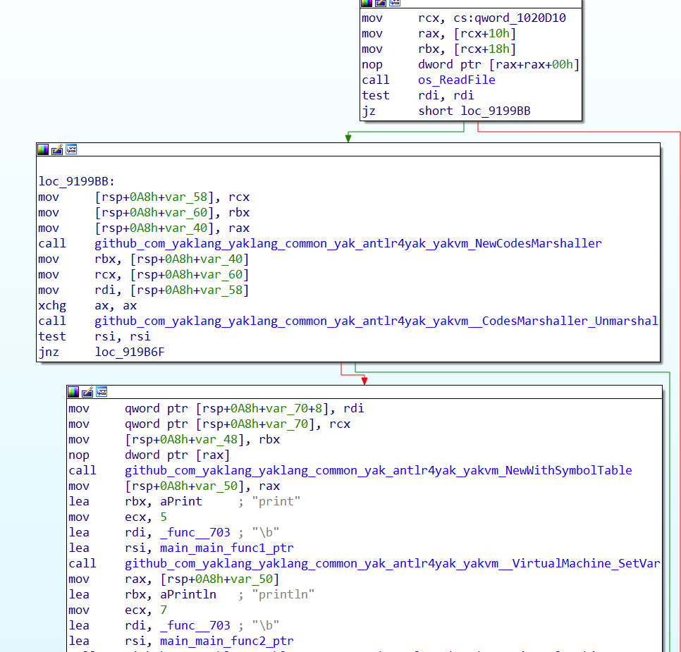
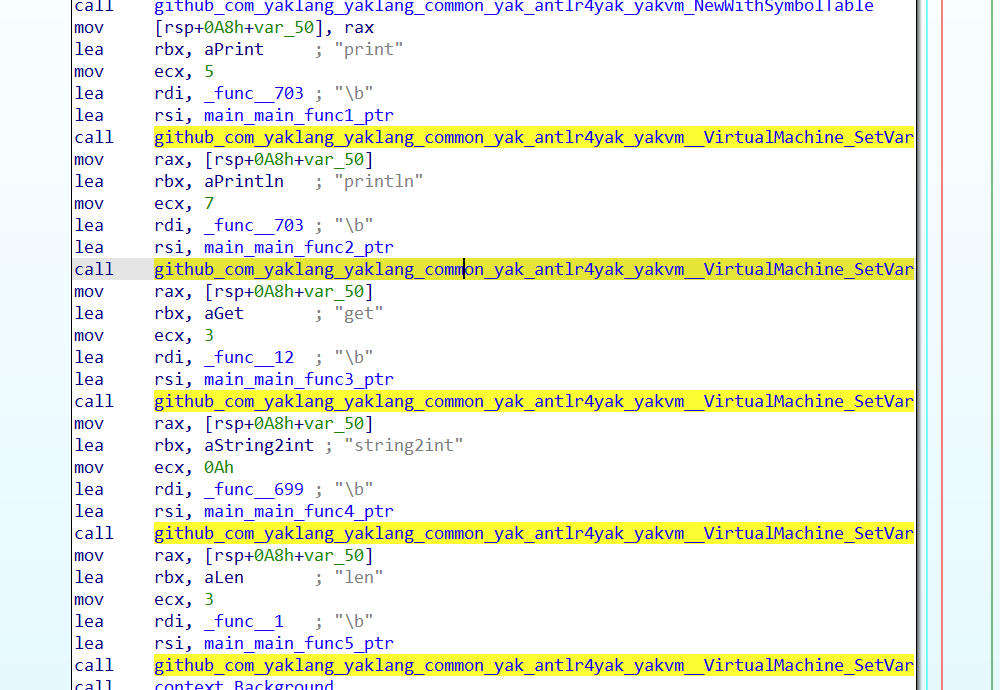
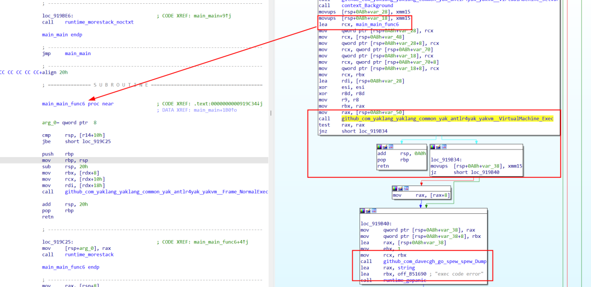
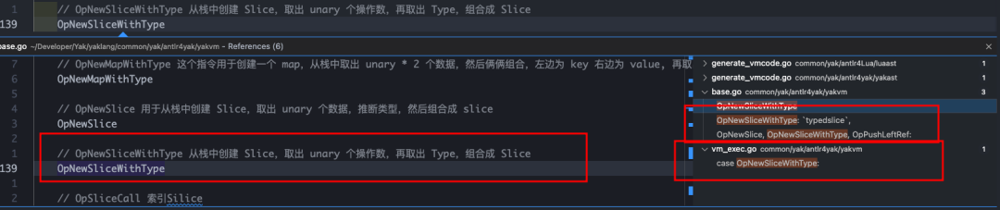

# 极客大挑战YAKVM题目WP

日期: 2023-12-21 | 原文: <https://mp.weixin.qq.com/s/vhjbXYpPgFJI3TdQt-IDnQ>


**前言**


第十四届极客大挑战已完美收官，此次题目融合了YAK元素进行创意改编，不少同学赛后对YAK展现出浓烈兴趣。

在之前的文章里，Rookie师傅已为大家讲解了EZ_Smuggling题目[HTTP2降级请求走私](http://mp.weixin.qq.com/s?__biz=Mzk0MTM4NzIxMQ==&mid=2247516951&idx=1&sn=7297aa9f7fa49c3fdc79225f42e441f0&chksm=c2d1ffb3f5a676a57c053b8917bf9d0b012c3b4995658feb8a4cc2a3670486f6dc0634e76205&scene=21#wechat_redirect)。为了让小伙伴们从题目中学习到更多CTF思路，更好得认识了解YAK，我们将在Yak Project中陆续呈上YAK题目的WriteUp，一起来get出题师傅的小心思把~


**YAKVM该题目**源码位于*https://github.com/yaklang/yaklang/tree/geek2023)*

**逆向**


该题目使用 golang 编译，需要使用一定手段恢复符号。恢复符号以后，将会看到一下内容：调用 `NewCodeMarshaller` 并继续调用其 `Unmarshal` 方法，这是反序列化 yakc 文件也就是题目中的 `marshalCode` 文件，之后调用 `NewWithSymbolTable` 创建一个新的作用域。



然后不断调用 `SetVar` 方法，设置如下的符号到对应的函数：`print`, `println`, `get`, `string2int`, `len` :



最后直接调用 `Exec` 方法，



恢复符号以后发现该代码项目与题目 Readme 提示中的一致，主要代码都来自于 *https://github.com/yaklang/yaklang*, 主要使用的是 *https://github.com/yaklang/yaklang/tree/main/common/yak/antlr4yak* 包里的内容。直接去看这些函数，在 main 分支的源码中都是存在的，也有很多对应的测试样例，可以了解这些 API 的使用。

**VM**


**创建代码样例**

直接去翻看这些 API 的参数和返回值，与逆向的数据进行对比，可以还原出这样的代码：

```
func TestReverse(t *testing.T) { bytes, err := os.ReadFile("./marshalCode") if err != nil {  panic("read file error") } m := yakvm.NewCodesMarshaller() table, code, err := m.Unmarshal(bytes) if err != nil {  panic("unmarshal error") } yakvm.ShowOpcodes(code) // run vm := yakvm.NewWithSymbolTable(table) // 这几个函数看名字就能知道啥意思，不影响对VM-OPcode的分析，或者逆向看代码也没有特别困难，基本都是直接调用api函数。 vm.SetVar("print", func(args ...interface{}) {  fmt.Print(args...) }) vm.SetVar("println", func(args ...interface{}) {  fmt.Println(args...) }) vm.SetVar("get", func() []byte {  var input string  fmt.Scanln(&input)  return []byte(input) }) vm.SetVar("string2int", func(str string) int {  i, err := strconv.Atoi(str)  if err != nil {   return 0  }  return i }) vm.SetVar("len", func(a []byte) int {  return len(a) })  vm.Exec(context.Background(), func(frame *yakvm.Frame) {  frame.NormalExec(code) })}
```

注意在这里直接使用 `yakvm.ShowOpcodes(code)` 这样的 API 即可直接打印出 Opcode 的反汇编版本。同时，将所有注入的变量全部写一遍，都是直接打印数据。需要继续逆向一下各个子函数确定他们的意思，里头都是调用的 Golang 标准库 API，比较简单。

可以补全整个测试样例，就可以开始 Golang 源码调试。这里多的就不赘述了可以直接看整个 VM 的实现。


**逆向 Opcode**

因为存在源码，所以几乎所有的 Opcode 都可以找到对应的运行操作、定义和注释 。

*https://github.com/yaklang/yaklang/blob/main/common/yak/antlr4yak/yakvm/base.go*，在其后的分析过程将不会详细解析每个 Opcode 的作用。函数参数和闭包捕获参考 func.go。*https://github.com/yaklang/yaklang/blob/main/common/yak/antlr4yak/yakvm/func.go#L245*



通过之前的打印，可以得到一个线性的反汇编 Opcode。接下来将会分段讲解：

#### **-Opcode主函数**

以下这段 Opcode 的作用是创建一个左值，这里先定义为 `L1` 内容位这些 `push` 的数据，类型为 `byte[]`。

```
2:6->2:9         0:OP:type                 byte2:4->2:97        1:OP:type                 slice2:11->2:13       2:OP:push                 1372:15->2:17       3:OP:push                 1082:19->2:21       4:OP:push                 1592:23->2:25       5:OP:push                 1142:27->2:29       6:OP:push                 1852:31->2:32       7:OP:push                 902:34->2:36       8:OP:push                 1742:38->2:39       9:OP:push                 682:41->2:43      10:OP:push                 1602:45->2:46      11:OP:push                 812:48->2:50      12:OP:push                 1792:52->2:53      13:OP:push                 412:55->2:57      14:OP:push                 1862:59->2:60      15:OP:push                 892:62->2:64      16:OP:push                 1682:66->2:67      17:OP:push                 782:69->2:71      18:OP:push                 2292:73->2:75      19:OP:push                 1212:77->2:79      20:OP:push                 1492:81->2:83      21:OP:push                 1062:85->2:87      22:OP:push                 1472:89->2:91      23:OP:push                 1032:93->2:95      24:OP:push                 1562:97->2:99      25:OP:push                 1142:101->2:103    26:OP:push                 1332:105->2:106    27:OP:push                 982:108->2:110    28:OP:push                 1462:112->2:114    29:OP:push                 1162:116->2:118    30:OP:push                 1812:4->2:97       25:OP:typedslice           23 // OP：OpNewSliceWithType 2:4->2:97       26:OP:list                 12:0->2:0        27:OP:pushleftr            12:0->2:0        28:OP:list                 12:0->2:97       29:OP:assignL1 = []byte{137,108,159,114,185,90,174,68,160,81,179,41,186,89,168,78,229,121,149,106,147,103,156,114,133,98,146,116,181}
```

以下这一段是调用函数 `print` 并传入参数 `"please input"`，最后扔掉返回值。

```
3:0->3:4        30:OP:pushid               print3:6->3:25       31:OP:push                 please input flag:3:5->3:26       32:OP:call                 vlen:13:0->3:26       33:OP:popprint("please input")
```

以下这段调用 `get` 函数：`

```
4:4->4:6        34:OP:pushid               get4:7->4:8        35:OP:call                 vlen:04:4->4:8        36:OP:list                 14:0->4:0        37:OP:pushleftr            24:0->4:0        38:OP:list                 14:0->4:8        39:OP:assignL2 = get()
```

以下这段创建了新的作用域，一般情况下 `if/for/switch/try` 都会创建新的作用域，这段代码内部逻辑是判断+向后跳转，因此这应该是 `if` 结构：

```
5:18->8:0       40:OP:new-scope            2 5:3->5:5        41:OP:pushid               len 5:7->5:7        42:OP:pushr                2 5:6->5:8        43:OP:call                 vlen:1 5:12->5:14      44:OP:pushid               len 5:16->5:16      45:OP:pushr                1 5:15->5:17      46:OP:call                 vlen:1 5:3->5:17       47:OP:gt 5:18->8:0       48:OP:jmpf                 -> 57 5:18->8:0       49:OP:new-scope            3  6:1->6:7        50:OP:pushid               println  6:9->6:32       51:OP:push                 input string too long!  6:8->6:33       52:OP:call                 vlen:1  6:1->6:33       53:OP:pop  7:1->7:6        54:OP:return 5:18->8:0       55:OP:end-scope 5:18->8:0       56:OP:jmp                  -> 575:18->8:0       57:OP:end-scopeif len(L2) > len(L1) { println("string too long!")}
```

以下这两段首先保存了一段 opcode 到一个左值中，其中这段 Opcode 是 Opcode 内定义的函数：

```
12:8->21:0      58:OP:push                 function params[1] codes[54] (copy)12:8->21:0      59:OP:list                 112:0->12:4      60:OP:pushleftr            812:0->12:4      61:OP:list                 112:0->21:0      62:OP:assign25:4->25:8      63:OP:pushr                825:10->25:10    64:OP:pushr                225:9->25:11     65:OP:call                 vlen:125:4->25:11     66:OP:list                 125:0->25:0      67:OP:pushleftr            225:0->25:0      68:OP:list                 125:0->25:11     69:OP:assignL8 = func_code_54L2 = L8(L2)28:9->33:0      70:OP:push                 function params[0] codes[40] (copy)28:9->33:0      71:OP:list                 128:0->28:4      72:OP:pushleftr            1428:0->28:4      73:OP:list                 128:0->33:0      74:OP:assign36:0->36:4      75:OP:pushr                1436:5->36:6      76:OP:call                 vlen:036:0->36:6      77:OP:popL14 = func_code_40L14()
```

这段 Opcode 的最后一段如下, 首先获取定义的函数，然后进入一个判断结构：

```
38:11->48:0     78:OP:push                 function params[0] codes[52] (copy)38:11->48:0     79:OP:list                 138:0->38:7      80:OP:pushleftr            1938:0->38:7      81:OP:list                 138:0->48:0      82:OP:assign// L19 = func_code_52 51:14->53:0     83:OP:new-scope            24 51:3->51:10     84:OP:pushr                19 51:11->51:12    85:OP:call                 vlen:0 51:14->53:0     86:OP:jmpf                 -> 94 51:14->53:0     87:OP:new-scope            25  52:1->52:5      88:OP:pushid               print  52:7->52:24     89:OP:push                 yes! you get it!  52:6->52:25     90:OP:call                 vlen:1  52:1->52:25     91:OP:pop  // print("yes! you get it!") 51:14->53:0     92:OP:end-scope 51:14->53:0     93:OP:jmp                  -> 10251:14->53:0     94:OP:end-scope51:14->53:0     95:OP:new-scope            26 53:6->55:0      96:OP:new-scope            27  54:1->54:5      97:OP:pushid               print  54:7->54:24     98:OP:push                 no this not flag  54:6->54:25     99:OP:call                 vlen:1  54:1->54:25    100:OP:pop  // print("no this not flag") 53:6->55:0     101:OP:end-scope51:14->53:0    102:OP:end-scopeif L19() { print("yes! you get it!")}else { print("no this not flag") }
```

#### **-Opcode 函数 1**`func_code_54`**

```
anonymous12:15->21:0      0:OP:new-scope            5 13:1->19:1       1:OP:new-scope            6  13:1->19:1       2:OP:pushleftr            5  13:18->13:18     3:OP:pushr                3  13:1->19:1       4:OP:fast-assign  L5 = L3   13:1->19:1       5:OP:enter-for-range      -> 47  13:1->19:1       6:OP:range-next  13:5->13:5       7:OP:pushleftr            6  13:8->13:8       8:OP:pushleftr            7  13:5->13:8       9:OP:list                 2  13:1->19:1      10:OP:assign  L6, L7 = range L5  13:20->19:1     11:OP:new-scope            7   14:16->16:2     12:OP:new-scope            8    14:5->14:5      13:OP:pushr                6    14:9->14:9      14:OP:push                 2    14:5->14:9      15:OP:mod    14:14->14:14    16:OP:push                 0    14:5->14:14     17:OP:eq    // L6 % 2 == 0     14:16->16:2     18:OP:jmpf                 -> 31    14:16->16:2     19:OP:new-scope            9     15:10->15:10    20:OP:pushr                7     15:14->15:17    21:OP:push                 240     15:10->15:17    22:OP:xor     15:10->15:17    23:OP:list                 1     // L7 ^ 240      15:3->15:3      24:OP:pushr                3     15:5->15:5      25:OP:pushr                6     15:3->15:6      26:OP:list                 2     // L3[L6]          15:3->15:6      27:OP:list                 1     15:3->15:17     28:OP:assign     // L3[L6] = L7 ^ 240     14:16->16:2     29:OP:end-scope    14:16->16:2     30:OP:jmp                  -> 44   14:16->16:2     31:OP:end-scope   14:16->16:2     32:OP:new-scope            10    16:9->18:2      33:OP:new-scope            11     17:10->17:10    34:OP:pushr                7     17:14->17:17    35:OP:push                 15     17:10->17:17    36:OP:xor     17:10->17:17    37:OP:list                 1     // L7 ^ 15     17:3->17:3      38:OP:pushr                3     17:5->17:5      39:OP:pushr                6     17:3->17:6      40:OP:list                 2     // L3[L6]     17:3->17:6      41:OP:list                 1     17:3->17:17     42:OP:assign     // L3[L6] = L7 ^ 15    16:9->18:2      43:OP:end-scope   14:16->16:2     44:OP:end-scope  13:20->19:1     45:OP:end-scope  13:1->19:1      46:OP:exit-for-range       -> 6  13:1->19:1      47:OP:pop 13:1->19:1      48:OP:end-scope 20:8->20:8      49:OP:pushr                3 20:8->20:8      50:OP:list                 1 20:1->20:8      51:OP:return // return L3 12:15->21:0     52:OP:end-scope12:8->21:0      53:OP:return
```

大概内容如下，函数的参数将会被定名为和父函数内所有值都不同名的一个 ID。

```
func1 = (L3) => { for L6, L6 = range arg1 {  if L6 % 2 == 0 {   L3[L6] = L6 ^ 240  }else {   L3[L6] = L6 ^ 15  } } return L3}
```

#### **-Opcode 函数 2**`func_code_50`**

```
anonymous28:15->33:0      0:OP:new-scope            13 29:1->32:1       1:OP:new-scope            14  29:1->32:1       2:OP:pushleftr            10  29:18->29:18     3:OP:pushr                2  29:1->32:1       4:OP:fast-assign  // L10 = L2  29:1->32:1       5:OP:enter-for-range      -> 36  29:1->32:1       6:OP:range-next  29:5->29:5       7:OP:pushleftr            11  29:8->29:8       8:OP:pushleftr            12  29:5->29:8       9:OP:list                 2  29:1->32:1      10:OP:assign  // L11, L12 = range L10   29:20->32:1     11:OP:new-scope            15   30:6->30:6      12:OP:pushr                11   30:10->30:10    13:OP:push                 2   30:6->30:10     14:OP:mul   30:6->30:10     15:OP:list                 1   // L11 * 2   30:2->30:2      16:OP:pushleftr            13   30:2->30:2      17:OP:list                 1   30:2->30:10     18:OP:assign   // L13 = L11 * 2   31:11->31:11    19:OP:pushr                12   31:10->31:11    20:OP:not   // ^L12   31:15->31:15    21:OP:pushr                13   31:10->31:15    22:OP:and   // L13 & ^L12   31:21->31:21    23:OP:pushr                12   31:26->31:26    24:OP:pushr                13   31:25->31:26    25:OP:not   31:21->31:26    26:OP:and   // ^L13 & L12   31:9->31:27     27:OP:or   31:9->31:27     28:OP:list                 1   // (L13 & ^L12) |  (L13 & ^L12)   31:2->31:2      29:OP:pushr                2   31:4->31:4      30:OP:pushr                11   31:2->31:5      31:OP:list                 2   // L2[L11]    31:2->31:5      32:OP:list                 1   31:2->31:27     33:OP:assign   // L2[L11]  = (L13 & ^L12) |  (L13 & ^L12)  29:20->32:1     34:OP:end-scope  29:1->32:1      35:OP:exit-for-range       -> 6  29:1->32:1      36:OP:pop 29:1->32:1      37:OP:end-scope28:15->33:0     38:OP:end-scope28:9->33:0      39:OP:return
```

大致内容如下，注意函数内使用和外部一样的 id，表示这个参数是尝试对外部变量的捕获，在此函数内对这个变量进行修改是可以将外部的该变量修改掉的。

```
func2  = ()  => { for L11, L12 := range L2 {  L13 = L11 * 2  L2[L11] = (L13 & ^L12) | (^L13 & L12) }}
```

#### **-Opcode 函数 3**`func_code_52`**

```
anonymous38:17->48:0      0:OP:new-scope            17 39:21->41:1      1:OP:new-scope            18  39:4->39:6       2:OP:pushid               len  39:8->39:8       3:OP:pushr                2  39:7->39:9       4:OP:call                 vlen:1  // len(L2)  39:14->39:16     5:OP:pushid               len  39:18->39:18     6:OP:pushr                1  39:17->39:19     7:OP:call                 vlen:1  // len(L1)  39:4->39:19      8:OP:neq  // Len(L2) != len(L1)  39:21->41:1      9:OP:jmpf                 -> 16  39:21->41:1     10:OP:new-scope            19   40:9->40:13     11:OP:push                 false   40:9->40:13     12:OP:list                 1   40:2->40:13     13:OP:return   // return false   39:21->41:1     14:OP:end-scope  39:21->41:1     15:OP:jmp                  -> 16 39:21->41:1     16:OP:end-scope 42:1->46:1      17:OP:new-scope            20  42:1->46:1      18:OP:pushleftr            16  42:18->42:18    19:OP:pushr                2  42:1->46:1      20:OP:fast-assign  // L16 = L2  42:1->46:1      21:OP:enter-for-range      -> 45  42:1->46:1      22:OP:range-next  42:5->42:5      23:OP:pushleftr            17  42:8->42:8      24:OP:pushleftr            18  42:5->42:8      25:OP:list                 2  42:1->46:1      26:OP:assign  // L17, L18 = range L16   42:20->46:1     27:OP:new-scope            21   43:14->45:2     28:OP:new-scope            22    43:5->43:5      29:OP:pushr                18    // L18     43:10->43:10    30:OP:pushr                1    43:12->43:12    31:OP:pushr                17    43:11->43:13    32:OP:push                 false    43:11->43:13    33:OP:iterablecall         off:1 op1: -  op2: -    // L1[L17]    43:5->43:13     34:OP:neq    // L18 != L1[L17]    43:14->45:2     35:OP:jmpf                 -> 42    43:14->45:2     36:OP:new-scope            23     44:10->44:14    37:OP:push                 false     44:10->44:14    38:OP:list                 1     44:3->44:14     39:OP:return     // return false     43:14->45:2     40:OP:end-scope    43:14->45:2     41:OP:jmp                  -> 42   43:14->45:2     42:OP:end-scope  42:20->46:1     43:OP:end-scope  42:1->46:1      44:OP:exit-for-range       -> 22  42:1->46:1      45:OP:pop 42:1->46:1      46:OP:end-scope 47:8->47:11     47:OP:push                 true 47:8->47:11     48:OP:list                 1 47:1->47:11     49:OP:return // return true 38:17->48:0     50:OP:end-scope38:11->48:0     51:OP:return
```

大致内容如下：

```
func3 = () => { if len(L2)!=len(L1){  return false } L16 = L2 for L17, L18 = range L16{  if L18 != L1[L17] {   return false   } } return true}
```


**伪代码展示：**

```
L1 = []byte{137,108,159,114,185,90,174,68,160,81,179,41,186,89,168,78,229,121,149,106,147,103,156,114,133,98,146,116,181}print("please input")L2 = get()if len(L2) > len(L1) { println("string too long!")}L8 = func1L2 = L8(L2)L14 = func2L14()L19 = func3if L19() { print("yes! you get it!")}else { print("no this not flag") }func1 = (L3) => { for L6, L6 = range arg1 {  if L6 % 2 == 0 {   L3[L6] = L6 ^ 240  }else {   L3[L6] = L6 ^ 15  } } return L3}func2  = ()  => { for L11, L12 := range L2 {  L13 = L11 * 2  L2[L11] = (L13 & ^L12) | (^L13 & L12) }}func3 = () => { if len(L2)!=len(L1){  return false } L16 = L2 for L17, L18 = range L16{  if L18 != L1[L17] {   return false   } } return true}
```


**解密得到 flag：**

```
func TestGetFlag(t *testing.T) { L1 := []byte{137, 108, 159, 114, 185, 90, 174, 68, 160, 81, 179, 41, 186, 89, 168, 78, 229, 121, 149, 106, 147, 103, 156, 114, 133, 98, 146, 116, 181} Decode(L1) fmt.Println(string(L1))}func Decode(flag []byte) { for i, v := range flag {  v = v ^ byte(2*i)  if i%2 == 0 {   v = v ^ 0xf0  } else {   v = v ^ 0x0f  }  flag[i] = v }}
```

Flag : `yak{A_RE@LW0RLD_5TACKB@SE_VM}`
