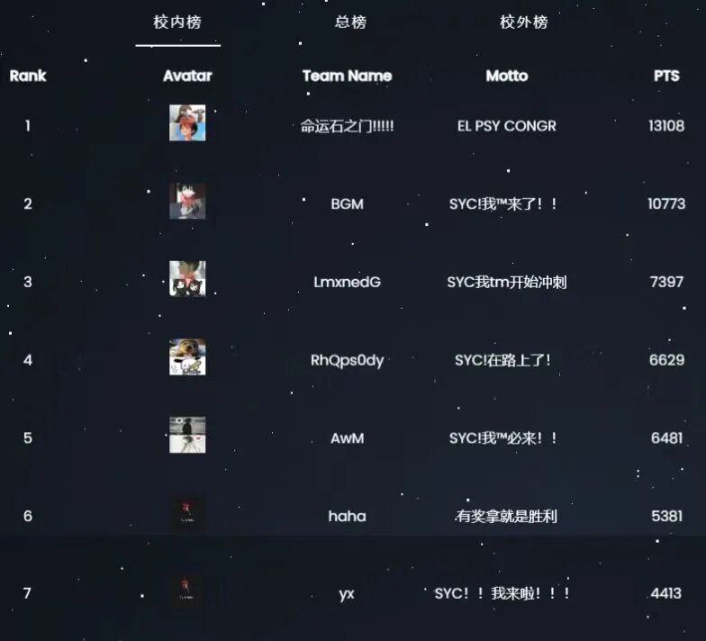
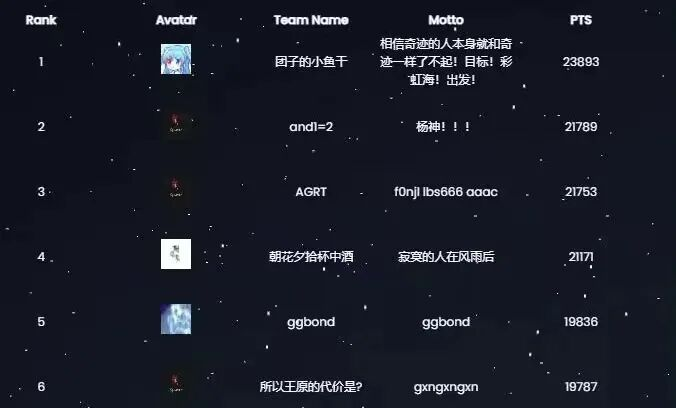
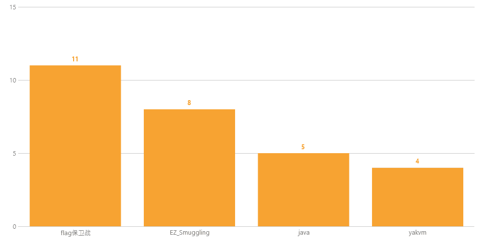

# 【能力传承】第十四届极客大挑战完美收官！

日期: 2023-12-15 | 原文: <https://mp.weixin.qq.com/s/w_O_yvYLaJO6xqQ0VEY8sg>

**不为金钱而参与的比赛是新生代Hacker对信息安全行业热爱的信号吗？**

2023年12月14日，第十四届极客大挑战在历时一个月的激战后圆满结束！

**校内校外共计2000+支战队激烈交锋近3000名参赛选手超10000次flag提交！**

初涉信息安全的畅快，在这场以“启蒙”为名的云端派对上，见证了大家的每一次挑战、每一次进步、每一次突破。

本次赛题主要从激发学生们的行业热情出发，题目由浅入深，融入了**YAK语言的全新赛题**，更为比赛带来了独有的特性。

最终，战队命运石之门！获得校内一等奖，战队BGM、LmxnedG获得校内二等奖，战队RhQps0dy、AwM、haha、yx获得校内三等奖；战队团子的小鱼干获得校外一等奖，AGRT、朝花夕拾杯中酒获得校外二等奖，战队所以王原的代价是？、Birkenwald、看看题获得校外三等奖。

**校内榜**

**校外榜**

比赛中的每一道赛题都是经过出题组深思熟虑，贴近实际应用场景又不失乐趣，目的是让每一位同学都能参与到比赛中，探索自己技术优势所在。YAK语言在本次极客大挑战赛题类别涵盖**Web和逆向**，Flag提交成功共计30余次。很高兴看到同学们对YAK展现出的兴趣，我们将在Yak Project公众号后期更新呈上YAK全系列题目Writeup。

举办极客大挑战的初衷是以赛促学，带领网络安全新生入门，通过CTF赛事形式激发学习兴趣，有助于后期了解、明确自己的发展方向和技术路线。一个行业的未来发展和人才培养密不可分，YAK团队一直坚持探索白帽成长和安全研发人才培养新模式。在未来，我们将会继续与各大高校合作，把安全开发及行业经验传递给更多青年，并通过大赛等多种形式发掘及培养技术人才。

一段征程的结束，是另一段征程的起点，探索永无止境。万径安全希望极客大挑战能作为一个契机，推动新生代极客走向更高更远的目标。同时，我们将继续赋能网络安全教育事业，助力安全教育体系建设。期待在未来网络安全领域跑道上，能够出现越来越多优秀的人才与我们并肩同行，一起加速技术革新。

**让世界更安全让安全更简单END更新日志Yaklang 1.2.9-sp3**

1. 新增爬虫模块的文档

2. 修复链接池的降级Bug导致数据包确实

3. 优化 mitm 的行为

4. 修复数据查询的一些行为

5. 优化 payload 管理接口

6. 新增 payload fuzztag 的过滤与筛选功能

7. 修复 web 探测端口时某些情况的误判

8. 优化 DNS 缓存行为

9. 修复 Markdown 不渲染的问题

10. 优化前端引擎端口选择逻辑

11. 新增 MySQL ErrorBased 的检测

12. 优化了 SSA Scope Vars Range 的逻辑

**Yakit  1.2.8-sp2**

1. Payload上线新UI

2. WebFuzzer常用标签调整内置标签内容（因为底层逻辑改动会影响到师傅们自己添加的标签，烦请更新后自己添加一下）

3. 修复History导出数据的问题

4. 修复MITM劫持屏蔽数据失败的问题

5. Yso-Java Hack反连URL增加显示类名

6. ChatCS增加提示词分类Yak，可以询问Yak&Yakit相关问题

7. 过滤器清除优化为不全部清空，留下排除Http方法
