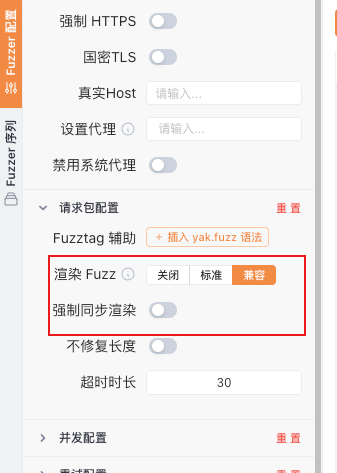
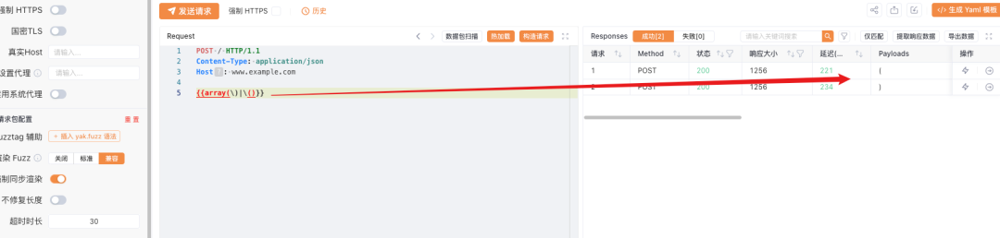
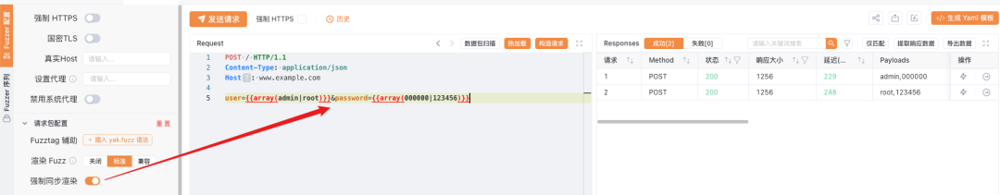

# FuzzTag 全解（WebFuzzer更新）

日期: 2023-12-14 | 原文: <https://mp.weixin.qq.com/s/r6XN9HWJlKOSYSIqh0RZ2Q>


**背景**

Yaklang独创的FuzzTag可以用于模糊文本生成、数据编解码、与yaklang插件联动。经过了几个版本的迭代，增添修补了很多功能，本篇再详细介绍下一些FuzzTag的使用。

**FuzzTag语法**


**基本语法**

一般的FuzzTag格式如下：`{{x(user_top10)}}`，其中`{{`为FuzzTag标签的开始，`}}`为FuzzTag标签结束。标签内容`x(user_top10)`会交由FuzzTag执行引擎解析。执行引擎编译过程中会根据小括号将标签内容解析为标签名`x`和参数`user_top10`，然后再交给标签函数执行，生成数据。如`x`函数收到参数`user_top10`后，按行读取文件，将读取结果返回。


**多参数标签**

有些标签支持多个参数，继上面的基本语法，FuzzTag执行引擎会将参数传递给标签函数，如标签`{{array(1|2|3)}}`在执行时，会解析为标签名`array`和参数`1|2|3`，其中参数是由标签函数自主解析。所以对于多参数并没有严格限制，如指定范围的随机数在处理多参数时与array标签不同，它可以这样用：`{{randint(1,1010)}}`，也可以这样用`{{randint(1-1010)}}`（更符合直觉一些）。

但总体上来说，除个别特殊标签（如数据与分隔符冲突），大多都会使用`|`作为多个参数的分隔符。


**同步渲染**

FuzzTag可以通过添加label的方式实现标签在渲染时索引同步的效果。如：

`{{array(1|2|3)}}{{array(1|2|3)}}`的渲染结果数量应该是9，但可以通过添加label的方式，如`{{array::sync(1|2|3)}}{{array::sync(1|2|3)}}`实现同步，渲染结果为11、22、33。

label的用法就是在原有的tag名后加`::label``名`。这样就可以精准的指定需要同步的FuzzTag。


**标签嵌套**

FuzzTag标签支持嵌套使用，如`{{base64({{url(this is yakit)}})}}`，其中数据`this is yakit`会被先url编码，再base64编码。更极端一点的情况，如`{{int(1-{{int(1-3)}})}}`，生成数据为:

```
1
12
123
```

也就是说FuzzTag的标签参数支持动态生成。

更极端的，标签名也可以动态生成，如`{{i{{hexdec(6e)}}t(1-3)}}`，生成结果：1、2、3。

但不建议使用动态标签名的特性，暂时还没有遇到应用场景。


**转义问题**

FuzzTag的开始和结束标志为`{{`、`}}`，所以标签内数据是禁止使用`{{和}}`的，如果不小心直接使用了，会影响标签的正常解析。但可以通过转义符使用，如`{{array(\}}|\{{)}}`的输出为：}}、{{。

标签内，函数参数的开始和结束标志为第一个`(`和最后一个`)`，所以参数内使用`(`、`)`不受影响，如：`{{array()|()}}`，输出为：)、(

**WebFuzzer更新**


WebFuzzer的高级功能更新了两个按钮：渲染Fuzz从开关按钮变成了三种可选模式、增加强制同步渲染按钮




**兼容模式**

在介绍FuzzTag语法部分时介绍了参数的边界符为第一个`(`和最后一个`)`，这么做的好处就是在参数部分使用小括号不需要转义，但缺点就是一个tag内只能使用一个标签函数。如果使用多个tag嵌套就会像这样`{{base64({{url(this is fuzztag)}})}}`，每个标签函数都要使用`{{}}`包裹。

在兼容模式下，参数的边界为`(`和`)`，在tag内标签函数可以直接嵌套，如`{{base64(url(this is fuzztag))}}`，但缺点就是参数中出现的小括号都需要转义，如:



总结下：

|  | 优点 | 缺点 | 案例 |
| --- | --- | --- | --- |
| **标准** | 小括号不需要转义 | 大括号多，阅读难 | `{{base64({{url(this is fuzztag)}})}}` |
| **兼容** | 可以省略一些大括号 | 小括号需要转义 | `{{base64(url(this is fuzztag))}}` |

**注意：现版本默认开启兼容模式，如果使用过程中发现渲染错误，可以检查下是否小括号的问题，可以转义或选择标准模式。**


**强制同步渲染**

师傅们多数是从burp转来的，对比下burp的几种模式，yakit都可以实现支持。

| 模式 | 案例 | 字典数量 | 理解 | 应用场景 | Fuzztag |
| --- | --- | --- | --- | --- | --- |
| Sniper（狙击手） | `a=``$a$``&b=``$b$` | 1 | 轮流替换 | fuzz请求参数 | - |
| Battering ram（攻城锤） | `a=``$a$``&b=``$b$` | 1 | 替换全部 | 多个字段参数相同 | 同步渲染 |
| PitchFork（草叉） | `a=``$a$``&b=``$b$` | 多个 | 同步替换 | 有对应关系的字典 | 同步渲染 |
| Cluster bomb（集束炸弹） | `a=``$a$``&b=``$b$` | 多个 | 笛卡尔 | 无对应关系的字典 | 笛卡尔渲染 |

其中Battering ram模式和PitchFork模式是等价的，只是在burp中选择字典的数量不同。在WebFuzzer使用中，师傅们常问的就是：“怎么做到两个字典的元素一一对应”，其实就是上面介绍的同步标签。为了方便使用，在WebFuzzer高级配置中添加了“强制同步渲染”按钮。

如图，开启后，所有根标签会就会一一对应的渲染



需要注意的是，开启“强制同步渲染”后。所有根标签的同步标签会失效，所有根标签都会强制同步渲染。

**总结**


同步渲染和兼容模式是很多师傅提出的问题，现在提到了前端，使用起来很方便，对新入门的师傅也很友好。同步渲染和兼容模式需要师傅们可以动手测试下。
