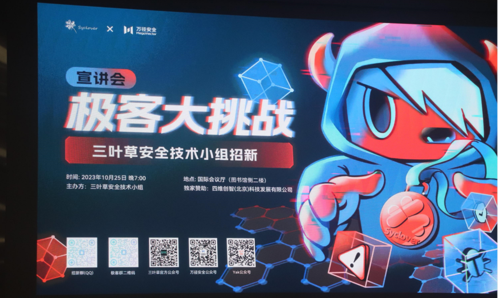
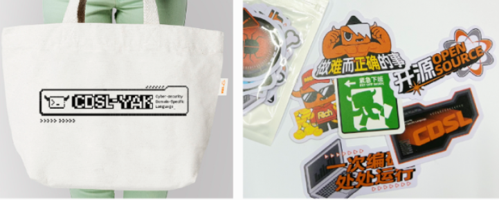

# YAK携手极客大挑战，助力高校网安人才培养

日期: 2023-10-26 | 原文: <https://mp.weixin.qq.com/s/9xnRkZzOrQXKxGLVcv0fPg>

## 极客大挑战

2023年10月25日晚，第十四届极客大挑战宣讲会在成都信息工程大学顺利举办。成都信息工程大学网络空间安全学院党委书记张仕斌、网络空间安全学院院长周益民发表开幕致辞。**万径安全（四维创智（北京）科技发展有限公司）作为独家赞助商出席现场。**

## 领导致辞

## 领导致辞

极客大挑战是由成都信息工程大学三叶草安全技术小组主办的一场面向新生与各位信息安全爱好者的ctf赛事。旨在以赛促学，引领新生入门信息安全。此次大赛还加入**全新Yak语言元素，**赛题结合Yak进行了创意改编**，题目范围包括re，web，pwn，crypto，misc等等，方向多样，趣味性高。

万径安全市场负责人陈杨讲到，作为成信大曾经的一员，再次回归母校倍感荣幸和亲切，也期待未来能与学院有更多深入合作机会。万径安全其实一直在探索**网络空间安全创新型人才培养模式，同时也在利用Yak推动网络安全教育的创新与发展**，**提升高校学生攻防兼备的实操经验，培养学生的团队合作精神与能力。

## 极客大挑战
三叶草安全技术小组招新

在宣讲会后，同学们对Yak展现出了浓厚的兴趣，同时对于**安全能力融合**的理念感到新奇且富有吸引力，他们认为，Yak将为他们的网络安全学习过程带来全新的体验，无论是**“图灵完备”的网络安全领域编程语言CDSL-YAK还是交互式应用安全测试平台Yakit**，**都能应用在课程攻防实践以及开发创新等实际场景中。

**小花絮：**

作为独家赞助商，Yak团队也为同学们准备了福利，现场抽取了10名幸运观众获得牛牛精美周边一份。

最后预祝参赛选手们能豪夺Flag，取得好成绩，咱们颁奖典礼见！
