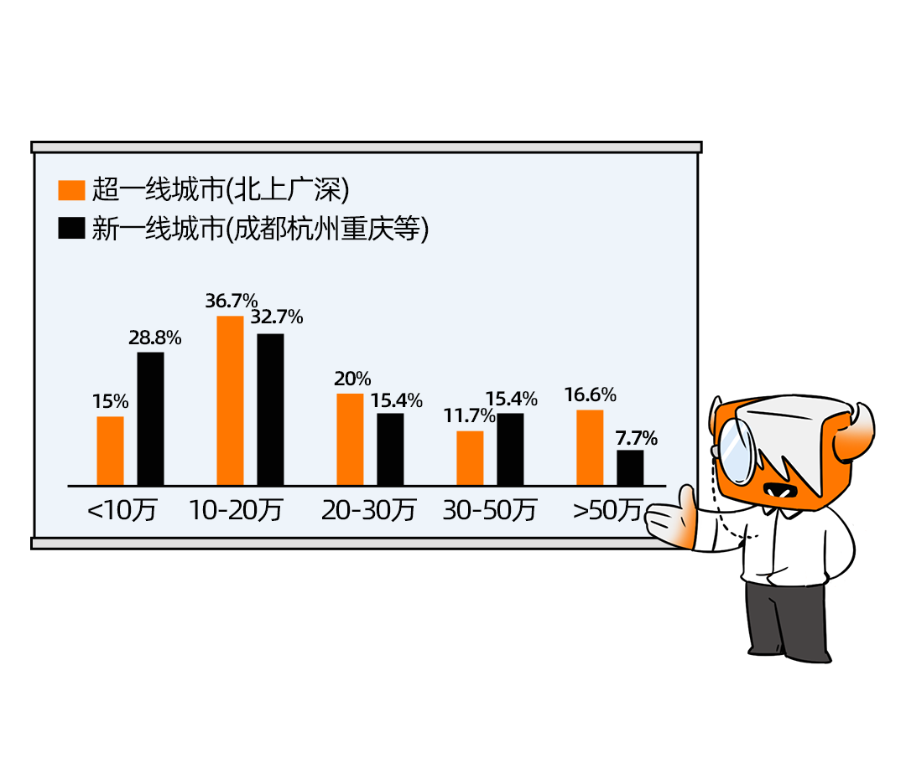

# 来成都吗，不用打电话的那种

日期: 2023-10-13 | 原文: <https://mp.weixin.qq.com/s/WiE9y-HdAbvid-X6crE8CA>

前段时间和大学同学唠嗑，聊起当时临近毕业的彷徨不安：**“**作为网安人想要选择成都作为根据地，万千灯火中这里能有一盏属于自己的灯吗？**”**

现如今，他们大部分都在北上广深打拼，除了有时候在社交软件聊聊天，平日的社交圈早已没了他们的身影。

成都——这几年超级出圈的城市，那座大家认为房价低，物价也低，生活成本不高，能过上躺平生活的城市。“少不入川，老不出蜀”，成都理所应当成为了打工族心目中的温柔乡，然而很多亲身体验过的人如此总结道**“**工作比深圳卷，通勤比北京远，存钱比上海难，土著比广州懒**”**。

打开招聘软件，搜索成都，弹出职位最多的是销售专员、服务员、Java、客服专员。据58同城招聘研究院数据显示：2020年，成都是全国销售、客服岗位需求最大的城市。

**成都，一座孙悟空来了，也得打五百个电话才能走的城市和我在成都的街头走一走，走来的不是赵雷，是推销的中介**

岗位选择如此狭窄，网安相关专业的毕业人数却直线上升。据2023网络安全产业人才发展报告显示，预估2023年网安相关专业毕业生达到3.2万人。毕业生增长的同时，就业率却持续走低。反观网络安全人才从业的区域，以北上广深等城市为主，合计占比高达66%，杭州占比7%，成都仅占比6%。照理来说，成都作为中国西南地区的发展中心，在人才吸引维度上各项数字是居于榜首，但是网安相关从业人员更优先选择一线城市，也足以说明一些问题。

说到底，薪资仍是大部分打工人在意的第一要素，再则是城市定位。从城市看，36.7%的超一线城市（北上广深）网络安全从业者税前年薪在10-20万元之间，占比最高，且高于总体水平。其次，北上广深从业者的税前年薪水平在20-30万元、50万元及以上的占比分别为20%、16.6%。知名大厂虽然在成都几乎都设立分部，但多以支持性部门为主，所以薪资总体水平并不高，就算有好的工作岗位也因信息差等因素未被知晓。再辅以各项综合因素，产品对销售的需求超出了研发/财务等综合性岗位的需求，用人在岗位有限的情况下，更多会考虑**“性价比”**。

**虽然看起来就业形势严峻但是！接下来要说的可就是好消息了**

2023年网安人才供需比的数据表明，北京、深圳、广州、成都的供需比超过5，**成都的供需比甚至达到5.8高居榜首**。其他行业暂且不表，网络安全厂商遍地开花，不仅本土涌现出不少安全企业，越来越多的行业巨头争相在成都开设分部。

网络安全作为一个专业性极强的学科，就业的选择面还是比较广的，所以恭喜大家，目前看来行业情况还是相对乐观的。

**何去何从？牛牛给出几点建设性意见，仅供参考：01选对赛道**。选择大于努力，理想固然是美好，但是现实往往是残酷的。选择好自己的职业方向，确定要从事的行业，慢慢建立自己的职业关系网，积攒经验。若不走纯技术进阶路线，也可以选择其他安全岗位（安全服务工程师、售前工程师、安全项目经理、安全产品销售等）。

**02提高竞争力**。数据显示，网络安全工程师、安全运维工程师、渗透测试工程师等岗位是当前公司主要需求，但是高校按照教材授课，培养方案方向狭窄，实习实践机会较少，毕业的网安学子们能力不足，无法匹配上安全公司的要求。所以提高自己的专业能力尤为关键，在校期间可以多参加网安技能比赛、提前进入安全公司实习步入实战、加入安全研究实验室等都可以PUSH自己快速提升水平。

**03了解政策**。例如相继出台的《数据安全法》和《个人信息保护法》，要求企业迫切需要开展数据安全及隐私保护、合规治理等方面工作。了解行业发展动向，不断学习知识，掌握不同方向的安全技能。同时关注自己的社交圈，打破信息差，部分优质岗位不会流入市场而是内部消化，要及时把握机会。

看到这里，相信你也对成都的网络安全从业形式有了初步的看法。牛牛认为，成都的城市发展和网络安全的行业前景都未来可期。工作也好，生活也好，无论选择哪个城市，祝大家都能做到“此心安处即吾乡”。

（注：本文部分数据来源自《2023网络安全产业人才发展报告》）
