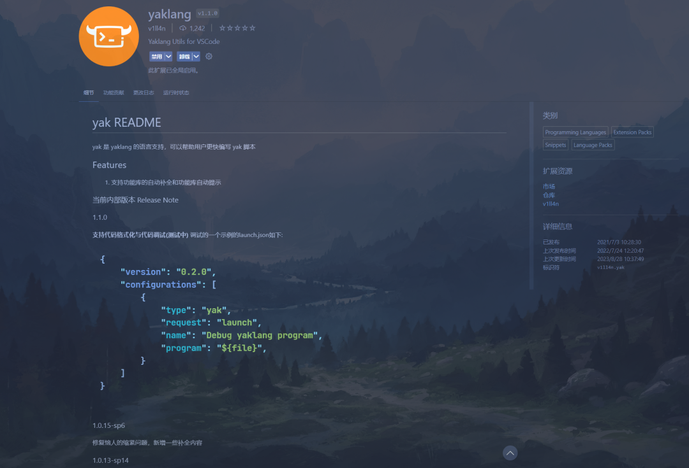
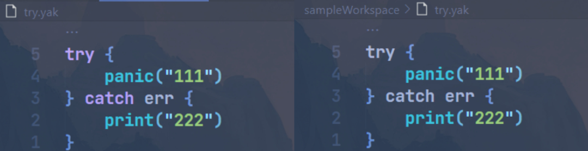
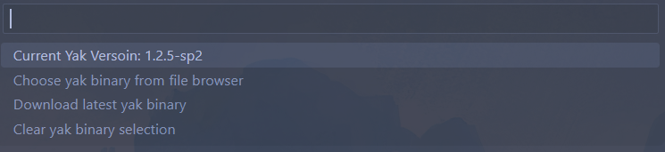
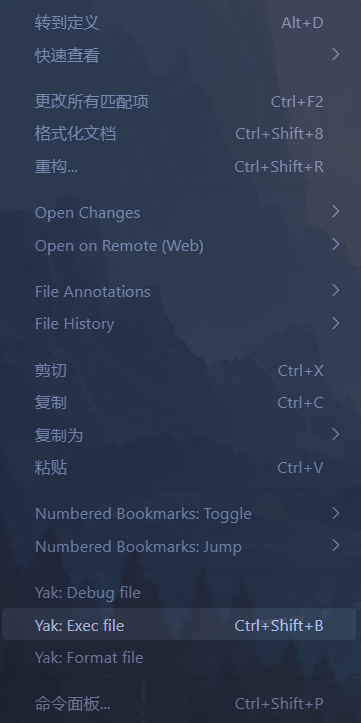
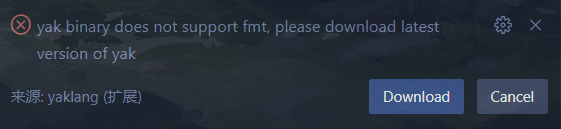
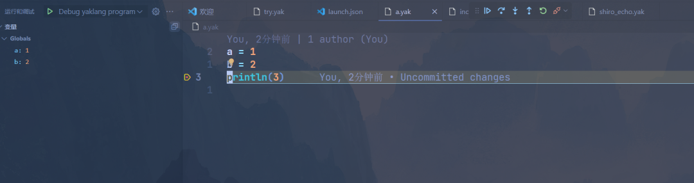

# 焕然一新的vscode扩展！

日期: 2023-09-08 | 原文: <https://mp.weixin.qq.com/s/ICyhS5eJ10J7PdmnwV2Kww>


**前言**

大家应该有注意到，vscode的yaklang扩展已经很久没有更新了，甚至有很多师傅都不知道vscode有yaklang扩展，那么究其原因是什么呢？

不好用是一方面，另外一方面则是因为师傅们一般只使用yakit，而没有单独去使用yaklang的习惯。yaklang经过几个版本的迭代之后，拥有了更多的新特性，现在和牛牛一起来看看焕然一新的vscode扩展吧！

1

**安装扩展**

打开扩展商店,搜索`yaklang`,并下载对应扩展，下载完后如图所示，可以发现新的扩展已经拥有了一个崭新的图标：



图1

2

**激活扩展**

由于vscode存在懒加载机制，所以扩展并不会在打开vscode的时候就加载，我们可以打开一个`.yak`后缀的插件，此时yaklang插件才会加载。

3

**全新语法高亮**

由于扩展年久失修，因此旧版本的扩展还没法对yaklang的新语法高亮支持，但是更新之后已经实现了支持，如图所示：



图2

4

**全新状态栏**

当你打开一个`.yak`文件时，假如你尚未安装yak或者无法从PATH环境变量中找到yak，则会收到以下错误提示：


图3

此时点击下载，并选择一个目录确定，扩展就会自动下载最新版的yak到该目录下。

当你已经安装好了yak，你可以在左下角的地方看到yak的状态栏，显示了当前yak的版本：


图4

点击该状态栏，会出现选择框，可以在这里看到当前yak版本，手动切换yak路径，下载最新版yak，以及清除当前选择的yak路径：



图5

5

**执行yak脚本**

旧版扩展中执行yak脚本的快捷键为f5，与默认的调试快捷键冲突，因此我们将执行yak脚本的快捷键改为了`ctrl+shift+b`(mac下则为`cmd+shift+b`)，现在也可以在右键扩展中找到：



图6

6

**格式化yak脚本**

新版扩展也增加了格式化yak脚本的功能，下载最新版yak后，按下vscode默认的格式化代码快捷键:`shift+alt+f`(mac下则为`Shift+Option+F`)或者右键yak脚本选择`Yak: Format file`，扩展就会调用引擎功能对代码进行格式化。

如果收到如下提示，则证明你的yak脚本不是最新的：



图7

7

**调制yak脚本（调试器）**

细心的师傅其实发现很早之前yak引擎就有`--cdebug`这个参数，用于启动基于命令行的调试器，但是显然这个丑陋的命令行调试器很多师傅是不会用的，所以经过了前期基础与多个版本的迭代，我们在最新版本实现了调试适配器协议（dap, debugger adapter protocol）并接入了vscode扩展中，实现了在vscode中调试yak的梦想。对yak调试器实现或调试适配器感兴趣的师傅可以查看这个pr来查看具体的实现，由于篇幅问题我们就不再赘述。

要想简单地对当前文件进行调试，只需要和呼吸一样自然地在yak文件行号左侧设置断点，然后按下f5进行调试，默认调试的`launch.json`如下：

```
{ "version": "0.2.0", "configurations": [  {   "type": "yak",   "request": "launch",   "name": "Debug yaklang program",   "program": "${file}",  } ]}
```

当进入调试状态后，我们可以观察到作用域中变量的值，还可以添加监视表达式，断点等，如图所示：



图8

虽然调试器经过了多个版本的迭代，添加了些许的测试，但是仍然无法百分百保证整个调试器能够如常运行，所以现在算是测试版本，希望广大师傅们多多试验这个调试功能，如果遇到bug请在github中提issue。
