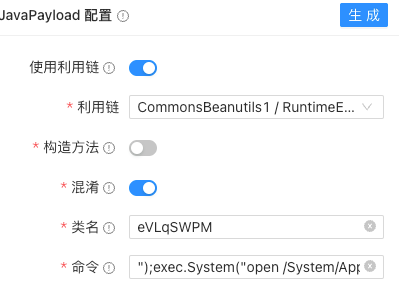
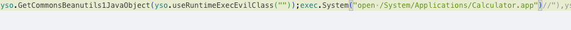
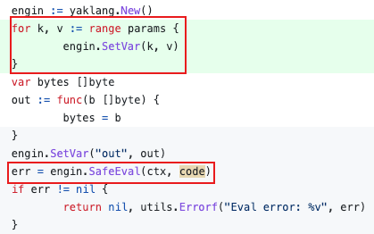
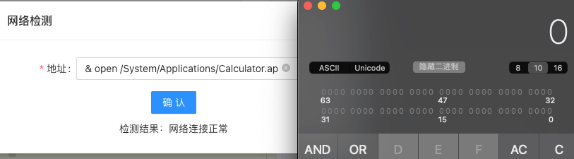
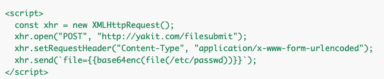

# Yakit 近期漏洞复盘

日期: 2023-08-31 | 原文: <https://mp.weixin.qq.com/s/Z4qoQUmk-woaImnCJ_RXiQ>

最近师傅们提了几个Yakit安全风险的issues，牛牛在这里给大家做一个总结复盘。

Yso-Java Hack

01

由l3yx师傅提出的Yso-Java Hack功能存在 `命令注入` 风险。由于Yso-Java Hack功能是由yaklang实现的，后端通过前端传入数据生成yak代码，再通过执行yak代码生成payload。在构造yak代码时，由于是直接将数据拼接，未做转义处理，导致可以注入任意代码，如图所示：

问题的原因在于前端传入的数据在未预期情况下作为了控制语句处理，所以需要保证用户前端传入的数据在yak的语义中还是`数据`。

## **解决方案：**

## 1、解决方案1是转义用户输入的数据，确保用户数据在yaklang代码中的语义是`string literal`。使用Golang的`strconv.Quote`函数可以将传入的字符串转为`Go string literal`近似作为yaklang的`string literal`使用，但由于yaklang的`string literal`相较于Golang的还有变量渲染、fuzztag渲染等功能等，后续更新版本可能存在基于二者`string literal`差异的绕过利用风险，所以还有方案2。

2、为了确保传入的数据在yaklang虚拟机执行时还是数据，需要这段数据存在于string类型变量中，让数据以`string literal`的形式定义在yaklang代码中是一种方法。除此外还可以在代码执行前将变量导入虚拟机，直接将golang string 转为 yaklang string变量，如下：

网络检测

02

由Git-Again师傅提出**。**为了方便检测本地Yakit和目标连通性，前端基于ping命令实现了网络检测功能，用于前端是直接通过模板字符串生成ping命令，导致可能存在命令注入。

## **解决方案：**

最新版Yakit已经更新为网络诊断功能，支持可配置代理的连通性诊断和dns诊断。

使用远程模式的小伙伴注意下，网络诊断功能是yak引擎实现的，所使用的网络环境也是yak引擎所在主机。

任意文件读取漏洞

03

此漏洞由Medi0cr1ty师傅提出的。已经帮师傅申请了CVE:

https://github.com/yaklang/yaklang/security/advisories/GHSA-xvhg-w6qc-m3qq

## **原因分析:**

由于发起请求的底层_httpPool函数默认会对数据包中的请求进行fuzztag解析，而yak的fuzz库使用了_httpPool函数，导致默认会对请求包中的fuzztag解析。mitm插件的传入参数是镜像的代理流量，很多脚本使用fuzz库对目标进行fuzz，导致了漏洞的产生。

响应流量是目标可控的，但响应流量不会被渲染，所以需要在响应包中发起新的可控的请求，payload如下:

当浏览器发出POST请求时会将请求流量镜像给插件， 插件中调用了fuzz库，导致渲染了请求中的fuzztag，将本机文件信息携带出去。

## **解决方案：**

fuzz库默认关闭_httpPool的fuzztag渲染功能。

总结

04

Yso-Java Hack功能和网络检测功能导致的问题都是self exploit，不会造成真正安全风险，但对于这种未预期的行为可能作为潜在的安全隐患，所以也及时做了修复。对于任意文件读取漏洞，从发布到修复不到一小时（by 劳模V神），师傅们及时更新就好了。

**注意**：师傅们在公网部署引擎时不要偷懒使用空密码，别人连上就能RCE。师傅们也不要随便连未知的引擎，小心被反制（例如在前端调用chrome时从引擎获取到恶意的chrome路径）。
