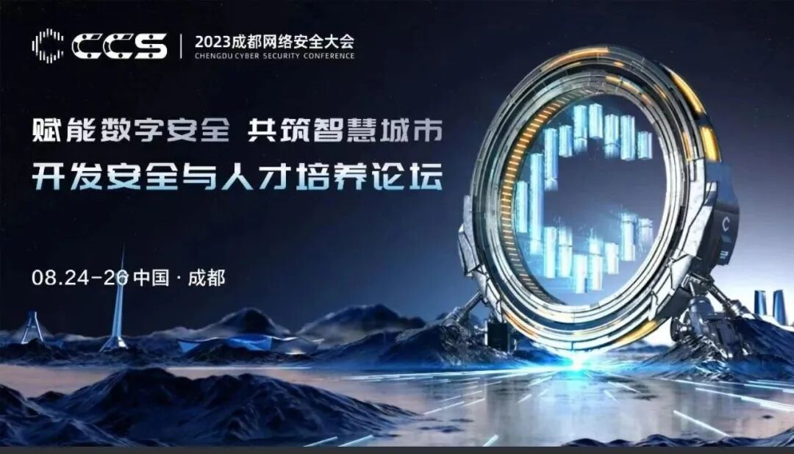
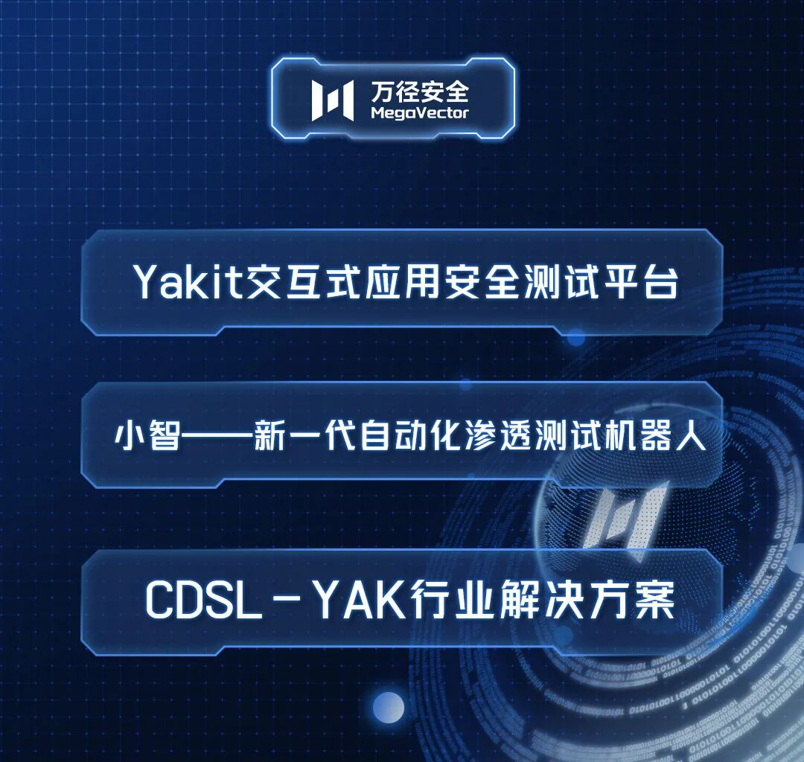
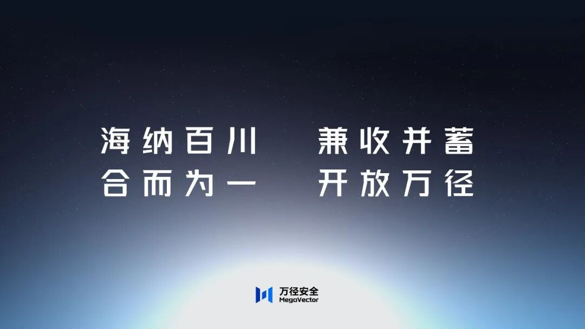
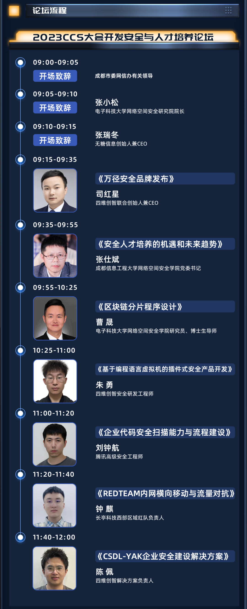

# 《万径安全官宣！赋能网安新未来 》——四维创智CCS开发安全与人才培养分论坛圆满落幕

日期: 2023-08-26 | 原文: <https://mp.weixin.qq.com/s/swd4wbr5RdEkqyLz5UjZUw>

8月26日上午，四维创智承办的CCS成都网络安全大会分论坛—开发安全与人才培养分论坛圆满落幕。

会议聚焦于**人才培养、技术探讨**以及**四维创智新品牌发布**等多个精彩环节，既有基于学术背景的深入研究，又有关于人才教育的行业视角…精彩纷呈，展望未来。

**1突破创新，万径安全品牌发布**

作为本次会议的最重要环节之一，四维创智正式发布了全新的安全品牌——万径安全。

这一崭新品牌的发布，是10年来的一项重大改变。2021年，网络安全领域编程语言YAK诞生，预示着我们的安全能力由“被动需求”转变为了“主动创造”。随着YAK趋于成熟的进程，是时候以新面貌迈向未来了。

万径安全品牌的诞生，将为行业带来全新的安全解决方案，为客户创造更加安全可靠的数字环境。我们也将以开放的姿态，与业内同僚、各行客户相互扶持，共同进步。“让世界更安全，让安全更简单”。

**2当代技术探讨，展望未来安全趋势**

在本次开发安全与人才培养分论坛的技术探讨环节，与会者聚焦于当今安全领域的前沿技术与趋势。各界专家就区块链技术、安全产品开发、企业安全解决方案等议题展开深入研讨，揭示了技术创新在安全保障方面的巨大潜力。同时，与会者们也纷纷展望了未来安全领域可能出现的挑战与应对策略，为业界提供了宝贵的参考。

**3培养未来，探索多元人才之路**

人才培养一直是行业发展的关键环节，本次论坛也不例外。与会者们就如何培养具备创新思维和多元技能的安全人才展开了深入研讨。成都信息工程大学网络空间安全学院党委书记张仕斌强调，要注重安全人才培养的机遇和未来趋势，注重知识体系的构建，同时培养学生的实际动手能力，使他们能够在未来应对各种复杂的安全挑战。

**4回顾与展望，引领安全创新发展**

通过本次开发安全与人才培养分论坛，与会者们不仅汲取了技术与思想的灵感，更见证了一个安全品牌的崭新诞生。四维创智万径安全品牌的发布，为行业注入了新的活力与动力。相信，在新品牌的引领下，四维创智将持续引领安全领域的创新发展，为构建更加安全的数字世界贡献更多力量。
