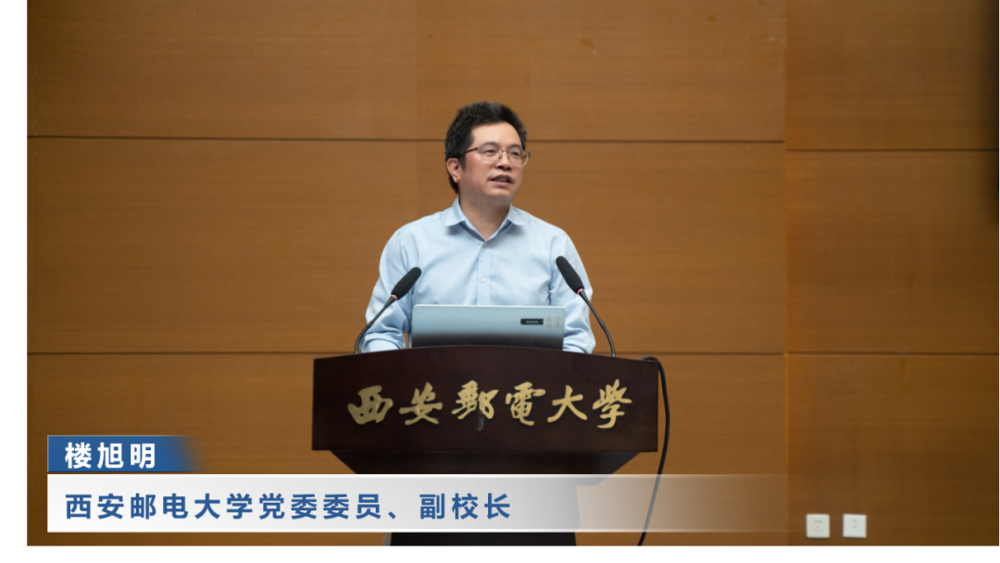
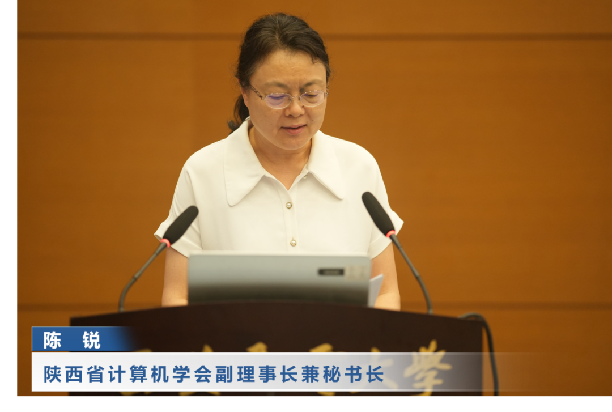
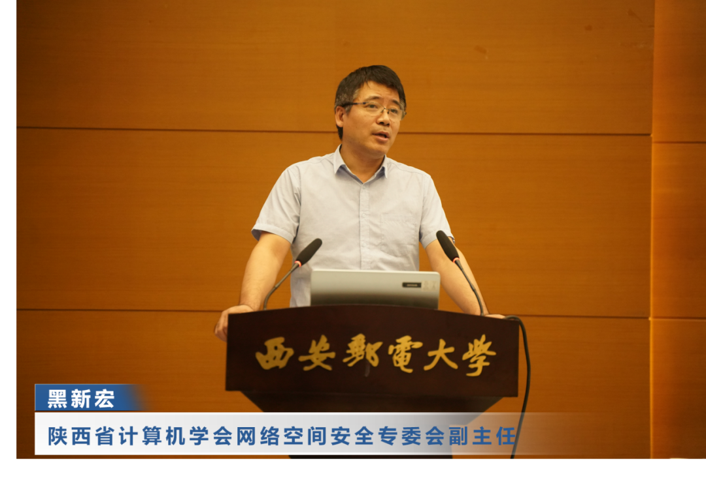
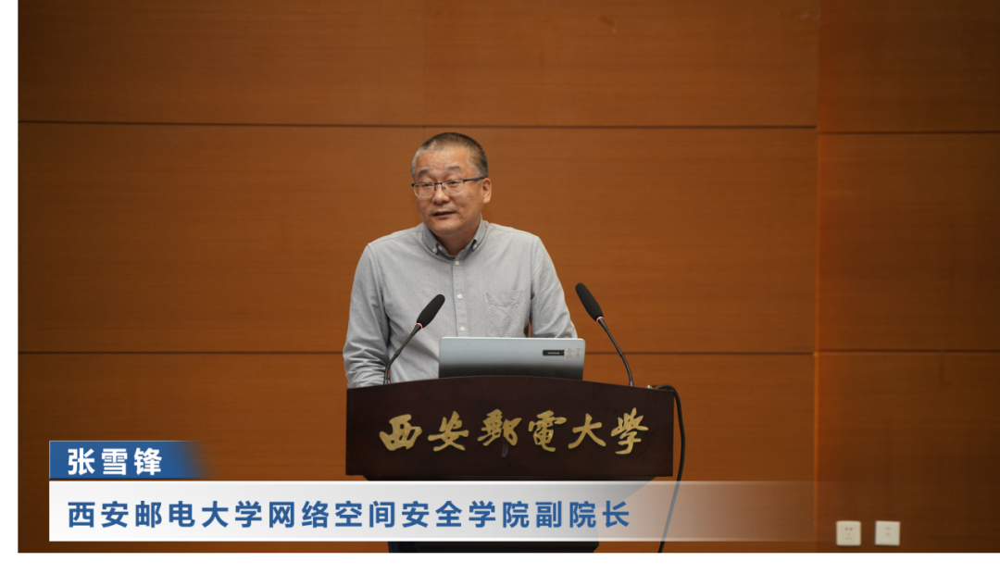
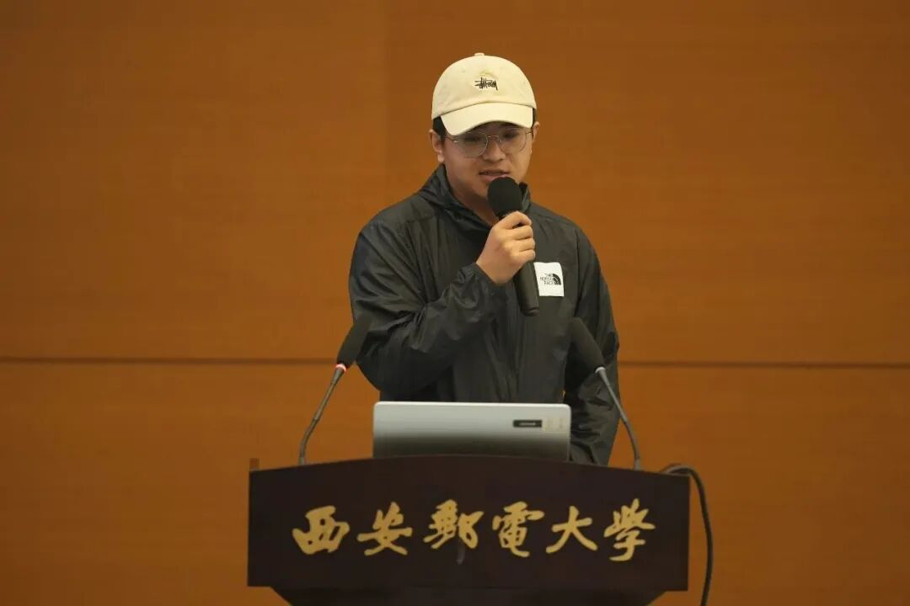
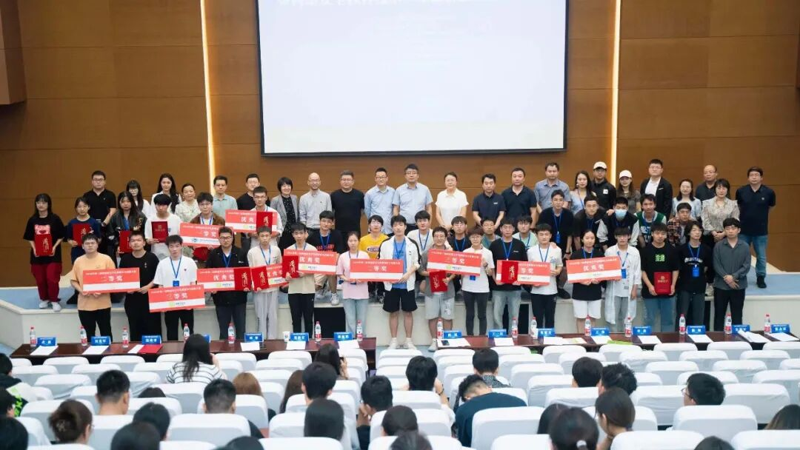

# 助力网络安全产教融合，CDSL-YAK 西安之行！

日期: 2023-06-20 | 原文: <https://mp.weixin.qq.com/s/NPbPLs7YOJvsokkDWYr8iQ>

2023年6月18日，第三届陕西省大学生网络安全技能大赛暨网络安全教育技术产业融合创新发展研讨会在西安邮电大学长安校区逸夫楼报告厅举行。Yaklang.io 安全团队受邀出席了本次会议并进行了“**利用YAK语言推动网络安全教育的创新与发展**”的主题演讲。

会议由西安邮电大学网络空间安全学院副院长**张雪锋**主持，西安邮电大学党委委员、副校长**楼旭明**，陕西省计算机学会副理事长兼秘书长**陈锐**，陕西省计算机学会网络空间安全专委会副主任**黑新宏**，西安四叶草信息技术有限公司高级副总裁**郑玮**为论坛开幕致辞。

论坛围绕党的二十大关于教育、科技、人才工作的重大部署，探讨数字时代下的网络安全人才培养。邀请西安邮电大学网络空间安全学院副院长任方、西安交通大学网络空间安全学院助理教授李前、四叶草安全创研中心教育事业部总监刘伟、奇安信产品安全负责人武鑫、**YAK 解决方案负责人陈佩**分别以《网络空间安全创新型人才培养模式探索》、《人工智能系统对抗安全》、《聚焦场景创新推动网络安全人才培养》、《企业SRC，助力网络安全高技能人才成长》、**《利用YAK推动网络安全教育的创新与发展》**进行主题演讲，陕西区第一名战队队长杨朔进行经验分享。

大赛分为本科高校组和职业院校组，参赛覆盖全国29个省、直辖市、自治区，参赛高校300余所，参赛队伍700多支，参赛人数2000余人。其中本科院校参赛高校200余所，参赛队伍500多支，参赛人数1600余人。大赛为高校营造浓厚的网络安全学习氛围营造了良好的环境，为促进陕西乃至全国高校网络安全学子交流学习搭建了平台。

YAK 展台花絮
