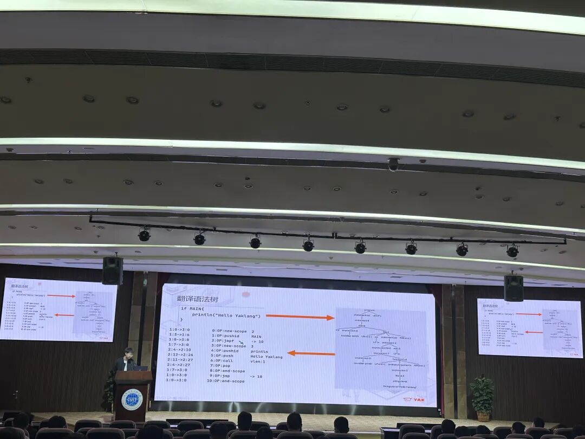
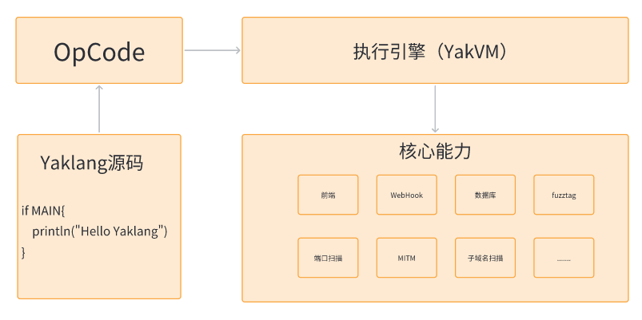
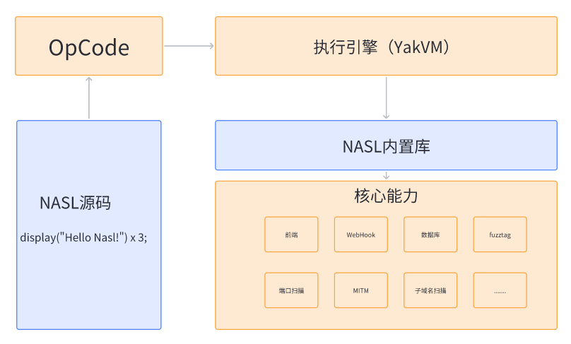
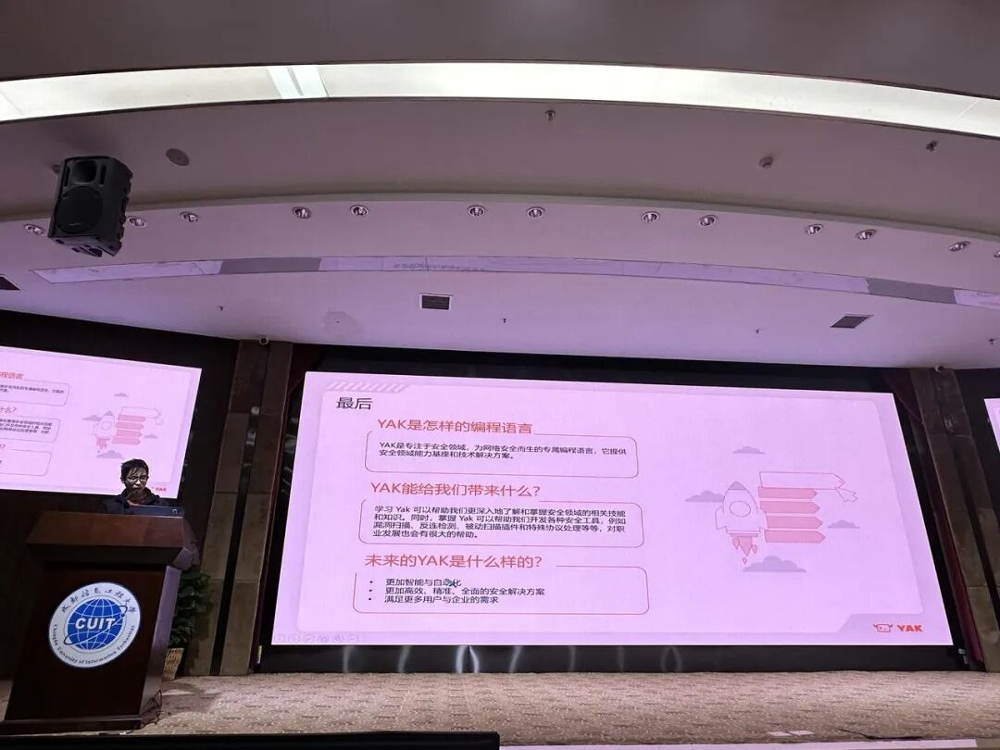

# 惊喜与失望？CDSL-YAK 确实不一样！

日期: 2023-05-11 | 原文: <https://mp.weixin.qq.com/s/2MpGtgpn3ofwclI2aev4Sw>

安全圈小透明 杨仔

5分钟前：

如果一场大雨都不能阻挡学生们对YAK的热情，那这个事儿基本上就稳了。

3月，我们在电子科技大学网络空间安全研究院，进行了第一次YAK的校内宣讲，收到了极佳的反馈，于是，我们准备把【网络安全能力传承】这件事做成一个长期的公益性项目。

5月10日，我们在成都信息工程大学完成了YAK的第二站校内宣讲。

整个宣讲会主要从三个方面全面介绍了YAK的核心能力、技术理念、语法特点以及实践应用，旨在营造高校网络安全技术交流氛围，搭建高校人才技术交流平台，赋能行业人才安全能力建设，希望有更多的学生了解并参与到安全行业中，成为网络安全行业不可或缺的新生力量。

**0**1什么是YAK？**

YAK商业化负责人陈佩@Vanilla 通过带来的议题**《CDSL-YAK：为网络安全而生的专属编程语言》**向大家做出了系统的解答。

**CDSL-YAK：为网络安全而生的领域编程语言**（又称**YakLang**），是由姬锦坤（V1ll4n）开发的一种图灵完备，且易书写、易分发、自主可控的中国首款开源网络安全领域编程语言（英语：Cyber security Domain-Specific Language、CDSL）。目前已实现**安全领域专用模块25+**，**安全领域库专用库函数100+**，**库函数直接可用接口700+**，同时支持**国密体系SM2/SM3/SM4**多种场景算法。

作为一个专门为网络安全领域设计的领域特定语言，YAK语法简单，交互快速，新手10分钟即可轻松上手。独创的模糊测试Fuzztag，可以帮助安全研究人员、安全研发人员、渗透测试人员和其他网络安全专业人员更加高效地编写脚本和工具，提高工作效率和准确性。

YAK 基于 YakVM 运行，语法规则定义了 YakLang 的语言结构，是一个**动态强类型语言**。

1. YakLang 允许用户可以在改变变量的值的时候也改变变量的类型；
2. 在进行表达式运算的时候 YakLang 允许程序或函数识别运行时的准确类型，并进行对应计算；

YakLang 可以 **编译** 为 YakVM 可以支持的字节码运行，可以作为一门“嵌入式语言”被其他语言调用或编译。

**02YAK底层技术是如何实现的？**

YakLang.io团队高级安全开发工程师朱勇@Z3r0ne_通过带来的议题**《基于YakVM的CDSL开发》**，向同学们简单介绍了YakLang的实现原理。

从YAK源码编译成YAK字节码，通过加载依赖到YakVM最后执行结果。YakLang前端实现包括：词法、语法分析、语法树生成，语义分析、中间代码生成；后端实现是一个基于Goalng实现的虚拟机--YakVM，有支持使用协程并发，自动垃圾回收等优势。与Golang可以无缝衔接，轻松实现混合编程。

YakVM可以直接调用YAK项目的核心能力库，基于YakVM实现的YaLang可以将基本的安全能力自然的整合，让开发者可以只关注于漏洞逻辑编写。

而基于YakVM实现的NASL语言引擎，只需要实现编译器和NASL内置库。NASL内置库可以基于YAK的核心能力进行开发。

**03YAK究竟能给信息安全学子们带来什么？**

## 学YAK可以帮助我们更深入地了解和掌握安全领域的相关技能和知识。同时，掌握YAK可以帮助我们开发各种安全工具，例如漏洞扫描、反连检测、被动扫描插件和特殊协议处理等等，对职业发展也会有很大的帮助。

## -- by Longlone

与YAK相识一周年的成都信息工程大学学子Longlone还说：“初实YAK，有惊喜也有失望！”

最大的惊喜在于Yakit 的 WebFuzzer。在BurpSuite中，Repeater 和 Intruder 是两个分开的独立模块，当我们需要对一个网站进行大量的发包测试时，设置 Intruder 的过程时常让我感到很烦恼。但是Yakit 却开创性地将这两个模块结合在了一起。

第二个让我感到惊喜的是插件商店（前模块管理器）。了解过Burpsuite的小伙伴可能知道，为Burpsuite编写一个插件是很麻烦的，但是 Yakit 不一样，现在我只需要花10分钟学习一下YAK语法，就可以为 Yakit 编写一个插件，十分方便与快捷。

但是我也发现了 Yakit 的一些缺点，比如说UI设计存在一些问题，经常会碰见的端口监听器的显示BUG。

**YAK 作者想说**

## 我们从不掩饰自己的缺点，因为我们深知，只有在技术上的不断拔高才能换来世人的尊重。我们不卖产品，不卖课程，我们只想听到来自学生们、来自YAK用户们最真实的声音！

YAK是不是真的有这么牛逼我无法评价，但我能告诉大家的是，我们想做一件很酷的事，也是一件难而正确的事，YakLang.io团队将永远秉持其自由、开放、共享的黑客精神，永远身怀对网络安全行业不变的热情。只要你在，我们就一直在！

**Yaklang v1.2.1 重要更新**

1. 优化 Yaklang 数据库的功能，自动检测索引添加，缓解一定程度数据库被锁的问题

2. MITM 新增 hijackResponseEx 可以把 Request(Bytes) 也传入

3. 修复 nuclei.Scan 返回值的问题，新增 ScanAuto 兼容新的代码风格

4. 新增 hids cpu mem 监控

5. 优化 xgrpc server 的 tunnels 注册问题

6. 新增 jsonpath 对模糊测试优化的接口

7. Fuzz 模块支持 JSON 深度的 Get Post 中参数的测试
