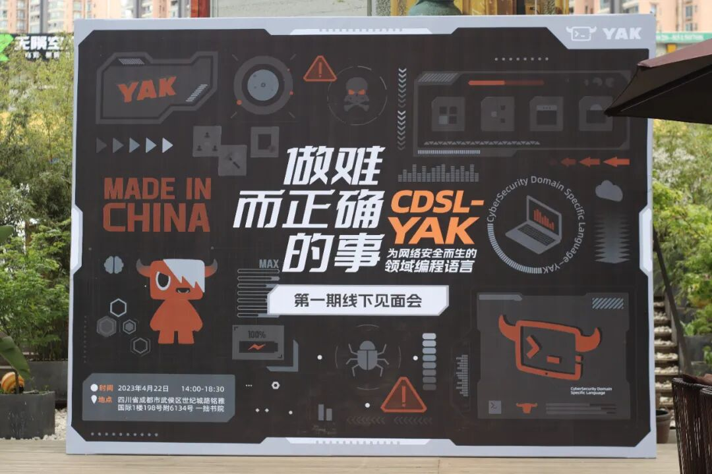
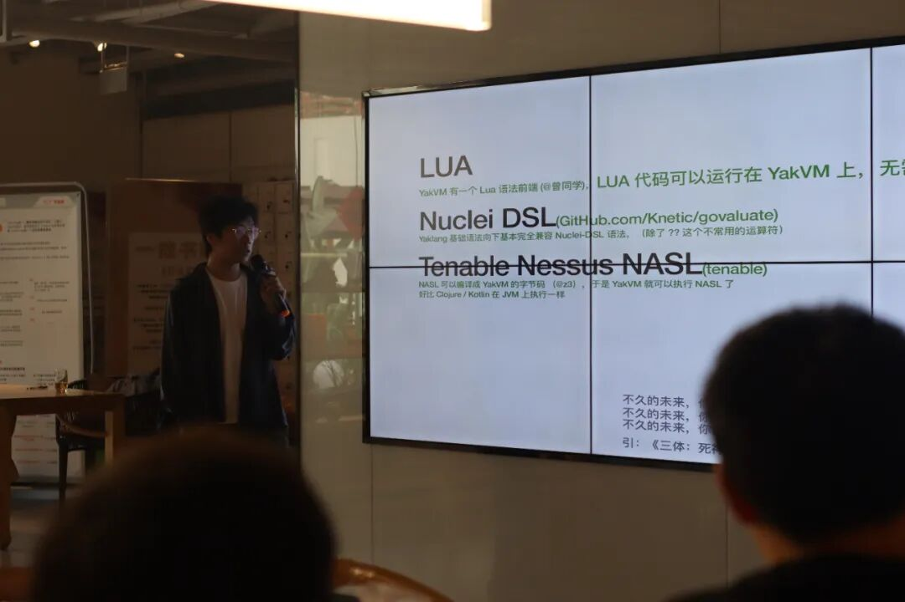
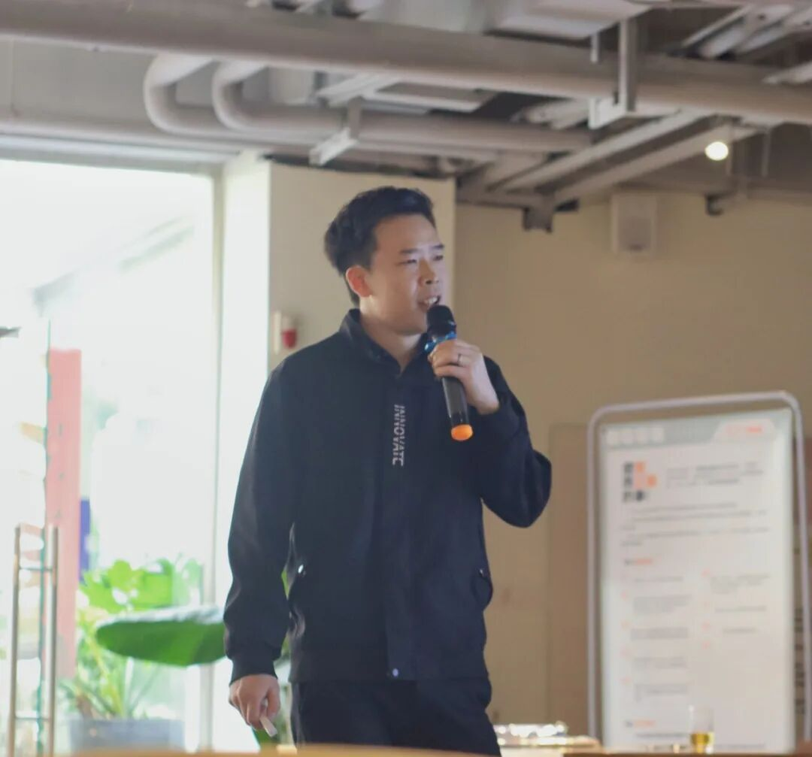
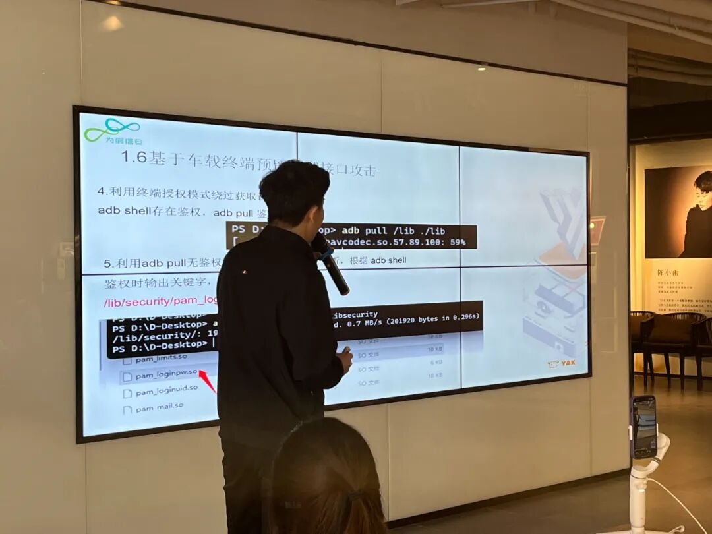
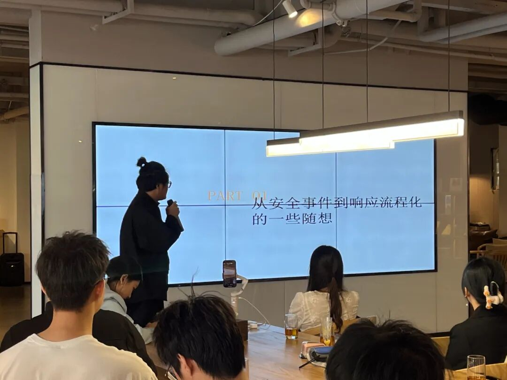
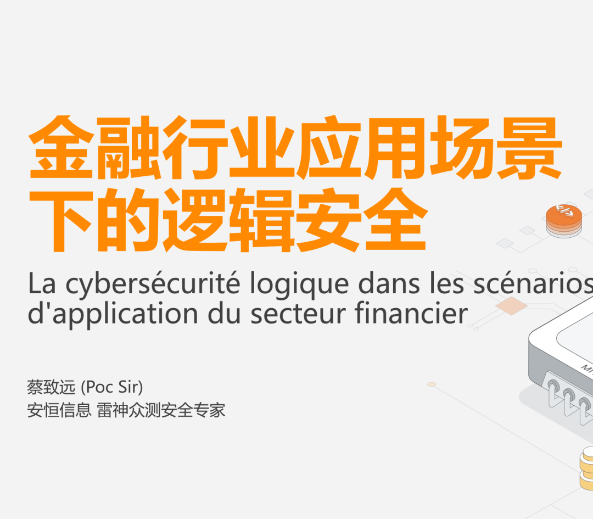

# “做难而正确的事”YAK第一期见面会圆满结束啦！

日期: 2023-04-23 | 原文: <https://mp.weixin.qq.com/s/BR_K4ZwcfVrlTHchvaA65A>

4月22日

YAK第一期线下见面会于成都如期举办

众多技术爱好者、网络安全玩家齐聚成都

分享各自的技术观点

探讨安全行业的热门话题

现场交流氛围良好

嘉宾议题精彩多元

**聚焦行业洞察促进技术共享**

让思维在YAK见面会上得到交织碰撞

精彩回顾

各位没能到现场的师傅们不用遗憾啦

你们想要的议题内容、现场照片都在这里！

2023

YAK旅程伊始

见面会开始，各位Yaker熟知的YAK作者@V1ll4n V师傅向各位前来参加活动的师傅们表达了欢迎和感谢，并和大家分享了**Yaklang&YakVM编译技术及原理**。

**初识YAK，了解YAK中无处不在的基础规律：**

> • Yak Runner 的代码补全和语法检查依赖 Yak 对 AST 和 VM 的控制• Fuzztag 利⽤ PDA(Push-Down Automaton) 技术解析语法，编译节点，再执⾏• Yaklang 多种“朴实⽆华”融合语⾔特性对编译原理前后端都有⾼要求• YakVM 执⾏ Yak 字节码，以任何形式编译，加密和混淆你的代码

**未来可期，安全能力的强化一直正在进行中**

> 不久的未来，你甚⾄可以在Yakit 的 Web Fuzzer 中调试 Nuclei 插件不久的未来，你甚⾄可以在Yakit 中直接调⽤ Nessus 的扫描脚本 不久的未来，你甚⾄可以在Yakit 中使⽤ Nmap - NSE 脚本

多元议题内容

技术交织碰撞

本次YAK线下见面会，我们十分荣幸的邀请到了5位嘉宾到场，和大家分享他们近期的技术研究，与现场的各位技术爱好者共同探讨当下网络安全领域不同方向的研究和思考。

首先是来自**Yaklang.io团队的核心研发成员朱勇@Z3r0ne_为大家介绍的《基于YakVM的CDSL开发》**

众所周知，Nessus Attack Scripting Language是一个老牌的安全领域语言，有过千的脚本，非常适合做漏洞检测、合规管理等。其实，通过实现NASL的前端，翻译成YAKVM的字节码，就可以使用YAK执行NASL脚本，从而借用NASL丰富的生态。

Z3师傅本次带来的分享**以NASL语言为例介绍如何基于YakVM实现一门安全领域语言，同时融合YAK的底层安全能力实现更高效的安全开发。**

来自**ChaMd5安全团队，同时也是为辰安全实验室负责人的Thanos.王志鹏**师傅则是跟大家分享了其近期针对**《智能汽车攻击路径与信息安全脆弱点剖析》**的研究内容。

在智能汽车飞速发展的当下，该领域的信息安全问题也正在面临各种严峻考验@Thanos.从**云、管、端、业务四个维度对智能汽车常见的攻击路径及薄弱点进行了分析与分享**。构建多元化探讨视角，让各位行业伙伴有机会了解不同领域和方向的信息安全问题。

#智能汽车攻击路径#

“安全运营乃至整个安全行业的痛点是SOC的平台化、流程化、自动化…从事件发生到响应闭环，需要频繁的操作处理且难以量化价值。”

**前启明星辰安全研究员左松林**基于此现状进行了诸多调研，逐步生成了一套基于流程的同步启动、异步进行式响应流程，并在本次YAK见面会现场与各位师傅们进行了面对面交流探讨。

现阶段，我们即将跨入Web3时代的新阶段，新阶段必将同时带来机会与挑战，而信息安全问题正是Web3时代尤为突出的严峻考验，提前了解**Web3时代下的网络安全风险点，有助于我们更从容的应对各种攻击手法降低损失和影响。**

茶歇时间过后，**国外某头部exchange安全团队成员蒋晓辉**在现场与各位行业伙伴们分享了他的研究内容。

最后，远道而来专程赴约的**安恒信息安全专家Poc Sir蔡致远分享了他在金融行业体系下的安全问题研究—《金融行业应用场景下的逻辑安全》**

站在应用场景的宏观视角，从研发底层思维出发探索金融安全下的逻辑漏洞测试方法论，让逻辑漏洞无处遁形。

#精彩的瞬间#

！！本次议题分享的全部内容，**点击文末【阅读原文】**or后台回复“**YAK见面会议题**”即可获得全部完整版PPT！！

敬请期待！

YAK即将正式开源

**YAK会全面开源**，是我们一开始就承诺大家的。

开源也不仅仅是一句口号，是为了让技术共享，让思维碰撞；为这个行业，为行业伙伴们做些有意义、真正能帮助大家解决问题的事情。**我们计划于5月30日在国家会议中心正式发布YAK语言开源**，让更多的人关注到YAK、了解YAK、而后能够通过使用YAK创造出更多好用的生产工具，为网络安全生态共建贡献自己的一份力量。

因此，本次线下见面会也算是正式发布YAK之前，我们与用户朋友们的首次面对面交流，非常感谢大家百忙之中到场支持，各位师傅对YAK/Yakit的需求和建议对我们来说是十分珍贵的，所以，YAK线下见面会接下来也会继续举办，期待未来在不同的城市与各位师傅们成功面基！
