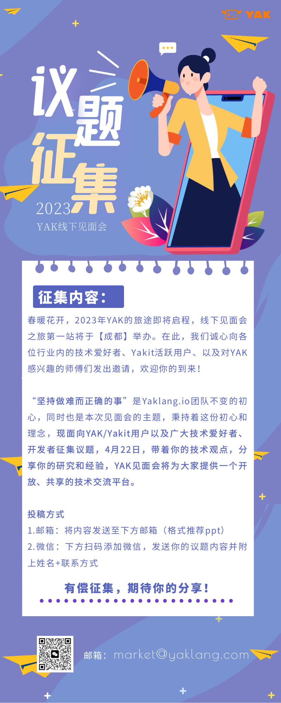

# 征集令！YAK第一期线下见面会议题征集ing

日期: 2023-04-12 | 原文: <https://mp.weixin.qq.com/s/QqOwNZzJH0ZsGmM7STBpkQ>

01

YAK.成都

基于安全融合的理念，Yaklang.io团队联合电子科技大学网络空间安全研究院合作开发了安全领域垂直语言Yaklang，它--**“图灵完备”、适用于网络安全、致力于安全能力融合。YAK开源**，是我们一开始就承诺大家的。开源也不仅仅是一句口号，是为了让技术共享，让思维有效碰撞。我们计划于5月30日在国家会议中心正式发布YAK语言开源。也让更多的人关注YAK、了解YAK。

在此之前，我们还想和用户朋友们进行一次走心的交谈，所以决定于4月22日（下周六）在**成都**举办第一期**YAK线下见面会**，在此，我们诚心向各位行业内的技术爱好者、Yakit活跃用户、以及对YAK感兴趣的师傅们发出邀请，期待您的到来！

（本次见面会活动的具体信息，后续将通过公众号发布，点个关注不错过）

02

议题征集

正如Yaklang.io团队“自由、开放、共享”的精神一样，在议题的选择上，只要您想分享的内容与YAK及网络安全领域相关，我们都愿意听见你的声音。

（投稿方式详见上图，有问题也可私信留言）
