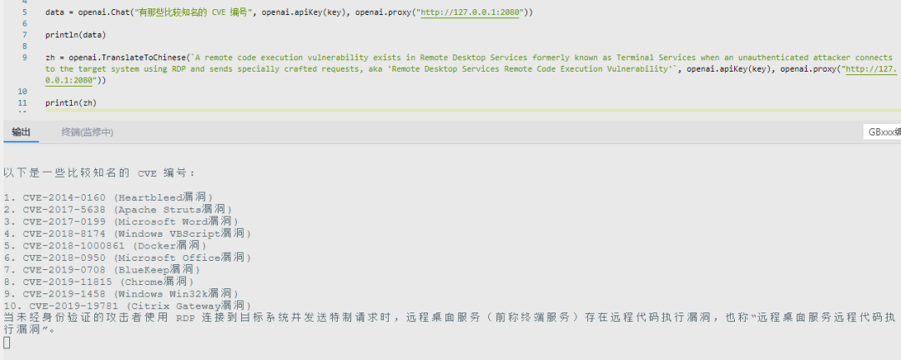
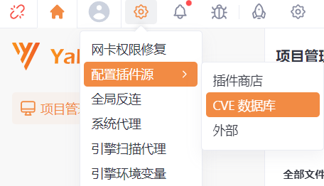
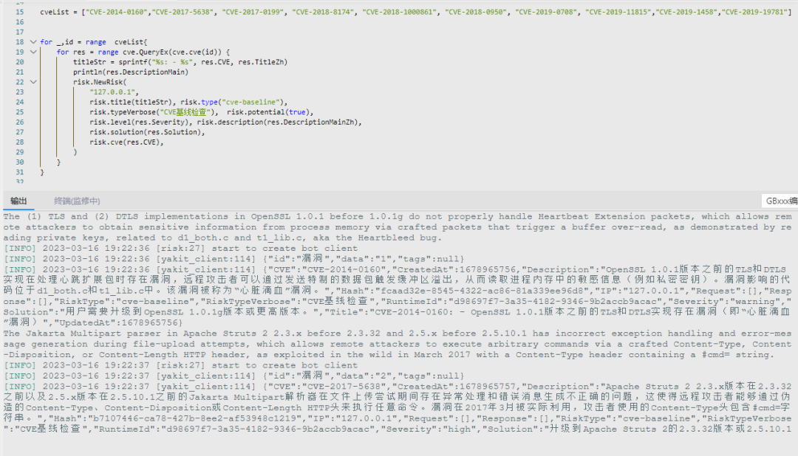
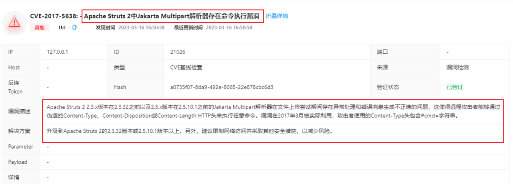
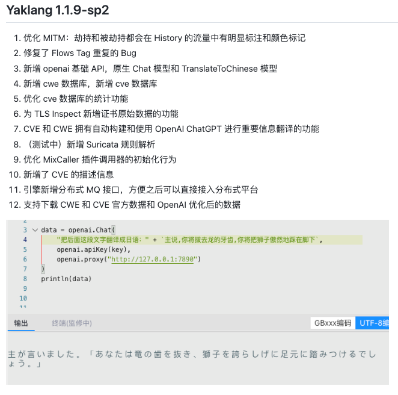

# Yaklang能力再提升！提供更好的中文漏洞信息展示

日期: 2023-03-17 | 原文: <https://mp.weixin.qq.com/s/Yvo71d0UHuijpNO_tqI4LQ>

漏洞信息展示是软件安全评估和管理过程中非常重要的一环，它可以帮助团队**更好地理解和解决软件中的安全问题**，**加快修复速度**，**减少沟通成本**并改进流程和工具。

CVE 是英文"*Common Vulnerabilities and Exposures*"的缩写，中文意为"公共漏洞和暴露"。它是一个全球通用的安全漏洞命名规范。每个 CVE ID 都是一个唯一的标识符，用于标识互联网上公开披露的计算机系统或软件产品中的漏洞或安全问题。CVE 的目的是为了帮助计算机安全专业人员更好地识别、报告和共享各种漏洞信息，以便尽快解决这些漏洞并提高网络的安全性。同时，CVE 还可以使不同厂商和组织之间的漏洞信息共享和交流更加简单和方便。

CWE 是 *Common Weakness Enumeration*（常见弱点枚举）的缩写，它是一种用于标识和分类软件安全问题的系统。CWE 主要关注软件中的弱点和安全漏洞，例如缓冲区溢出、代码注入、跨站点脚本攻击等。CWE 使用一个唯一的标识符来标识每个已知的软件安全问题，并提供详细的描述、示例和建议措施，以帮助开发人员和安全专业人员识别和修复这些问题。

**长久以来CVE 的使用场景主要包括以下几个方面：**

1. **漏洞管理和修复：**企业和组织可以通过查询 CVE 数据库，了解自身系统或应用中存在的漏洞，及时采取措施进行修复，提高网络安全性。
2. **安全风险评估：**信息安全专业人员可以借助 CVE 数据库，对某个系统或产品的安全风险进行评估和分析，从而制定相应的安全策略和措施。
3. **漏洞研究和开发：**安全研究人员可以利用 CVE 数据库中的已公开漏洞信息，进行相关漏洞研究和开发工作，推动整个行业的技术进步。
4. **安全培训和教育：**安全从业人员可以通过学习 CVE 数据库中的漏洞信息和解决方案，提高自己的安全意识和技能水平，从而更好地保护企业和用户的信息安全。

对于我们来说，可能 CVE 唯一 "美中不足"的就是**没有中文描述、标题等信息了。对此，我们想到了，最强工具人——ChatGPT！**

01

利用ChatGPT进行CVE、CWE相关信息的翻译

我们提供了两个接口，分别是"**原生 Chat 接口**"和 "**TranslateToChinese 接口**"。

只需提供一个Apikey和必要的网络连通性，就可以进行简单的提问了，提升一点功能性的同时也增加一点趣味性

。如下图，进行简单提问和翻译到中文的接口使用：

02

支持下载OpenAI优化后的CWE和CVE官方数据

通过 Chatgpt 对漏洞信息进行提炼，总结出**漏洞标题**，**漏洞描述**以及漏洞的**修复建议。**我们生成了一个**包含中英文信息的 CVE、CWE 数据库**。

在**新版 Yakit** 中，我们可以通过下面的按钮，将数据库文件(default-cve.db.gzip)下载到本地。

注：翻译过程中也还是存在一些坑点的，比如：即使对 Chatgpt 强调返回 JSON 格式，它还是偶尔会输出干扰字符串(gpt-4好像不存在这种问题?)，我们的解决方式是，使用之前曾经提到过的 JSON 字符串提取功能。

03

新增CVE中文描述信息和前端展示

随后我们就可以通过提供的cve接口，对CVEID进行查询了。

如下图，我们根据chatgpt返回的它认为比较知名的CVEID，进行漏洞信息的查询，为了方便查看，这里使用risk.NewRisk保存这些 `CVEID` 的漏洞信息。

同时我们也新增了两个漏洞字段，分别通过risk.description("漏洞描述")和risk.solution("漏洞修复建议")对漏洞信息进行补充

随后在漏洞风险中进行查看，可以明显感觉到让 Chatgpt总结的标题、漏洞描述、解决方案还是十分不错的，不会出现类似"春天靴子(Spring Boot)" 这样的耿直翻译……

并且CVE和CWE信息拥有**自动构建和使用 OpenAl ChatGPT 进行重要信息翻译的功能**，后续有新的 CVE 出现，数据库也会随之更新。

本次更新，有助于解决**中文漏洞信息展示方面存在的挑战和问题**。

通过提供更好的中文漏洞信息展示功能，Yaklang 可以帮助安全专业人员、开发人员和其他相关方面更好地识别、理解和解决软件中的安全问题，**提高团队工作效率**和**软件质量**，为广大用户提供更加安全可靠的产品和服务。

往期回顾

01

[安全研发启蒙课：合理使用协程优化YAK插件](http://mp.weixin.qq.com/s?__biz=Mzk0MTM4NzIxMQ==&mid=2247494401&idx=1&sn=d6270f749fbb1d27b786d41c1d7cafa2&chksm=c2d197a5f5a61eb378f1e25a1f65ed2e3fdc8ad4201563670beb83a7723000605996fdab7fd5&scene=21#wechat_redirect)

02

[“诅咒”一颗50光年外的恒星](http://mp.weixin.qq.com/s?__biz=Mzk0MTM4NzIxMQ==&mid=2247493158&idx=1&sn=f3dc2e2a386e50cbba073f724ea39d14&chksm=c2d19a82f5a6139440188415f588fe9c8e8d871389786759540b5218fce6caae48ca0e2beccd&scene=21#wechat_redirect)

03

[使用 Fuzztag 一键爆破反序列化链2.0](http://mp.weixin.qq.com/s?__biz=Mzk0MTM4NzIxMQ==&mid=2247492569&idx=1&sn=6abc07e30721102756bfd8d3a1a62770&chksm=c2d19f7df5a6166bd79e8d098dfba640997b6ba69e8980400054bc8181375cdedff891e4bf64&scene=21#wechat_redirect)
