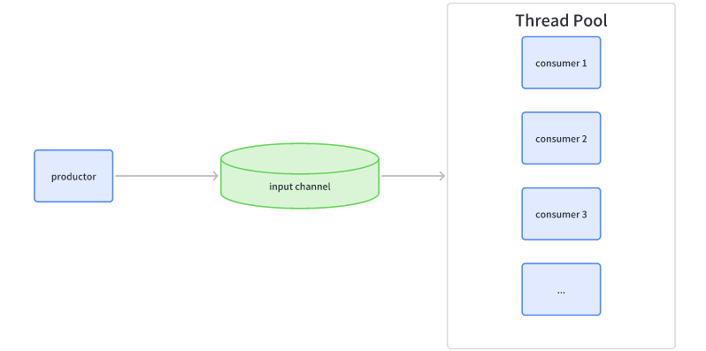
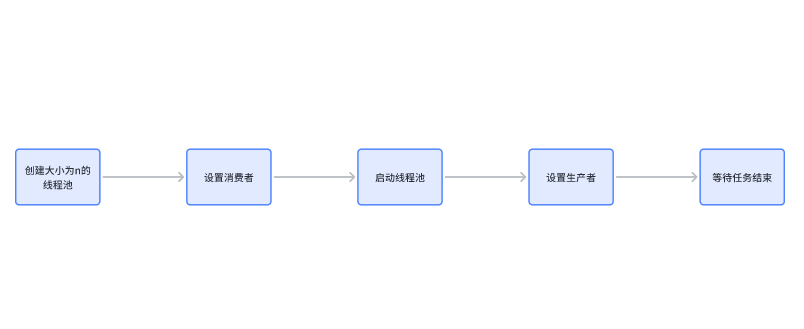
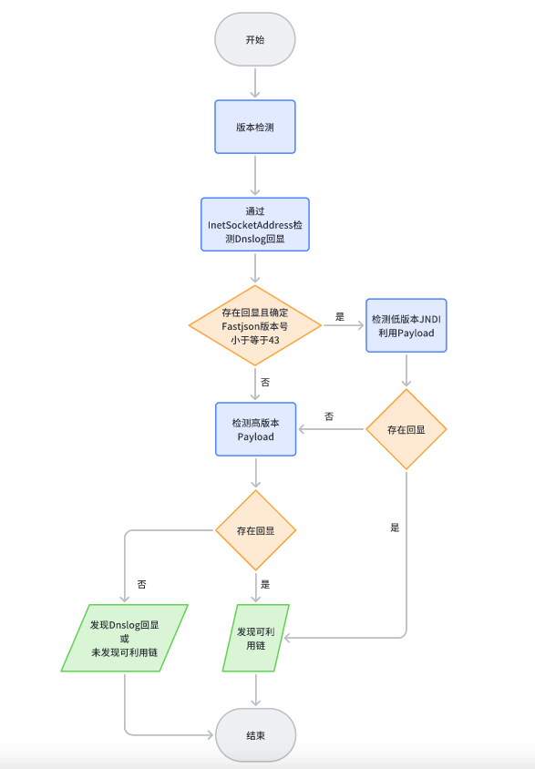

# 安全研发启蒙课：合理使用协程优化YAK插件

日期: 2023-03-10 | 原文: <https://mp.weixin.qq.com/s/FiGz4FrMOHijtUREZdkRmA>

背景

协程是一种轻量级的线程，可以在单个线程中实现并发执行。与线程不同的是，协程之间的切换成本非常低，可以在不阻塞线程的情况下实现高并发，非常适合用在漏洞扫描等需要高并发的场景。

Yaklang支持通过go关键字创建协程，与go类似。但是对于没学过golang的同学来说还是有上手难度的，所以本篇文章就介绍下**如何简化在一些基础场景下协程的使用。**

01

协程池

类比线程池我们可以使用Yaklang写一个简单的协程池，我们使用生产者-消费者模式来实现。

一般在YAK插件中发包场景对并发有需求，由于只有发包过程是网络IO，所以我们使用一个生产者对应多个消费者，如下:



代码如下:

```javascript
NewThreadPool = func(size){
    inputChan = make(chan var)
    var consumer
    wg = sync.NewWaitGroup()
    threadPool = {
        "consumer":f =>{
            consumer = (id,data)=>{
                try {
                    f(id, data)
                } catch err {
                    log.warn("run consumer error: %v"%err)
                }
            }
            return threadPool
        },
        "productor":f=>{
            try {
                f(inputChan)
            } catch err {
                log.warn("run productor error: %v"%err)
            }
            return threadPool
        },
        "start":()=>{
            for id = range size{
                wg.Add(1)
                go func(id){
                    for data in inputChan{
                        if consumer{
                            consumer(id,data)
                        }else{
                            log.warn("not set consumer for data: %v"%data)
                        }
                    }
                    wg.Done()
                }(id)
            }
            return threadPool
        },
        "wait":()=>{
            close(inputChan)
            wg.Wait()
        }
    }
    return threadPool
}

pool = NewThreadPool(10).consumer((id,data)=>{
    println(data)
}).start()

pool.productor((c)=>{
    c <- "data"
})
pool.closeInputChan()
pool.wait()
```

`NewThreadPool`函数参数是线程数量，返回的是一个对象，这个对象包含以下几个方法：

- `consumer`: 用于设置任务处理函数，即消费者，通过该方法传递一个函数，该函数用于处理从输入通道中读取的任务数据；
- `productor`: 用于设置任务生成函数，即生产者，通过该方法传递一个函数，该函数用于向输入通道中写入任务数据；
- `start`: 用于启动线程池，即开始从输入通道中读取任务数据，并交给任务处理函数处理；
- `wait`: 用于等待所有任务处理完成，即等待所有线程执行完毕。

使用流程大概如下，线性的流程很简单:



02

优化Fastjson插件

先回顾下 Fastjson 插件的检测逻辑：



流程中有三次需要发送Payload，第一次通过InetSocketAddress检测Dnslog回显，第二次测试低版本Payload，第三次测试高版本Payload。我们可以使用协程池对这三次发包过程进行优化。

部分代码如下:

```javascript
pool = NewThreadPool(10) // 10个线程
pool.consumer((id,data)=>{ // 每次从任务管道读取到任务后都会调用 consumer
    ok = sendPayload(data...) // sendPayload是发包函数，这里的 data 是数组，使用...可以对数组解包作为参数
    if ok{
        yakit.Info("目标存在漏洞")
    }
}).start()// 设置线程数和consumer后启动
pool.productor(c=>{
    for _,dnslogPayload = range dnslogPayloads{
        c <- [dnslogPayload,true] // 需要检测的目标放进任务管道
    }
})
pool.wait() // 等待任务完成
yakit.Info("扫描结束")
```

完整代码**已经在Yakit插件商店更新**，有需要学习或使用的可以直接去插件商店直接下载。

03

总结

对于一些频繁需要发包操作的插件，我们可以通过协程去实现并发操作，来优化插件的使用体验，对于使用协程不太熟悉的同学可以使用例子中使用的协程池操作。


往期推荐


[“诅咒”一颗50光年外的恒星](http://mp.weixin.qq.com/s?__biz=Mzk0MTM4NzIxMQ==&mid=2247493158&idx=1&sn=f3dc2e2a386e50cbba073f724ea39d14&chksm=c2d19a82f5a6139440188415f588fe9c8e8d871389786759540b5218fce6caae48ca0e2beccd&scene=21#wechat_redirect)


[实用技巧|渗透测试中的流量修改](http://mp.weixin.qq.com/s?__biz=Mzk0MTM4NzIxMQ==&mid=2247492722&idx=1&sn=6b3bf424ef6489e0c2f347c08f62534d&chksm=c2d198d6f5a611c044c0ce626f0eb2bbda6b69a6303c05acde2e992da78cf0242273f2cc6f89&scene=21#wechat_redirect)


[使用 Fuzztag 一键爆破反序列化链2.0](http://mp.weixin.qq.com/s?__biz=Mzk0MTM4NzIxMQ==&mid=2247492569&idx=1&sn=6abc07e30721102756bfd8d3a1a62770&chksm=c2d19f7df5a6166bd79e8d098dfba640997b6ba69e8980400054bc8181375cdedff891e4bf64&scene=21#wechat_redirect)
