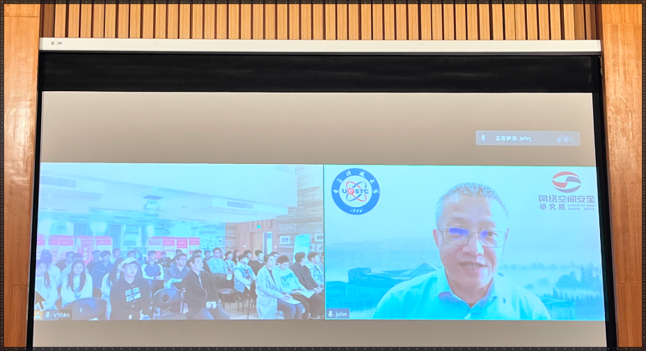
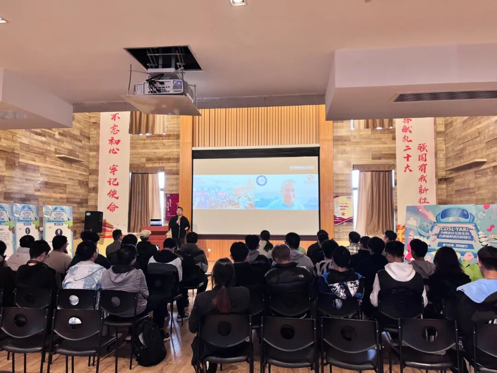
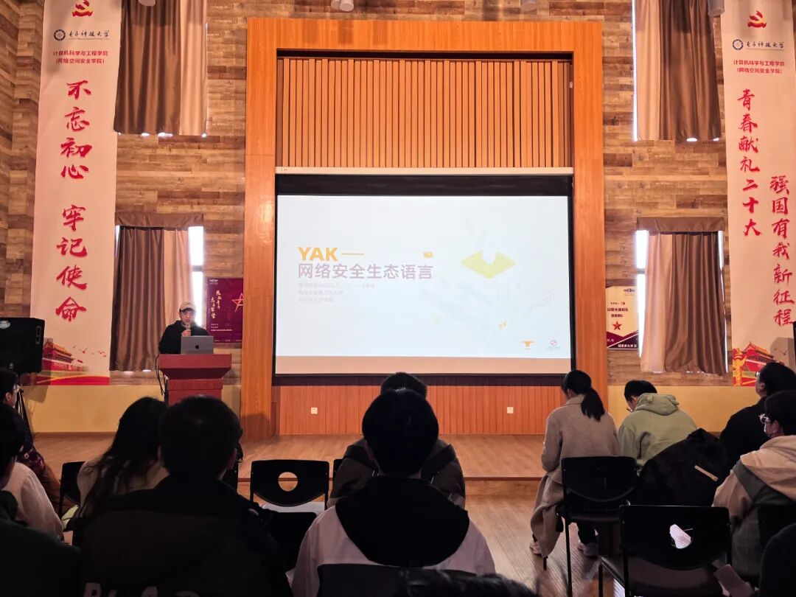
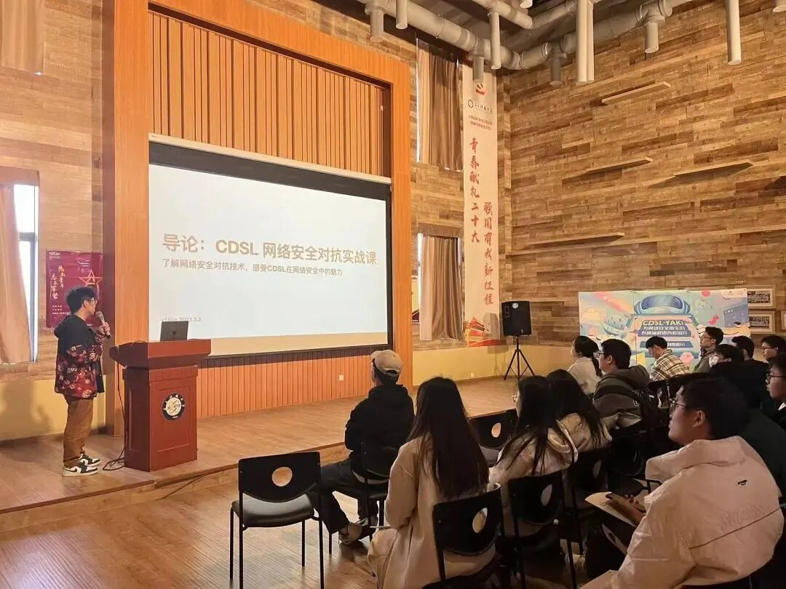

# 【能力传承，向梦而行】CDSL-YAK电子科技大学校园行

日期: 2023-03-03 | 原文: <https://mp.weixin.qq.com/s/6OYY4ngYHqxnx7PQ0tc2iw>

能力传承，向梦而行

3月3日，电子科技大学网络空间安全研究院携手Yaklang.io团队，首次带领**网络安全领域专属编程语言CDSL-YAK**走进高校校园，面向23级图灵班学生全面介绍了YAK的核心能力、技术理念、语法特点以及实践应用，旨在营造高校网络安全技术交流氛围，搭建高校人才技术交流平台，赋能行业人才安全能力建设，希望有更多的学生了解并参与到安全行业中，成为网络安全的新生力量，为构建网络空间命运共同体添砖加瓦。

## CDSL-YAK: 为网络安全而生的专属编程语言 校园行

**分享行业前沿技术，赋能行业人才建设**

# 本次宣讲会，电子科技大学网络空间安全研究院院长**张小松**，远程连线致辞，肯定了YAK的技术前瞻，认可其在教育领域的正向积极意义。计算机学科与工程学院副院长肖鸣宇出席本次宣讲会现场并发言致辞。

Yaklang.io团队成员、YAK商业化负责人陈佩@Vanilla带来了**《CDSL-YAK：为网络安全而生的专属编程语言》**主题宣讲，向学生们介绍了Yaklang使用图灵完备特性融合原子化的安全能力。

现场，凝聚工作室核心成员同时也是YAK语言的作者姬锦坤@V1ll4n向学生们介绍了**网络安全领域专属编程语言YAK的核心技术理念以及Yaklang的语法特性以及编程实战**。

**CDSL-YAK：为网络安全而生的专属编程语言**

随着技术的发展进步，面对范围更广、技术更强、危害更大的新型网络进攻手段，新安全工具的开发与应用尤为重要。如今，大量的安全从业者使用了不同的开发语言开发出了大量功能趋同的安全能力，这种造轮子现状一是浪费了大量的人力物力，二是阻碍了优秀产品产出。

解决上述问题，我们可以使用领域特定语言（DSL）的图灵完备特性，把安全能力进行合理的编排与融合。这种思路在计算机科学届已经得到了良好的验证，比如数学与实验领域 MATLAB、科学计算领域的 Julia 等，通过图灵完备的特性可以急速提升研发效率和效果。

**CDSL（CyberSecurity Domain Specific Language）-YAK正是由网络空间安全研究院创建的“凝聚工作室”核心成员牵头发起，持续多年研发出的国内首款开源网络安全领域专用编程语言。**

因此，YAK对于行业储备人才即高校学生来说，是非常重要的基础能力，Yaklang.io联合电子科技大学网络空间安全研究院，希望通过高校窗口，向学生介绍Yaklang语言的基础语法、核心能力、专利技术、实战应用等。旨在提升学生的技术实力、夯实专业基础，赋能网络安全行业人才建设，为培养网络安全人才架起学校与企业之间的桥梁。

**凝聚力量，共筑网络空间命运共同体**

电子科技大学网络空间安全研究院是国内最早系统性开展计算机系统与网络安全研究的单位之一，始终以“面向国际学术前沿，服务国家重大战略”为使命，紧密围绕保障国家重要设施信息安全和数字经济转型的战略需求，在主动网络安全技术领域持续开展基础性、系统性、开拓性的探索研究和应用实践。

由网络空间安全研究院创建的“凝聚工作室”历经多年的技术积累以及人才队伍的不断扩大，在工作室核心成员的带领下，现已成立核心研发团队Yaklang.io，团队承诺，始终坚持做**“难而正确的事”**，其**自由、开放、共享**的精神是团队对行业不变的热情。

“网络空间的竞争，归根结底是人才竞争”当前，网络安全行业人才匮乏，网络安全人才培养尤为重要，电子科技大学网络空间安全研究院和Yaklang.io团队希望能够在向行业输出优秀的安全能力同时，为行业内前沿技术交流和人才培养贡献力量，通过YAK语言的图灵完备及其高效的研发能力，让行业学子拥有竞争力强的技术实力，打造属于自己的安全利刃，为国家与社会培养网络安全人才，为国家网络安全保驾护航。
