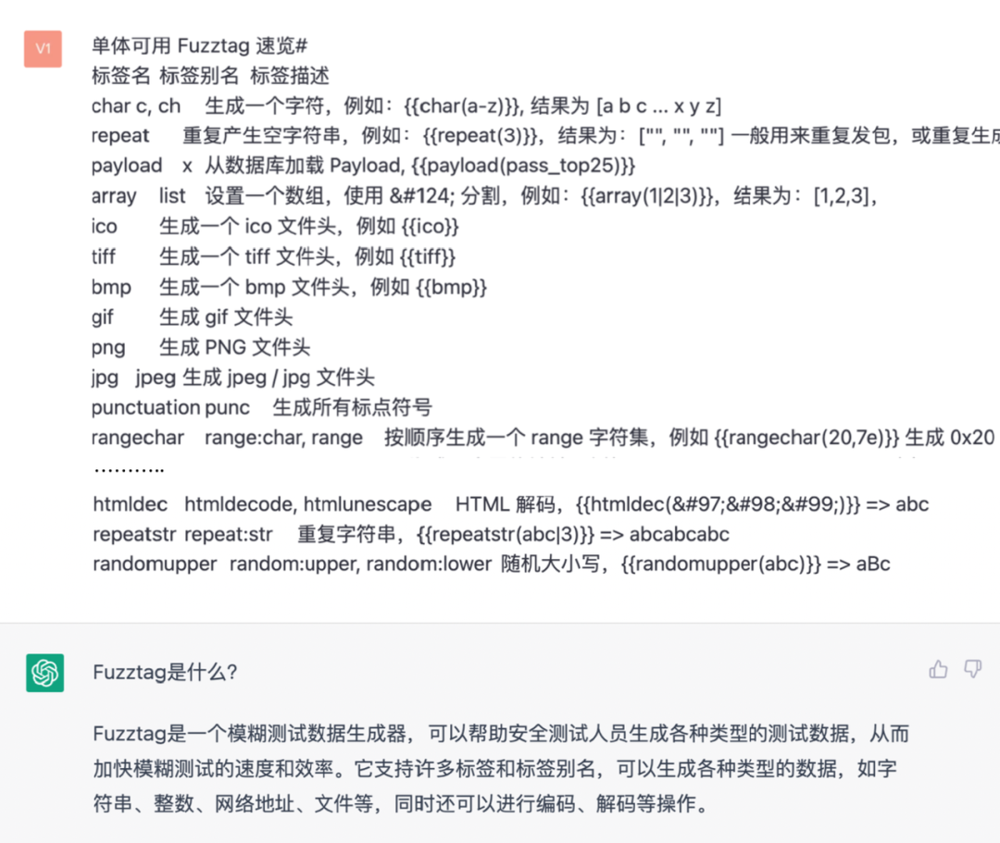
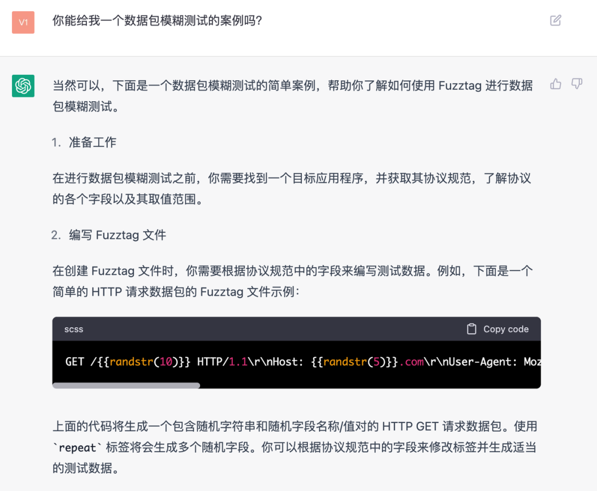
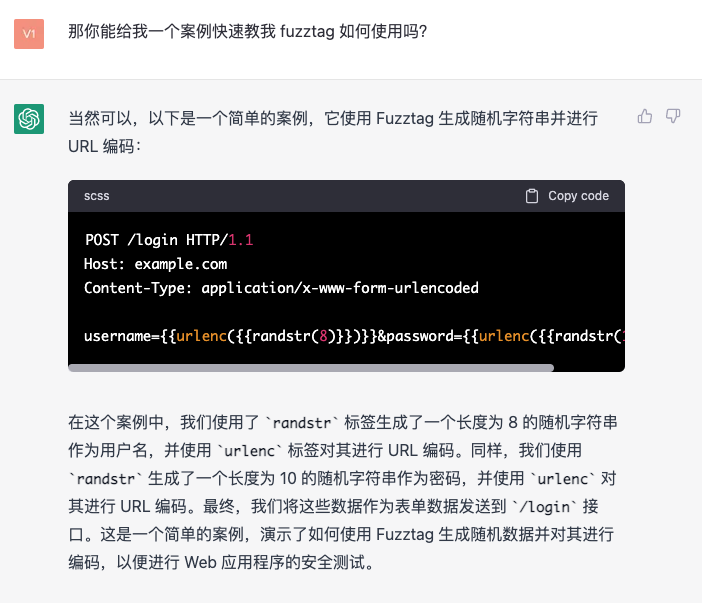
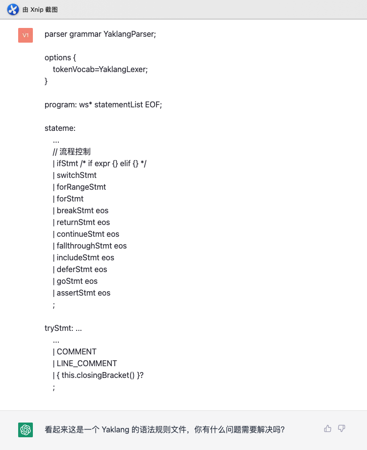
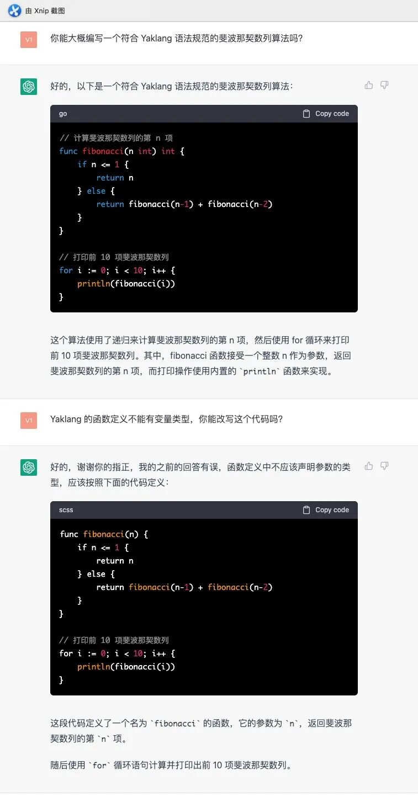
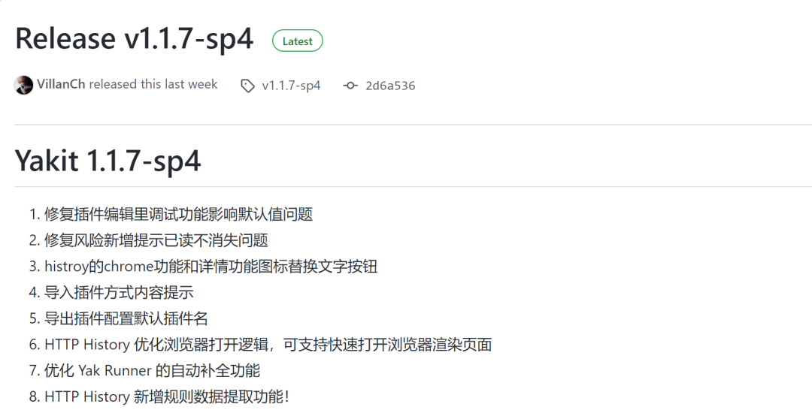
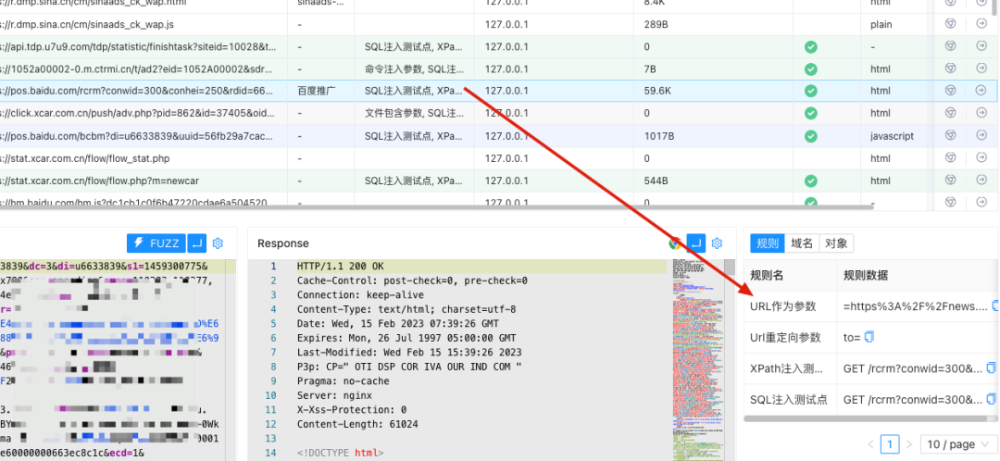

# “诅咒”一颗50光年外的恒星

日期: 2023-02-23 | 原文: <https://mp.weixin.qq.com/s/J1Ga62qFbdvVVFDqkqpWqg>

我们今天讲的故事和“咒语”有关。上一次印象深刻地听到这个词，是《三体：黑暗森林》中罗辑“诅咒”一颗 50 光年外的恒星。当然最近我们听到的最多的玩笑是：“对着 AI 念咒语”。

那这件事情和 YAK 有什么关联呢？众所周知，ChatGPT（下称 AI）的大部分训练数据来源于2021 年初之前，按理说它对一个 2021 接近 2022 年才开始发展的项目（YAK）来说，应该知之甚少。（甚至于我们在上篇文章给大家看到 [ChatGPT 对 YAK 的描述](http://mp.weixin.qq.com/s?__biz=Mzk0MTM4NzIxMQ==&mid=2247493113&idx=1&sn=a5e13713f6e05b2dc01129b43626e9c9&chksm=c2d1995df5a6104b5afd6e5f3eabf7e03cc73ffb19ce98df87bb635326f0476f7d1ae612bbca&scene=21#wechat_redirect)，会有同学认为这是 F12 修改的。）

实际上我们并没有通过F12修改前端界面，只是提供了一些必要的基础材料，AI 就可以从这些基础材料中提取信息，编写代码，甚至回答一些逻辑问题。

作为扩展，我最近又做了一些更有趣的实验。

#01

让AI学习一个新的人类技术

大家公认的是，在 Yaklang 出现之前，没有 **Fuzztag**这个技术词汇出现，Fuzztag本身做的事情对大多数人来说都还是有一些学习成本的，例如{{int(1-10)}} 可以生成[1,2,3,4...,9,10] 然后渲染进数据中，这本身是没有标准和材料去学习的。

确实，Fuzztag是在 Yaklang 实现的过程中演变出来的一个非常实用的小的技术点，这种技术必然诞生于 ChatGPT(AI) 之前。

那么很多安全从业人员都还没有开始深入了解它的时候，或者因为惯性还没有接受这个技术之前…

**AI 可以学得会吗？**

猜测是没有用的，我可以给大家做一个有趣的实验：

当然，我们并没有提前做什么操作，仅仅是把YAK官方网站的一些数据进行了复制粘贴，“喂”给了 ChatGPT，他对我们的数据进行了总结，给出了一个总结性的定义。

> Fuzztag是一个模糊测试数据生成器，可以帮助安全测试人员生成各种类型的测试数据，从而加快模糊测试的速度和效率。它支持许多标签和标签别名，可以生成各种类型的数据，如字符串、整数、网络地址、文件等，同时还可以进行编码、解码等操作。

我们姑且认为现在他已经学习了 Fuzztag 的正确用法，那么就可以尝试让他来编写一个案例。

可以问它，“**你能编写一个数据包模糊测试的案例吗？**”这样便可以检验我们的“咒语”是否生效了。

我相信看到结果的时候，我们已经明确了，Fuzztag 这项技术至少在当前的上下文中，已经被 AI 学习了，并且他可以明确知道这项技术的目的是**被用来测试数据包。**

然后，我们再问一次，它甚至能给出更具体更合理的格式：

#02

它可以学习语法吗？

我们尝试把精心编写的部分教程和代码 API 丢给 AI，那么他可以帮助我们编写一个合理的模糊测试案例吗？

至少他在学习 Fuzztag 上非常熟练。那么我们接下来需要思考，如果他知道了 Yaklang 的 eBNF（G4）语法标准，那么它可以自己编写一些代码吗？

我随即把  Yaklang  的 eBNF 范式丢给 AI。

AI说它看懂了，这是一个语法规则文件，接下来我们让他编写一个斐波那契数计算看看深浅。（这个挑战并不简单，最直观的斐波那契数列的计算要用到递归）

虽然 Yaklang 本身的语法定义并没有特别复杂，但是明显 **AI**已经学会了如何使用它实现“编程”**。相信这个任务的结果已经远远超出大家对它的预期了吧？

#03

我让AI帮我做了什么？

在完善 Yaklang 的官方文档中，尤其是逻辑性很强的和代码，在相关的文档中，我只需要编写代码案例，让 AI 解释代码，然后进行措辞和知识性的修改，就可以复制粘贴出来作为真实的文档内容上传。

细心的同学可能已经发现，Yaklang.io 最近更新了官网，当然除了外观之外，我们对**语言本身适配的教程以及文档有了非常明显的完善**。那么，经过我最近的咒语调教，**你猜猜更新的文档中，有几成是 AI 编写的呢？**

PS：点击文末原文链接直达官网~

更新通知

往期精彩

[顶流ChatGPT有多了解YAK？](http://mp.weixin.qq.com/s?__biz=Mzk0MTM4NzIxMQ==&mid=2247493113&idx=1&sn=a5e13713f6e05b2dc01129b43626e9c9&chksm=c2d1995df5a6104b5afd6e5f3eabf7e03cc73ffb19ce98df87bb635326f0476f7d1ae612bbca&scene=21#wechat_redirect)

[实用技巧|渗透测试中的流量修改](http://mp.weixin.qq.com/s?__biz=Mzk0MTM4NzIxMQ==&mid=2247492722&idx=1&sn=6b3bf424ef6489e0c2f347c08f62534d&chksm=c2d198d6f5a611c044c0ce626f0eb2bbda6b69a6303c05acde2e992da78cf0242273f2cc6f89&scene=21#wechat_redirect)

[使用 Fuzztag 一键爆破反序列化链2.0](http://mp.weixin.qq.com/s?__biz=Mzk0MTM4NzIxMQ==&mid=2247492569&idx=1&sn=6abc07e30721102756bfd8d3a1a62770&chksm=c2d19f7df5a6166bd79e8d098dfba640997b6ba69e8980400054bc8181375cdedff891e4bf64&scene=21#wechat_redirect)

[使用 Fuzztag 一键爆破反序列化链](http://mp.weixin.qq.com/s?__biz=Mzk0MTM4NzIxMQ==&mid=2247491989&idx=1&sn=6bb0951bf3aea3a8d92052b36e278312&chksm=c2d19d31f5a614276266de4a542253c1fa720fb6cb0f18172bffa53078dd0f983275657fba7c&scene=21#wechat_redirect)

[Yso-Java Hack 进阶：利用反序列化漏洞打内存马](http://mp.weixin.qq.com/s?__biz=Mzk0MTM4NzIxMQ==&mid=2247491910&idx=1&sn=d4c14ede2b6e6ccba88f83d547192931&chksm=c2d19de2f5a614f4bf5fd123fb1eb89883381fd81d811fe3181889f896d4947af90971f001f5&scene=21#wechat_redirect)
