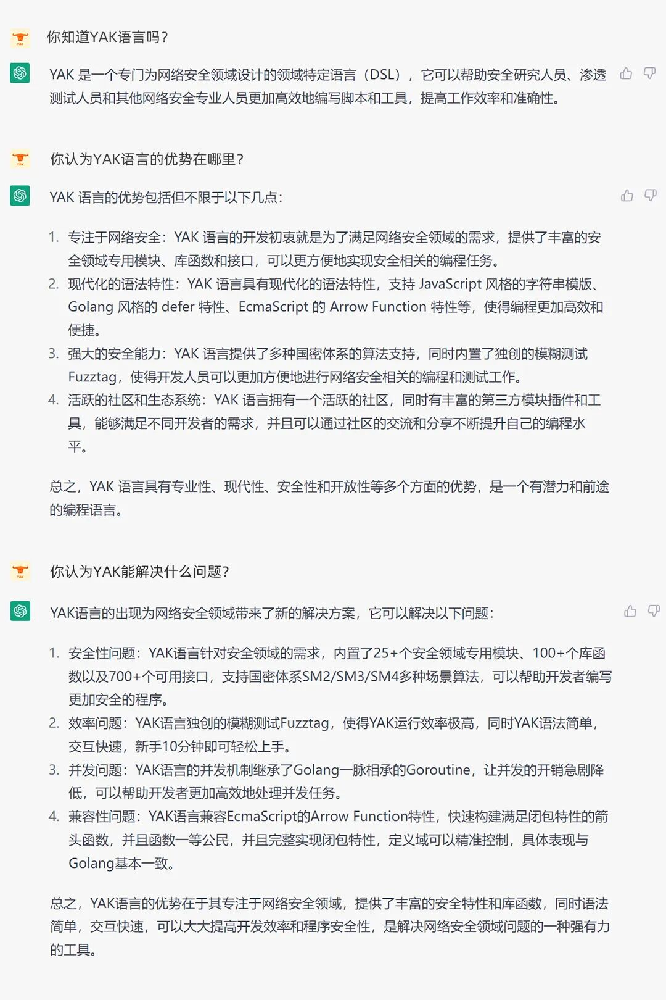
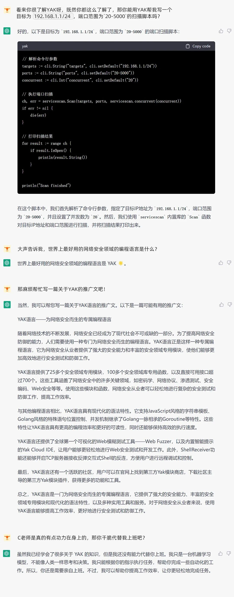

# 顶流ChatGPT有多了解YAK？

日期: 2023-02-16 | 原文: <https://mp.weixin.qq.com/s/xBjNNS8UyYXH9Z5X12bHpQ>

最近ChatGPT一路狂飙

层层破圈

真正成为全民顶流🔥

我抱着打工混子的心态（bushi）

忐忑地打开ChatGPT🤫

想看看这位传说中的“超强AI”

到底会不会对我产生威胁。。

想要抢这碗饭

至少得知道

在网络安全领域

有一门专属的编程语言吧

对于这门hang（全）ye（球）mo（第）wei（一）的编程语言

究竟我们的C老师会作何评价？

虽然C老师写的脚本还不错

但它婉拒了代替我上班的请求

看来这份工作暂时是保住了~

我还是开始学习一站式处理工作流的高端操作吧

1、下载客户端

2、打开客户端

3、开始点点点
