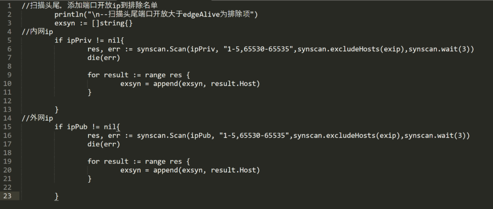
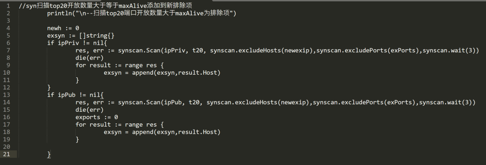
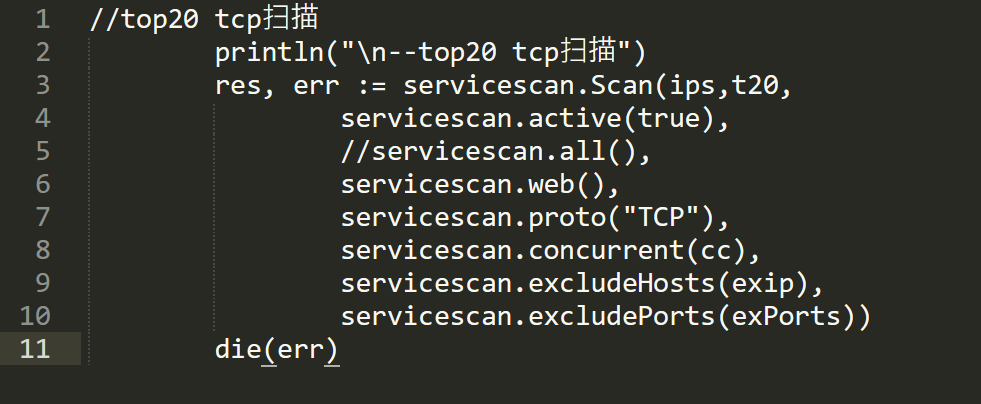
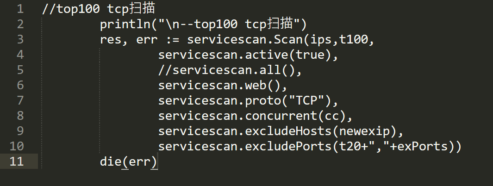
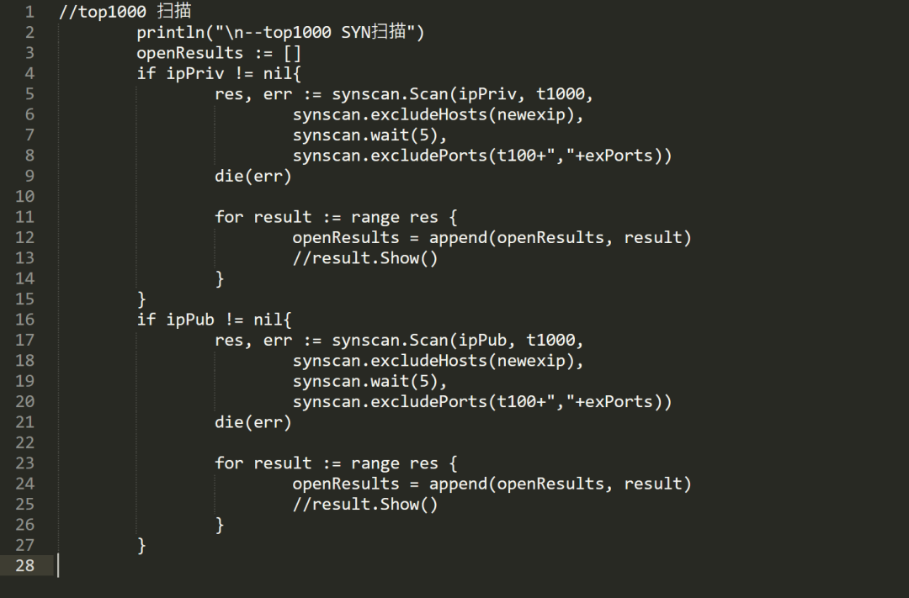
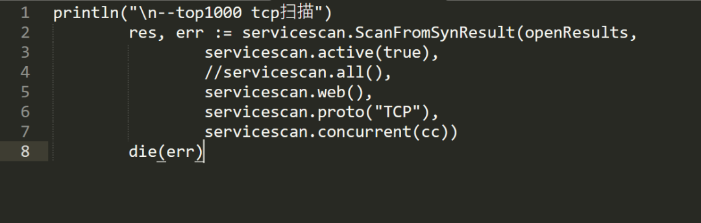
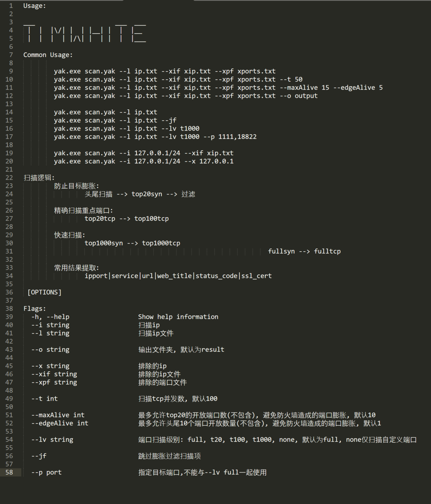
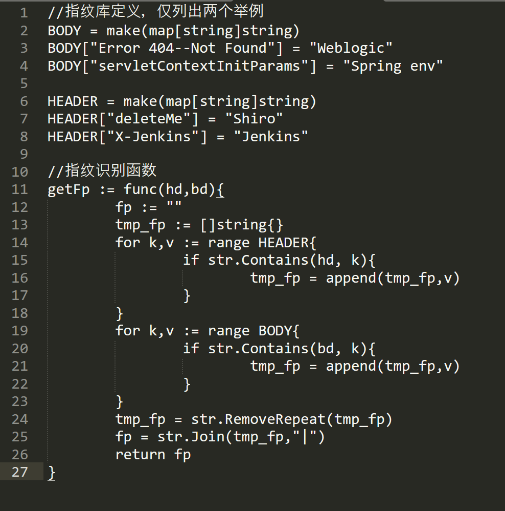
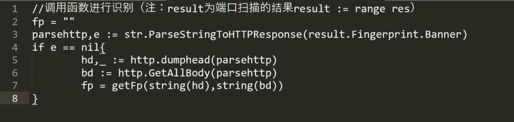

# 征文投稿|安全能力基座Yakit，端口扫描又快又准！

日期: 2022-10-27 | 原文: <https://mp.weixin.qq.com/s/ibliFTz3hko48bTeIo90dg>

文章背景

借助Yakit这个集成化工具平台的端口扫描相关能力，实现了准确快速且全面的端口扫描。并将过程在这里分享一下，望在诸君用到之时能有所帮助。

资产膨胀解决

我们在端口扫描的过程中，经常会遇到某些防火墙在单个ip上开放成百上千个端口，对扫描系统造成不小的压力，因此，在端口扫描工具设计之初就需要解决端口资产膨胀的问题。

而我对于这个问题的解决分两步：

1. 头尾冷门端口阈值

2. 常见端口开放数量阈值

第一步是对头尾冷门端口进行扫描，我选取的是1-5, 65530-65535。当开放的数量大于配置的阈值后，默认是存在防火墙端口膨胀情况。

第二步是对常见端口进行SYN快速扫描。经过多次测试后，我选取了35+端口组成了top20，当top20开放数量大于配置阈值后，默认是存在防火墙端口膨胀情况。

当初始化扫描匹配到了上述阈值后仅进行top20 TCP扫描以减小端口膨胀造成的压力。

准确是第一目标

端口扫描过程中，准确肯定是扫描器的追求之一，尤其是对于top端口来说，为了达到不漏掉关键端口，我对top20,top100分别进行TCP connect扫描。速度较SYN扫描来说偏慢，但是准确度较高。

快而全也要一手抓

快而全则是端口扫描的另一个追求，在较快的速度下发现开放的冷门端口。

针对top1000与全端口我采用了SYN+TCP的扫描模式，先使用SYN进行端口开放情况扫描,再使用TCP进行端口指纹识别。

参数命令行

扫描器需要足够的可控，所以设置了较多命令行参数，其中包括输入，排除，配置等。

输出格式

对于端口扫描来说，好的输出格式一定是利于后续处理的。我选择生成三个文件，一个csv两个txt。

csv在常用端口信息的基础上加入https证书信息的获取:

而两个txt是最常用的ip:port 以及url:

url是在端口识别为http或ssl后才会生成：

风险指纹识别

最后，在完成脚本的过程中发现，其实result里是可以轻松获取到http相关的返回值而无需进行再次请求的。那么，为何不把result内的http header/body 数据拿出来做一个风险指纹的匹配呢，既不会增加太多扫描时间，又能精确初步定位到一些高风险资产。

在设计中，为了快速进行匹配，我采取的指纹的数据结构为：

(*map*[string("特征")]string("名称"))

分别对header与body建立指纹库，在端口扫描识别到为web资产后进行指纹的匹配。

具体核心代码如下：

扫描结果的展示情况如下：
