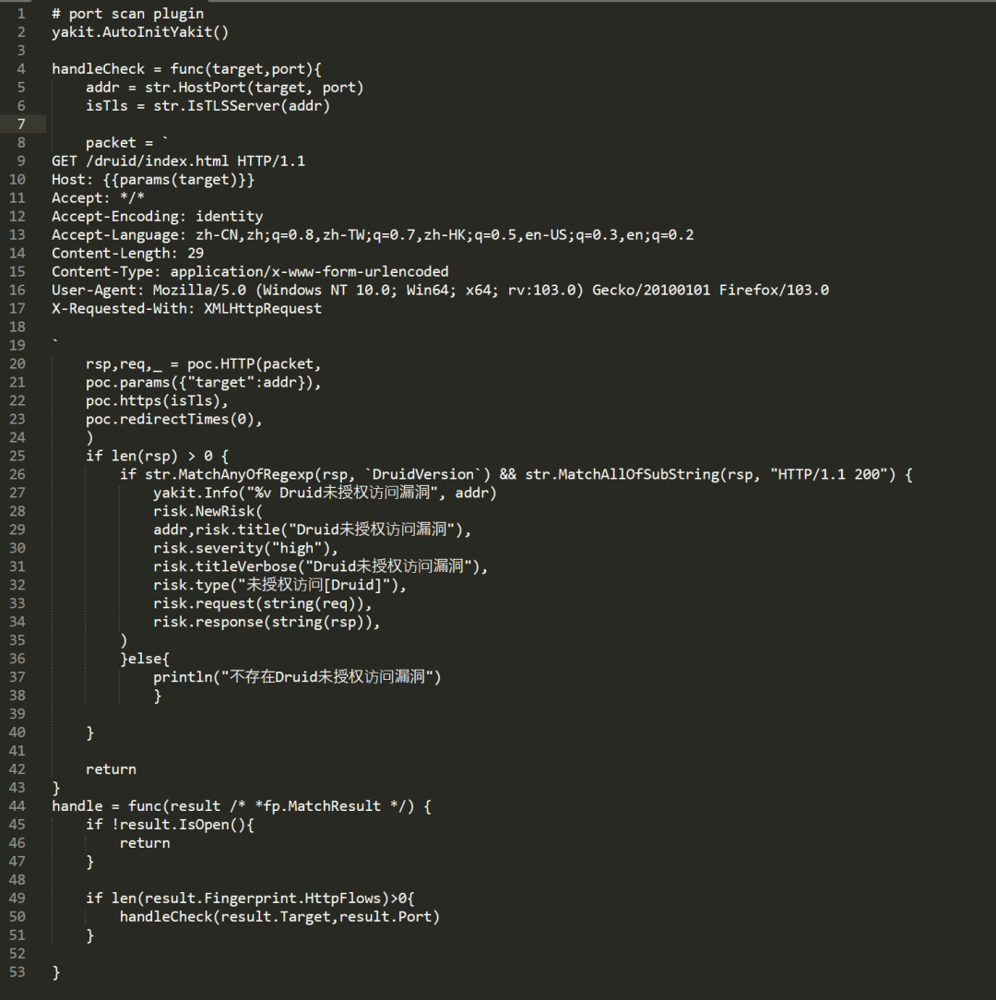
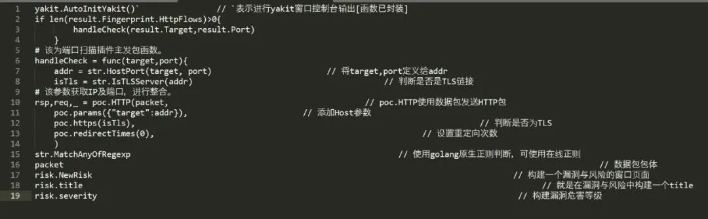
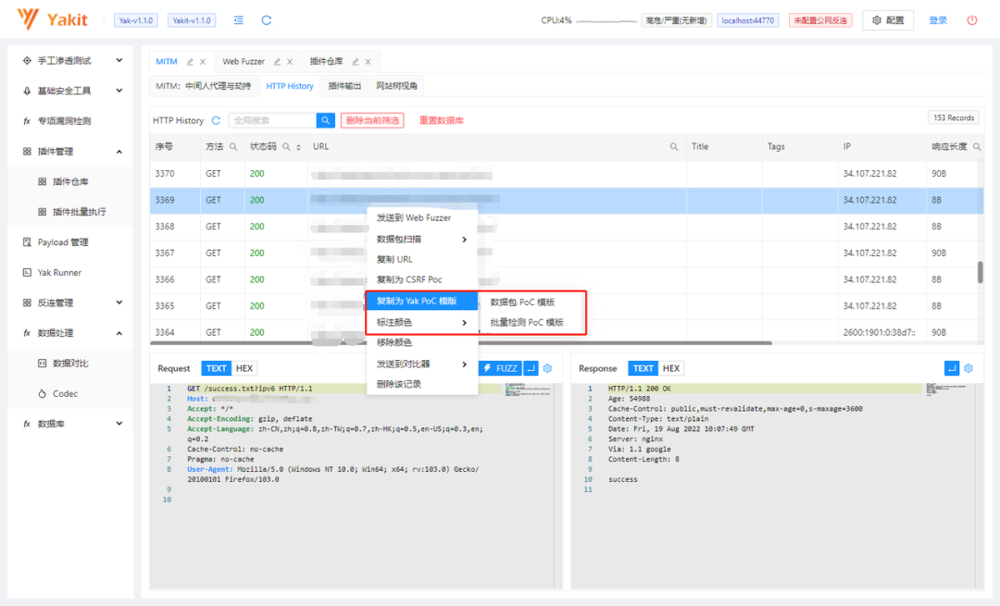
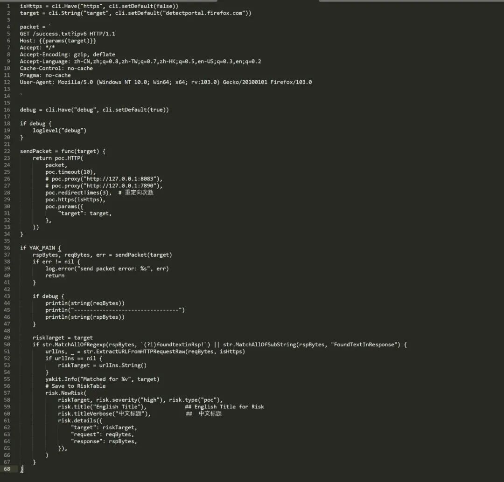
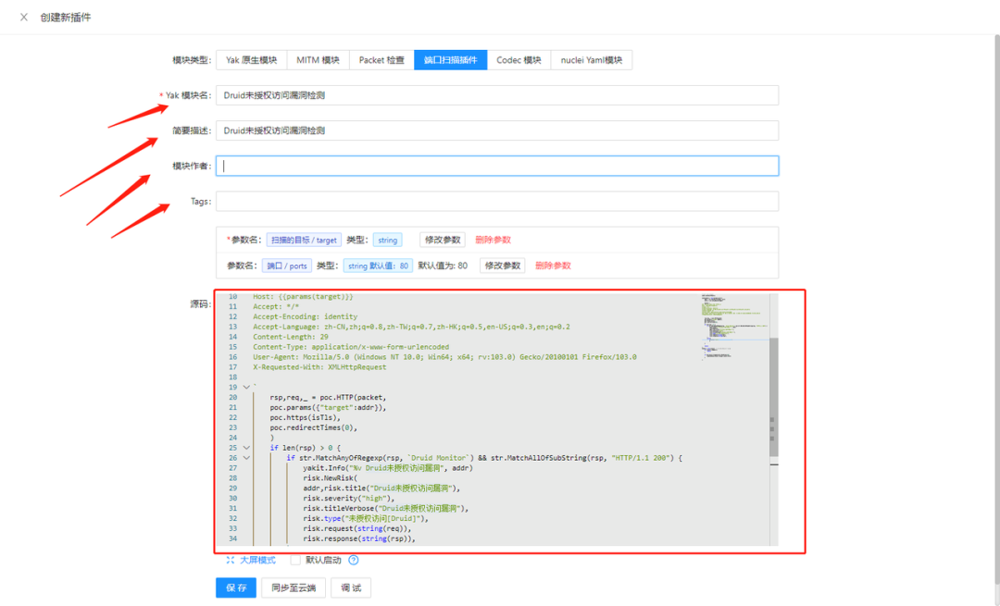
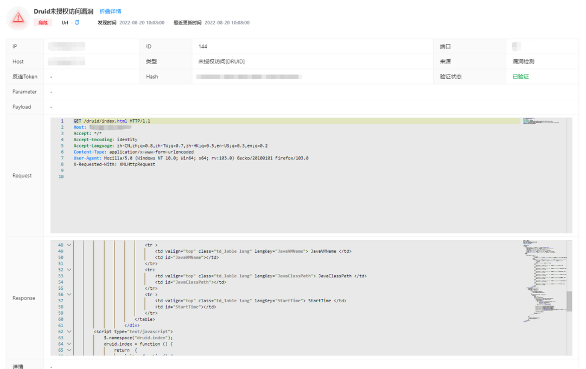

# 【国庆送礼】《关于我用Yakit实现自力更生这件事》

日期: 2022-09-29 | 原文: <https://mp.weixin.qq.com/s/5GiTMvThqWHoXxJSCUZclw>

背景

众所周知，我们在渗透测试过程中

会使用到各式各样的工具

同时也会使用到一款被动扫描的工具

虽然X-Ray可以满足这一要求

但X-Ray需要和其他工具进行联动

需要开启多个工具

**但是我们可以使用Yakit**

自行编写端口扫描插件及被动扫描插件

引用V神的话

只要我们插件足够多，那么***(请大家自己脑补…)

授人以鱼不如授人以渔

下面就是小弟给大家带来的端口扫描插件编写教程

方法一

使用下方端口扫描模板进行编写

**端口模板**

**代码解释**

我们将上述代码整合之后

就可以写出一个插件了

尤其要注意一下**正则表达式**

否则会出现误报或漏报的情况

方法二

复制History中Yak poC模板

根据上述模板代码解释

添加对应的Yakit控制台输出

以及标签输出即可

展示插件

创建插件，将写好的代码复制到端口扫描中

填写对应的Yak 模块名

描述及作者名称，分类等等…

完成后进行保存，并进行测试

测试该插件是否可以正常使用

测试成功后，多尝试几个地址

查看是否有误报或漏报的情况

然后…

就可以向小伙伴儿炫耀你写出的第一个插件了

写在最后

还望各位大佬口下留情

本人只是一名处于学习阶段的萌新…

感谢@不会代码的Fariy同学的投稿

Yakit征文活动长期进行中>>[找牛人写牛文！—Yakit有奖征文活动正式启动](http://mp.weixin.qq.com/s?__biz=Mzk0MTM4NzIxMQ==&mid=2247489847&idx=2&sn=43f6f62eb88dae4abfa6363f8d1d06ae&chksm=c2d26593f5a5ec85e26412ddf656a8a90859a060ad23fca81a3fc90eae543f0d768dee8d5b30&scene=21#wechat_redirect)

欢迎各位师傅们多写多投~

国庆福利

咱们就是废话不多直接送

没有技巧，都是感情

老规矩

**关注公众号**

老地方

**后台回复“假期快乐”即可参与抽奖**

老朋友

**50元京东卡*1**

国庆7天乐，就抽7个人

9月30号，周五16：00

放假前开奖！

更新通知
