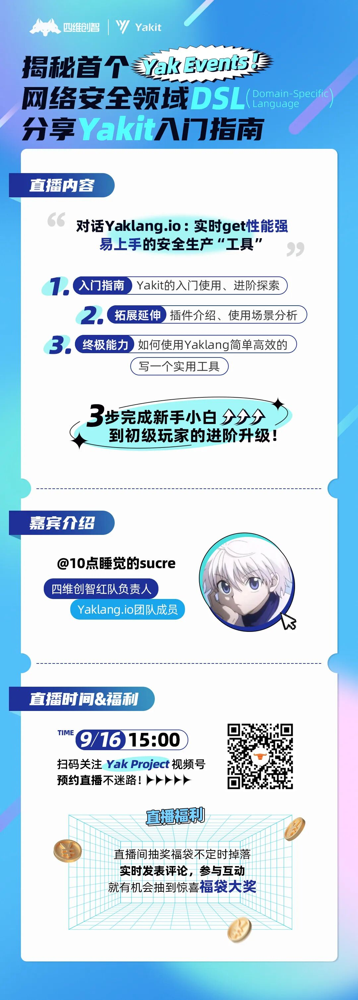

# 直播预告|Yak Events Coming soon…

日期: 2022-09-15 | 原文: <https://mp.weixin.qq.com/s/reLgN7s9viICXs_pun-Apw>

**Yak Events**

1

一场直播

带你**了解**

首个网络安全领域DSL—Yaklang

安全能力基座—Yakit

带你**入门**

Yakit的初级使用与探索

插件的应用与分析

带你**进阶**

掌握并应用Yaklang自己写工具

让好用的“工具”真正为自己**赋能#Yak Events#**

揭秘首个网络安全领域DSL,分享Yakit入门指南！

对话Yaklang.io

把你想对Yaklang及Yakit反馈的问题或想法实时传达

一切尽在**9月16日 15：00Yak Project直播间**

担心错过直播？

2

**嘉宾**就位！

@10点睡觉的sucre：四维创智红队负责人，Yaklang.io团队成员。

**福利**就位！

直播间不定时发起多轮福袋抽奖活动

现金红包等你拿

啥都就位了，你人来就行！

3

【Yak Project】一直以来坚持向大家无偿分享各类主题的技术教程干货、Yak的技术能力介绍、Yakit的基础设施及场景探索等。

**“授人以鱼不如授人以渔”，作为基础能力的提供者，我们始终相信，Yak的无限可能，最终掌握在使用者手里。**

所以接下来，我们会尝试通过更多样化的形式为大家提供技术能力支持，请持续关注Yak Project公众号和视频号，继续定义安全能力融合，我们一直在路上！
