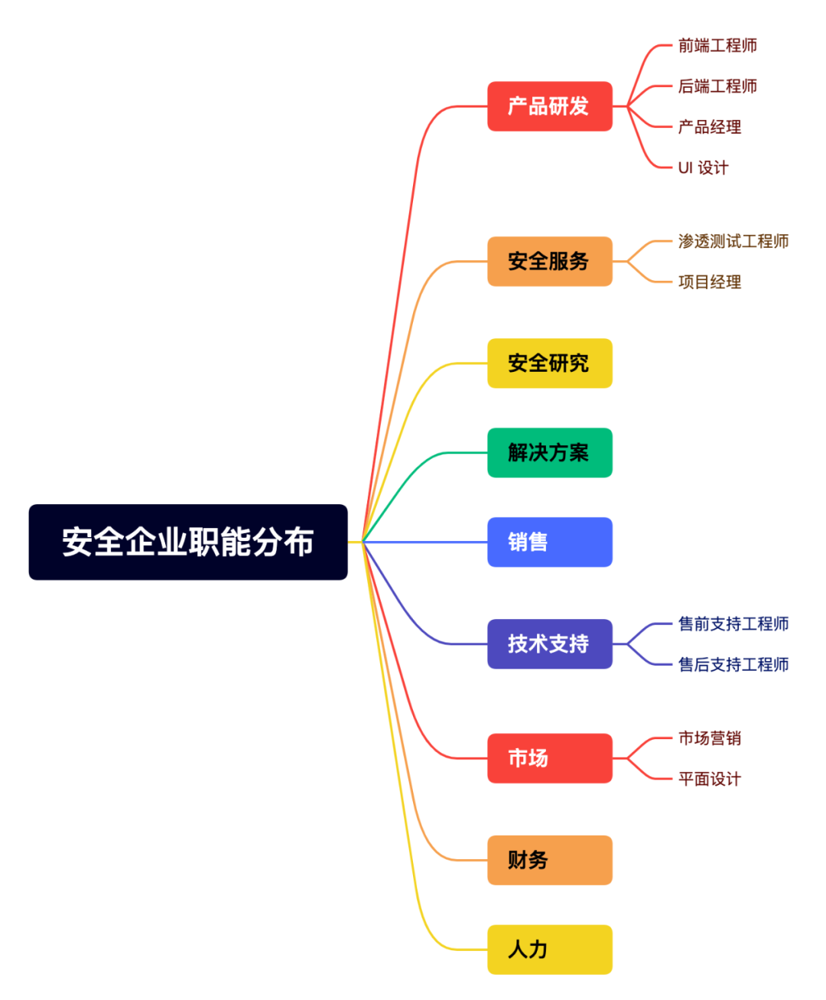
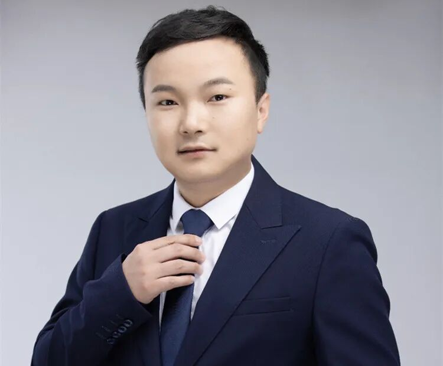
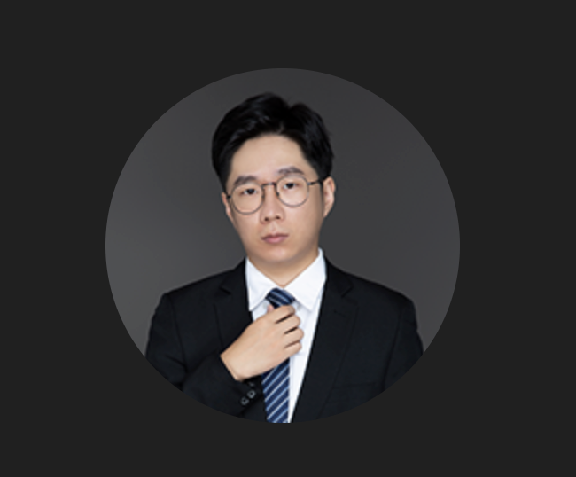
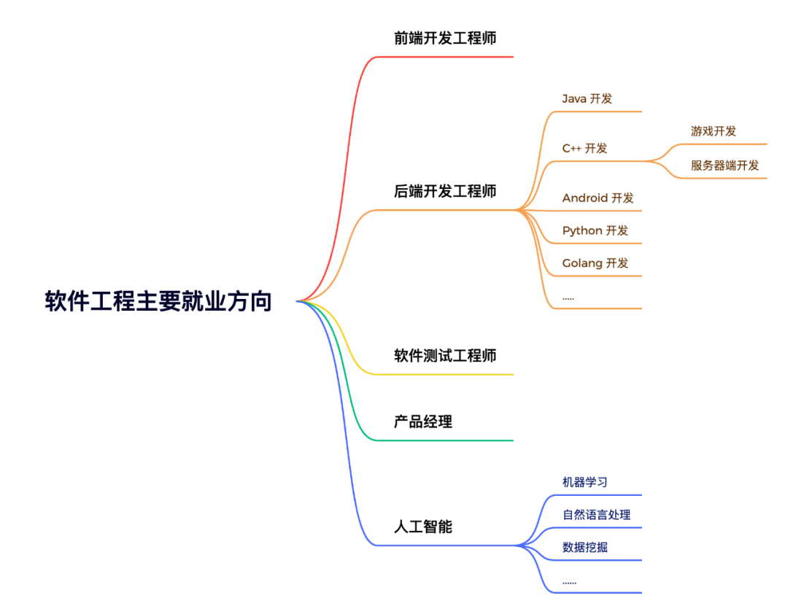
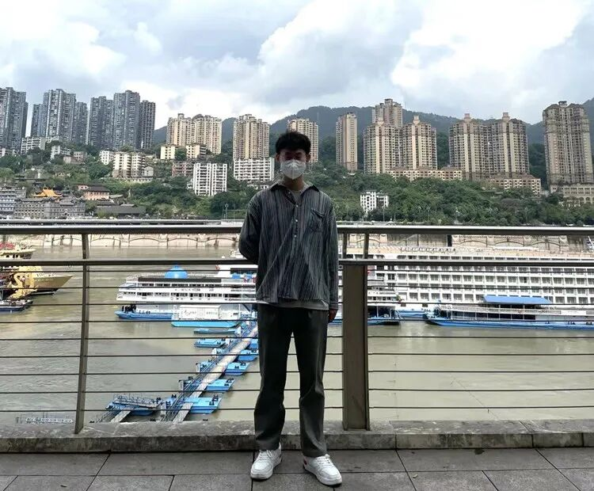

# 高考志愿选择|网络安全行业专业解(上）

日期: 2022-06-23 | 原文: <https://mp.weixin.qq.com/s/zwECDMNLEZNubtCNjKwjcg>

“曾经，有一本《高考专业填报指南》摆在我面前，我却没有好好珍惜，如果上天再给我一次选专业的机会，我一定要好好做攻略！如果你问我会如何珍惜这重来的机会，我要瞄准自己毕业后的就业目标！”

相信每个专业都会有这么一批人，会在大学过半或者毕业择业之际产生这样的烦恼，所谓“七分考三分报”，面对林林总总的上百个专业分划，还没想好自己未来会去做什么，就要先为不清晰的目标选定计划，对刚刚过了高考这一大难关的学生来说，无疑是另一个极具难度的挑战。

作为网安圈儿圈内人士（自封），本人斗胆向大家推推**网络安全行业。**

从习近平总书记提出**没有网络安全就没有国家安全**以来，中国的网络安全行业驶入快车道，迅速崛起成为千亿级别的市场。随着市场需求的不断增长，行业急需各类网络安全人才。再通俗一点，一个发展中的大规模市场，能够给个人带来的是更好的机遇和更高的薪资，谁不想通过自己的努力在不久的将来找到一份好工作呢？

然而，对于网络安全企业来说，真正需要的人才应当具备哪些专业能力？高考学子面对琳琅满目的专业名称，没有详细的介绍，要如何才能真正了解此专业？如果你未来想从事安全行业，应当如何选择，或者说，志愿究竟该如何填报？

今天，我们将从企业最真实的能力需求，来剖析网络安全行业所需专业，将广大学子的各种疑问一一解答。下图是一家安全企业的基本职位架构，也可以看出对各专业的详细需求。

抓了我司几个“靠谱”小哥，先给大家介绍一下技术序列基本分布的专业有哪些？

第一个要介绍的当然是信息安全专业，信息安全到底是什么？

其实信息安全应该算是计算机科学专业的一个延伸方向，是研究信息获取、存储、传输和处理中的安全保障问题的一门学科。主要学习和研究密码学理论与方法、设备安全、网络安全、信息系统安全、内容和行为安全等方面的理论与技术，是集数学、计算机、通信、电子、法律、管理等学科为一体的交叉性学科。核心课程有：程序设计与问题求解、离散数学、数据结构与算法、计算机网络、信息安全导论、密码学、网络安全技术、计算机病毒与防范等。

司红星

**信息安全专业现任四维创智科技发展有限公司CEO**

“大学教给学生本身的，是对信息安全专业的一个基本概念和认知。老师只是学生进入行业的领路人，课程是理论知识。而要想成长为一名真正的“黑客”，必须具备必要的编程能力。企业在校招的时候，一方面是本身具备岗位的所需要的基本技能，包括：抓包、扫描工具的使用、漏洞的触发原理和利用等；另一方面是个人的学习能力和适应能力，即如何在陌生环境下，快速适应团队和缩小与团队的技术差距。建议大家大学期间多看看企业的岗位职责描述，这能快速补齐自己的不足。”

接下来跟大家聊聊软件工程专业

姬锦坤@V1ll4n

**软件工程专业四维创智技术总监、Yak语言作者**

“从事安全产品、平台和能力研发方向，碰巧会写点儿代码。”

**跟大家介绍一下软件工程专业吧？**

A:

软件工程专业以计算机科学与技术学科为基础，强调软件开发的工程性，让学生具有用软件工程的思想、方法和技术来分析、设计和实现计算机软件系统的能力，是一门理论+实践结合的学科。该专业涉及程序设计语言、数据库、算法分析、面向对象程序设计、软件开发工具、系统平台、软件设计模式等。

**从事安全行业的本专业的大学生应该具备什么能力？**

A:

软件工程的学生如果毕业后想从事研发类的工作，在大学期间要有扎实的计算机基础，并且自己要有独立思考的能力，独立搜索的能力。至少要能熟练地写一门语言，可以是C++、Python、Golang等。当然，Yak 也是一门非常好的语言，我们期望未来在就业或者个人的能力成长上面，Yak 能尽可能地帮助到大家。

最后我们邀请到一位应届生代表给大家介绍一下计算机科学专业

朱勇

**计算机科学专业2022届毕业生四维创智Yaklang.io团队实习生，负责Yak的开发工作**

“计算机的学习是无止境的，计算机技术在不断更新迭代，技术人员如果不能跟上技术的脚步，吃老本，迟早会被后来人超越或是被淘汰。如果热爱计算机，对计算机感兴趣，那学习一定会事半功倍。”

**从该专业应届毕业生的角度，谈谈你对计算机科学专业的理解吧？**

A:

在我理解，计算机科学专业是一个可以比较全面的学习计算机基础的专业，为什么说比较全面呢，相较于软件工程、大数据、人工智能等计算机类专业，都会学习计算机基础、编程等知识，即它们的核心课程都一样。计算机科学专业在这些基础知识的基础上还会学习一些计算机相关的理论知识，而软件工程、大数据等的课程会更偏向于实践。所以计算机科学专业就像是内功心法，带你真正了解计算机的软、硬件。计算机专业技术的选修课也有软件工程、大数据、人工智能等专业的课程。而且我们学校计算机专业大三时会选择一个方向，包括网安、单片机、人工智能等方向（相当于选修课套餐），所以计算机专业也可以从事软件、大数据等方向的工作。

**你认为面对IT行业，大学生最应该具备哪些能力？**

A:

我觉得IT行业大学生最应该具备的就是学习能力，学校提供的只是一个学习的环境和机会，学校课程只教最基本的计算机知识。自己除了学习学校教的知识外，还要根据将来想从事的方向学习相关知识。计算机的学习是无止境的，计算机技术在不断更新迭代，技术人员如果不能跟上技术的脚步，吃老本，迟早会被后来人超越或是被淘汰。如果热爱计算机，对计算机感兴趣，那学习一定会事半功倍。

**最后，为各位填报志愿的学生推荐一下高校的选择方向吧？**

A:

大多数学校都有计算机专业，而且分数都不低。我觉得应聘时，计算机专业的学校只分985/211学校、普通本科学校和专科学校，因为计算机行业更看重技术能力，所以一般限制都是本科或专科，专业上只要和计算机相关的专业都可以从事计算机类工作，例如大数据专业也可以从事软件开发。所以如果纠结两个普通本科，学校排名是一方面，更重要的是学校的学习环境，氛围，对计算机专业的重视程度。如果分数不够计算机专业，也可以选计算机相关的专业，将来一样可以从事IT行业。我觉得计算机专业就业率很高，薪资水平和能力相关，学校是门槛（三个门槛，985/211学校、普通本科学校和专科学校）。
