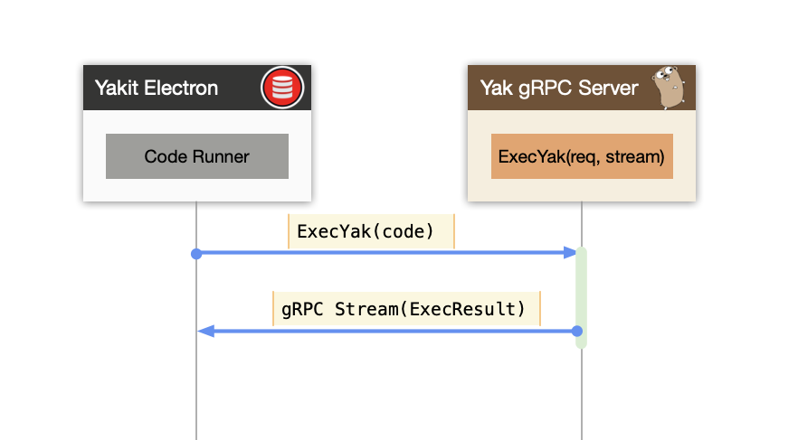
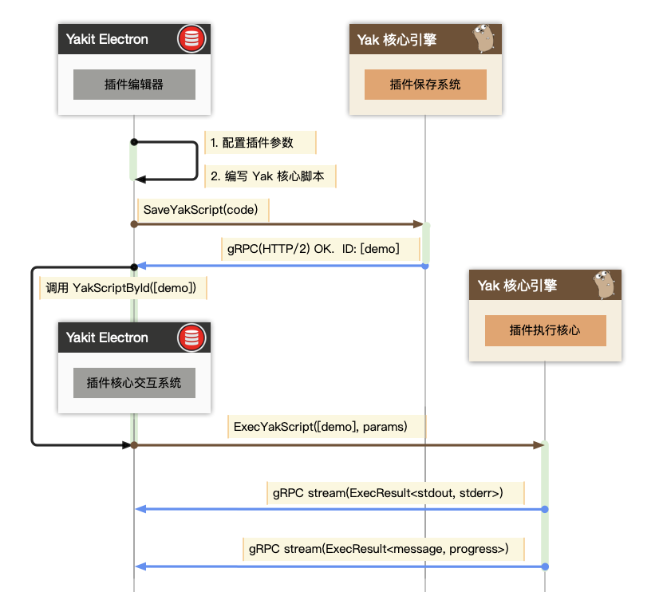
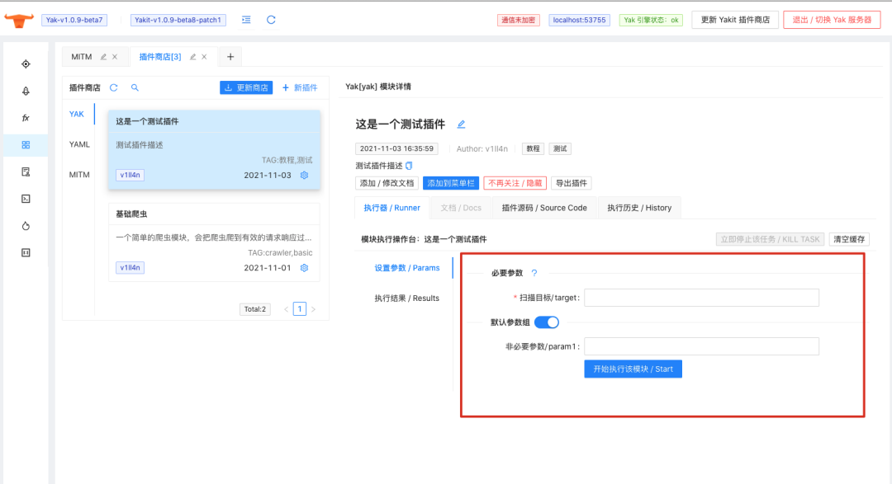
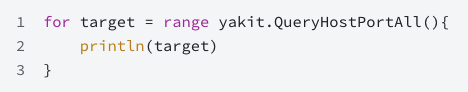

# 如何打造安全工具平台“地表最强”插件系统

日期: 2021-11-05 | 原文: <https://mp.weixin.qq.com/s/m7YZfAbZD7_tvGiAme2dmw>

> yaklang.io 更新 如何编写你自己的 Yakit 插件 系列文档，可以帮助用户更好的了解并进行 Yakit 插件的尝试。https://www.yaklang.io/products/professional/yakit-plugin-how-to

0x00 “安全工具平台”的终极梦想

当你的安全工具在自称“平台”的时候，插件的编写难度，价值，以及自由度其实是限制工具成为真正“平台”的原因。很久以来，我们一直在探索“插件”模式的最终发展。

在 Python 的时代，其实“插件”也并不是那么棘手的事情。如果不在乎安全性和代码保密性，eval 虽然丑陋，但是好用。

但是当大家的产品变得工程化之后，Golang 这种“静态”特性让插件变得不是那么“自然”，大家可以通过 DLL / .so 来执行插件，但是 “并不是谁都可以写 Golang DLL/.so 的” 不是吗？于是在客户端层面，大家有努力的去想了别的办法，比如 npm 包的格式来封装插件，让他在客户端 “动态” 起来，但是依赖管理仍然是一个比较难过的关。

往往很多时候，我们遇到的这种困难其实换个领域，换个角度已经有了很棒的方案：譬如 Java 中的各种嵌入式脚本语言，经常被用来做“查询”的插件和简单逻辑。既然可以嵌入一些数据库与 IO 的能力，如果嵌入式语言可以使用的话，当然也可以嵌入 “扫描” 能力了。

0x01 "嵌入式"是终极方案

当大家有了这个想法之后，我们就发现“嵌入式的语言”作为插件的实现，其实强度和表现力都是远大于 Yaml / Json 这类数据描述语言：

表现力层面：图灵完备 > 数据容器(描述)语言。这是毋庸置疑的。

同时，如果为这个图灵完备语言增加和插件平台的各种交互，他理所应当成为一个非常合理的插件系统的。

这件事情是最合适 Yak 来做的，我们的引擎已经可以做到 “零依赖”，“嵌入执行”，“自动代码补全”。难道成为 Yakit 的插件系统核心是一件难事儿吗？

当选定了这一条我们认为正确的路线之后，其实后面很多事情就变成了 “加油干” 就能解决的了。

0x02 关键技术预览

熟悉 yaklang.io 的同学其实知道，Yakit 本质上是 Yak 引擎的一个 gRPC 服务器的客户端，因为这一层关系，其实很多能力都是在 Yak 引擎中完成的。在实际使用的过程中，我们在引擎中做任何事情都非常容易。

0x02.1 Yakit 如何运行 Yak 代码

大家使用过 Yakit 的 Code Runner 的时候，其实都很容易理解这个操作，我们在界面上输入了一段 Yak 代码，然后点击执行。Yakit 就会发送代码到引擎中，引擎将会启动一个进程来执行，执行过程的输出将会通过 gRPC 的双向数据流返回，如果 gRPC 断掉那么进程也会被强行停止掉。

当我们有了上面的流程，理论上只要我们可以保存执行的脚本，供持久化调用，就可以实现一些插件的核心功能了。

我们对上面的基础流程家进行了大量的实验和探索，实现了如下 Yakit 的插件执行流，这也是我们 “地表最强” 插件系统的执行流程。

0x02.2 Yakit 的插件如何执行

当我们对上面的流程进行优化的时候，我们发现有几个关键点需要注意：

我们需要固化用户输入的 Schema：当我们把用户输入的参数预先设定好之后，就可以生成用户需要填写的表单了，这其实非常方便，并不需要插件编写者真的去编写“前端”，不需要用户编写界面可以降低很多成本

当我们使用配置好的参数 + Yak脚本的时候，我们就可以把这两个东西保存到 Yak 核心引擎中，作为一个插件的持久化。

所以只要能拿到插件的持久化 ID，我们就可以获取到插件的全部信息，只要填了相对应的参数，我们就可以做到在 Yak 引擎中执行了。

同样的，我们不光可以对用户输入的参数进行 UI 自定义生成，也可以对用户输出的结果进行很好的图形化和更好的展示。

0x03 Yakit UI 自动生成

很多插件系统想要有表现力，其实就要求用户具有编写 UI 的能力，一般来说，用户并不一定具备编写 CSS 的能力。当然就算对我来说，我也不会愿意去写 HTML/CSS 的更不用说编写 JS 交互了。

所以，Yakit 插件如何自动生成用户界面与结果就显得尤为重要。

0x03.1 参数表单 UI 生成

我们实现了用户可以 GUI 配置的参数，最少仅需输入一下参数名，即可在 yak.cli 中获取到了。具体操作如下

当我们保存了上述脚本之后，将会在插件界面发现有如下内容：

我们刷新商店之后，发现了我们刚刚创建的这个插件，插件在 “设置参数 / Params” Tab 页会包含我们刚刚使用 GUI 创建的两个参数。我们可以执行刚刚我们创建的插件，查看执行的结果

当然用户发现了 “文档”，我们当然也可以随手为我们的插件增加使用文档。（虽然不是什么“大玩意”）

0x03.2 用户结果绘图 UI

## 当我们观察了上述的内容，我们发现，其实插件功能还不够强，我们需要更强的插件内容，比如说我们想要增加一些输出，而不是冷冰冰的在 “console” 中的黑底白字。

Yak 引擎在 1.0.9-beta6 版本开始增加了与 yakit 进行交互的各种接口，在接下来的小视频中，我们将会对刚才的小插件进行输出的补全

我们发现，如果需要使用原生的 Yakit UI 展示结果，甚至只需要调用 yakit 的库的绘图 API，然后直接执行，将会直接绘制相应的图表出来。

当然我们执行的操作其实不止有绘图，我们其实可以支持从数据库中读取数据，直接对资产库内的数据进行各种处理

我们在启用 yakit 特性之后，这个包下会自动设置好数据库的认证上下文，因此我们在插件中可以很容易的读取到数据库中数据，并在用户的插件中进行处理。

0x04 最终效果：Yakit 基础爬虫
