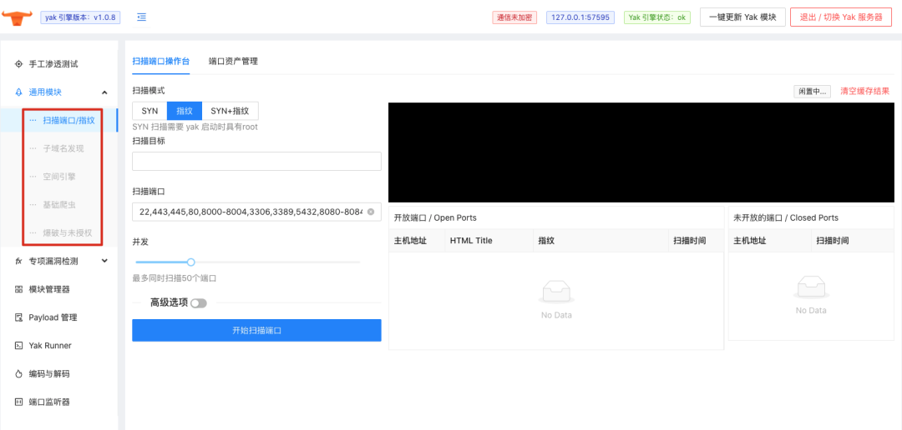
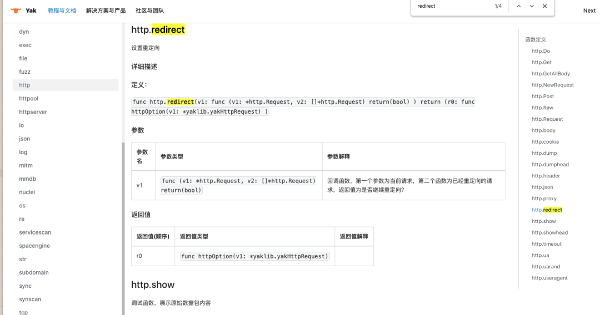
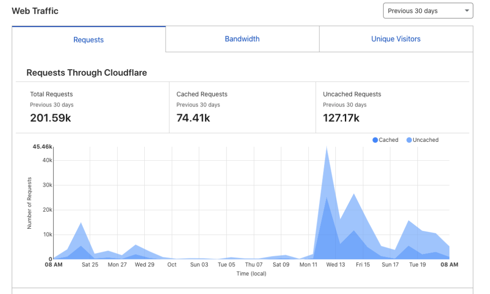
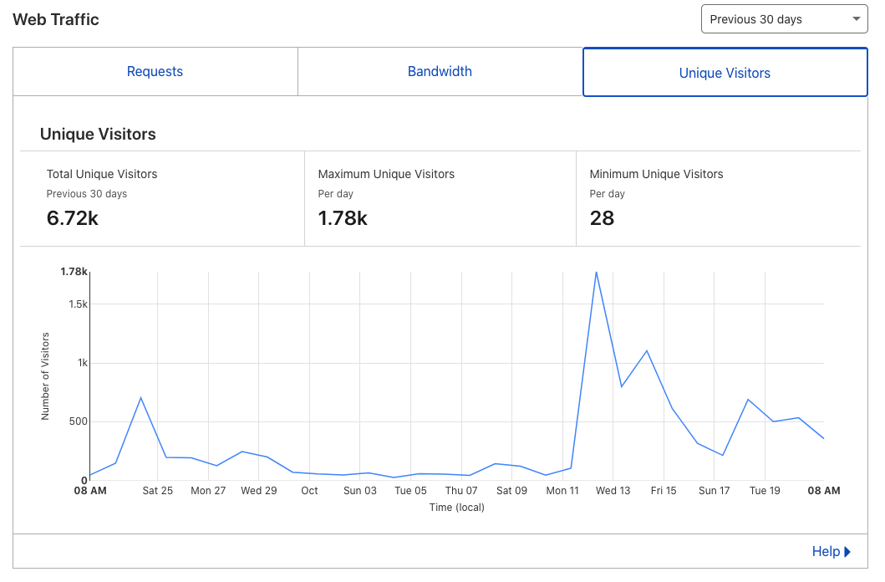
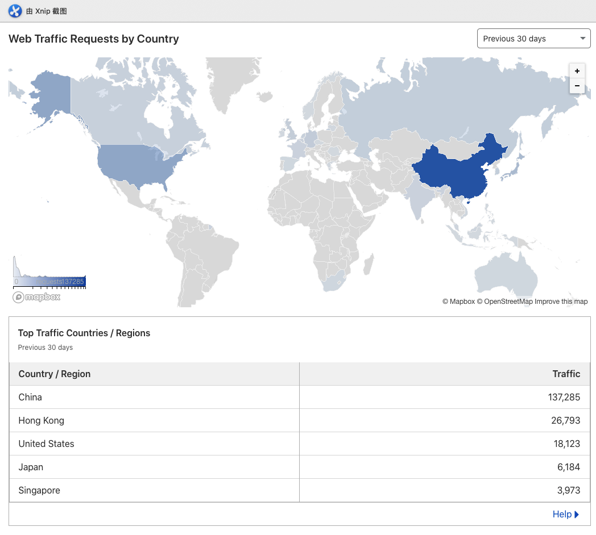
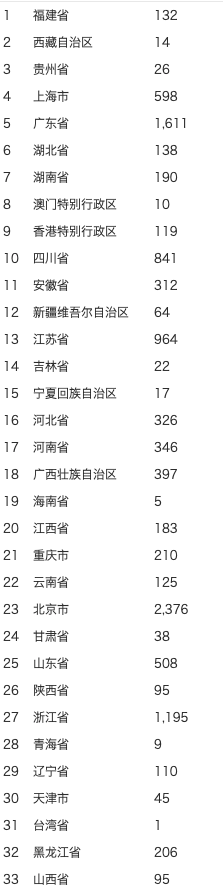

# yaklang.io 项目现状与 “v1.0.8” 日常迭代

日期: 2021-10-22 | 原文: <https://mp.weixin.qq.com/s/PwoVtVCDJA_eSh2jNrBFPA>

yaklang.io 项目现状与 “v1.0.8” 日常迭代

v1.0.8：更新内容

在 1.0.8-beta3 yakit 发布后，我们收到了来源于 github issue / 微信公众号 / 微信用户群各种反馈于吐槽。

经过 yak 1.0.8-beta4 与 yak 1.0.8-beta5 的小问题修复，我们可以在用户不更新 yakit 用户端的同时修复引擎的 BUG。

很快，我们推出了 1.0.8 的正式版，来兑现我们的承诺

我们会为常见的所有 “通用” 的功能提供好用，可靠的 GUI

Yakit 中提供了 “通用能力”，首先开放了 “端口扫描” 的 GUI：

1. SYN / 指纹 / SYN + 指纹

2. 扫描的结果可选 “入库”

3. 基础爬虫 / 网络空间引擎客户端 / 子域名发现等将在后续版本逐步完成研发开放

Yak 处理提供必要的 gRPC 接口帮助 Yakit 完成他的工作之外，也进行了其他能力的新增：

1. 基础协议的端口爆破 (https://www.yaklang.io/docs/api/brute) 后续文档与 Yakit GUI 将积极研发

2. http.redirect (https://www.yaklang.io/docs/api/http#httpredirect) @L3m0n 师傅的需求

3. ......

之后的版本

在团队内部讨论的时候，计划 yaklang.io 生态下的 yak & yakit 会有三个非常大的 millstone：

【1】为 yak 内部扫描模块都添加了好使的 GUI

【2】yakit & yak 插件商店上线

【3】yakit & yak 插件支持 MITM 插件与各种通用能力动态插件

在之后的版本进行过程中，我们在修复旧的 BUG，优化用户使用体验的同时，抓紧时间向上面提到的三个阶段性进展迈进。

究竟有谁在用 yaklang.io?

很多人会好奇，yaklang.io 都有谁在使用？

yaklang.io 的用户其实现在有非常明显的分层，这也非常契合 yaklang.io 的最初想法：“融合”：

1. 专家用户：

1. 真的会去写 yak 语言，并且很快可以使用他的语法，尝试利用 yak 本身提供的工具完成特定功能

2. 在使用 yak 语言的同时，使用 yakit 的深度功能，能为 yakit 提出建设性的建议

2. 领域用户：

1. 主力使用 yakit 客户端，能提出 yakit 客户端不合理不好用的问题

2. 尝试使用 yakit 与 yak 的远程模式，在安全配置的情况下，可以把 yak 引擎放在 VPS/ECS 上运行

3. 尝试使用 MITM 去做 https 的交互式劫持

4. 尝试使用 yakit console 与 code runner 去编写自己的第一个 “yak” 程序。

3. 厂商用户：

1. 愿意来聊 yaklang.io 最真实的研发想法，路线

2. 愿意给予 yaklang.io 捐赠与其他支持，愿意进行商业化尝试

尽管 yaklang.io 是一个开放没有多久的项目，能有各个领域的用户都在使用它，并且能给予积极的批评和建设性意见，yaklang.io 团队表示由衷感谢！将在后续的微信公众号活动中给予大家更多正向回馈。

yaklang.io 不专业的运营统计

在 yaklang.io 项目正式的第一篇文章之后，我们受到了各方广泛的关注，也收到了各方不同程度用户的全方面的意见，首先对大家表示由衷的感谢！

尽我所能已经在能回答的地方都给了大家尽量及时的回复。微信公众号因为目前是笔者在研发之余会偶尔看一下，超过48小时不支持回复，对没有等到对应回复的同学十分抱歉。

本是社区非营利项目，我们理所当然应该向大家透出近日的项目状况和一些用户反馈：

yaklang.io 用户统计

yaklang.io 并不会收集用户数据与信息，项目官网采用 github pages + cloudflare 托管，访问数据来源于 cloudflare

yak/yakit 安装统计(PV)

该数据来源于 aliyun oss 托管的安装包下载统计

安全能力，技术分享

了解我们，社区合作
