# 如期而至的 Yak 和 Yakit：免费的安全能力基座

日期: 2021-10-15 | 原文: <https://mp.weixin.qq.com/s/FZCUsRqM5y_B78b1xNvNgA>

如期而至的 Yak 和 Yakit：免费的安全能力基座

我们是谁

我们是 yaklang.io 团队，我们是一群希望通过技术和想法来改变网络安全行业，提升安全从业人员生产力的人。我们的能力覆盖 “甲方乙方安全能力建设”，“专业的安全研发”。

> “我们的终极目标是：成为安全领域的 ‘Matlab’ 并且免费”“我们希望 Yakit 成为 Burpsuite 这种行业深度的产品！”“任何人都可以免费使用我们的技术，大家不必再去重复造轮子了”

Background

在 Yak Project 第一个推文发布的时候，我们介绍 yak 语言做了什么，算是一篇小预告，结尾的时候透露了我们会有一个比 Yak 语言更有意思的项目将会开放。

在 XCon 会议上：yaklang.io 得到了第一次正式的亮相

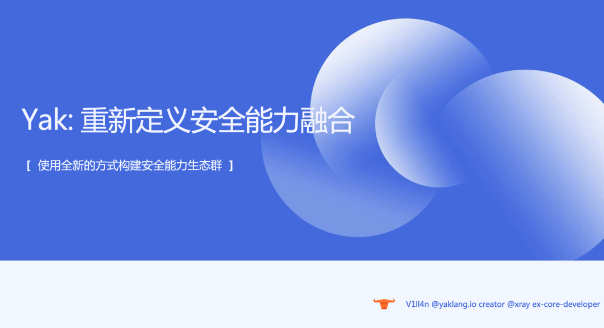

当然，在项目给大家正式介绍之前的一两个小时，我们在 github.com/yaklang/ 组织下建立了一个 github.com/yaklang/yakit/ 代码仓库，yakit 单兵平台跟随 yak 的第一次曝光开源了。

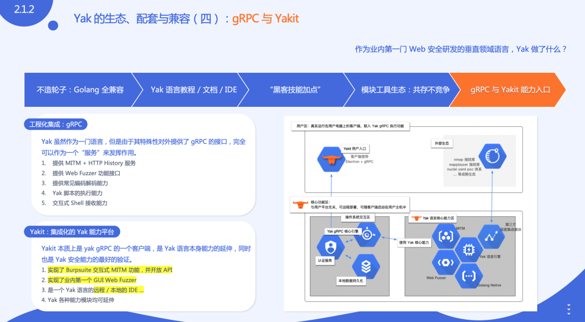

初衷：成为免费的安全能力基础设施

这个项目是最适合讲理想的，我们得暂时忘记 “商业和赚钱” 来谈这个事情：

Yak 语言本身不值钱，技术细节在官网的各种文档中已经给大家详细讲述了这是怎么一回事儿，所谓的编译原理 / 语言语法其实只是我们想做的事情的 “工具人”；

我们想做的是 “安全能力融合” ，“安全能力基座”。

为什么要做这件事？

在过去的很多年中，我们想要扫描端口，需要使用 masscan+nmap 全家桶；各种工具只能提供一个或者两个能力；一个新的平台开放，想把他和一些旧的工具进行结合是很麻烦的。

从最基础的“实现”角度来说，大家使用 python / golang 去完成各种功能的连接，每个人风格都不一样，完成度不一样，重复编写类似的平台/工具这种情况非常多。

如果可以 “编写脚本/平台”，已经是专家用户了，但是绝大部分人并不具备这样的能力和技术栈，大家更容易接受的反而是简单易用的 GUI；很多 GUI 并没有长期维护但是还是很多同学都在使用。

与此同时一些好用的 GUI 工具有很强的商业属性，比如 Burpsuite 这类，长期和大量的盗版用户存在其实会有很大的安全隐患。

我们怎么解决？

对于一些无法原生集成在我们平台中的产品/工具，我们将会重新编写他们的 “高质量替代”。

对于一些生态完整且认可度非常高的产品，我们将会直接编译到 Yak 中，对源码进行修改，更好的适配 Yak 的语言。

对于一些并不想编写代码的同学，我们会为 Yak 中所有的能力提供合适的 GUI，随着版本更迭，GUI 会越来越好用，并且推出更多的联动工具，满足尽量多的用户。

当我们把上面三件事做好之后，我们将实现从普通用户到专家用户的全面覆盖，全面提升大家的安全能力，真正提升生产力，成为大家工作的基础工具，成为了能力基座。

硬通货：高质量的能力模块与经验沉淀

当然，很多想法不能只停留在 “想” 的阶段，我们为上面的一些承诺，做了很大努力，我们研发了一组质量还算可以的 yak 内置的工具包：

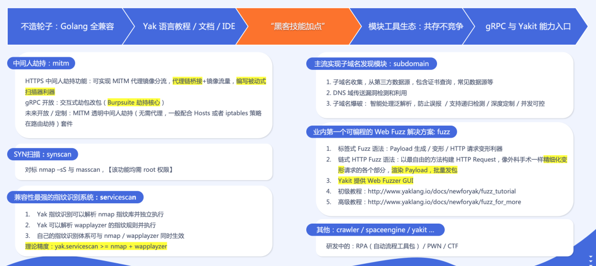

比如说，mitm 劫持，比如说支持 payload 变形和 HTTP 变形的 fuzz。

高质量的 MITM HTTPS 劫持

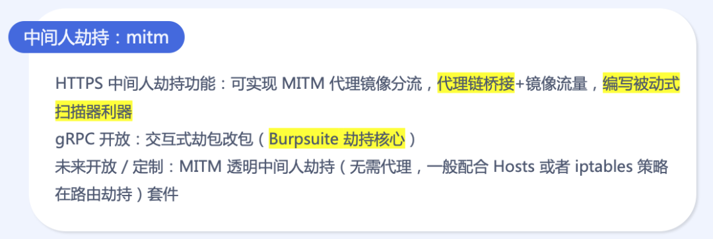

独一无二的 fuzz 解决方案

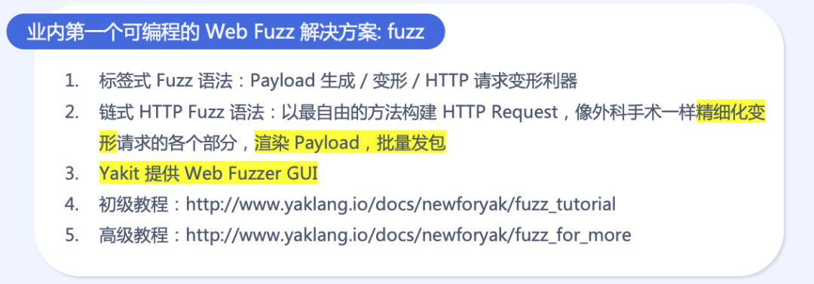

同时也提供了一些常见工具的高质量替代品：

理论精度很强的 servicescan

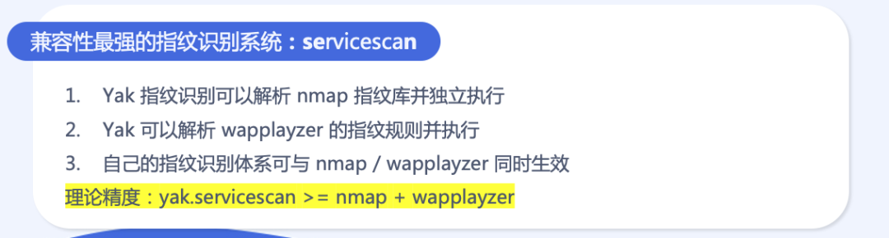

为数不多的 Yaml PoC GUI (powered by nuclei):

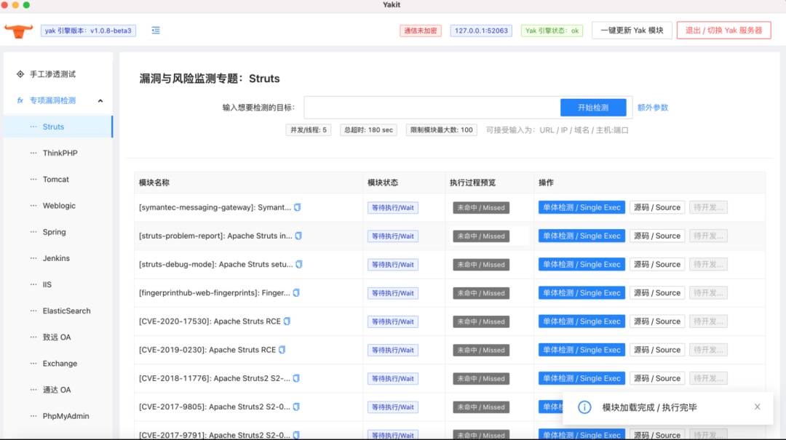

**小结**

当然，这些并不是全部，也并不是终点，在后续的版本中：

在我们能力范围内的模块，会逐步新增，比如 “爆破”，比如 Yakit 更合理的 GUI。

同样的，我们也将为每一个通用能力，增加他专属的 GUI。

短期目标

“众所周知，我们在 Yakit 中提供了一个类似 Burpsuite 的能力，虽然有些交互并不是特别好用，但是我们将会持续优化这些功能，结合 Yak 本身的动态/嵌入式语言优势，让他有颠覆性的改变，成为有技术深度的产品。”

中期目标

“插件商店将会是 Yakit 能力扩展的主战场，现有的【专项漏洞检测】的小功能相信大家已经瞥见了 Yak 的插件能力的未来，相信我，未来会有更强的插件体系，包括 MITM 中的插件”

终极目标

“Matlab 是 yaklang.io 的理想形态，Yakit 作为 IDE/能力扩展/GUI 存在，Yak 作为语言核心，提供各种安全算法”

Q&A

很多人在知道这个项目的时候，会有很多质疑：

1. 你们能坚持多久？Yak Project 能坚持多久？

“Yak 的项目已经存在了很多年了，只是在此之前是以别的形态存在的。”

“这个项目从某种意义上说，并没有终点，能力模块会逐步增多，旧的能力也会修复BUG并增加新的接口，新的功能。既然最沉默的几年已经活下来了，从现在再活几年也并不是太大问题”

2. yaklang.io 的商业模式究竟是怎么样，用户会被割韭菜吗？

“我们并不希望 yaklang.io / yakit 由个人用户来买单，当然，个人用户愿意捐赠为我们买一杯咖啡，感激不尽！”

“由于政策原因，有很多功能无法免费提供给个人，但是可以提供给企业，这部分将是 yaklang.io 生态完善之后的一个方向。”

“我们想成为一个免费的 Burpsuite 这类人手一部的行业深度的产品。”

“当用户足够多，认可度足够高的时候，证明我们确实可以提升生产力，降低安全操作的一些门槛，我们将会做一些职业教育方面的尝试。”

3. 为什么不把 Yak 直接开源？只开源 Yakit？

“Yak 会开源，但是不是现在，因为知识产权/专利，开源协议以及影响力的一些问题，现在开源并不是一个好的时机”

“从经济价值来说，Yakit 比 Yak 的直接经济价值更高，我们先把这部分开源，表明我们做‘免费’的决心”

“Yak 将会在合适的阶段开源，比如 Yak 的影响力能达到 ‘人尽皆知’，使用 Yak 的安全产品会主动并愿意把 Yak 的品牌 / Logo 放在自己的产品中，认真遵守开源协议”

后续

在 Yak Project 中，我们将会在后续的推文定期分享各类技术文章，包括 Yak 核心技术的解密，Yakit 技术解密与技术选型分析等。

yaklang.io 在 XCon XReward

回复 “XCon-Yak” 获取 yaklang.io 在 XCon 的会议

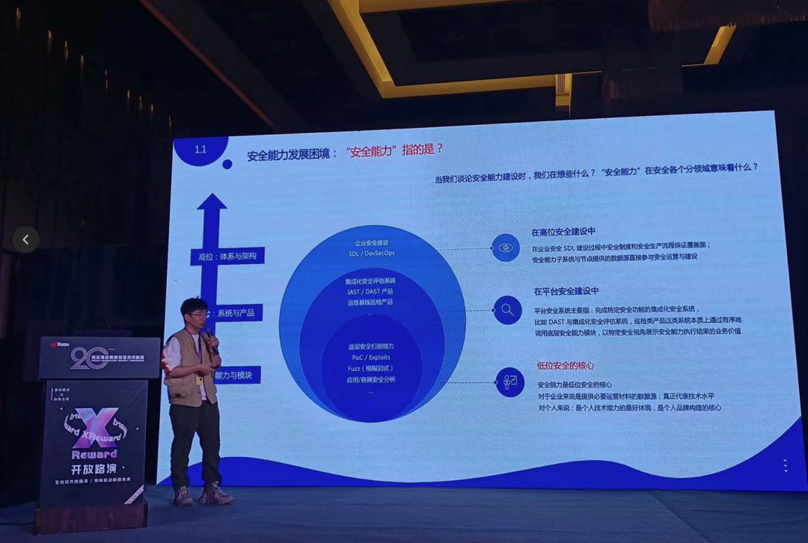

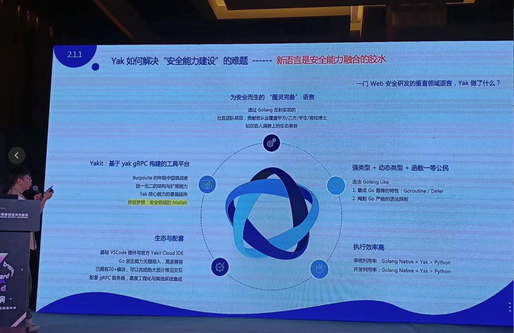

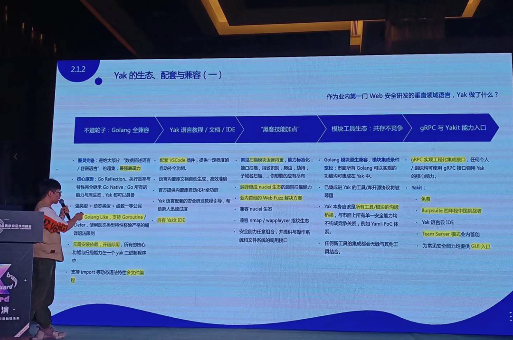

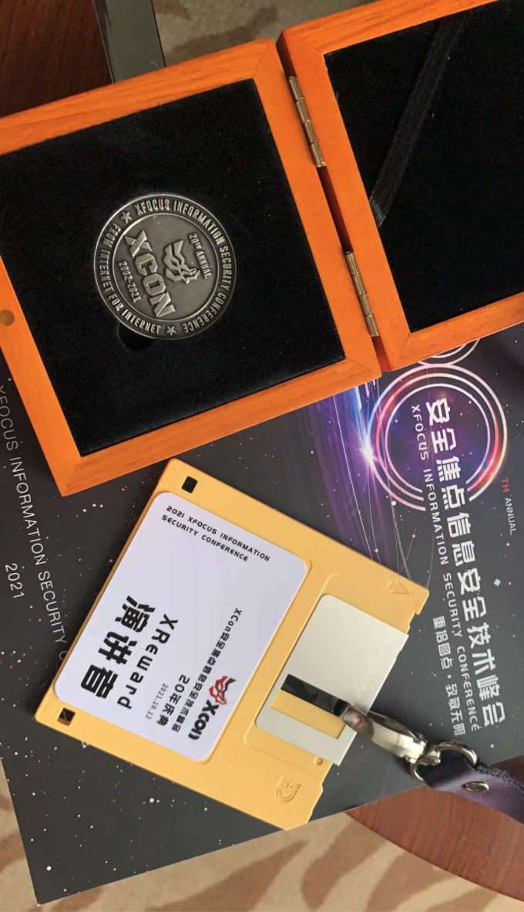

安全能力，技术分享

了解我们，社区合作

回复 “XCon-Yak” 获取 yaklang.io 在 XCon 的会议 PPT
